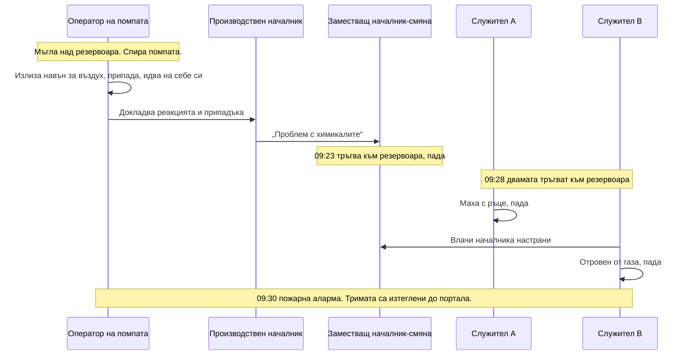

*Снимка: Peter Herrmann, Unsplash.*

В 9:23 сутринта на 22 април 2026 г. заместващ началник-смяна влиза в производствения цех на малък завод за извличане на сребро в Институт, Западна Вирджиния, за да види какво не е наред с един резервоар. Казали са му, че химикалите в него „имат проблем“. Приближава се достатъчно, за да разбере, и пада.

В 9:28 камерата за видеонаблюдение записва още двама души, тръгнали към същото място. Никой от тях няма нищо общо с тази задача. Единият започва да маха с ръце и се свлича. Другият стига до началника, хваща го и го влачи настрани от резервоара, когато също пада.

Началникът оцелява. Двамата, които идват да му помогнат, умират.

Писахме за този инцидент през май, седмица след като Американският съвет по химическа безопасност (CSB, федералната агенция, която разследва химически аварии) откри разследване. Тогава публичната информация беше оскъдна: резервоар, азотна киселина, почистващ химикал, сероводород, двама загинали. На 13 август 2026 г. CSB публикува своя [междинен доклад](https://www.csb.gov/assets/1/6/FINAL_Investigation_Update_Catalyst_Refiners_.pdf) по случай № 2026-02-I-WV и той променя историята по три начина. Дава хронологията минута по минута. Назовава химията. И описва респираторите, които CSB намира разхвърляни из завода след това, и какво е било завинтено на тях.

Последната подробност е причината за тази статия.

## Какво добавя докладът

Заводът принадлежи на Catalyst Refiners, дъщерно дружество на Ames Goldsmith Corporation. Работата му е била да извлича сребро от отработен катализатор, изхабените гранули, които излизат от реакторите за етиленов оксид. До април 2026 г. компанията майка е решила да го затвори. Извеждането от експлоатация е трябвало да приключи на 5 юни. Повечето технологично оборудване вече е било демонтирано.

Една система още е работела: предварителното пречистване на отпадните води. Площадката е била оградена с вал, така че всяка капка дъжд и вода от миене се е стичала в приемен резервоар. Това е резервоарът, който CSB нарича „инцидентния резервоар“. Бил е открит отгоре, метър и осемдесет висок, около два метра и седемдесет в диаметър, около 8400 литра. Оттам водата е отивала в неутрализационен резервоар, после в утаител, който е отделял твърдите сребърни частици.

Три химикала са участвали в извличането на среброто от тази отпадна вода:

- **A-50**, разтвор на калциев хлорид, използван като коагулант, който кара фините частици да се слепват, за да се утаят.
- **M-2000A**, патентован разтвор на натриев тритиокарбонат, използван като утаител на метали, който изтегля разтвореното сребро от водата под формата на твърдо вещество. Информационният му лист за безопасност го описва като червена течност с остра миризма, несъвместима със силни киселини.
- **Азотна киселина**, 67-процентова, останала от самия процес на извличане и стояща в резервоар за съхранение отвън.

Ето какво казва докладът за начина, по който заводът се е отървавал от тях, в изречението, което има най-голямо значение:

> „Catalyst Refiners не е имала писмена процедура за обезвреждане на A-50, M-2000A и азотната киселина чрез системата си за предварително пречистване на отпадни води.“

Тоест планът е живеел в главата на един човек. Около седмица по-рано, по нареждане на заместващия началник-смяна, служители са пуснали вода в резервоара с азотна киселина, за да я разредят, като нивото се вдига от 11 на 22 процента. Сутринта на 22 април същият началник кара двама служители да напълнят с пневматична мембранна помпа два IBC контейнера по 1040 литра с разредената киселина, а трети служител ги вкарва с мотокар в производствената сграда, до инцидентния резервоар.

След това началникът казва на двамата служители в какъв ред да изпомпат останалите химикали в резервоара. Първо бъчва и половина A-50. После почти пълен контейнер от 1040 литра M-2000A. После разредената азотна киселина.

Изпомпали са около 12 сантиметра от контейнера с киселина, когато резервоарът започва да реагира и над повърхността се вдига мъгла.

## Химията с прости думи

Не ви трябва диплома, за да разберете това. Тритиокарбонатът е молекула, построена около един въглероден атом и три серни атома. Достатъчно стабилна е в алкален разтвор, а точно така се доставя M-2000A. Сложете силна киселина върху нея и тя се разпада, а едно от парчетата, които се отделят, е сероводород, H2S. Представете си го като запечатана консерва с нещо развалено: киселината е отварачката.

H2S е газът, който мирише на развалени яйца в нищожни концентрации, а при по-високи спира да мирише на каквото и да било, защото парализира нерва, с който бихте го усетили. Докладът на CSB дава числата: 100 части на милион са непосредствено опасни за живота и здравето. Над 1000 ppm могат да убият почти мигновено. По-тежък е от въздуха, така че се събира на нивото на пода и в ниските места, точно там, където се озовава човек, след като припадне.

Близо 1040 литра богат на сяра утаител са стояли в открит резервоар и киселината е влязла отгоре. Дванайсет сантиметра от един контейнер са били достатъчни, за да напълнят производствена сграда с газ, който детекторите на пожарната улавят и четири часа по-късно. CSB още анализира химикалите на площадката, но общата картина е била в информационния лист на M-2000A, а листът е бил на място.

## Филтърът, който изглеждаше като защита

След инцидента CSB обхожда завода и намира четири целолицеви респиратора на различни места. Поне три от тях са били с филтри 3M 2091.

Ако сте работили около прах, познавате този филтър. Това е пурпурният диск P100. Спира 99,97 процента от частиците във въздуха: силициев прах, метални пари, прах от сребърен оксид, всичко, което този завод е произвеждал в работния си живот. За това е добър филтър.

Срещу газ не прави нищо. P100 е много фино сито и молекулите на H2S минават през него, както водата минава през рибарска мрежа. За спиране на газ е нужен химически патрон, кутия с обработен въглен, който улавя определени газове, а патроните се класифицират по това, което улавят. В САЩ патроните с маркировка за сероводород са одобрени само за евакуация. В Европа еквивалентът е филтър тип B по EN 14387 и правилото е същото: известни ниски концентрации, известен път за евакуация, никога непозната атмосфера.

Така че респираторите на пода в Catalyst Refiners са били, за тази опасност, пластмаса върху лицето. Човекът с такъв респиратор би се чувствал защитен, би дишал нормално и би получил същата доза като някой без нищо. Докладът на CSB не казва дали някой е носил такъв в момента на изпускането. Казва обаче две неща за правилата на площадката.

Първо, работниците казват на CSB, че след като заводът е преминал от производство към извеждане от експлоатация, респираторите вече не са били задължителни вътре в завода.

Второ, компанията не е предоставяла лични газдетектори и не е изисквала нито служители, нито подизпълнители да ги използват.

Прочетете двете заедно. Производствената опасност (сребърен прах) е изчезнала, така че производственото правило за ЛПС е отпаднало. Опасността при извеждане от експлоатация (смесване на остатъчни химикали) е пристигнала и нищо не е заменило правилото. А единственото устройство, което би казало на когото и да било, че въздухът не е наред, закачен на гърдите H2S детектор с размер на пейджър, не е било на ничии гърди.

*Снимка: Hush Naidoo Jade Photography, Unsplash.*

## Спасителният рефлекс

Ето хронологията от доклада, подредена като верига. Всяка стъпка е човек, който прави естественото нещо.

Операторът на помпата прави правилните неща. Вижда мъглата, спира помпата, излиза навън за въздух и докладва, когато идва на себе си. После информацията се разпада по пътя си. Той казва на производствения началник за реакцията и припадъка. Производственият началник казва на заместващия началник-смяна, че има „проблем със смесването на химикалите“. Някъде между „припаднах“ и „проблем“ фактът, че въздухът може да те убие, изпада от съобщението. Заместващият началник-смяна влиза да погледне един резервоар. Влиза в газов облак.

После двама души, които изобщо не са били на тази задача, виждат паднал човек и отиват при него. Това не е небрежност. Това е, което почти всеки прави, и това е причината инцидентите с H2S толкова често да убиват по двама и трима. Газът е по-тежък от въздуха, така че спасителят се навежда в най-лошото. Архивът на CSB е пълен с този модел. На помпена станция в Одеса, Тексас, през 2019 г. оператор е отровен от H2S, а съпругата му умира същата вечер, след като идва на площадката да го търси. Историята в Институт, Западна Вирджиния, е същата история с други имена.

Обучителната карта казва „не предприемайте спасяване без подходящи ЛПС“. Това, което не покрива, е колко силно тегли, когато началникът ти е на пода на шест метра от теб и не виждаш нищо нередно във въздуха. Никой в Catalyst Refiners не е имал детектор, който да пищи. Имало е мъгла над резервоар в другия край на помещението и човек на земята.

## Защо извеждането от експлоатация е опасната фаза

Подизпълнителите познават този модел от другата страна. Заводите често са най-недисциплинирани в самия край. Отделът за разрешителни е орязан. Операторите, които са знаели коя линия какво държи, са взели обезщетението и са си тръгнали. Площадката е „на практика празна“, а точно тази фраза трябва да настръхва врата на всеки ръководител на екип.

Защото не е празна. Това, което е останало, е точно онова, с което никой не е искал да се занимава: полупълни контейнери, резервоар с киселина на 11 процента, бъчви с червен химикал с лоша миризма. А когато бюджетът е изхарчен, начинът да се отървеш от него е да го излееш в който резервоар още има помпа.

Думите на председателя на CSB в прессъобщението бяха: „Този трагичен инцидент подчертава необходимостта от ясни процедури и безопасно управление на сериозните химически опасности, които могат да възникнат при извеждане на съоръжение от експлоатация.“ Ключовата дума е *възникнат*. По време на производството тези три химикала никога не са се срещали. Срещат се, защото някой е трябвало да изпразни три съда, а резервоарът е бил един.

Екипите със сертификат SCC/VCA, европейския стандарт за безопасност на подизпълнители, който хората на GEMBA притежават, тренират реакция при H2S всяка година: включен детектор, евакуация срещу вятъра, никакво спасяване без дихателен апарат. Това обучение предполага източник на H2S, за който знаеш: линия с кисел газ или серна яма. Този доклад показва източник, измислен същата сутрин, в сграда без история с H2S, от реда на три маркуча на помпа. Никакъв опреснителен курс не покрива опасност, която не е съществувала до онази сутрин.

## Какво може да направи ръководителят на екип

Не можеш да напишеш процедурите на възложителя вместо него. Можеш да контролираш какво носят твоите хора и какво ще откажат да правят. Ето краткия вариант на това, за което говори този доклад.

**Приемай „вече не изискваме респиратори“ като информация, не като разрешение.** Когато площадка ти каже, че правилото за ЛПС е разхлабено, защото производството е спряло, попитай какво го е заменило. Ако отговорът е „нищо“, оценката на риска за новата фаза не е направена. Направи си своя.

**Личен газдетектор на всеки гърди, всеки ден, каквото и да казва площадката.** Четиригазов уред струва по-малко от един работен ден на един техник. В Catalyst Refiners никой не е имал такъв. Детектор, алармиращ при 10 ppm, би превърнал „проблем с химикалите“ в „всички навън“ и би спрял двама души да тръгнат към човек на пода.

**Гледай патрона, не маската.** Целолицева маска с P100 филтър е противопрахова маска с прозорец. Ако газът може да е H2S с непозната концентрация, никой филтър не е годен за това. Тогава е дихателен апарат или нищо. Направи кода на патрона част от проверката преди работа, на глас, както би проверил сбруя.

**Всяка задача за „обезвреждане“, при която се смесват остатъци, е химическа задача.** Три съда в един резервоар означават три информационни листа, прочетени един до друг, преди маркучът да влезе. Ако площадката не може да ти покаже писмена процедура за прехвърлянето, прехвърлянето не е готово.

**Кажи „паднал човек, газ“ по радиото, а не „проблем“.** Съобщението, което стига до заместващия началник-смяна, губи думата, която би го задържала навън. Договорете думите предварително.

**Кажи спасителния рефлекс на глас, преди работата.** „Ако падна, не идваш при мен. Отиваш срещу вятъра, докладваш и чакаш дихателен апарат.“ Хората трябва да го чуят от човека, когото биха се изкушили да спасят.

## Урокът

Двама души умират в Catalyst Refiners, защото завод, който е спрял да произвежда каквото и да било, все още е бил пълен с химикали, а правилата, които биха защитили хората вътре, са били изключени заедно с процеса. Грешни филтри. Никакъв детектор. Никаква процедура. Спасителният инстинкт довършва останалото.

Всичко в този списък е евтино. Скъпото е било допускането, че „затваряме“ означава „опасността си отива“, докато всъщност е означавало „опасността се променя и вече никой не я гледа“.

Ако вземете едно нещо от този доклад на следващото си влизане в извеждан от експлоатация завод, вземете това: когато площадка ви каже, че опасността е изчезнала, попитайте къде е отишла.

## Източници и допълнително четене

- **Междинен доклад на CSB**, № 2026-02-I-WV, август 2026 г.: [Fatal Toxic Hydrogen Sulfide Release at Catalyst Refiners, Inc., Institute, West Virginia](https://www.csb.gov/assets/1/6/FINAL_Investigation_Update_Catalyst_Refiners_.pdf) (PDF). Прессъобщението от 13 август е [тук](https://www.csb.gov/us-chemical-safety-board-issues-update-on-investigation-of-fatal-april-2026-hydrogen-sulfide-release-at-catalyst-refiners-facility-in-west-virginia/).
- **OSHA**, [Hydrogen Sulfide: Hazards](https://www.osha.gov/hydrogen-sulfide/hazards), праговете на експозиция, цитирани в доклада.
- **3M**, [How to select the right cartridges and filters for reusable respirators](https://multimedia.3m.com/mws/media/1687482O/select-the-right-cartridges-and-filters-reusable-respirators-english.pdf) (PDF), ръководството на самия производител защо P100 противопраховият филтър не предпазва от газове.
- **CSB**, [Aghorn Operating waterflood station H2S release, Odessa, Texas](https://www.csb.gov/aghorn-operating-waterflood-station-hydrogen-sulfide-release-/), случаят от 2019 г. със същия модел на спасителя.
- Нашата по-ранна статия за този инцидент, написана при откриването на разследването: [Когато почистването създаде газа: Урокът от Catalyst Refiners](/bg/blog/catalyst-refiners-h2s-decommissioning-csb).

Лицата в материалите на CSB са посочени тук само по длъжност. „Служител A“ и „Служител B“ са обозначенията на самия CSB.

BA специалистите на GEMBA Industrial осигуряват дежурство с дихателни апарати, газов мониторинг и спасително покритие в затворени пространства при спирания на рафинерии, нефтохимически и катализаторни заводи в целия ЕС, включително при извеждане от експлоатация, когато собственото покритие на възложителя е най-тънко. Ако следващата ви работа е на площадка, която е „на практика празна“, [говорете с нас](/bg/contact).
