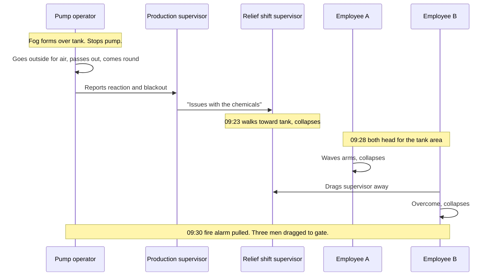

*Image: Peter Herrmann on Unsplash.*

At 9:23 on the morning of 22 April 2026, a relief shift supervisor walked onto the production floor of a small silver-recovery plant in Institute, West Virginia, to see what was wrong with a tank. He'd been told the chemicals in it were "having issues". He got close enough to find out, and dropped.

At 9:28, the surveillance camera caught two more people heading for the same spot. Neither of them had anything to do with the job. One of them started waving his arms and went down. The other reached the supervisor, grabbed him, and was dragging him away from the tank when he collapsed too.

The supervisor lived. The two people who came to help him died.

We wrote about this incident in May, the week after the U.S. Chemical Safety Board (the CSB, the federal agency that investigates chemical accidents) opened its investigation. Back then the public record was thin: a tank, nitric acid, a cleaning chemical, hydrogen sulfide, two dead. On 13 August 2026 the CSB published its [Investigation Update](https://www.csb.gov/assets/1/6/FINAL_Investigation_Update_Catalyst_Refiners_.pdf) for case No. 2026-02-I-WV, and it changes the story in three ways. It gives the timeline to the minute. It names the chemistry. And it describes the respirators the CSB found lying around the plant afterwards, and what was screwed into them.

That last detail is the reason for this post.

## What the Update Adds

The facility belonged to Catalyst Refiners, a subsidiary of Ames Goldsmith Corporation. Its job was reclaiming silver from spent catalyst, the used-up pellets that come out of ethylene oxide reactors. By April 2026 the parent company had decided to close it. Decommissioning was due to finish on 5 June. Most of the process equipment had already been pulled out.

One system was still running: wastewater pretreatment. The site was bermed, so every drop of rain and wash water on the property drained into a receiving tank. That tank is the one the CSB calls the "incident tank". It was open-topped, six feet tall, nine feet across, about 2,200 gallons. From there water went to a neutralisation tank, then a clarifier that dropped out silver solids.

Three chemicals were involved in the silver-recovery side of that wastewater system:

- **A-50**, a calcium chloride solution used as a coagulant, which makes fine particles clump together so they settle.
- **M-2000A**, a proprietary sodium trithiocarbonate solution used as a metal precipitant, which pulls dissolved silver out of the water as a solid. Its safety data sheet describes it as a red liquid with a pungent odour, incompatible with strong acids.
- **Nitric acid**, at 67 percent strength, left over from the reclamation process itself and sitting in a storage tank outside.

Here's what the update says about how the site was getting rid of them, in the sentence that matters most:

> "Catalyst Refiners had no written procedure for disposing of the A-50, M-2000A, and nitric acid using its wastewater pretreatment system."

So the plan lived in one person's head. About a week earlier, on the relief shift supervisor's instruction, employees had run water into the nitric acid tank to dilute it, taking the level from 11 to 22 percent. On the morning of 22 April the same supervisor had two employees use an air-driven diaphragm pump to fill two 275-gallon totes with the diluted acid, and a third employee forklifted them into the production building, next to the incident tank.

Then the supervisor told the two employees which order to pump the remaining chemicals into the tank. First, a drum and a half of A-50. Then almost a full 275-gallon tote of M-2000A. Then the diluted nitric acid.

They'd pumped about five inches out of the acid tote when the tank started reacting and a fog rose off the surface.

## The Chemistry, in Plain Words

You don't need a degree to follow this. A trithiocarbonate is a molecule built around a carbon atom and three sulfur atoms. It's stable enough in an alkaline solution, which is how M-2000A ships. Put strong acid on it and it falls apart, and one of the pieces that comes off is hydrogen sulfide, H2S. Think of it like a sealed can of something rotten: the acid is the can opener.

H2S is the gas that smells of rotten eggs at tiny concentrations and then, at higher ones, stops smelling of anything, because it paralyses the nerve you'd smell it with. The CSB's update gives the numbers: 100 parts per million is immediately dangerous to life or health. Over 1,000 ppm can kill almost instantly. It's heavier than air, so it pools at floor level and in low spots, which is exactly where a person ends up after they collapse.

Nearly 275 gallons of a sulfur-rich precipitant sat in an open-topped tank, and acid went in on top. Five inches from a tote was enough to fill a production building with gas that the fire department's detectors still picked up four hours later. The CSB is still analysing the on-site chemicals, but the outline was on the M-2000A data sheet, and the data sheet was on site.

## The Filter That Looked Like Protection

After the incident the CSB walked the plant and found four full-face respirators in various places. At least three of them were fitted with 3M 2091 filters.

If you've worked around dust, you know that filter. It's the magenta P100 disc. It stops 99.97 percent of airborne particles: silica, metal fume, silver oxide powder, the stuff this plant produced in its working life. It's a good filter for that.

It does nothing against gas. A P100 is a very fine sieve, and H2S molecules go through it the way water goes through a fishing net. Stopping a gas takes a chemical cartridge, a canister of treated carbon that traps specific gases, and cartridges are rated by what they trap. In the US, cartridges labelled for hydrogen sulfide are approved for escape only. In Europe the equivalent is an EN 14387 type B filter, and the rule is the same: known low concentrations, known escape route, never an unknown atmosphere.

So the respirators on the floor at Catalyst Refiners were, for this hazard, plastic on the face. The person wearing one would have felt protected, breathed normally, and got the same dose as someone wearing nothing. The CSB's update doesn't say whether anyone was wearing one at the moment of the release. It does say two things about the site's rules.

First, workers told the CSB that once the facility moved from production to decommissioning, respirators were no longer required inside the plant.

Second, the company did not provide personal gas monitors, and did not require employees or contractors to use them.

Read those two together. The production hazard (silver dust) had gone, so the production PPE rule was dropped. The decommissioning hazard (mixing leftover chemicals) had arrived, and nothing replaced the rule. And the one piece of kit that would have told anyone the air was wrong, a clip-on H2S monitor the size of a pager, wasn't on anybody's chest.

*Image: Hush Naidoo Jade Photography on Unsplash.*

## The Rescue Reflex

Here is the timeline from the update, laid out as a chain. Every step is a human being doing the natural thing.

The pump operator did the right things. He saw the fog, stopped the pump, walked outside for air, and reported it when he came round. Then the information degraded as it moved. He told the production supervisor about the reaction and the blackout. The production supervisor told the relief shift supervisor there were "issues regarding the mixing of the chemicals". Somewhere between "I passed out" and "issues", the fact that the air could kill you fell off the message. The relief shift supervisor walked in to look at a tank. He was walking into a gas cloud.

Then two people who weren't on the job at all saw a man down and went to him. That's not carelessness. That's what nearly everyone does, and it's the reason H2S incidents so often kill in twos and threes. The gas is heavier than air, so the rescuer bends down into the worst of it. The CSB's own case history is full of this pattern. At a waterflood station in Odessa, Texas in 2019, a pumper was overcome by H2S, and his spouse died that evening after coming to the site to find him. The story in Institute, West Virginia is the same story with different names.

The training card says "do not attempt rescue without appropriate PPE". What it doesn't cover is how strong the pull is when it's your supervisor on the floor twenty feet away and you can't see anything wrong with the air. Nobody at Catalyst Refiners had a monitor screaming at them. There was a fog over a tank across the room, and a man on the ground.

## Why Decommissioning Is the Dangerous Phase

Contractors know this pattern from the other direction. Plants are often at their least disciplined at the very end. The permit office has been thinned out. The operators who knew which line held what have taken the redundancy package. The site is "basically empty", which is the phrase that should make a crew lead's neck prickle.

Because it isn't empty. What's left is exactly the stuff nobody wanted to deal with: partial totes, a tank of acid at 11 percent, drums of a red chemical with a bad smell. And when the budget is spent, the way to get rid of it is to pour it into whatever tank still has a pump on it.

The CSB Chairperson's line in the press release was: "This tragic incident underscores the need to have clear procedures and safely manage the serious chemical hazards that can arise during facility decommissioning." The key word is *arise*. During production these three chemicals never met. They met because someone had to empty three containers and there was one tank.

Crews with SCC/VCA certification, the European contractor safety standard GEMBA's people hold, drill H2S response every year: monitor on, upwind escape, no rescue without breathing apparatus. That training assumes an H2S source you know about, a sour gas line or a sulfur pit. This update shows a source invented on the morning, in a building with no H2S history, by the order of three pump hoses. No refresher course covers a hazard that didn't exist until that morning.

## What a Crew Lead Can Do

You can't write the host's procedures for them. You can control what your own people carry and what they'll refuse to do. Here is the short version of what this update argues for.

**Treat "we don't require respirators any more" as information, not permission.** When a site tells you the PPE rule has been relaxed because production has stopped, ask what replaced it. If the answer is "nothing", the hazard assessment hasn't been done for the new phase. Do your own.

**Personal gas monitors on every chest, every day, whatever the site says.** A four-gas unit costs less than a day of one technician's time. At Catalyst Refiners, nobody had one. A monitor alarming at 10 ppm would have turned "issues with the chemicals" into "everybody out", and would have stopped two people walking toward a man on the floor.

**Look at the cartridge, not the mask.** A full-face mask with a P100 filter is a dust mask with a window. If the gas could be H2S at unknown concentration, no filter is rated for it. That's breathing apparatus or nothing. Make the cartridge code part of the pre-job check, out loud, the way you'd check a harness.

**Any "disposal" job that mixes leftovers is a chemistry job.** Three containers going into one tank means three data sheets read side by side before a hose goes in. If a site can't show you a written procedure for a disposal transfer, the transfer isn't ready.

**Say "man down, gas" on the radio, not "issues".** The message that reached the relief shift supervisor lost the word that would have kept him outside. Agree the words in advance.

**Brief the rescue reflex out loud, before the job.** "If I go down, you do not come to me. You go upwind, you call it in, you wait for BA." People need to hear it from the person they'd be tempted to save.

## The Lesson

Two people died at Catalyst Refiners because a plant that had stopped making anything was still full of chemicals, and the rules that would have protected the people inside had been switched off along with the process. Wrong filters. No monitor. No procedure. The rescue instinct did the rest.

Everything on that list is cheap. The expensive thing was assuming that "we're shutting down" meant "the danger is going", when it actually meant "the danger is changing, and nobody's watching it any more."

If you take one thing from this update onto your next decommissioning entry, take this: when a site tells you the hazard is gone, ask them where it went.

## Credit and Further Reading

- **CSB Investigation Update**, No. 2026-02-I-WV, August 2026: [Fatal Toxic Hydrogen Sulfide Release at Catalyst Refiners, Inc., Institute, West Virginia](https://www.csb.gov/assets/1/6/FINAL_Investigation_Update_Catalyst_Refiners_.pdf) (PDF). The 13 August press release is [here](https://www.csb.gov/us-chemical-safety-board-issues-update-on-investigation-of-fatal-april-2026-hydrogen-sulfide-release-at-catalyst-refiners-facility-in-west-virginia/).
- **OSHA**, [Hydrogen Sulfide: Hazards](https://www.osha.gov/hydrogen-sulfide/hazards), the exposure thresholds cited in the update.
- **3M**, [How to select the right cartridges and filters for reusable respirators](https://multimedia.3m.com/mws/media/1687482O/select-the-right-cartridges-and-filters-reusable-respirators-english.pdf) (PDF), the manufacturer's own guide to why a P100 particulate filter offers no protection against gases.
- **CSB**, [Aghorn Operating waterflood station H2S release, Odessa, Texas](https://www.csb.gov/aghorn-operating-waterflood-station-hydrogen-sulfide-release-/), the 2019 case with the same rescuer pattern.
- Our earlier piece on this incident, written when the investigation opened: [When Cleaning Made the Gas: The Catalyst Refiners Lesson](/en/blog/catalyst-refiners-h2s-decommissioning-csb).

Individuals in the CSB material are referred to here by role only. Employees A and B are the CSB's own labels.

GEMBA Industrial's BA specialists provide breathing-apparatus standby, gas monitoring and confined-space rescue cover for refinery, petrochemical and catalyst-plant shutdowns across the EU, including decommissioning, when the host's own cover is thinnest. If your next job is on a site that's "basically empty", [talk to us](/en/contact).
