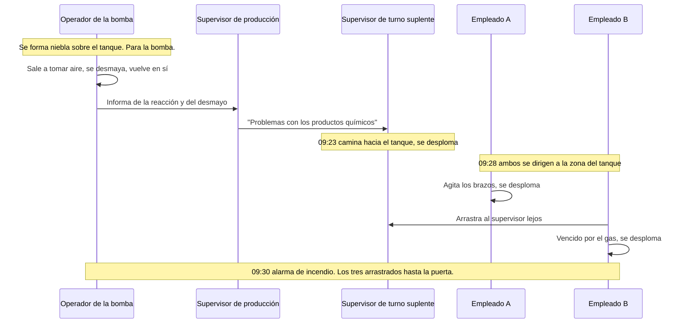

*Imagen: Peter Herrmann en Unsplash.*

A las 9:23 de la mañana del 22 de abril de 2026, un supervisor de turno suplente entró en la nave de producción de una pequeña planta de recuperación de plata en Institute, Virginia Occidental, para ver qué pasaba con un tanque. Le habían dicho que los productos químicos que contenía "tenían problemas". Se acercó lo suficiente para averiguarlo, y cayó.

A las 9:28, la cámara de vigilancia captó a dos personas más dirigiéndose al mismo punto. Ninguna de ellas tenía nada que ver con el trabajo. Una empezó a agitar los brazos y se desplomó. La otra llegó hasta el supervisor, lo agarró y lo estaba arrastrando lejos del tanque cuando también se desplomó.

El supervisor sobrevivió. Las dos personas que fueron a ayudarlo murieron.

Escribimos sobre este incidente en mayo, la semana después de que la Junta de Seguridad Química de Estados Unidos (la CSB, la agencia federal que investiga accidentes químicos) abriera su investigación. Entonces el registro público era escaso: un tanque, ácido nítrico, un producto de limpieza, sulfuro de hidrógeno, dos muertos. El 13 de agosto de 2026 la CSB publicó su [Actualización de la Investigación](https://www.csb.gov/assets/1/6/FINAL_Investigation_Update_Catalyst_Refiners_.pdf) del caso n.º 2026-02-I-WV, y cambia la historia de tres maneras. Da la cronología minuto a minuto. Nombra la química. Y describe los respiradores que la CSB encontró tirados por la planta después, y lo que llevaban enroscado.

Ese último detalle es la razón de este artículo.

## Qué añade la actualización

La instalación pertenecía a Catalyst Refiners, filial de Ames Goldsmith Corporation. Su trabajo era recuperar plata de catalizador gastado, los pellets agotados que salen de los reactores de óxido de etileno. Para abril de 2026 la empresa matriz había decidido cerrarla. El desmantelamiento debía terminar el 5 de junio. La mayor parte del equipo de proceso ya se había retirado.

Un sistema seguía funcionando: el pretratamiento de aguas residuales. El recinto estaba rodeado por un dique, así que cada gota de lluvia y de agua de lavado de la propiedad drenaba a un tanque receptor. Ese tanque es el que la CSB llama el "tanque del incidente". Era abierto por arriba, de 1,8 metros de alto y 2,7 metros de diámetro, unos 8.400 litros. De ahí el agua pasaba a un tanque de neutralización y luego a un clarificador que separaba los sólidos de plata.

Tres productos químicos intervenían en la parte de recuperación de plata de ese sistema de aguas residuales:

- **A-50**, una solución de cloruro de calcio usada como coagulante, que hace que las partículas finas se aglomeren para sedimentar.
- **M-2000A**, una solución patentada de tritiocarbonato de sodio usada como precipitante de metales, que extrae la plata disuelta del agua en forma de sólido. Su ficha de datos de seguridad la describe como un líquido rojo de olor penetrante, incompatible con ácidos fuertes.
- **Ácido nítrico**, al 67 por ciento, sobrante del propio proceso de recuperación y almacenado en un tanque exterior.

Esto es lo que dice la actualización sobre cómo la planta se deshacía de ellos, en la frase que más importa:

> "Catalyst Refiners no tenía un procedimiento escrito para la eliminación del A-50, el M-2000A y el ácido nítrico a través de su sistema de pretratamiento de aguas residuales."

Así que el plan vivía en la cabeza de una persona. Una semana antes, por instrucción del supervisor de turno suplente, los empleados habían añadido agua al tanque de ácido nítrico para diluirlo, subiendo el nivel del 11 al 22 por ciento. La mañana del 22 de abril el mismo supervisor hizo que dos empleados llenaran con una bomba de diafragma neumática dos contenedores IBC de 1.040 litros con el ácido diluido, y un tercer empleado los llevó con la carretilla elevadora a la nave de producción, junto al tanque del incidente.

Después el supervisor indicó a los dos empleados en qué orden bombear los productos restantes al tanque. Primero, un bidón y medio de A-50. Luego casi un contenedor entero de 1.040 litros de M-2000A. Luego el ácido nítrico diluido.

Habían bombeado unos 12 centímetros del contenedor de ácido cuando el tanque empezó a reaccionar y una niebla se levantó de la superficie.

## La química, en palabras sencillas

No hace falta un título para seguir esto. Un tritiocarbonato es una molécula construida alrededor de un átomo de carbono y tres átomos de azufre. Es bastante estable en una solución alcalina, que es como se suministra el M-2000A. Échale ácido fuerte y se desmorona, y uno de los trozos que se desprende es sulfuro de hidrógeno, H2S. Piénsalo como una lata sellada con algo podrido dentro: el ácido es el abrelatas.

El H2S es el gas que huele a huevos podridos en concentraciones mínimas y que, a concentraciones más altas, deja de oler a nada, porque paraliza el nervio con el que lo olerías. La actualización de la CSB da las cifras: 100 partes por millón son inmediatamente peligrosas para la vida o la salud. Por encima de 1.000 ppm puede matar casi al instante. Es más pesado que el aire, así que se acumula a nivel del suelo y en los puntos bajos, exactamente donde acaba una persona después de desplomarse.

Casi 1.040 litros de un precipitante rico en azufre estaban en un tanque abierto, y el ácido entró por encima. Doce centímetros de un contenedor bastaron para llenar una nave de producción de un gas que los detectores de los bomberos seguían registrando cuatro horas después. La CSB sigue analizando los productos químicos del sitio, pero el esquema estaba en la ficha de seguridad del M-2000A, y la ficha estaba en la planta.

## El filtro que parecía protección

Después del incidente la CSB recorrió la planta y encontró cuatro respiradores de cara completa en distintos lugares. Al menos tres llevaban filtros 3M 2091.

Si has trabajado con polvo, conoces ese filtro. Es el disco magenta P100. Detiene el 99,97 por ciento de las partículas en suspensión: sílice, humos metálicos, polvo de óxido de plata, lo que esta planta producía en su vida activa. Para eso es un buen filtro.

Contra un gas no hace nada. Un P100 es un tamiz muy fino, y las moléculas de H2S lo atraviesan como el agua atraviesa una red de pesca. Detener un gas requiere un cartucho químico, un bote de carbón tratado que atrapa gases concretos, y los cartuchos se clasifican por lo que atrapan. En Estados Unidos, los cartuchos etiquetados para sulfuro de hidrógeno están aprobados solo para escape. En Europa el equivalente es un filtro tipo B según EN 14387, y la regla es la misma: concentraciones bajas conocidas, ruta de escape conocida, nunca una atmósfera desconocida.

Así que los respiradores del suelo de Catalyst Refiners eran, para este peligro, plástico sobre la cara. Quien llevara uno se habría sentido protegido, habría respirado con normalidad y habría recibido la misma dosis que alguien sin nada. La actualización de la CSB no dice si alguien llevaba uno en el momento de la fuga. Sí dice dos cosas sobre las reglas del sitio.

Primero, los trabajadores dijeron a la CSB que, una vez que la instalación pasó de producción a desmantelamiento, los respiradores ya no eran obligatorios dentro de la planta.

Segundo, la empresa no proporcionaba detectores de gas personales, ni exigía que empleados o contratistas los usaran.

Lee las dos juntas. El peligro de producción (polvo de plata) había desaparecido, así que la regla de EPI de producción se eliminó. El peligro del desmantelamiento (mezclar productos sobrantes) había llegado, y nada sustituyó a la regla. Y el único equipo que habría avisado a alguien de que el aire estaba mal, un detector de H2S de pinza del tamaño de un busca, no estaba en el pecho de nadie.

*Imagen: Hush Naidoo Jade Photography en Unsplash.*

## El reflejo de rescate

Aquí está la cronología de la actualización, dispuesta como una cadena. Cada paso es un ser humano haciendo lo natural.

El operador de la bomba hizo lo correcto. Vio la niebla, paró la bomba, salió a tomar aire y lo comunicó cuando volvió en sí. Después la información se degradó por el camino. Él contó al supervisor de producción la reacción y el desmayo. El supervisor de producción dijo al supervisor de turno suplente que había "problemas con la mezcla de los productos químicos". En algún punto entre "me desmayé" y "problemas", el hecho de que el aire podía matarte se cayó del mensaje. El supervisor de turno suplente entró a mirar un tanque. Estaba entrando en una nube de gas.

Luego dos personas que no estaban en ese trabajo vieron a un hombre en el suelo y fueron hacia él. Eso no es descuido. Es lo que hace casi todo el mundo, y es la razón por la que los incidentes con H2S matan tan a menudo de dos en dos y de tres en tres. El gas es más pesado que el aire, así que el rescatador se agacha hacia lo peor. El historial de casos de la CSB está lleno de este patrón. En una estación de inyección de agua en Odessa, Texas, en 2019, un operario fue vencido por el H2S y su cónyuge murió esa misma tarde tras ir al sitio a buscarlo. La historia de Institute, Virginia Occidental, es la misma historia con otros nombres.

La tarjeta de formación dice "no intente un rescate sin el EPI adecuado". Lo que no cubre es lo fuerte que tira cuando es tu supervisor quien está en el suelo a seis metros y no ves nada raro en el aire. Nadie en Catalyst Refiners tenía un detector pitando. Había una niebla sobre un tanque al otro lado de la sala, y un hombre en el suelo.

## Por qué el desmantelamiento es la fase peligrosa

Los contratistas conocen este patrón desde el otro lado. Las plantas suelen estar en su punto de menor disciplina justo al final. La oficina de permisos se ha reducido. Los operadores que sabían qué línea contenía qué se han ido con la indemnización. El sitio está "prácticamente vacío", que es la frase que debería erizar la nuca de cualquier jefe de cuadrilla.

Porque no está vacío. Lo que queda es exactamente lo que nadie quería tratar: contenedores a medias, un tanque de ácido al 11 por ciento, bidones de un producto rojo que huele mal. Y cuando el presupuesto se ha gastado, la forma de deshacerse de ello es verterlo en cualquier tanque que aún tenga bomba.

La frase del presidente de la CSB en el comunicado de prensa fue: "Este trágico incidente subraya la necesidad de tener procedimientos claros y gestionar con seguridad los graves peligros químicos que pueden surgir durante el desmantelamiento de una instalación." La palabra clave es *surgir*. Durante la producción esos tres productos nunca se encontraron. Se encontraron porque alguien tenía que vaciar tres recipientes y había un solo tanque.

Las cuadrillas con certificación SCC/VCA, el estándar europeo de seguridad para contratistas que tiene el personal de GEMBA, practican la respuesta ante H2S cada año: detector encendido, escape a barlovento, ningún rescate sin equipo de respiración. Esa formación asume una fuente de H2S conocida, una línea de gas ácido o una fosa de azufre. Esta actualización muestra una fuente inventada esa misma mañana, en un edificio sin historial de H2S, por el orden de tres mangueras de bomba. Ningún curso de reciclaje cubre un peligro que no existía hasta esa mañana.

## Qué puede hacer un jefe de cuadrilla

No puedes escribir los procedimientos del cliente por él. Sí puedes controlar lo que lleva tu gente y lo que se negará a hacer. Esta es la versión corta de lo que defiende esta actualización.

**Trata "ya no exigimos respiradores" como información, no como permiso.** Cuando un sitio te diga que la regla de EPI se ha relajado porque la producción ha parado, pregunta qué la ha sustituido. Si la respuesta es "nada", la evaluación de riesgos no se ha hecho para la nueva fase. Haz la tuya.

**Detector de gas personal en cada pecho, cada día, diga lo que diga el sitio.** Un equipo de cuatro gases cuesta menos que un día de un técnico. En Catalyst Refiners nadie tenía uno. Un detector alarmando a 10 ppm habría convertido "problemas con los productos químicos" en "todos fuera", y habría impedido que dos personas caminaran hacia un hombre en el suelo.

**Mira el cartucho, no la máscara.** Una máscara de cara completa con filtro P100 es una mascarilla antipolvo con ventana. Si el gas puede ser H2S en concentración desconocida, ningún filtro sirve. Es equipo de respiración o nada. Haz que el código del cartucho forme parte de la comprobación previa, en voz alta, como comprobarías un arnés.

**Cualquier trabajo de "eliminación" que mezcle sobrantes es un trabajo de química.** Tres recipientes en un tanque significan tres fichas de seguridad leídas una junto a otra antes de que entre una manguera. Si el sitio no puede enseñarte un procedimiento escrito para el trasvase, el trasvase no está listo.

**Di "hombre caído, gas" por la radio, no "problemas".** El mensaje que llegó al supervisor de turno suplente perdió la palabra que lo habría mantenido fuera. Acordad las palabras de antemano.

**Explica el reflejo de rescate en voz alta, antes del trabajo.** "Si caigo, no vienes a por mí. Vas a barlovento, lo comunicas y esperas al equipo de respiración." La gente necesita oírlo de la persona a la que se sentiría tentada de salvar.

## La lección

Dos personas murieron en Catalyst Refiners porque una planta que había dejado de fabricar nada seguía llena de productos químicos, y las reglas que habrían protegido a la gente de dentro se apagaron junto con el proceso. Filtros equivocados. Ningún detector. Ningún procedimiento. El instinto de rescate hizo el resto.

Todo lo de esa lista es barato. Lo caro fue suponer que "estamos cerrando" significaba "el peligro se va", cuando en realidad significaba "el peligro está cambiando, y ya nadie lo vigila".

Si te llevas una sola cosa de esta actualización a tu próxima entrada en una planta en desmantelamiento, que sea esta: cuando un sitio te diga que el peligro ha desaparecido, pregúntale adónde ha ido.

## Créditos y lecturas adicionales

- **Actualización de la Investigación de la CSB**, n.º 2026-02-I-WV, agosto de 2026: [Fatal Toxic Hydrogen Sulfide Release at Catalyst Refiners, Inc., Institute, West Virginia](https://www.csb.gov/assets/1/6/FINAL_Investigation_Update_Catalyst_Refiners_.pdf) (PDF). El comunicado de prensa del 13 de agosto está [aquí](https://www.csb.gov/us-chemical-safety-board-issues-update-on-investigation-of-fatal-april-2026-hydrogen-sulfide-release-at-catalyst-refiners-facility-in-west-virginia/).
- **OSHA**, [Hydrogen Sulfide: Hazards](https://www.osha.gov/hydrogen-sulfide/hazards), los umbrales de exposición citados en la actualización.
- **3M**, [How to select the right cartridges and filters for reusable respirators](https://multimedia.3m.com/mws/media/1687482O/select-the-right-cartridges-and-filters-reusable-respirators-english.pdf) (PDF), la guía del propio fabricante sobre por qué un filtro de partículas P100 no ofrece protección contra gases.
- **CSB**, [Aghorn Operating waterflood station H2S release, Odessa, Texas](https://www.csb.gov/aghorn-operating-waterflood-station-hydrogen-sulfide-release-/), el caso de 2019 con el mismo patrón de rescatador.
- Nuestro artículo anterior sobre este incidente, escrito cuando se abrió la investigación: [Cuando la limpieza generó el gas: La lección de Catalyst Refiners](/es/blog/catalyst-refiners-h2s-decommissioning-csb).

Las personas que aparecen en el material de la CSB se mencionan aquí solo por su función. "Empleado A" y "Empleado B" son las etiquetas de la propia CSB.

Los especialistas en BA de GEMBA Industrial prestan cobertura de equipos de respiración en espera, monitorización de gases y rescate en espacios confinados para paradas de refinerías, plantas petroquímicas y plantas de catalizadores en toda la UE, incluido el desmantelamiento, cuando la cobertura propia del cliente es más escasa. Si tu próximo trabajo es en un sitio "prácticamente vacío", [habla con nosotros](/es/contact).
