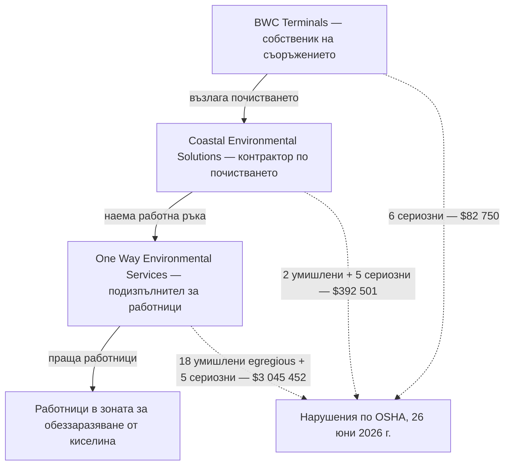

*Снимка: Alex Waldbrand, Unsplash.*

В съботната сутрин след Коледа 2025 г. резервоар от 25 000 барела в терминала на BWC Terminals в Channelview, Тексас — склад за насипни течни товари, разположен направо на Хюстънския корабен канал — вдига свръхналягане и разкъсва 6-инчова захранваща линия. Онова, което изтича, е отработена сярна киселина. Не капка, не локва: приблизително **един милион галона** — по-голямата част в обваловката около резервоара, неизвестно количество в самия корабен канал.

Четиридесет и четирима души минават през медицински преглед същия ден, включително екипажите на два акостирали наблизо кораба. Двама постъпват в болница с дихателни проблеми и по-късно са изписани. Властите обмислят евакуация на района и се отказват — в непосредствена близост няма жилища, само терминали, докове и вода. До вечерта течът е овладян, каналът остава отворен и историята изпада от новините.

Частта от историята, която има значение за всеки, който работи индустриално контракторство, идва шест месеца по-късно. На 26 юни 2026 г. OSHA — федералният регулатор по безопасност на труда в САЩ — публикува резултатите от своите инспекции: над **3,5 милиона долара предложени глоби**, разпределени между три компании. И начинът, по който се разпределят тези пари, е целият урок.

Компанията, която притежава резервоара: 82 750 долара. Контракторът, нает да ръководи почистването: 392 501 долара. А подизпълнителят на дъното на веригата — компанията, която просто е доставила работниците, стояли реално в киселинните остатъци — **3 045 452 долара**.

Прочетете това отново, отдолу нагоре. Колкото по-далеч е една компания от резервоара и колкото по-близо са хората ѝ до киселината, толкова по-голяма е глобата. Това не е счетоводна случайност. Това е анатомията на начина, по който реално се върши почистването след аварии — и си струва да я разгледаме бавно, защото ако си изкарвате хляба през портала за контрактори, дъното на тази верига е мястото, където живеете.

## Какво се случи в Channelview

Първо, самият ден. Channelview се намира на северния бряг на Хюстънския корабен канал — водния път, който нанизва един от най-големите нефтохимически комплекси в света. BWC Terminals оперира там склад за насипни течности — резервоарни паркове, които съхраняват чужд продукт между кораб, жп и автотранспорт. Един от тези резервоари е съдържал отработена сярна киселина.

„Отработена" заслужава едно изречение, защото звучи безобидно, а не е. Рафинериите използват концентрирана сярна киселина като катализатор в алкилиращите инсталации — процесът, който произвежда високооктанови бензинови компоненти. Киселината излиза от тази служба разредена и замърсена с вода и въглеводороди и се изпраща за регенерация. Тя все още е киселина. Все още изгаря кожа, яде стомана и вкарва хора в болница, когато отиде там, където не трябва. Просто вече няма вниманието към документацията, което получава свежият продукт.

Според разследването на OSHA терминалът е смесвал **свежа и отработена сярна киселина** — и то въпреки предупреждения за безопасност. Смесването на двете е известна лоша идея по проста химическа причина: отработената киселина носи вода и въглеводороди, а силната сярна киселина реагира с вода бурно, отделяйки топлина. Топлина в затворен резервоар прави газ и пари. Газ в затворен резервоар прави налягане. На 27 декември налягането печели: резервоарът вдига свръхналягане и 6-инчова захранваща линия се разкъсва. Местните власти в същия ден описват срутила се пасарелка, отнесла линията, когато резервоарът поддава — механиката едва ли има значение до обема. Резервоар с такъв размер не тече; той се излива.

По-голямата част от киселината отива там, където проектът казва: в обваловката около резервоара. Част от нея — не. Аварийните екипи прекарват деня в неутрализиране, следене на въздуха, триаж на хората, вдишали мъглата. И тогава извънредната ситуация, формално казано, приключва.

Точно за този момент е всъщност този текст. Защото когато сирените замлъкнат, милион галона киселина и всичко, до което се е докоснала, все още стоят там — и някой трябва да ги почисти.

## Шест месеца по-късно: списъкът с нарушенията

OSHA открива три инспекции след изпускането — по една на замесен работодател — и на 26 юни 2026 г. публикува резултата. Структурата на операцията по почистване, направо от правителственото съобщение, изглежда така: BWC Terminals наема **Coastal Environmental Solutions Inc.** да поеме почистването на опасните отпадъци, а Coastal на свой ред наема **One Way Environmental Services LLC** като подизпълнител, който да достави работниците за почистване и обеззаразяване.

Ето как се стоварват нарушенията:

- **One Way Environmental Services LLC** — подизпълнителят за работна ръка: **18 умишлени нарушения от най-тежката категория (willful egregious) и 5 сериозни, предложени 3 045 452 долара**. OSHA установява, че е пращал работници по почистването без адекватно обучение, без фит тестове на респираторите и без изискваните мерки за безопасност.
- **Coastal Environmental Solutions Inc.** — контракторът по почистването: **2 умишлени и 5 сериозни нарушения, предложени 392 501 долара**. Липсващо обучение на работниците, липса на програма за безопасност и здраве, липса на авариен план за операции с опасни отпадъци и пропуски в използването на респиратори.
- **BWC Terminals LLC** — собственикът на съоръжението: **6 сериозни нарушения, предложени 82 750 долара**. Излагане на работници на химически изгаряния, непредоставяне на обучение за опасни материали и пропуски при респираторите.

Общо: **3 520 703 долара**. Компаниите са имали 15 работни дни да изпълнят, да се срещнат с OSHA или да оспорят констатациите — така че приемайте всяка цифра тук като предложена, не окончателна. Предложените глоби постоянно се договарят надолу. Констатациите под тях обикновено оцеляват.

Заместник-министърът на труда по безопасност и здраве при работа го казва в две изречения, които заслужават дословно цитиране. Първо: „Въпреки че са имали пълно знание за тежките опасности при разлива и при отговора по почистването, тези трима работодатели са избрали да заобиколят изискванията на OSHA." И след това онова, което трябва да се ламинира върху всеки договор за подизпълнение: **„Съвместният им провал да защитят работниците не беше пропуск — беше избор, който доведе до предотвратими наранявания на служители."**

Не пропуск. Избор. Регулаторите не използват тази дума небрежно — „умишлено" (willful) е правна категория и означава, че работодателят е знаел какво изискват правилата и е решил да не ги спазва.

А „egregious" е още по-рядко. Политиката на OSHA за най-тежките случаи — формалното име е „цитиране случай по случай" (instance-by-instance) — се пази за най-лошото. Вместо да напише едно нарушение за „липсва програма за обучение", OSHA пише отделно нарушение за всеки случай: всеки работник, всяко повторение. Осемнадесет умишлени нарушения от най-тежката категория не означава, че компанията е направила осемнадесет различни грешки. Обикновено означава, че е взела едно решение — „пращай ги все пак" — и OSHA е преброила хората от другата му страна.

## Веригата, прочетена от дъното

Сега забавете и погледнете кои са били тези хора.

Когато един разлив стигне до новините, работниците, които виждате в кадрите от първите часове, са аварийни спасители — обучени hazmat екипи, обикновено добре тренирани, добре екипирани и добре документирани. Но аварийната фаза е кратка. Следват седмици или месеци обеззаразяване: изпомпване на замърсена течност, стъргане и измиване на повърхности, боравене с варели неутрализиран отпадък, рязане на повредена стомана, полагане и вдигане на изолации. Това е бавна, мокра, монотонна работа точно на мястото, където живее опасността.

И ето структурната истина, която нарушенията от Channelview изкарват наяве: тази работа много рядко се върши от хората на самото съоръжение, а често дори не и от хората на контрактора по почистването. Върши се от работна ръка, доставена от по-надолу по веригата — наета бързо, защото обеззаразяването не чака; наета евтино, защото договорът над нея е спечелен на цена; и наета от разстояние, защото точно за това служи веригата. Всяко звено между резервоара и работника взима марж и смъква от себе си отговорност. На дъното работата, която се нуждае от *най-много* защита, се държи от хората с *най-малко* от нея.

В Channelview, според OSHA, работниците са влезли в зона за обеззаразяване от сярна киселина без адекватно обучение и с респиратори, които никой не е фит-тествал към лицата им. Ако никога не сте минавали фит тест: това е процедурата, при която вашият конкретен респиратор се проверява върху вашето конкретно лице, за да се докаже, че наистина уплътнява — с тестовия аерозол, който ви кара да кашляте, ако има теч. Респиратор без фит тест не е защитно средство. Той е гумен предмет, който променя как изглеждате, докато вдишвате киселинна мъгла.

Хората, които са ги носели, вероятно не са знаели това. Точно за това служи обучението — а обучението е онова, което го е нямало. Този блог все се връща към темата какво не покрива обучителната карта — това е най-мрачната ѝ версия: онази, в която карта изобщо няма.

*Снимка: Cash Macanaya, Unsplash.*

## Правилникът, който покрива тази работа

Правилата точно за тази ситуация съществуват от 1990 г. Стандартът на OSHA за работа с опасни отпадъци — HAZWOPER, съкращение от Hazardous Waste Operations and Emergency Response („Операции с опасни отпадъци и авариен отговор") — е написан именно защото почистването след химически изпускания продължаваше да наранява хора, след като камерите си тръгнат. Той покрива самата авария, а след това, в отделен свой раздел, **почистването след аварийния отговор**: фазата, за която са били наети работниците от Channelview.

Казано просто, HAZWOPER изисква нещата, чиято липса изпълни списъка с нарушения. Работниците по почистване на опасни отпадъци се нуждаят от истинско обучение, преди да докоснат площадката — за най-мръсната работа това е 40-часовият курс плюс дни на място под надзор, и то принадлежи на работника: документирано, преносимо, опреснявано ежегодно. Нуждаят се от **план за безопасност и здраве за конкретната площадка**: писмен документ, който казва какво е веществото, къде е, какви са граничните стойности на експозиция, какви ЛПС изисква всяка задача и как работи обеззаразяването. Нуждаят се от респиратори, подбрани за реалната опасност, фит-тествани към реалния човек, подкрепени с медицинска оценка. И някой компетентен трябва да отговаря за този план на площадката, всяка смяна.

Нищо от това не е екзотика. Всеки екологичен контрактор знае HAZWOPER така, както скелетчикът знае табелите си. Точно затова OSHA посяга към думата *умишлено*: това не е неясно правило, което никой не е длъжен да знае. Това е входният билет за индустрията, в която тези компании работят.

Има още един механизъм, който си струва да разберете, защото обяснява защо *три* компании са цитирани за една и съща площадка, а не само най-долната. Американското правоприлагане използва доктрината за множество работодатели: на споделена площадка приемащото съоръжение, управляващият контрактор и подизпълнителят могат едновременно да носят задължения към един и същ работник. Отговорността тече надолу по веригата — но не *напуска* горните звена. Да възложиш работата навън е законно. Да възложиш задължението навън — не е.

Погледнете двете посоки в тази диаграма. Работата тече надолу. Отговорността, когато OSHA най-накрая пристига, тече към всяко звено — но най-тежко точно там, където задължението към работника е било най-пряко и най-пренебрегнато.

## Какво реално може да направи един екип

Първо честната уговорка, както винаги в този блог: работник, нает за почистване, не може да одитира договорната верига над себе си, а бригадир, работещ за подизпълнител, не може да пренапише програмата за безопасност на главния контрактор. Но нарушенията от Channelview сочат към неща, които наистина са в ръцете на работника или бригадира — защото всяка липсваща точка от онзи списък е нещо, за което работникът може да *попита* преди първата смяна.

**Попитайте какво е веществото — на глас, преди да се екипирате.** Не търговското име, а опасността: какво прави на кожа, дробове, очи и какви са симптомите на свръхекспозиция? На легитимна площадка за опасни отпадъци този отговор съществува писмено в плана за безопасност и човекът, който ви инструктира, може да го извади за минута. Ако отговорът е „киселина, носи си маската", току-що сте научили всичко нужно за площадката — и нищо от него не е добро.

**Отнасяйте се към фит теста като към лична собственост.** Ако ще носите плътно прилягащ респиратор, някой трябва да е тествал този модел, този размер, върху вашето лице — и вие сте били там, когато се е случило, кашляйки или не при тестовия аерозол. Никой не може да го направи *вместо* вас, без да знаете. Така че въпросът „кога беше моят фит тест?" има само два отговора: дата или истината. Нашите екипи работят по задачи с дихателни апарати под европейската контракторска сертификация SCC/VCA и дисциплината на проверката за прилягане се тренира всяка година — не защото одиторите обичат документи, а защото пропускащото уплътнение е невидимо чак до доклада за експозиция.

**Обучителната ви карта пътува с вас.** Обучението по HAZWOPER — както обучението за дихателни апарати, както билетите за затворени пространства — принадлежи на работника, не на работодателя. Ако вършите работа по обеззаразяване, вашият сертификат и датата на опресняването му са ваши: да ги знаете и да ги покажете. Компания, която ви наема за работа с опасни отпадъци и никога не поиска да види карта, ви е казала още преди първия ден как ще мине останалото.

**Бригадири: четете едно ниво нагоре.** Преди хората ви да се мобилизират на чуждо почистване, поискайте от нивото над вас два документа: плана за безопасност за конкретната площадка и името на човека, отговорен за него на място. Не ги одитирате — проверявате, че механизмът съществува. Главен контрактор с работеща система праща и двете в един имейл. Мълчанието също е отговор — и в Channelview мълчанието би било точният.

## Урокът за бригадири и млади техници

Изграден от онова, което нарушенията на OSHA реално установяват:

1. **Дъното на веригата наследява най-много задължения, не най-малко.** Компанията, чиято единствена роля е била да доставя работници, поема 86% от глобите — защото е била прекият работодател на хората на острия край. Ако бизнесът на фирмата ви е да осигурява работна ръка, законът ви вижда като първата линия на защита, каквото и да пише договорът за това кой командва.

2. **Аварията свършва с декларация; опасността — не.** Драматичната фаза в Channelview продължи ден. Фазата на експозицията — почистването — продължи месеци, с по-малко внимание, по-малко структура и, според OSHA, по-малко защита. Ако работата ви започва *след* като новинарските екипи си тръгнат, рискът ви не се е свил. Свила се е видимостта ви.

3. **Респиратор без фит тест е костюм.** Между киселинната мъгла и дробовете ви има гумено уплътнение, което или пасва на лицето ви, или не. Без фит тест никой не знае. Това е най-евтиният тест в индустриалната хигиена — и пропускането му превърна ЛПС в театрален реквизит за осемнадесет умишлени нарушения.

4. **„Умишлено" означава, че някой е решил.** Три отделни компании, според регулатора, са знаели опасностите и въпреки това са заобиколили изискванията. Повечето инциденти, които този блог разглежда, са системи, отказващи бавно. Този е по-прост и по-грозен: системата е съществувала, на хартия, в стандарт, по-стар от повечето от работниците — и е била оставена настрана.

5. **Въпросите са единственият одит на работника.** Какво е това, къде е фит тестът ми, къде е картата ми, кой отговаря за плана? Четири въпроса, по минута всеки. Площадка, която може да им отговори, така или иначе е щяла да ви защити. Площадка, която не може, току-що ви е връчила единственото предупреждение, което ще получите.

Един милион галона киселина бяха в новините един уикенд. Изборите за това кой ще ги почисти, с какво облечен и знаейки какво — те изобщо не стигнаха до новините, докато не стигнаха глобите. Хората на дъното на веригата са имали право на същата защита като всички над тях. Шест месеца по-късно поне документите най-накрая го казват.

## Признание и допълнително четиво

- Национално прессъобщение на OSHA, *US Department of Labor proposes $3.5M in fines for dangerous health, safety violations by 3 employers during Houston facility chemical spill response* (26 юни 2026 г.): [https://www.osha.gov/news/newsreleases/osha-national-news-release/20260626](https://www.osha.gov/news/newsreleases/osha-national-news-release/20260626)
- Огледално съобщение на Министерството на труда на САЩ: [https://www.dol.gov/newsroom/releases/osha/osha20260629](https://www.dol.gov/newsroom/releases/osha/osha20260629)
- KPRC Click2Houston, репортаж от деня на изпускането, 27 декември 2025 г.: [https://www.click2houston.com/news/local/2025/12/27/channelview-chemical-spill-contained-2-hospitalized-with-respiratory-issues/](https://www.click2houston.com/news/local/2025/12/27/channelview-chemical-spill-contained-2-hospitalized-with-respiratory-issues/)
- Occupational Health & Safety, *Texas Chemical Spill Cleanup Sparks Millions In Federal Fines* (29 юни 2026 г.): [https://ohsonline.com/articles/2026/06/29/texas-chemical-spill-cleanup-sparks-millions-in-federal-fines.aspx](https://ohsonline.com/articles/2026/06/29/texas-chemical-spill-cleanup-sparks-millions-in-federal-fines.aspx)
- Стандартът HAZWOPER на OSHA, 29 CFR 1910.120 — какво законово изисква почистването след авариен отговор: [https://www.osha.gov/laws-regs/regulations/standardnumber/1910/1910.120](https://www.osha.gov/laws-regs/regulations/standardnumber/1910/1910.120)
- За друга работа по резервоар, при която документите липсваха преди първият работник да влезе, вижте нашия прочит на [заровения резервоар в PCE Lake Worth](/bg/blog/pce-lake-worth-buried-tank-benzene) — а за това какво става, когато самата химия на почистването се обърне срещу теб, [инцидентът при извеждането от експлоатация в Catalyst Refiners](/bg/blog/catalyst-refiners-h2s-decommissioning-csb).
