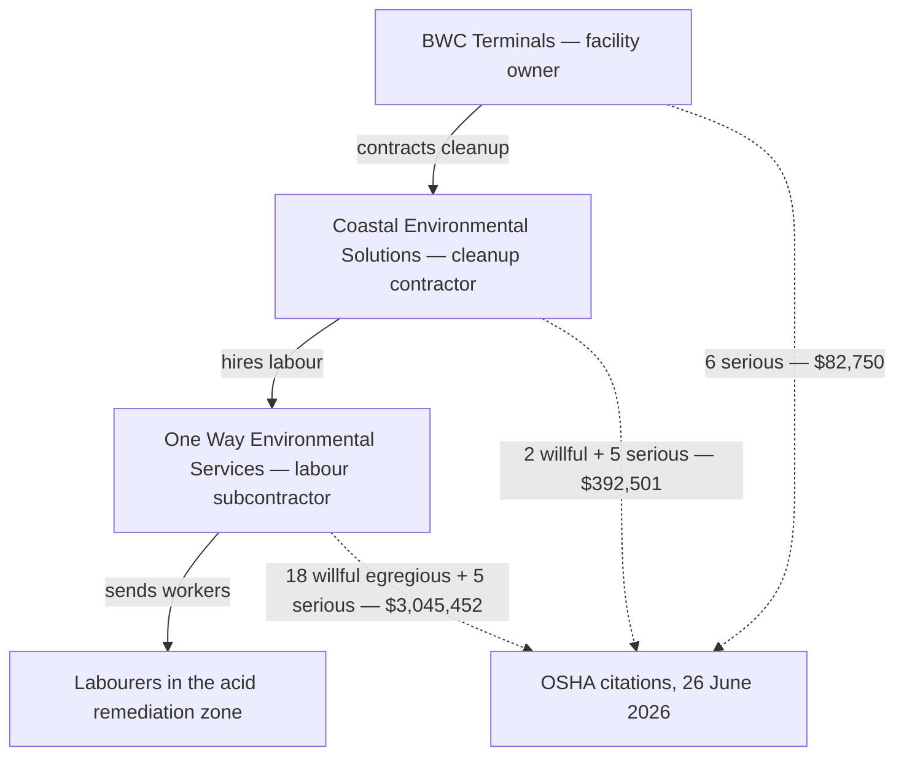

*Image: Alex Waldbrand on Unsplash.*

On the Saturday morning after Christmas 2025, a 25,000-barrel storage tank at the BWC Terminals facility in Channelview, Texas — a bulk liquids terminal sitting right on the Houston Ship Channel — over-pressured and burst a 6-inch supply line. What came out was spent sulfuric acid. Not a drip, not a puddle: roughly **one million gallons** of it, most into the containment area around the tank, an unknown amount into the ship channel itself.

Forty-four people were checked over by medics that day, including crews pulled off two vessels moored nearby. Two went to hospital with breathing problems and were later released. Officials considered evacuating the area and decided against it — there are no homes in the immediate vicinity, just terminals, docks and water. By the evening the leak was contained, the channel stayed open, and the story slid off the news.

The part of the story that matters to anyone who works industrial contracting arrived six months later. On 26 June 2026, OSHA — the US federal workplace safety regulator — published the results of its inspections: more than **$3.5 million in proposed fines**, split across three companies. And the way that money splits is the whole lesson.

The company that owns the tank: $82,750. The contractor hired to run the cleanup: $392,501. And the subcontractor at the bottom of the chain — the company that simply supplied the labourers who actually stood in the acid residue — **$3,045,452**.

Read that again from the bottom up. The further a company sat from the tank, and the closer its people stood to the acid, the bigger the fine. That's not an accounting accident. That's the anatomy of how post-emergency cleanup work actually gets done, and it's worth walking through slowly, because if you work through a contractor gate for a living, the bottom of that chain is where you live.

## What Happened at Channelview

First, the day itself. Channelview sits on the north side of the Houston Ship Channel, the waterway that strings together one of the largest petrochemical complexes in the world. BWC Terminals operates a bulk liquid storage terminal there — tank farms that hold other companies' product between ship, rail and truck. One of those tanks held spent sulfuric acid.

"Spent" is worth a sentence, because it sounds harmless and isn't. Refineries use concentrated sulfuric acid as a catalyst in alkylation units — the process that makes high-octane gasoline components. The acid comes out of that service diluted and contaminated with water and hydrocarbons, and it gets shipped out for regeneration. It's still acid. It still burns skin, eats steel and puts people in hospital when it goes where it shouldn't. It just no longer has a fresh product's paperwork attention.

According to OSHA's investigation, the terminal had been mixing **fresh and spent sulfuric acid** — and it did so despite safety warnings. Mixing the two is a known bad idea for a plain chemical reason: spent acid carries water and hydrocarbons, and strong sulfuric acid reacts with water violently, giving off heat. Heat in a closed tank makes gas and vapour. Gas in a closed tank makes pressure. On 27 December, the pressure won: the tank over-pressured and a 6-inch supply line ruptured. Local officials on the day described a collapsed catwalk taking the line out as the tank let go — the mechanics hardly matter next to the volume. A tank that size doesn't leak; it disgorges.

Most of the acid went where the design said it should: into the containment dike around the tank. Some of it didn't. Emergency crews spent the day neutralizing, monitoring air, triaging the people who'd breathed the mist. And then the emergency, formally speaking, ended.

That's the moment this post is actually about. Because when the sirens stop, a million gallons of acid and everything it touched is still sitting there — and somebody has to clean it up.

## Six Months Later: The Citation List

OSHA opened three inspections after the release — one per employer involved — and on 26 June 2026 it published the outcome. The structure of the cleanup operation, straight from the government's release, looked like this: BWC Terminals contracted **Coastal Environmental Solutions Inc.** to handle the hazardous waste cleanup, and Coastal in turn hired **One Way Environmental Services LLC** as a subcontractor to provide the labourers for cleanup and remediation.

Here's how the citations landed:

- **One Way Environmental Services LLC** — the labour subcontractor: **18 willful egregious violations and 5 serious violations, $3,045,452 proposed**. OSHA found it sent cleanup workers into the job without adequate training, without respirator fit tests, and without required safety measures.
- **Coastal Environmental Solutions Inc.** — the cleanup contractor: **2 willful and 5 serious violations, $392,501 proposed**. Missing worker training, no safety and health program, no emergency response plan for hazardous waste operations, and deficiencies in how respirators were used.
- **BWC Terminals LLC** — the facility owner: **6 serious violations, $82,750 proposed**. Exposing workers to chemical burns, failing to provide hazmat training, and respirator deficiencies.

Total: **$3,520,703**. The companies had 15 business days to comply, meet with OSHA, or contest the findings — so treat every figure here as proposed, not final. Proposed penalties get negotiated down all the time. The findings underneath them tend to survive.

The Assistant Secretary of Labor for Occupational Safety and Health put it in two sentences that deserve quoting verbatim. First: "Despite having full knowledge of the severe hazards involved in the spill and cleanup response, these three employers chose to bypass OSHA requirements." And then the one that should be laminated onto every subcontract: **"Their joint failure to protect workers was not an oversight, it was a choice that resulted in preventable employee injuries."**

Not an oversight. A choice. Regulators don't use that word casually — "willful" is a legal category, and it means the employer knew what the rules required and decided not to follow them.

And "egregious" is rarer still. OSHA's egregious policy — the formal name is instance-by-instance citation — is reserved for the worst cases. Instead of writing one citation for "no training program," OSHA writes a separate violation for each instance: each worker, each occurrence. Eighteen willful egregious violations doesn't mean the company made eighteen different mistakes. It usually means it made one decision — send them in anyway — and OSHA counted the people on the other end of it.

## The Chain, Read from the Bottom

Now slow down and look at who those people were.

When a spill makes the news, the workers you see in the footage during the first hours are emergency responders — trained hazmat teams, usually well drilled, well equipped and well documented. But the emergency phase is short. What follows is weeks or months of remediation: pumping out contaminated liquid, scraping and washing surfaces, handling drums of neutralized waste, cutting up damaged steel, laying down and pulling up containment. It's slow, wet, repetitive work in the exact place the hazard lives.

And here's the structural truth the Channelview citations expose: that work is very rarely done by the facility's own people, and often not even by the cleanup contractor's own people. It's done by labour supplied from further down the chain — hired fast, because remediation can't wait; hired cheap, because the contract above it was won on price; and hired at arm's length, because that's what the chain is for. Every layer between the tank and the worker takes a margin and sheds a responsibility. By the bottom, the job that needs the *most* protection is held by the people with the *least* of it.

At Channelview, per OSHA, the labourers went into a sulfuric acid remediation site without adequate training and wearing respirators nobody had fit-tested to their faces. If you've never had a fit test: it's the procedure where your specific respirator gets checked, on your specific face, to prove it actually seals — with the test aerosol that makes you cough if it leaks. A respirator that hasn't been fit-tested isn't protective equipment. It's a rubber object that changes how you look while you inhale acid mist.

The people wearing them likely didn't know that. That's the point of training, and the training is what wasn't there. This blog keeps coming back to the theme of what the training card doesn't cover — this is the bleakest version of it, the one where there is no card at all.

*Image: Cash Macanaya on Unsplash.*

## The Rulebook That Covers This Work

The rules for exactly this situation have existed since 1990. OSHA's standard for hazardous waste work — HAZWOPER, short for Hazardous Waste Operations and Emergency Response — was written precisely because cleanup work after chemical releases kept hurting people once the cameras left. It covers the emergency itself, and then, in its own section, the **post-emergency response cleanup**: the phase Channelview's labourers were hired for.

In plain words, HAZWOPER requires the things whose absence filled the citation list. Workers on a hazardous waste cleanup need real training before they touch the site — for the dirtiest work that's the 40-hour course plus supervised field days, and it belongs to the worker, documented, portable, renewed yearly. They need a **site-specific safety and health plan**: a written document that says what the substance is, where it is, what the exposure limits are, what PPE each task needs, and how decontamination works. They need respirators selected for the actual hazard, fit-tested to the actual person, backed by medical evaluation. And somebody competent needs to own that plan on site, every shift.

None of that is exotic. Every environmental contractor knows HAZWOPER the way a scaffolder knows their tags. Which is exactly why OSHA reached for the word *willful*: this wasn't an obscure rule nobody could be expected to know. It's the entry ticket to the industry these companies are in.

There's one more mechanism worth understanding, because it explains why *three* companies got cited for the same site rather than just the bottom one. US enforcement uses a multi-employer doctrine: on a shared site, the host facility, the managing contractor and the subcontractor can each hold duties toward the same worker at the same time. Responsibility flows down the chain — but it doesn't *leave* the upper links. Contracting the work out is legal. Contracting the duty out is not.

Look at the two directions in that diagram. The work flows down. The accountability, when OSHA finally arrived, flowed to every link — but heaviest exactly where the duty to the worker was most direct and most ignored.

## What a Crew Can Actually Do

The honest disclaimer first, same as always on this blog: a labourer hired onto a cleanup can't audit the contract chain above them, and a crew lead working for a sub can't rewrite the prime contractor's safety program. But the Channelview citations point at things that are genuinely in a worker's or a crew lead's hands — because every missing item on that citation list is something a worker can *ask about* before the first shift.

**Ask what the substance is — out loud, before you suit up.** Not the trade name, the hazard: what does it do to skin, lungs, eyes, and what are the symptoms of overexposure? On a legitimate hazardous waste site, that answer exists in writing in the site safety plan, and the person briefing you can produce it in a minute. If the answer is "acid, wear your mask," you've just learned everything you need to know about the site — none of it good.

**Treat the fit test as your personal property.** If you'll wear a tight-fitting respirator, someone must have tested that model, that size, on your face — and you were there when it happened, coughing or not coughing at the test aerosol. Nobody can do it *to* you without your knowledge. So the question "when was my fit test?" has only two answers: a date, or the truth. Our own crews work breathing-apparatus jobs under European SCC/VCA contractor certification, and the fit check discipline is drilled every single year — not because auditors love paperwork, but because a leaking seal is invisible right up until the exposure report.

**Your training card travels with you.** HAZWOPER training — like BA training, like confined-space tickets — belongs to the worker, not the employer. If you do remediation work, your certificate and its refresher date are yours to know and yours to show. A company that hires you for hazardous waste labour and never asks to see a card has told you, before day one, how the rest will go.

**Crew leads: read one layer up.** Before your people mobilize onto someone else's cleanup, ask the layer above you for two documents: the site-specific safety plan, and the name of the person responsible for it on site. You're not auditing them — you're checking that the machinery exists. A prime contractor with a working system sends both in one email. Silence is also an answer, and at Channelview, silence would have been the accurate one.

## The Lesson for Crew Leads and Young Techs

Built from what OSHA's citations actually establish:

1. **The bottom of the chain inherits the most duty, not the least.** The company whose only role was supplying workers drew 86% of the fines — because it was the direct employer of the people at the sharp end. If your company's business is providing labour, the law sees you as the first line of protection, whatever the contract says about who's in charge.

2. **The emergency ends by declaration; the hazard doesn't.** The dramatic phase at Channelview lasted a day. The exposure phase — the cleanup — lasted months, with less attention, less structure and, per OSHA, less protection. If your work starts *after* the news crews leave, your risk didn't shrink. Your visibility did.

3. **An unfitted respirator is a costume.** Between acid mist and your lungs there is a rubber seal that either matches your face or doesn't. No fit test means nobody knows. It's the cheapest test in industrial hygiene, and skipping it converted PPE into set dressing for eighteen willful counts.

4. **"Willful" means someone decided.** Three separate companies, per the regulator, knew the hazards and bypassed the requirements anyway. Most of the incidents this blog covers are systems failing slowly. This one is simpler and uglier: the system existed, on paper, in a standard older than most of the workers — and it was set aside.

5. **Questions are the worker's only audit.** What is it, where's my fit test, where's my card, who owns the plan? Four questions, one minute each. A site that can answer them was going to protect you anyway. A site that can't has just handed you the only warning you'll get.

One million gallons of acid made the news for a weekend. The choices about who would clean it up, wearing what, knowing what — those never made the news at all, until the fines did. The people at the bottom of the chain were owed the same protection as everyone above them. Six months later, at least the paperwork finally says so.

## Credit and Further Reading

- OSHA national news release, *US Department of Labor proposes $3.5M in fines for dangerous health, safety violations by 3 employers during Houston facility chemical spill response* (26 June 2026): [https://www.osha.gov/news/newsreleases/osha-national-news-release/20260626](https://www.osha.gov/news/newsreleases/osha-national-news-release/20260626)
- US Department of Labor mirror of the release: [https://www.dol.gov/newsroom/releases/osha/osha20260629](https://www.dol.gov/newsroom/releases/osha/osha20260629)
- KPRC Click2Houston, day-of coverage of the 27 December 2025 release: [https://www.click2houston.com/news/local/2025/12/27/channelview-chemical-spill-contained-2-hospitalized-with-respiratory-issues/](https://www.click2houston.com/news/local/2025/12/27/channelview-chemical-spill-contained-2-hospitalized-with-respiratory-issues/)
- Occupational Health & Safety, *Texas Chemical Spill Cleanup Sparks Millions In Federal Fines* (29 June 2026): [https://ohsonline.com/articles/2026/06/29/texas-chemical-spill-cleanup-sparks-millions-in-federal-fines.aspx](https://ohsonline.com/articles/2026/06/29/texas-chemical-spill-cleanup-sparks-millions-in-federal-fines.aspx)
- OSHA's HAZWOPER standard, 29 CFR 1910.120, for what post-emergency cleanup work legally requires: [https://www.osha.gov/laws-regs/regulations/standardnumber/1910/1910.120](https://www.osha.gov/laws-regs/regulations/standardnumber/1910/1910.120)
- For another tank job where the paperwork was missing before the first worker went in, see our reading of the [buried tank at PCE Lake Worth](/en/blog/pce-lake-worth-buried-tank-benzene) — and for what happens when cleanup chemistry itself turns hostile, the [Catalyst Refiners decommissioning incident](/en/blog/catalyst-refiners-h2s-decommissioning-csb).
