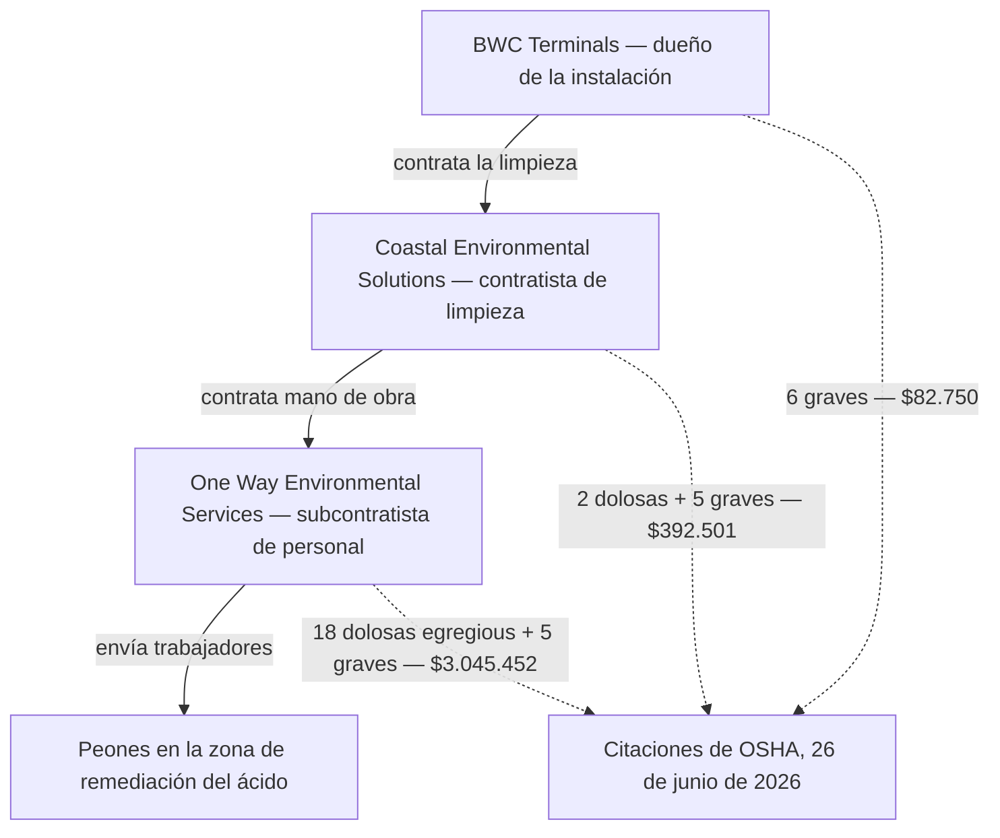

*Imagen: Alex Waldbrand en Unsplash.*

La mañana del sábado siguiente a la Navidad de 2025, un tanque de almacenamiento de 25.000 barriles en la instalación de BWC Terminals en Channelview, Texas — una terminal de líquidos a granel situada justo sobre el Canal de Navegación de Houston — se sobrepresurizó y reventó una línea de suministro de 6 pulgadas. Lo que salió fue ácido sulfúrico gastado. No una gota, no un charco: aproximadamente **un millón de galones**, la mayor parte hacia el área de contención alrededor del tanque, y una cantidad desconocida hacia el propio canal.

Cuarenta y cuatro personas pasaron por revisión médica ese día, incluidas las tripulaciones de dos buques amarrados cerca. Dos fueron al hospital con problemas respiratorios y luego recibieron el alta. Las autoridades consideraron evacuar la zona y lo descartaron — no hay viviendas en las inmediaciones, solo terminales, muelles y agua. Al caer la tarde la fuga estaba contenida, el canal siguió abierto y la historia desapareció de las noticias.

La parte de la historia que importa a cualquiera que trabaje en contratación industrial llegó seis meses después. El 26 de junio de 2026, OSHA — el regulador federal de seguridad laboral de Estados Unidos — publicó los resultados de sus inspecciones: más de **3,5 millones de dólares en multas propuestas**, repartidas entre tres empresas. Y la forma en que se reparte ese dinero es toda la lección.

La empresa dueña del tanque: 82.750 dólares. El contratista contratado para dirigir la limpieza: 392.501 dólares. Y el subcontratista en el fondo de la cadena — la empresa que simplemente suministró a los peones que de verdad estuvieron de pie sobre los residuos de ácido — **3.045.452 dólares**.

Léalo otra vez, de abajo hacia arriba. Cuanto más lejos estaba una empresa del tanque, y cuanto más cerca estaba su gente del ácido, mayor fue la multa. Eso no es un accidente contable. Es la anatomía de cómo se hace realmente el trabajo de limpieza posterior a una emergencia, y vale la pena recorrerla despacio, porque si usted se gana la vida cruzando la puerta de contratistas, el fondo de esa cadena es donde vive.

## Qué pasó en Channelview

Primero, el día en sí. Channelview está en la orilla norte del Canal de Navegación de Houston, la vía fluvial que enhebra uno de los mayores complejos petroquímicos del mundo. BWC Terminals opera allí una terminal de almacenamiento de líquidos a granel — parques de tanques que guardan producto ajeno entre el barco, el ferrocarril y el camión. Uno de esos tanques contenía ácido sulfúrico gastado.

Lo de "gastado" merece una frase, porque suena inofensivo y no lo es. Las refinerías usan ácido sulfúrico concentrado como catalizador en las unidades de alquilación — el proceso que fabrica componentes de gasolina de alto octanaje. El ácido sale de ese servicio diluido y contaminado con agua e hidrocarburos, y se envía a regeneración. Sigue siendo ácido. Sigue quemando la piel, comiéndose el acero y mandando gente al hospital cuando va a donde no debe. Simplemente ya no recibe la atención documental de un producto fresco.

Según la investigación de OSHA, la terminal había estado mezclando **ácido sulfúrico fresco y gastado** — y lo hizo a pesar de las advertencias de seguridad. Mezclar los dos es una mala idea conocida por una razón química simple: el ácido gastado lleva agua e hidrocarburos, y el ácido sulfúrico fuerte reacciona con el agua de forma violenta, desprendiendo calor. El calor en un tanque cerrado genera gas y vapor. El gas en un tanque cerrado genera presión. El 27 de diciembre, la presión ganó: el tanque se sobrepresurizó y una línea de suministro de 6 pulgadas se rompió. Los funcionarios locales describieron ese día una pasarela colapsada que se llevó la línea cuando el tanque cedió — la mecánica apenas importa al lado del volumen. Un tanque de ese tamaño no gotea; se vacía.

La mayor parte del ácido fue a donde el diseño decía: al dique de contención alrededor del tanque. Una parte no. Los equipos de emergencia pasaron el día neutralizando, monitoreando el aire, haciendo triaje a la gente que había respirado la neblina. Y entonces la emergencia, formalmente hablando, terminó.

Ese es el momento del que trata realmente este artículo. Porque cuando las sirenas se apagan, un millón de galones de ácido y todo lo que tocó siguen ahí — y alguien tiene que limpiarlo.

## Seis meses después: la lista de infracciones

OSHA abrió tres inspecciones tras el escape — una por empleador implicado — y el 26 de junio de 2026 publicó el resultado. La estructura de la operación de limpieza, directamente del comunicado del gobierno, era así: BWC Terminals contrató a **Coastal Environmental Solutions Inc.** para encargarse de la limpieza de residuos peligrosos, y Coastal a su vez contrató a **One Way Environmental Services LLC** como subcontratista para suministrar los peones de la limpieza y remediación.

Así aterrizaron las citaciones:

- **One Way Environmental Services LLC** — el subcontratista de mano de obra: **18 infracciones dolosas de categoría máxima (willful egregious) y 5 graves, 3.045.452 dólares propuestos**. OSHA halló que envió a los trabajadores de limpieza sin formación adecuada, sin pruebas de ajuste de los respiradores y sin las medidas de seguridad exigidas.
- **Coastal Environmental Solutions Inc.** — el contratista de la limpieza: **2 infracciones dolosas y 5 graves, 392.501 dólares propuestos**. Falta de formación de los trabajadores, sin programa de seguridad y salud, sin plan de respuesta a emergencias para operaciones con residuos peligrosos y deficiencias en el uso de respiradores.
- **BWC Terminals LLC** — el dueño de la instalación: **6 infracciones graves, 82.750 dólares propuestos**. Exponer a trabajadores a quemaduras químicas, no proporcionar formación en materiales peligrosos y deficiencias con los respiradores.

Total: **3.520.703 dólares**. Las empresas tenían 15 días hábiles para cumplir, reunirse con OSHA o impugnar las conclusiones — así que tome cada cifra de aquí como propuesta, no definitiva. Las multas propuestas se negocian a la baja constantemente. Las conclusiones que hay debajo suelen sobrevivir.

El Subsecretario de Trabajo para la Seguridad y Salud Ocupacional lo dijo en dos frases que merecen cita literal. Primero: "A pesar de tener pleno conocimiento de los graves peligros implicados en el derrame y la respuesta de limpieza, estos tres empleadores eligieron saltarse los requisitos de OSHA." Y luego la que debería plastificarse sobre cada subcontrato: **"Su fracaso conjunto en proteger a los trabajadores no fue un descuido, fue una elección que resultó en lesiones evitables de empleados."**

No un descuido. Una elección. Los reguladores no usan esa palabra a la ligera — "dolosa" (willful) es una categoría legal, y significa que el empleador sabía lo que exigían las normas y decidió no seguirlas.

Y "egregious" es aún más rara. La política de OSHA para los casos extremos — el nombre formal es citación instancia por instancia — se reserva para lo peor. En lugar de escribir una citación por "no hay programa de formación", OSHA escribe una infracción separada por cada instancia: cada trabajador, cada ocurrencia. Dieciocho infracciones dolosas de categoría máxima no significa que la empresa cometió dieciocho errores distintos. Normalmente significa que tomó una decisión — mándalos igual — y OSHA contó a las personas al otro lado de esa decisión.

## La cadena, leída desde el fondo

Ahora vaya despacio y mire quiénes eran esas personas.

Cuando un derrame llega a las noticias, los trabajadores que se ven en las imágenes de las primeras horas son los servicios de emergencia — equipos hazmat entrenados, normalmente bien preparados, bien equipados y bien documentados. Pero la fase de emergencia es corta. Lo que sigue son semanas o meses de remediación: bombear líquido contaminado, raspar y lavar superficies, manejar bidones de residuo neutralizado, cortar acero dañado, tender y recoger contenciones. Es un trabajo lento, húmedo y repetitivo en el lugar exacto donde vive el peligro.

Y aquí está la verdad estructural que las citaciones de Channelview dejan al descubierto: ese trabajo rara vez lo hace el personal propio de la instalación, y muchas veces ni siquiera el personal propio del contratista de limpieza. Lo hace mano de obra suministrada desde más abajo en la cadena — contratada rápido, porque la remediación no espera; contratada barata, porque el contrato de arriba se ganó por precio; y contratada a distancia, porque para eso existe la cadena. Cada eslabón entre el tanque y el trabajador toma un margen y se desprende de una responsabilidad. En el fondo, el trabajo que necesita *más* protección lo tienen las personas con *menos*.

En Channelview, según OSHA, los peones entraron a un sitio de remediación de ácido sulfúrico sin formación adecuada y con respiradores que nadie había ajustado a sus caras. Si nunca ha pasado una prueba de ajuste: es el procedimiento en el que su respirador concreto se comprueba, sobre su cara concreta, para demostrar que de verdad sella — con el aerosol de prueba que le hace toser si hay fuga. Un respirador sin prueba de ajuste no es un equipo de protección. Es un objeto de goma que cambia su aspecto mientras inhala neblina de ácido.

Las personas que los llevaban probablemente no lo sabían. Ese es el propósito de la formación, y la formación es lo que no estaba. Este blog vuelve una y otra vez al tema de lo que la tarjeta de formación no cubre — esta es su versión más sombría: aquella en la que directamente no hay tarjeta.

*Imagen: Cash Macanaya en Unsplash.*

## El reglamento que cubre este trabajo

Las reglas para exactamente esta situación existen desde 1990. La norma de OSHA para el trabajo con residuos peligrosos — HAZWOPER, siglas de Hazardous Waste Operations and Emergency Response ("Operaciones con residuos peligrosos y respuesta a emergencias") — se escribió precisamente porque el trabajo de limpieza tras los escapes químicos seguía lesionando gente cuando las cámaras se iban. Cubre la emergencia en sí y luego, en su propia sección, la **limpieza posterior a la respuesta de emergencia**: la fase para la que se contrató a los peones de Channelview.

En palabras llanas, HAZWOPER exige las cosas cuya ausencia llenó la lista de citaciones. Los trabajadores de una limpieza de residuos peligrosos necesitan formación real antes de tocar el sitio — para el trabajo más sucio es el curso de 40 horas más días de campo supervisados, y pertenece al trabajador: documentada, portátil, renovada cada año. Necesitan un **plan de seguridad y salud específico del sitio**: un documento escrito que diga cuál es la sustancia, dónde está, cuáles son los límites de exposición, qué EPI requiere cada tarea y cómo funciona la descontaminación. Necesitan respiradores seleccionados para el peligro real, ajustados a la persona real, respaldados por evaluación médica. Y alguien competente tiene que ser dueño de ese plan en el sitio, cada turno.

Nada de eso es exótico. Todo contratista ambiental conoce HAZWOPER como el andamiero conoce sus tarjetas. Y exactamente por eso OSHA echó mano de la palabra *dolosa*: no era una regla oscura que nadie podía conocer. Es el billete de entrada a la industria en la que trabajan estas empresas.

Hay un mecanismo más que vale la pena entender, porque explica por qué se citó a *tres* empresas por el mismo sitio y no solo a la de abajo. La aplicación de la ley en EE. UU. usa la doctrina del multiempleador: en un sitio compartido, la instalación anfitriona, el contratista gestor y el subcontratista pueden tener, cada uno, deberes hacia el mismo trabajador al mismo tiempo. La responsabilidad fluye hacia abajo por la cadena — pero no *abandona* los eslabones de arriba. Subcontratar el trabajo es legal. Subcontratar el deber no lo es.

Mire las dos direcciones de ese diagrama. El trabajo fluye hacia abajo. La rendición de cuentas, cuando OSHA por fin llegó, fluyó hacia todos los eslabones — pero con más peso exactamente donde el deber hacia el trabajador era más directo y más ignorado.

## Qué puede hacer realmente una cuadrilla

Primero la advertencia honesta, como siempre en este blog: un peón contratado para una limpieza no puede auditar la cadena de contratos por encima de él, y un jefe de cuadrilla que trabaja para un subcontratista no puede reescribir el programa de seguridad del contratista principal. Pero las citaciones de Channelview señalan cosas que sí están en manos del trabajador o del jefe de cuadrilla — porque cada elemento ausente de esa lista de citaciones es algo por lo que un trabajador puede *preguntar* antes del primer turno.

**Pregunte qué es la sustancia — en voz alta, antes de ponerse el equipo.** No el nombre comercial, el peligro: ¿qué le hace a la piel, los pulmones, los ojos, y cuáles son los síntomas de sobreexposición? En un sitio legítimo de residuos peligrosos esa respuesta existe por escrito en el plan de seguridad del sitio, y la persona que le da la charla puede sacarla en un minuto. Si la respuesta es "ácido, ponte la máscara", acaba de aprender todo lo que necesitaba saber sobre el sitio — y nada de ello es bueno.

**Trate la prueba de ajuste como propiedad personal.** Si va a llevar un respirador de ajuste facial, alguien tiene que haber probado ese modelo, esa talla, sobre su cara — y usted estaba presente cuando ocurrió, tosiendo o no ante el aerosol de prueba. Nadie puede hacérsela sin que usted lo sepa. Así que la pregunta "¿cuándo fue mi prueba de ajuste?" solo tiene dos respuestas: una fecha, o la verdad. Nuestras propias cuadrillas trabajan tareas con equipos de respiración bajo la certificación europea de contratistas SCC/VCA, y la disciplina de la comprobación de sellado se entrena todos los años — no porque a los auditores les encante el papeleo, sino porque un sello que fuga es invisible justo hasta el informe de exposición.

**Su tarjeta de formación viaja con usted.** La formación HAZWOPER — como la de equipos de respiración, como los certificados de espacios confinados — pertenece al trabajador, no al empleador. Si hace trabajo de remediación, su certificado y su fecha de renovación son suyos: para conocerlos y para mostrarlos. Una empresa que lo contrata para trabajo con residuos peligrosos y nunca pide ver una tarjeta le ha dicho, antes del primer día, cómo irá el resto.

**Jefes de cuadrilla: lean un nivel hacia arriba.** Antes de que su gente se movilice a la limpieza de otro, pida al nivel de arriba dos documentos: el plan de seguridad específico del sitio y el nombre de la persona responsable de él en el sitio. No los está auditando — está comprobando que la maquinaria existe. Un contratista principal con un sistema que funciona envía ambos en un correo. El silencio también es una respuesta, y en Channelview el silencio habría sido la respuesta exacta.

## La lección para jefes de cuadrilla y técnicos jóvenes

Construida a partir de lo que las citaciones de OSHA realmente establecen:

1. **El fondo de la cadena hereda el mayor deber, no el menor.** La empresa cuyo único papel era suministrar trabajadores se llevó el 86% de las multas — porque era el empleador directo de las personas en el extremo afilado. Si el negocio de su empresa es proveer mano de obra, la ley la ve como la primera línea de protección, diga lo que diga el contrato sobre quién manda.

2. **La emergencia termina por declaración; el peligro no.** La fase dramática en Channelview duró un día. La fase de exposición — la limpieza — duró meses, con menos atención, menos estructura y, según OSHA, menos protección. Si su trabajo empieza *después* de que se van los equipos de noticias, su riesgo no se encogió. Se encogió su visibilidad.

3. **Un respirador sin ajustar es un disfraz.** Entre la neblina de ácido y sus pulmones hay un sello de goma que o encaja con su cara o no. Sin prueba de ajuste, nadie lo sabe. Es la prueba más barata de la higiene industrial, y saltársela convirtió el EPI en decorado para dieciocho cargos dolosos.

4. **"Dolosa" significa que alguien decidió.** Tres empresas distintas, según el regulador, conocían los peligros y aun así se saltaron los requisitos. La mayoría de los incidentes que cubre este blog son sistemas fallando despacio. Este es más simple y más feo: el sistema existía, en papel, en una norma más vieja que la mayoría de los trabajadores — y se dejó de lado.

5. **Las preguntas son la única auditoría del trabajador.** Qué es, dónde está mi prueba de ajuste, dónde está mi tarjeta, quién es dueño del plan. Cuatro preguntas, un minuto cada una. Un sitio que puede responderlas iba a protegerlo de todos modos. Un sitio que no puede acaba de entregarle el único aviso que va a recibir.

Un millón de galones de ácido estuvieron en las noticias un fin de semana. Las decisiones sobre quién lo limpiaría, con qué puesto, sabiendo qué — esas nunca llegaron a las noticias, hasta que llegaron las multas. A las personas del fondo de la cadena se les debía la misma protección que a todos los de arriba. Seis meses después, al menos el papeleo por fin lo dice.

## Créditos y lecturas adicionales

- Comunicado nacional de OSHA, *US Department of Labor proposes $3.5M in fines for dangerous health, safety violations by 3 employers during Houston facility chemical spill response* (26 de junio de 2026): [https://www.osha.gov/news/newsreleases/osha-national-news-release/20260626](https://www.osha.gov/news/newsreleases/osha-national-news-release/20260626)
- Réplica del comunicado en el Departamento de Trabajo de EE. UU.: [https://www.dol.gov/newsroom/releases/osha/osha20260629](https://www.dol.gov/newsroom/releases/osha/osha20260629)
- KPRC Click2Houston, cobertura del día del escape, 27 de diciembre de 2025: [https://www.click2houston.com/news/local/2025/12/27/channelview-chemical-spill-contained-2-hospitalized-with-respiratory-issues/](https://www.click2houston.com/news/local/2025/12/27/channelview-chemical-spill-contained-2-hospitalized-with-respiratory-issues/)
- Occupational Health & Safety, *Texas Chemical Spill Cleanup Sparks Millions In Federal Fines* (29 de junio de 2026): [https://ohsonline.com/articles/2026/06/29/texas-chemical-spill-cleanup-sparks-millions-in-federal-fines.aspx](https://ohsonline.com/articles/2026/06/29/texas-chemical-spill-cleanup-sparks-millions-in-federal-fines.aspx)
- La norma HAZWOPER de OSHA, 29 CFR 1910.120 — lo que exige legalmente la limpieza posterior a una emergencia: [https://www.osha.gov/laws-regs/regulations/standardnumber/1910/1910.120](https://www.osha.gov/laws-regs/regulations/standardnumber/1910/1910.120)
- Para otro trabajo en tanques donde el papeleo faltaba antes de que entrara el primer trabajador, vea nuestra lectura del [tanque enterrado de PCE Lake Worth](/es/blog/pce-lake-worth-buried-tank-benzene) — y para lo que pasa cuando la propia química de la limpieza se vuelve hostil, el [incidente de desmantelamiento de Catalyst Refiners](/es/blog/catalyst-refiners-h2s-decommissioning-csb).
