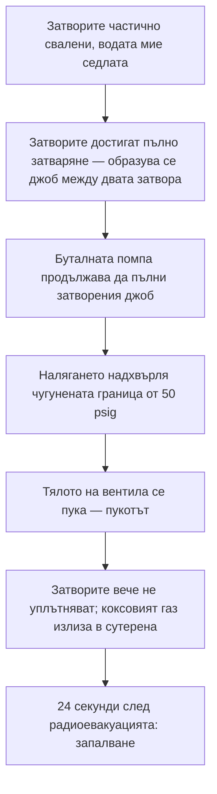

*Снимка: Gérard GRIFFAY, Unsplash.*

В 10:47 сутринта на 11 август 2025 г. екип, работещ по вентил в сутерена под две коксови батерии в завода Clairton Coke Works на U.S. Steel край Питсбърг, чува пукот. Един от работниците по-късно го описва пред федералните разследващи с едно изречение: „Чухме пукот. Звучеше като когато препомпаш гума."

Това, което се е спукало, е 18-инчов чугунен вентил, произведен през 1953 г., разцепен по цялата си обиколка от водно налягане. Коксовият газ — токсичен, запалим страничен продукт от превръщането на въглищата в кокс — започва да излиза от счупения вентил в сутерена. Екипът бяга. Един от тях хуква нагоре по стълбите, викайки хората да излизат. Работник едно ниво по-горе обявява евакуация по радиото.

Двадесет и четири секунди след това радиоповикване газът намира източник на запалване и избухва.

Двама работници загиват. Още единадесет са ранени, петима от тях тежко. Взривът нанася щети за около 52,5 милиона долара. А операцията, която го причинява, не е пуск, спиране или авария. Това е измиване на вентил — работа, която този и други екипи са вършили по същия импровизиран начин поне три години.

Американският Съвет по химическа безопасност (CSB) публикува окончателния си доклад на 10 август 2026 г., почти точно година след експлозията. Този текст е внимателен прочит на доклада от гледната точка на контрактора — защото до онзи вентил е стоял контракторски екип, правещ точно това, което е поискал супервайзорът на клиента.

## Какво се случи в Clairton

Фактите по-долу идват от доклад на CSB № 2025-03-I-PA, публикуван през август 2026 г.

Clairton е най-големият коксов завод в САЩ. Коксовите пещи изпичат въглища при висока температура, за да произведат кокс за доменните пещи, а изпичането отделя коксов газ — смес, която е приблизително наполовина водород, с метан и опасен дял въглероден оксид. Заводът пречиства този газ и го изгаря като гориво, а големи изолационни вентили контролират към коя батерия от пещи да тече.

Пет седмици преди експлозията рутинна проверка открива косъмна пукнатина във вентил след главния газов изолационен вентил на Батерия 13. U.S. Steel я запушва временно с ремонтен състав и започва да планира истинската поправка: изолиране на Батерия 13, продухване на газа от тръбопровода, смяна на спукания вентил. Официална планираща среща одобрява тази работа за 19 август.

Обърнете внимание какво този план *не* включва: никой на срещата не е планирал да задейства или измива изолационния вентил на Батерия 13. И никой от хората, които в крайна сметка правят точно това осем дни по-рано, не е бил в стаята.

Сутринта на 11 август супервайзор решава да „задейства" изолационния вентил — да го затвори напълно и да го отвори отново — за да потвърди, че той наистина може да уплътни преди голямото спиране. Само по себе си разумно. Тези вентили натрупват смолист остатък от коксов газ по уплътняващите си повърхности, а вентил, който не се затваря напълно, означава продухване, което няма да мине газовия тест. Супервайзорът, описан пред разследващите като „експерта по водно измиване" на завода, е уредил контракторски помпен камион да промива седлата на вентила с вода под налягане, докато екипът работи с вентила.

До 10:35 маркуч свързва помпения камион с почистващ отвор на дъното на вентила. В 10:39 подаването на газ към пещите на Батерия 13 е спряно. Помпата тръгва. Екипът започва да сваля затворите надолу, да ги повдига малко, да ги сваля отново — измивайки седлата. После вентилът спира да се върти. Газовите им детектори започват да алармират. Трима или четирима работници дърпат заедно ключа, опитвайки се да вдигнат затворите обратно. Не успяват.

После — пукотът.

## Вентил от 1953 г. и затворено пространство, което никой не е начертал

За да разберете отказа, ви трябва един детайл от анатомията на вентила. Това е бил шибърен вентил с *двоен диск*: вместо един затвор, спускащ се в потока, два успоредни затвора се спускат заедно и уплътняват срещу две седла. Когато и двата затвора са долу, между тях има затворен джоб пространство — а почистващият отвор, към който е свързан водният маркуч, води директно в този джоб.

С вдигнати затвори водата, помпана във вентила, просто изтича по тръбопровода. Със свалени затвори водата няма къде да отиде. Джобът се пълни. Налягането се качва.

Вентилът е бил оразмерен за 50 psig — паунда на квадратен инч, мярка за налягане; 50 е скромна стойност, а този вентил е бил отлят от чугун през 1953 г. Помпеният камион отвън е бил с бутална обемна помпа — от вида, който продължава да тласка вода напред независимо какво има пред него. Контракторският екип казва на разследващите, че са го пуснали „на 3000" оборота на „трета предавка". Никой не е измервал изходното налягане — никъде в схемата не е имало манометър — но блокирана бутална помпа може да вдигне налягане далеч над 50 psig без никакво усилие.

Изпитванията на CSB не откриват значителна корозия, предишни пукнатини или изтъняване. Вентилът не е отказал, защото е бил занемарен. Отказал е, защото е бил крехка, 72-годишна чугунена обвивка, от която е поискано да удържи каквото може да генерира блокиран съвременен помпен камион. Счупването минава по цялата обиколка на тялото — внезапно, крехко, пълно. С разцепено тяло затворите вече не могат да уплътнят и коксовият газ протича около тях навън в сутерена.

Ето последователността, която CSB реконструира:

Един детайл си заслужава да се осмисли: същата операция с *вдигнати* затвори е безобидна. Разликата между рутинно промиване и спукан вентил е била позицията на два затвора, които никой не е виждал, вътре във вентил без манометър.

## Процедурата, която живееше в главите на хората

Сега частта, която би трябвало да звучи неудобно познато на всеки, работил на спиране за ремонт.

U.S. Steel е имала писмена процедура за задействане на вентили. Тя е позволявала впръскване на пара за затопляне на вентила и разместване на смолистия остатък — с таван от 10 psig. За вода не е казвала нищо. Но парата невинаги е работела, а когато вентил не уплътнявал, продухванията се отменяли и графиците се плъзгали. Затова с времето екипите започнали да използват вода под налягане. Работело. Станало, по думите на един работник пред CSB, „статуквото" при подготовката на изолационни вентили преди продухвания.

Поне три години нещата вървят така. Практиката дори получава бегло споменаване в процедурата за изолиране на батерията — „измиване с вода под високо налягане", изброено като техника за справяне с проблемни изолационни вентили — без каквито и да е инструкции как да се прави. Ръководството е одобрило този документ. Супервайзор е носел неформалната титла „експерт по водно измиване". Всички са знаели, че практиката съществува. Никой никога не е записал стъпките, границите на налягането или единственото правило, което е имало значение: дръж затворите отворени, докато помпата работи.

Членът на борда на CSB събира целия доклад в едно изречение: „Този инцидент е резултат от това, че работници рутинно са изпълнявали задача неправилно в продължение на години, докато това накрая доведе до катастрофална експлозия."

Прочетете го внимателно. Не *веднъж*, неправилно. *Рутинно*, с години. Всяко предишно измиване или е имало безопасно позиционирани затвори по късмет, или помпането е спирало навреме, или налягането е изтичало отнякъде достатъчно, за да остане под границата на вентила. Задачата, както е била изпълнявана, е имала фатална версия и оцеляема версия, и нищо освен случайността и личните навици не е решавало коя от двете ще се падне в даден ден.

Това е неписаната процедура в действителност: лотария, в която губещият билет изглежда точно като всеки печеливш — докато не бъде изтеглен.

*Снимка: Ricardo Gomez Angel, Unsplash.*

## Гледката от помпения камион

Застанете за момент там, където е стоял контракторският екип, защото тази част от доклада е написана за хора като нас.

MPW Industrial Services е имала трима работници на Батерии 13 и 14 онази сутрин. Тяхната задача: да докарат помпения камион, да свържат водата, да пуснат помпата на настройката, зададена от супервайзора на клиента. Промишленото почистване е техният занаят — водно бластиране, вакуумиране, продухване с копия. Същата сутрин те правят анализ на опасностите на работата (JHA) и той покрива точно тези неща: професионалните рискове на работата с вода. Подхлъзвания, пръски, камшичен удар на маркуч.

Това, което той не покрива — което ничии документи не покриват — е въпросът за технологичната безопасност: *какво става, когато тази помпа срещне онзи вентил?* Заключението на CSB е директно: нито U.S. Steel, нито MPW са идентифицирали или адресирали опасностите от прилагане на вода под налягане към вентил при налягане, по-високо от проектното му. Клиентът не е имал процедура, която да предаде. Собствената процедура на завода за задействане на вентили изобщо не е била дадена на контрактора.

Един работник на MPW е сред ранените. OSHA предлага глоби от 61 473 долара за MPW и 118 214 долара за U.S. Steel — и двете обжалвани, и двете джобни пари на фона на 52,5 милиона долара щети и две погребения. А препоръка R7 на CSB се стоварва точно върху контрактора: разработете писмени процедури, в съответствие с NFPA 56 (противопожарният стандарт за почистване и продухване на тръбопроводи със запалим газ), за всяка работа по почистване на тръбопроводни системи със запалим или токсичен газ — и обучете всеки работник, който може да я върши.

Ето неудобната истина в тази препоръка: „клиентът ни каза" не е процедура. Екипите със сертификат SCC/VCA за контрактори тренират навик, наречен последна минутна оценка на риска — спри на работното място и попитай какво може да освободи енергия тук, преди да започнеш. Версията на този въпрос за Clairton е брутално проста: *тази помпа може да направи стотици psi; кое е най-слабото нещо, към което е свързана, и за какво е оразмерено то?* Чугунено тяло от 1953 г., оразмерено за 50 psig, си отговаря само. Но този въпрос се задава само ако някой в екипа разбира, че му е позволено — че се очаква — да го зададе, дори когато работата се ръководи от собствения „експерт" на клиента. Докладът показва какво струва, когато и двете страни предполагат, че другата притежава този въпрос.

## Двадесет фута над тръбата

Двамата загинали работници не са били от екипа на вентила. Никой от тях не е докосвал помпата, ключа или маркуча.

Те са били във и до две контролни помещения — „реверсивни помещения" на езика на коксовите заводи — разположени в трансферната зона между Батерии 13 и 14, на по-малко от 20 фута (около 6 метра) точно над тръбопровода с коксов газ. Там е имало и стая за почивка с двама работници вътре. Нито една от тези сгради не е била проектирана да издържи експлозия. И трите са разрушени. Един от загиналите работници е намерен чак в 19:30 вечерта, девет часа след взрива, затрупан под отломки. Един от работниците в стаята за почивка лежи в капан под развалините четири часа, преди спасителите да го достигнат.

CSB установява, че U.S. Steel е имала многократни възможности през годините да оцени разположението на тези сгради — обитавани помещения върху тръбопровод със запалим газ — и, по думите на доклада, „умишлено е избрала да не го направи", вярвайки, че никой регламент не го изисква. Разследващият по доклада извежда урока без смекчаване: „Когато сгради са заети от персонал, те трябва да бъдат адекватно проектирани или разположени, за да защитят персонала или оборудването от пожари, експлозии или токсични изпускания."

Това е урокът за тежестта на последствията, който екипите по спирания трябва да носят със себе си, защото ние живеем точно в такива пространства: контракторските фургони, стаите за почивка, пермитните офиси, скупчени близо до инсталацията, защото времето за ходене е пари. Хората, които експлозията убива, много често не са хората на работната площадка. Къде обядва екипът ви е решение по технологична безопасност — някой го е взел години преди да пристигнете, а докладът от Clairton е още една причина да попитате кога е било преразгледано за последно.

## Урокът за ръководители на екипи и млади техници

Изграден от това, което докладът установява:

1. **Ако една работа може да бъде свършена по фатален начин, тя се нуждае от писмена процедура — особено ако е рутинна.** Първият ключов урок на CSB от Clairton казва точно това. Три години разминаване не са доказателство, че методът е безопасен; те са доказателство, че губещата конфигурация още не се е паднала. Работите, които най-вероятно вървят на фолклор, са малките, честите — тези, за които никой не е сметнал, че си струват хартия.

2. **Всяка помпа, свързана към каквото и да е оборудване, е изчисление на налягане — независимо дали някой го прави.** Вторият ключов урок на CSB: винаги когато външен източник на налягане среща тръбопровод или оборудване с опасен материал, свръхналягането трябва да бъде обмислено и контролирано. Бутална помпа, блокиран изход, чугун за 50 psig — сметката е чакала да бъде направена три години. Направете я на работното място, ако никой не я е направил на бюрото: какво може да генерира този източник, за какво е оразмерен най-слабият компонент, къде е разтоварването?

3. **Затворен вентил може да бъде съд под налягане.** Двойните дискови затвори създават затворен обем помежду си; същото правят схемите double block-and-bleed, заглушените линии и всяка кухина между две уплътнения. Ако подавате вода, пара или азот в система, знайте къде отиват те, когато пътят се затвори — защото затварянето на пътя често е *смисълът* на операцията.

4. **Вашият JHA покрива вашия занаят. Той не покрива техния процес.** Документите на контрактора адресират рисковете на водното бластиране и не казват нищо за газовата система на клиента, защото контракторът не познава системата, а клиентът никога не е предал процедурата — такава не е имало. Ако сте контрактор, свързващ оборудването си към процес на клиента, опасностите на процеса вече са ваши опасности. Поискайте процедурата. Липсата ѝ е най-силното предупреждение, което ще получите.

5. **Радиусът на взрива не проверява списъка в пермита.** Двамата загинали са били в контролни помещения; двама от тежко ранените — в почивка. Когато оценявате работа, която може да изпусне запалим газ, обходете кръга около нея — включително нагоре. Обитавани сгради на 20 фута над линията превърнаха този отказ на оборудване в двойна смърт.

Батерия 14 е пусната отново 74 дни след експлозията. Батерия 13 отнема 178 дни. Писмената процедура, която би предотвратила всичко това — затвори отворени, докато помпата работи, път за разтоварване, граница на налягането, съобразена с вентила — би се събрала на една страница.

Сега тя се събира в едно изречение, във федерален доклад, с посвещение на първата страница.

## Източници и допълнително четене

- CSB, *Fatal Coke Oven Gas Explosion at U.S. Steel Clairton Coke Works* — доклад от разследване № 2025-03-I-PA, публикуван на 10 август 2026 г.: [https://www.csb.gov/united-states-steel-corporation-clairton-plant-coke-oven-explosion-/](https://www.csb.gov/united-states-steel-corporation-clairton-plant-coke-oven-explosion-/)
- Прессъобщение на CSB за окончателния доклад, 10 август 2026 г.: [https://www.csb.gov/us-chemical-safety-board-issues-final-report-on-august-2025-fatal-coke-oven-gas-explosion-at-us-steel-clairton-coke-works/](https://www.csb.gov/us-chemical-safety-board-issues-final-report-on-august-2025-fatal-coke-oven-gas-explosion-at-us-steel-clairton-coke-works/)
- NFPA 56, *Standard for Fire and Explosion Prevention During Cleaning and Purging of Flammable Gas Piping Systems* — стандартът, върху който CSB препоръчва двете компании да изградят писмените си процедури: [https://www.nfpa.org/codes-and-standards/nfpa-56-standard-development/56](https://www.nfpa.org/codes-and-standards/nfpa-56-standard-development/56)
- За друг случай на CSB, в който обитавани сгради са стояли твърде близо до процеса, вижте нашия прочит на [имплозията на резервоара в Лонгвю](/bg/blog/nippon-dynawave-tank-implosion-csb) — а за това какво струва неписаната практика „всички знаят как" при фланеца — [доклада за HF от Geismar](/bg/blog/geismar-hydrogen-fluoride-gasket-csb).
