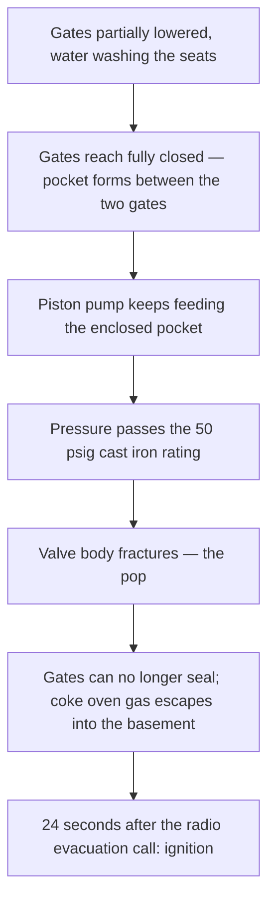

*Image: Gérard GRIFFAY on Unsplash.*

At 10:47 on the morning of 11 August 2025, a valve crew in the basement under two coke oven batteries at U.S. Steel's Clairton Coke Works, near Pittsburgh, heard a pop. One of the workers later described it to federal investigators in one sentence: "We heard a pop. It sounded like when you overinflate a tire."

What had popped was an 18-inch cast iron valve, built in 1953, split open around its full circumference by water pressure. Coke oven gas — a toxic, flammable by-product of turning coal into coke — started pouring out of the broken valve into the basement. The crew ran. One of them sprinted up the stairs shouting for people to get out. A worker one level up called an evacuation over the radio.

Twenty-four seconds after that radio call, the gas found an ignition source and exploded.

Two workers died. Eleven more were injured, five of them seriously. The blast did an estimated $52.5 million in damage. And the operation that caused it wasn't a startup, a shutdown, or an emergency. It was a valve wash — a job this crew and others had done, the same improvised way, for at least three years.

The US Chemical Safety Board (CSB) published its final report on 10 August 2026, almost exactly a year after the explosion. This post is a close read of that report from a contractor's chair — because there was a contractor crew standing at that valve, doing exactly what the client's supervisor asked.

## What Happened at Clairton

The facts below come from CSB investigation report No. 2025-03-I-PA, published August 2026.

Clairton is the largest coke plant in the United States. Coke ovens bake coal at high temperature to make coke for blast furnaces, and the baking gives off coke oven gas — a mix that's roughly half hydrogen, with methane and a dangerous slug of carbon monoxide. The plant cleans that gas and burns it as fuel, and big isolation valves control which battery of ovens it flows to.

Five weeks before the explosion, a routine check found a hairline crack in a valve downstream of Battery 13's main gas isolation valve. U.S. Steel patched it with repair compound and started planning a proper fix: isolate Battery 13, purge the gas from the piping, replace the cracked valve. A formal planning meeting approved that job for 19 August.

Note what that plan did *not* include: nobody at the meeting planned to exercise or wash the Battery 13 isolation valve. And none of the people who would end up doing exactly that, eight days early, were in the room.

On the morning of 11 August, a supervisor decided to "exercise" the isolation valve — close it fully and reopen it — to confirm it could actually seal before the big outage. Sensible in itself. These valves accumulate tarry coke oven gas residue on their sealing faces, and a valve that won't fully close means a purge that won't pass its gas test. The supervisor, described to investigators as the facility's "water washing expert," had arranged for a contractor pump truck to flush the valve seats with pressurized water while the crew worked the valve.

By 10:35 a hose ran from the pump truck to a cleanout port on the bottom of the valve. At 10:39 the gas flow to Battery 13's ovens was shut. The pump started. The crew began running the gates down, raising them a little, lowering them again — washing the seats. Then the valve stopped turning. Their gas monitors started to alarm. Three or four workers hauled on the wrench together, trying to raise the gates back up. They couldn't.

Then the pop.

## A 1953 Valve and an Enclosed Space Nobody Drew

To understand the failure you need one piece of valve anatomy. This was a *double disc* gate valve: instead of one gate dropping into the flow path, two parallel gates drop together, sealing against two seats. When both gates are down, there's a closed pocket of space between them — and the cleanout port the water hose was connected to feeds directly into that pocket.

With the gates up, water pumped into the valve just flows away down the piping. With the gates down, the water has nowhere to go. The pocket fills. The pressure climbs.

The valve was rated for 50 psig — pounds per square inch, a measure of pressure; 50 is a modest rating, and this valve had been cast in iron in 1953. The pump truck outside was a piston-type positive displacement pump, the kind that keeps shoving water forward no matter what's in front of it. The contractor crew told investigators they ran it "at 3,000" RPM in "third gear." Nobody measured the output pressure — there was no gauge anywhere in the setup — but a deadheaded piston pump can build pressure far beyond 50 psig without breathing hard.

The CSB's testing found no significant corrosion, no pre-existing cracks, no thinning. The valve didn't fail because it was neglected. It failed because it was a brittle, 72-year-old cast iron shell asked to hold whatever a blocked-in modern pump truck could generate. The fracture ran the full circumference of the body — sudden, brittle, complete. With the body split open, the gates could no longer seal, and coke oven gas flowed around them and out into the basement.

Here's the sequence the CSB reconstructed:

One detail worth sitting with: the same operation with the gates *up* is harmless. The difference between a routine flush and a fractured valve was the position of two gates nobody could see, inside a valve with no pressure gauge on it.

## The Procedure That Lived in People's Heads

Now the part that should feel uncomfortably familiar to anyone who's worked a turnaround.

U.S. Steel had a written procedure for exercising valves. It allowed steam injection to warm the valve and shift the tarry residue — capped at 10 psig. It said nothing about water. But steam didn't always work, and when a valve wouldn't seal, purge jobs got cancelled and schedules slipped. So over time, crews started using pressurized water instead. It worked. It became, in one worker's words to the CSB, "the status quo" for preparing isolation valves before purges.

For at least three years, that's how it went. The practice even got a passing mention in the battery isolation procedure — "high-pressure water washing" listed as a technique to address isolation valve issues — with no instructions whatsoever on how to do it. Management approved that document. A supervisor carried the informal title of "water washing expert." Everyone knew the practice existed. Nobody had ever written down the steps, the pressure limits, or the one rule that mattered: keep the gates open while the pump is running.

The CSB's board member put the whole report in one sentence: "This incident was the result of workers routinely performing a task incorrectly over a period of years until it ultimately led to a catastrophic explosion."

Read that carefully. Not *once*, incorrectly. *Routinely*, over years. Every previous wash either had the gates positioned safely by luck, or stopped pumping soon enough, or leaked enough pressure somewhere to stay under the valve's limit. The task as performed had a fatal version and a survivable version, and nothing but chance and individual habit decided which one ran on a given day.

That's what an unwritten procedure actually is: a lottery where the losing ticket looks exactly like every winning ticket until it's drawn.

*Image: Ricardo Gomez Angel on Unsplash.*

## The View From the Pump Truck

Stand where the contractor crew stood for a moment, because this is the part of the report written for people like us.

MPW Industrial Services had three workers at Batteries 13 and 14 that morning. Their job: bring the pump truck, hook up the water, run the pump at the setting the client's supervisor specified. Industrial cleaning is their trade — water blasting, vacuuming, lancing. They did a job hazard analysis that morning, and it covered exactly those things: the occupational hazards of water work. Slips, sprays, hose whip.

What it didn't cover — what nobody's paperwork covered — was the process safety question: *what happens when this pump meets that valve?* The CSB's finding is blunt: neither U.S. Steel nor MPW identified or addressed the hazards of applying pressurized water to a valve at a pressure greater than its design rating. The client had no procedure to hand over. The plant's own valve exercise procedure was never given to the contractor at all.

One MPW worker was among the injured. OSHA proposed $61,473 in fines for MPW and $118,214 for U.S. Steel — both contested, both pocket change against $52.5 million in damage and two funerals. And the CSB's recommendation R7 lands squarely on the contractor: develop written procedures, in line with NFPA 56 (the fire-protection standard for cleaning and purging flammable gas piping), for any job that involves cleaning piping systems containing flammable or toxic gas — and train every worker who might do one.

Here's the uncomfortable truth in that recommendation: "the client told us to" is not a procedure. Crews with SCC/VCA contractor certification drill a habit called the last-minute risk assessment — stop at the workface and ask what can release energy here, before starting. The Clairton version of that question is brutally simple: *this pump can make hundreds of psi; what's the weakest thing it's connected to, and what is that rated for?* A 1953 cast iron body rated 50 psig answers itself. But that question only gets asked if someone on the crew understands they're allowed — expected — to ask it, even when the client's own expert is running the job. The report shows what it costs when both sides assume the other one owns that question.

## Twenty Feet Above the Pipe

The two workers who died were not on the valve crew. Neither of them touched the pump, the wrench, or the hose.

They were in and near two control rooms — "reversing rooms" in coke plant language — that stood in the transfer area between Batteries 13 and 14, less than 20 feet directly above the coke oven gas piping. A break room stood there too, with two workers inside. None of these buildings was designed to survive an explosion. All three were destroyed. One of the fatally injured workers wasn't found until 7:30 that evening, nine hours after the blast, buried in debris. One of the break room workers lay trapped under rubble for four hours before rescuers reached him.

The CSB found that U.S. Steel had multiple opportunities over the years to evaluate the siting of those buildings — occupied rooms sitting on top of flammable gas piping — and, in the report's words, "affirmatively chose not to do so," believing no regulation required it. The report's investigator drew the lesson without softening it: "When buildings are occupied by personnel, they must be adequately designed or located to protect personnel or equipment from fires, explosions, or toxic releases."

This is the severity lesson that turnaround crews should carry, because we live in exactly these spaces: the contractor cabins, the break rooms, the permit offices that cluster near the unit because walking time is money. The people the explosion kills are very often not the people at the job. Where your crew eats lunch is a process safety decision — someone made it years before you arrived, and the Clairton report is one more reason to ask when it was last reviewed.

## The Lesson for Crew Leads and Young Techs

Built from what the report establishes:

1. **If a job can be done a fatal way, it needs a written procedure — especially if it's routine.** The CSB's first key lesson from Clairton says exactly this. Three years of getting away with it is not evidence the method is safe; it's evidence the losing configuration hasn't come up yet. The jobs most likely to be running on folklore are the small, frequent ones nobody thought were worth paper.

2. **Any pump connected to any equipment is a pressure calculation, whether or not anyone does it.** The CSB's second key lesson: whenever an external pressure source meets piping or equipment holding hazardous material, overpressure has to be considered and controlled. Piston pump, blocked outlet, 50 psig cast iron — the arithmetic was there to be done for three years. Do it at the workface if nobody did it at the desk: what can this source generate, what's the weakest component rated for, where's the relief?

3. **A closed valve can be a pressure vessel.** Double disc gates create an enclosed volume between them; so do double block-and-bleed arrangements, blinded lines, and any cavity between two seals. If you're feeding water, steam, or nitrogen into a system, know where it goes when the path closes — because the path closing is often the *point* of the operation.

4. **Your JHA covers your trade. It doesn't cover their process.** The contractor's paperwork addressed water blasting hazards and said nothing about the client's gas system, because the contractor didn't know the system and the client never handed over the procedure — there wasn't one. If you're a contractor connecting your equipment to a client's process, the process hazards are now your hazards. Ask for the procedure. The absence of one is the loudest warning you'll get.

5. **The blast radius doesn't check the permit list.** The two dead were in control rooms; two of the seriously injured were on break. When you assess a job that could release flammable gas, walk the circle around it — including up. Occupied buildings 20 feet above the line changed this from an equipment failure into a double fatality.

Battery 14 restarted 74 days after the explosion. Battery 13 took 178 days. The written procedure that would have prevented all of it — gates open while the pump runs, a relief path, a pressure limit matched to the valve rating — would have fit on one page.

It fits in one sentence now, in a federal report, with a dedication page at the front.

## Credit and Further Reading

- CSB, *Fatal Coke Oven Gas Explosion at U.S. Steel Clairton Coke Works* — Investigation Report No. 2025-03-I-PA, published 10 August 2026: [https://www.csb.gov/united-states-steel-corporation-clairton-plant-coke-oven-explosion-/](https://www.csb.gov/united-states-steel-corporation-clairton-plant-coke-oven-explosion-/)
- CSB news release on the final report, 10 August 2026: [https://www.csb.gov/us-chemical-safety-board-issues-final-report-on-august-2025-fatal-coke-oven-gas-explosion-at-us-steel-clairton-coke-works/](https://www.csb.gov/us-chemical-safety-board-issues-final-report-on-august-2025-fatal-coke-oven-gas-explosion-at-us-steel-clairton-coke-works/)
- NFPA 56, *Standard for Fire and Explosion Prevention During Cleaning and Purging of Flammable Gas Piping Systems* — the standard the CSB recommends both companies build their written procedures on: [https://www.nfpa.org/codes-and-standards/nfpa-56-standard-development/56](https://www.nfpa.org/codes-and-standards/nfpa-56-standard-development/56)
- For another CSB case where occupied buildings sat too close to the process, see our reading of [the Longview tank implosion](/en/blog/nippon-dynawave-tank-implosion-csb) — and for what an unwritten "everyone knows how" practice costs at the flange, [the Geismar HF report](/en/blog/geismar-hydrogen-fluoride-gasket-csb).
