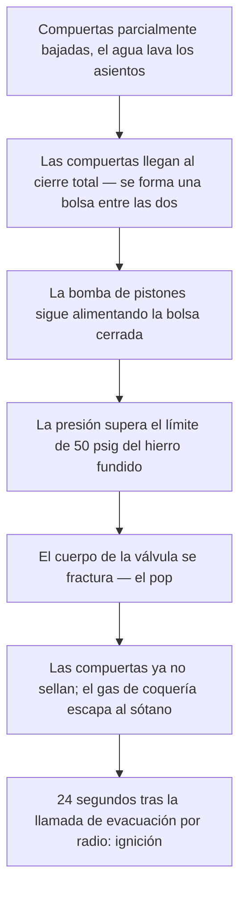

*Imagen: Gérard GRIFFAY en Unsplash.*

A las 10:47 de la mañana del 11 de agosto de 2025, una cuadrilla que trabajaba en una válvula en el sótano bajo dos baterías de hornos de coque en la planta Clairton Coke Works de U.S. Steel, cerca de Pittsburgh, oyó un estallido. Uno de los trabajadores se lo describió después a los investigadores federales en una frase: "Oímos un pop. Sonó como cuando inflas de más un neumático."

Lo que había reventado era una válvula de hierro fundido de 18 pulgadas, fabricada en 1953, partida por toda su circunferencia por presión de agua. El gas de coquería — un subproducto tóxico e inflamable de convertir carbón en coque — empezó a salir de la válvula rota hacia el sótano. La cuadrilla corrió. Uno de ellos subió las escaleras a toda velocidad gritando que había que salir. Un trabajador un nivel más arriba llamó a evacuar por radio.

Veinticuatro segundos después de esa llamada, el gas encontró una fuente de ignición y explotó.

Murieron dos trabajadores. Once más resultaron heridos, cinco de ellos de gravedad. La explosión causó unos 52,5 millones de dólares en daños. Y la operación que la provocó no fue un arranque, una parada ni una emergencia. Fue un lavado de válvula — un trabajo que esta cuadrilla y otras habían hecho, de la misma manera improvisada, durante al menos tres años.

La Junta de Seguridad Química de EE. UU. (CSB) publicó su informe final el 10 de agosto de 2026, casi exactamente un año después de la explosión. Este artículo es una lectura atenta de ese informe desde la silla del contratista — porque junto a esa válvula había una cuadrilla contratista, haciendo exactamente lo que el supervisor del cliente pidió.

## Qué pasó en Clairton

Los hechos siguientes proceden del informe de investigación de la CSB n.º 2025-03-I-PA, publicado en agosto de 2026.

Clairton es la mayor planta de coque de Estados Unidos. Los hornos de coque cuecen carbón a alta temperatura para producir coque para los altos hornos, y esa cocción desprende gas de coquería — una mezcla que es aproximadamente mitad hidrógeno, con metano y una peligrosa proporción de monóxido de carbono. La planta limpia ese gas y lo quema como combustible, y grandes válvulas de aislamiento controlan hacia qué batería de hornos fluye.

Cinco semanas antes de la explosión, una revisión rutinaria encontró una fisura capilar en una válvula aguas abajo de la válvula principal de aislamiento de gas de la Batería 13. U.S. Steel la parcheó con compuesto de reparación y empezó a planificar el arreglo de verdad: aislar la Batería 13, purgar el gas de la tubería, sustituir la válvula fisurada. Una reunión formal de planificación aprobó ese trabajo para el 19 de agosto.

Fíjese en lo que ese plan *no* incluía: nadie en la reunión planificó accionar ni lavar la válvula de aislamiento de la Batería 13. Y ninguna de las personas que acabarían haciendo exactamente eso, ocho días antes de lo previsto, estaba en la sala.

La mañana del 11 de agosto, un supervisor decidió "accionar" la válvula de aislamiento — cerrarla del todo y volver a abrirla — para confirmar que realmente podía sellar antes de la gran parada. Sensato en sí mismo. Estas válvulas acumulan residuo alquitranado de gas de coquería en sus superficies de sellado, y una válvula que no cierra del todo significa una purga que no pasará su prueba de gas. El supervisor, descrito a los investigadores como el "experto en lavado con agua" de la planta, había organizado que un camión de bombeo de un contratista lavara los asientos de la válvula con agua a presión mientras la cuadrilla accionaba la válvula.

A las 10:35 una manguera conectaba el camión de bombeo con un puerto de limpieza en el fondo de la válvula. A las 10:39 se cortó el flujo de gas hacia los hornos de la Batería 13. La bomba arrancó. La cuadrilla empezó a bajar las compuertas, subirlas un poco, bajarlas de nuevo — lavando los asientos. Entonces la válvula dejó de girar. Sus detectores de gas empezaron a alarmar. Tres o cuatro trabajadores tiraron juntos de la llave, intentando subir las compuertas. No pudieron.

Y entonces, el pop.

## Una válvula de 1953 y un espacio cerrado que nadie dibujó

Para entender el fallo hace falta un detalle de anatomía de válvulas. Esta era una válvula de compuerta de *doble disco*: en lugar de una sola compuerta que baja al paso del flujo, dos compuertas paralelas bajan juntas y sellan contra dos asientos. Cuando ambas están abajo, queda una bolsa cerrada de espacio entre ellas — y el puerto de limpieza al que estaba conectada la manguera de agua alimenta directamente esa bolsa.

Con las compuertas arriba, el agua bombeada a la válvula simplemente fluye por la tubería. Con las compuertas abajo, el agua no tiene adónde ir. La bolsa se llena. La presión sube.

La válvula estaba diseñada para 50 psig — libras por pulgada cuadrada, una medida de presión; 50 es un valor modesto, y esta válvula había sido fundida en hierro en 1953. El camión de fuera llevaba una bomba de desplazamiento positivo de pistones, del tipo que sigue empujando agua hacia delante sin importar lo que tenga enfrente. La cuadrilla contratista contó a los investigadores que la pusieron "a 3.000" RPM en "tercera marcha". Nadie midió la presión de salida — no había un solo manómetro en todo el montaje — pero una bomba de pistones con la descarga bloqueada puede superar con mucho los 50 psig sin despeinarse.

Los ensayos de la CSB no encontraron corrosión significativa, ni grietas previas, ni pérdida de espesor. La válvula no falló por abandono. Falló porque era una carcasa frágil de hierro fundido, de 72 años, a la que se pidió contener lo que pudiera generar un camión de bombeo moderno con la salida bloqueada. La fractura recorrió toda la circunferencia del cuerpo — súbita, frágil, completa. Con el cuerpo partido, las compuertas ya no podían sellar, y el gas de coquería fluyó alrededor de ellas hacia el sótano.

Esta es la secuencia que la CSB reconstruyó:

Un detalle sobre el que merece la pena detenerse: la misma operación con las compuertas *arriba* es inofensiva. La diferencia entre un lavado rutinario y una válvula fracturada fue la posición de dos compuertas que nadie podía ver, dentro de una válvula sin manómetro.

## El procedimiento que vivía en la cabeza de la gente

Ahora la parte que debería resultar incómodamente familiar a cualquiera que haya trabajado en una parada de planta.

U.S. Steel tenía un procedimiento escrito para accionar válvulas. Permitía inyectar vapor para calentar la válvula y mover el residuo alquitranado — con un tope de 10 psig. Del agua no decía nada. Pero el vapor no siempre funcionaba, y cuando una válvula no sellaba, las purgas se cancelaban y los cronogramas se deslizaban. Así que, con el tiempo, las cuadrillas empezaron a usar agua a presión. Funcionaba. Se convirtió, en palabras de un trabajador a la CSB, en "el statu quo" para preparar válvulas de aislamiento antes de las purgas.

Durante al menos tres años, así fueron las cosas. La práctica llegó incluso a mencionarse de pasada en el procedimiento de aislamiento de la batería — "lavado con agua a alta presión", listado como técnica para resolver problemas de válvulas de aislamiento — sin instrucción alguna sobre cómo hacerlo. La dirección aprobó ese documento. Un supervisor llevaba el título informal de "experto en lavado con agua". Todo el mundo sabía que la práctica existía. Nadie escribió nunca los pasos, los límites de presión, ni la única regla que importaba: mantener las compuertas abiertas mientras la bomba está en marcha.

La consejera de la CSB resumió todo el informe en una frase: "Este incidente fue el resultado de trabajadores realizando rutinariamente una tarea de forma incorrecta durante años, hasta que finalmente condujo a una explosión catastrófica."

Léala con cuidado. No *una vez*, de forma incorrecta. *Rutinariamente*, durante años. Cada lavado anterior o tuvo las compuertas en posición segura por suerte, o dejó de bombear a tiempo, o fugó suficiente presión por algún sitio para quedarse bajo el límite de la válvula. La tarea, tal como se realizaba, tenía una versión fatal y una versión sobrevivible, y nada salvo el azar y el hábito individual decidía cuál de las dos tocaba cada día.

Eso es un procedimiento no escrito en realidad: una lotería en la que el boleto perdedor es idéntico a todos los ganadores hasta que sale.

*Imagen: Ricardo Gomez Angel en Unsplash.*

## La vista desde el camión de bombeo

Póngase por un momento donde estaba la cuadrilla contratista, porque esta parte del informe está escrita para gente como nosotros.

MPW Industrial Services tenía tres trabajadores en las Baterías 13 y 14 esa mañana. Su tarea: traer el camión de bombeo, conectar el agua, poner la bomba al ajuste que especificó el supervisor del cliente. La limpieza industrial es su oficio — chorro de agua, aspiración, lanzas. Esa mañana hicieron un análisis de riesgos del trabajo (JHA), y cubría exactamente eso: los riesgos laborales del trabajo con agua. Resbalones, salpicaduras, latigazo de manguera.

Lo que no cubría — lo que no cubría el papeleo de nadie — era la pregunta de seguridad de proceso: *¿qué pasa cuando esta bomba se encuentra con esa válvula?* La conclusión de la CSB es contundente: ni U.S. Steel ni MPW identificaron ni abordaron los peligros de aplicar agua a presión a una válvula por encima de su presión de diseño. El cliente no tenía procedimiento que entregar. El propio procedimiento de la planta para accionar válvulas nunca se entregó al contratista.

Un trabajador de MPW estuvo entre los heridos. OSHA propuso multas de 61.473 dólares para MPW y 118.214 para U.S. Steel — ambas recurridas, ambas calderilla frente a 52,5 millones en daños y dos funerales. Y la recomendación R7 de la CSB cae de lleno sobre el contratista: desarrollar procedimientos escritos, alineados con NFPA 56 (la norma de protección contra incendios para la limpieza y purga de tuberías de gas inflamable), para cualquier trabajo de limpieza en sistemas de tuberías con gas inflamable o tóxico — y formar a todo trabajador que pueda hacerlo.

Aquí está la verdad incómoda de esa recomendación: "el cliente nos lo pidió" no es un procedimiento. Las cuadrillas con certificación de contratistas SCC/VCA entrenan un hábito llamado evaluación de riesgo de último minuto — detenerse en el punto de trabajo y preguntar qué puede liberar energía aquí, antes de empezar. La versión de Clairton de esa pregunta es brutalmente simple: *esta bomba puede generar cientos de psi; ¿cuál es el elemento más débil al que está conectada, y para cuánto está diseñado?* Un cuerpo de hierro fundido de 1953 diseñado para 50 psig se responde solo. Pero esa pregunta solo se hace si alguien en la cuadrilla entiende que tiene permiso — que se espera de él — hacerla, incluso cuando el trabajo lo dirige el propio "experto" del cliente. El informe muestra lo que cuesta cuando ambas partes asumen que la pregunta es del otro.

## Seis metros por encima de la tubería

Los dos trabajadores que murieron no eran de la cuadrilla de la válvula. Ninguno de los dos tocó la bomba, la llave ni la manguera.

Estaban en y junto a dos salas de control — "salas de inversión" en el idioma de las plantas de coque — situadas en la zona de transferencia entre las Baterías 13 y 14, a menos de 20 pies (unos 6 metros) directamente encima de la tubería de gas de coquería. Allí había también una sala de descanso, con dos trabajadores dentro. Ninguno de esos edificios estaba diseñado para resistir una explosión. Los tres quedaron destruidos. Uno de los trabajadores fallecidos no fue encontrado hasta las 19:30 de esa tarde, nueve horas después de la explosión, sepultado entre escombros. Uno de los trabajadores de la sala de descanso quedó atrapado bajo los restos durante cuatro horas antes de que los rescatistas llegaran hasta él.

La CSB concluyó que U.S. Steel tuvo múltiples oportunidades a lo largo de los años de evaluar la ubicación de esos edificios — recintos ocupados sobre tuberías de gas inflamable — y, en palabras del informe, "eligió afirmativamente no hacerlo", creyendo que ninguna norma lo exigía. El investigador del caso formuló la lección sin suavizarla: "Cuando los edificios están ocupados por personal, deben estar adecuadamente diseñados o ubicados para proteger al personal o al equipo de incendios, explosiones o liberaciones tóxicas."

Esta es la lección sobre la gravedad de las consecuencias que las cuadrillas de parada deben llevar consigo, porque vivimos exactamente en esos espacios: las casetas de contratistas, las salas de descanso, las oficinas de permisos que se agolpan junto a la unidad porque el tiempo de desplazamiento es dinero. La gente que mata la explosión muy a menudo no es la gente del tajo. Dónde come su cuadrilla es una decisión de seguridad de proceso — alguien la tomó años antes de que usted llegara, y el informe de Clairton es una razón más para preguntar cuándo se revisó por última vez.

## La lección para jefes de cuadrilla y técnicos jóvenes

Construida a partir de lo que el informe establece:

1. **Si un trabajo puede hacerse de una forma fatal, necesita un procedimiento escrito — sobre todo si es rutinario.** La primera lección clave de la CSB en Clairton dice exactamente esto. Tres años saliendo bien no son prueba de que el método sea seguro; son prueba de que la configuración perdedora aún no ha salido. Los trabajos con más probabilidad de funcionar con folclore son los pequeños y frecuentes — los que nadie consideró dignos de papel.

2. **Cualquier bomba conectada a cualquier equipo es un cálculo de presión, lo haga alguien o no.** Segunda lección clave de la CSB: siempre que una fuente externa de presión se conecta a tuberías o equipos con material peligroso, la sobrepresión debe considerarse y controlarse. Bomba de pistones, salida bloqueada, hierro fundido de 50 psig — la aritmética llevaba tres años esperando a que alguien la hiciera. Hágala en el punto de trabajo si nadie la hizo en el escritorio: qué puede generar esta fuente, para cuánto está diseñado el componente más débil, dónde está el alivio.

3. **Una válvula cerrada puede ser un recipiente a presión.** Las compuertas de doble disco crean un volumen cerrado entre sí; lo mismo hacen los montajes de doble bloqueo y purga, las líneas con bridas ciegas y cualquier cavidad entre dos sellos. Si está metiendo agua, vapor o nitrógeno en un sistema, sepa adónde van cuando el camino se cierra — porque cerrar el camino suele ser el *objetivo* de la operación.

4. **Su JHA cubre su oficio. No cubre el proceso del cliente.** El papeleo del contratista abordaba los riesgos del chorro de agua y no decía nada del sistema de gas del cliente, porque el contratista no conocía el sistema y el cliente nunca entregó el procedimiento — no existía. Si usted es un contratista conectando su equipo al proceso de un cliente, los peligros del proceso ahora son sus peligros. Pida el procedimiento. Su ausencia es la advertencia más clara que va a recibir.

5. **El radio de la explosión no consulta la lista del permiso.** Los dos fallecidos estaban en salas de control; dos de los heridos graves, en su descanso. Cuando evalúe un trabajo que pueda liberar gas inflamable, recorra el círculo a su alrededor — incluido hacia arriba. Edificios ocupados a seis metros sobre la línea convirtieron este fallo de equipo en una doble muerte.

La Batería 14 volvió a arrancar 74 días después de la explosión. La Batería 13 tardó 178 días. El procedimiento escrito que habría evitado todo — compuertas abiertas mientras la bomba funciona, un camino de alivio, un límite de presión acorde a la válvula — habría cabido en una página.

Ahora cabe en una frase, en un informe federal, con una página de dedicatoria al principio.

## Créditos y lecturas adicionales

- CSB, *Fatal Coke Oven Gas Explosion at U.S. Steel Clairton Coke Works* — informe de investigación n.º 2025-03-I-PA, publicado el 10 de agosto de 2026: [https://www.csb.gov/united-states-steel-corporation-clairton-plant-coke-oven-explosion-/](https://www.csb.gov/united-states-steel-corporation-clairton-plant-coke-oven-explosion-/)
- Comunicado de prensa de la CSB sobre el informe final, 10 de agosto de 2026: [https://www.csb.gov/us-chemical-safety-board-issues-final-report-on-august-2025-fatal-coke-oven-gas-explosion-at-us-steel-clairton-coke-works/](https://www.csb.gov/us-chemical-safety-board-issues-final-report-on-august-2025-fatal-coke-oven-gas-explosion-at-us-steel-clairton-coke-works/)
- NFPA 56, *Standard for Fire and Explosion Prevention During Cleaning and Purging of Flammable Gas Piping Systems* — la norma sobre la que la CSB recomienda a ambas empresas construir sus procedimientos escritos: [https://www.nfpa.org/codes-and-standards/nfpa-56-standard-development/56](https://www.nfpa.org/codes-and-standards/nfpa-56-standard-development/56)
- Para otro caso de la CSB en el que edificios ocupados estaban demasiado cerca del proceso, vea nuestra lectura de [la implosión del tanque de Longview](/es/blog/nippon-dynawave-tank-implosion-csb) — y para lo que cuesta en la brida una práctica no escrita que "todos saben hacer", [el informe de HF de Geismar](/es/blog/geismar-hydrogen-fluoride-gasket-csb).
