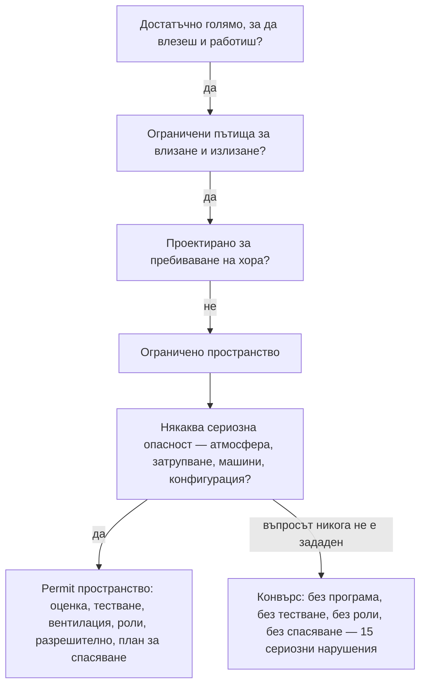

*Снимка: Monineath Horn, Unsplash.*

Сутринта на 7 януари 2026 г. строителен екип работи под началното училище Конвърс, точно до Сан Антонио, Тексас. Буквално под него: в crawl space-а под сградата — ниската кухина между земята и подовата конструкция, където минават тръбите и въздуховодите. Там се е натрупала пръст и задачата на изпълнителя е да я изкопае.

В такова пространство не можеш дълго да размахваш лопата, затова екипът вкарва мини багери — най-малкият клас копаеща машина. Дори най-малкият клас не влиза. Затова машините са преправени, докато влязат.

Същата сутрин машинист остава притиснат между една от тези машини и бетонна греда. Нараняванията са фатални.

Шест месеца по-късно, на 13 юли 2026 г., OSHA — федералният регулатор по безопасност на труда в САЩ — публикува цитатите си срещу две компании: изпълнителя и агенцията за персонал, осигурила допълнителна работна ръка за обекта. Списъкът с нарушения се чете като чеклист на всичко, което едно влизане в ограничено пространство трябва да има. Точка по точка — нищо от него го е нямало.

Тази история отива в купчината „полеви наръчник", защото капанът тук не е екзотична химия или рядка повреда на оборудване. Капанът е разпознаването. Всеки курс за ограничени пространства по света те обучава на резервоари, съдове и колектори. Почти никой не те обучава на пространството под училищен под — и точно затова тази история си струва твоите двадесет минути.

## Какво се случи в Конвърс

Известните факти са кратки и идват от съобщението на OSHA и местните репортажи около него.

Изпълнителят, D L Bandy Constructors Inc., е отстранявал натрупана пръст от crawl space-а на началното училище Конвърс, кампус на училищния окръг Judson. Втора компания, Pacesetter Personnel Services, е осигурила временни работници за проекта. На 7 януари 2026 г. оператор, работещ с мини багер вътре в пространството, е притиснат между машината и бетонна греда и умира от нараняванията си.

На 13 юли OSHA цитира изпълнителя за **едно умишлено (willful) и петнадесет сериозни нарушения** с предложени глоби от $276 399. Агенцията за персонал получава **две сериозни нарушения** и $23 170.

Умишленото нарушение е изречението, което те спира. OSHA цитира изпълнителя за — цитат от съобщението — „премахване на защитните конструкции срещу преобръщане от мини багерите" и изработване на части, „за да се побере оборудването вътре в crawl space-а".

Прочети го два пъти. ROPS — защитната конструкция срещу преобръщане — е стоманената рамка около оператора, която пази накланящата се машина да не го смаже; при мини багера тя е повечето от онова, което стои между тялото на оператора и всичко, което машината може да срещне. Пространството е било твърде ниско за машината. Затова рамката е свалена, монтирани са изработени части и машината е влязла.

Петнадесетте сериозни нарушения описват останалата част от работата: неидентифициране и неоценяване на permit-required ограничени пространства, липса на тестване на атмосферата, липса на вентилация и комуникация, липса на обучение на работниците по процедурите за ограничени пространства, неопределяне на персонал за ограничени пространства и неприлагане на процедури за влизане и спасяване. Всичко — като се започне от първия ред, за който е този пост.

Бележка за „предложени": компаниите са имали 15 работни дни да се съобразят, да се срещнат с OSHA или да оспорят, така че числата може да се променят. Констатациите под тях обикновено оцеляват.

## Пространството, което не приличаше на такова

Ето честния въпрос в центъра на този инцидент: *ти* би ли го нарекъл?

Представи си работата. Няма процесна инсталация, няма дневник с газови тестове, няма permit офис. Училище — най-неиндустриалното място, което можеш да си представиш. „Съдът" е междината под пода. Работата е копаене на пръст. Мирише на почва, не на разтворител. Нищо в него не съвпада с картинката за ограничено пространство от обучението.

Сега сложи дефиницията до него. Ограничено пространство е всяко пространство, което минава три теста: достатъчно голямо, за да влезе човек и да работи; ограничени пътища за влизане и излизане; не е проектирано за постоянно пребиваване на хора. Училищният crawl space минава и трите без запъване. То става **permit-required** — изискващо разрешително — ако добави каквато и да е сериозна опасност, а списъкът не е само лош въздух. Последната категория в правилото е „всяка друга призната сериозна опасност за безопасността или здравето". Копаеща машина, споделяща кухина с работник, в пространство толкова ниско, че машината е трябвало да бъде орязана, за да влезе — покрива тази графа с излишък.

Това не е разтягане на правилата — това е буквалният им текст. Стандартът на OSHA за ограничени пространства в строителството, 29 CFR 1926 Subpart AA, е в сила от 2015 г. и е написан до голяма степен защото строителни екипи продължаваха да умират точно в такива непрестижни пространства. Собствените указания на OSHA за жилищното строителство изброяват тавани, мазета и **crawl space-ове** като първите примери за оценяване.

Разпознаването се проваля въпреки това, защото разпознаването върви по картинки, а не по дефиниции. Нашите екипи минават ежегодни тренировки за ограничени пространства и дихателни апарати по SCC/VCA сертификация за контрактори, и сценариите са съдове, колони, резервоари — пространствата, в които индустриалните екипи наистина влизат. Правилното обучение за тази работа, с един страничен ефект: то учи инстинкта ти, че ограниченото пространство *прилича* на резервоар. После един ден пространството прилича на училище, инстинктът мълчи — а на смяна е бил точно инстинктът.

А разпознаването е ключовото нарушение. Виж как другите четиринадесет висят на първото:

Никой в Конвърс не е решил да пропусне газовите тестове, плана за спасяване или наблюдаващия на отвора. Тези решения изобщо не са били вземани, защото едното решение нагоре по веригата — *това е permit пространство* — никога не е било взето. Едно пропуснато разпознаване, петнадесет липсващи контроли. Това съотношение е цялата архитектура на безопасността в ограничени пространства.

## Машината, която орязаха, за да влезе

Умишленото нарушение заслужава собствена секция, защото това е частта от историята, която всеки ръководител на екип ще разпознае отнякъде.

В някакъв момент преди инцидента някой е застанал до мини багера, погледнал е входа на crawl space-а и е разбрал, че машината няма да влезе. Този момент е бил работата, говореща толкова ясно, колкото една работа изобщо говори: *работата по план не се побира в пространството по строеж.* Имало е налични отговори — съществува техника за ниски просвети; съществуват по-бавни методи с повече ръчен труд; съществуват преостойностени, разместени по график планове.

Вместо това машината е модифицирана да се побере в плана. От този ден нататък всяка смяна в crawl space-а върви на машина, чиято защита срещу премазване е свалена *именно защото* пространството е твърде тясно — свалена, с други думи, точно там, където е най-вероятно да потрябва. Този детайл прави цитата умишлен, а не пропуск: свалянето на ROPS не е нещо, което ти се случва. То е работа. Някой го е планирал, взел е инструменти и го е направил.

Ако си прекарал време по индустриални обекти, виждал си меката версия сто пъти. Предпазителят, който е свален „само за тази работа". Блокировката, шунтирана, защото цикълът не позволява. Защитата винаги пречи — това *е* защитата: материал, поставен между теб и опасността, което значи, че е и между теб и работата. Версията от Конвърс е необичайна само по това колко е четлива. Пространството каза „не". Машината беше накарана да каже „да".

Правилото, скрито тук, е за бялата дъска: **ако защитата трябва да се свали, за да е възможна работата, проблемът е работата по план.**

*Снимка: charlesdeluvio, Unsplash.*

## Два цитата за агенцията за персонал

Втората компания в списъка никога не е докосвала багера. Pacesetter Personnel Services е осигурила временни работници и OSHA я цитира за това, че не е гарантирала спазването на процедурите за permit-required ограничени пространства, и за това, че не е дала на временните си работници обучение за ограничени пространства.

Ако това ти изглежда жестоко за компания, чийто продукт са хора — обратното е: това е системата, работеща по проект. Американското правоприлагане третира агенцията за персонал и клиента ѝ като съвместни работодатели на временния работник; и двамата му дължат защита. Агенцията не може да продава труд към опасност и да остави частта с безопасността на купувача. Тя трябва да знае какво ще правят хората ѝ и да се увери, че са обучени за него — или да не ги праща.

Разходихме се през индустриалния мащаб на същото в [цитатите за киселинния разлив в Channelview](/bg/blog/channelview-acid-spill-cleanup-osha), където доставчикът на труд на дъното на верига от три компании получи 86% от $3,5 милиона глоби. Конвърс е същата анатомия в по-малка рамка: колкото по-надолу по веригата стои работникът, толкова по-малко хора над него са проверили в какво влиза — а отговорът на закона е, че *всички* над него са дължали проверката.

За самите работници — един ред: агенцията, която те е настанила, ти дължи обучение, а не само присъствена форма. Ако въведението на обекта е „входът е ей там", и двамата ти работодатели вече са те провалили — и ти си единственият останал по веригата, който още може да каже „не".

## Какво може реално да направи ръководителят на екип

Стандартната уговорка, честно казана: ръководителят на екип не може да пренапише договор. Но всяка контрола, липсвала в Конвърс, се проваля в момент, в който някой на терен е можел да зададе въпрос. Ето въпросите.

**Пускай дефиницията, не картинката.** Преди твой екип да работи вътре в каквото и да е, задай трите теста на глас: може ли човек да влезе и да работи? Ограничени ли са пътищата за влизане и излизане? Проектирано ли е за пребиваване? Да-да-не значи ограничено пространство — хидрокрекер или кухина под класна стая, без разлика. Направи дефиницията рефлекс и странно изглеждащите случаи спират да са невидими.

**Третирай „не се побира" като стоп карта.** Всеки път, когато работата изисква модифициране на оборудване — особено сваляне на нещо с думата „защитен" в името — това не е шлосерска задача, а планов провал, изплуващ на терен. Спри, ескалирай, накарай плана да се промени вместо машината.

**Брой липсващите роли.** Едно permit влизане има поименни хора: супервайзор на влизането, наблюдаващ на отвора, влизащи, които знаят опасностите, спасителна организация, която не започва с набиране на спешния номер след факта. Ако не можеш да назовеш кой държи всяка роля при днешното влизане, влизането не е готово. В Конвърс не е имало роли, защото официално не е имало влизане — само копаене.

**Дай на временните работници пълното въведение или ги дръж навън.** Работниците от агенция получават същия инструктаж за опасностите, същите правила за ограничени пространства и същото право на отказ като собствените ти хора — в първия ден, преди първото влизане. „Агенцията се занимава с обучението им" е изречение, предшествало много цитати — два от тях в тази история.

## Урокът за ръководители на екипи и млади техници

Изграден от това, което цитатите реално установяват:

1. **Ограничените пространства се дефинират от геометрия, не от индустрия.** Правилото никога не споменава резервоари — споменава влизане, излизане и пребиваване, и училищният crawl space се квалифицира също толкова лесно, колкото реактор. Ако разпознаването ти зависи от това пространството да изглежда индустриално, то има дупка точно с формата на работи като тази.

2. **Едно пропуснато разпознаване изтрива всяка контрола надолу по веригата.** Петнадесет от шестнадесет нарушения са съществували, защото първото е съществувало. Тестване, вентилация, роли, спасяване — нищо не е било отказано; то никога не е било повикано, защото пространството никога не е било назовано. Най-евтиното действие по безопасност на всеки обект е да кажеш думите „това е permit пространство".

3. **Когато защитата пречи на работата, грешен е планът — не защитата.** Crawl space-ът отхвърли машината. Отговорът беше да се отреже защитата ѝ срещу премазване и да се изфабрикува влизането ѝ. Всеки обект има по-тиха версия на тази сделка, работеща някъде. Намери своята, преди тя да намери теб.

4. **Машина в ограничено пространство е опасност на ограниченото пространство.** Без газ, без пари, без затрупване — операторът е убит от геометрия: движеща се машина и неподвижна греда в пространство без място да бъдеш другаде. Оценката за разрешителното пита за *всяка* сериозна опасност, и стоманата се брои.

5. **Двата края на веригата за труд дължат на работника едно и също.** Агенцията за персонал беше цитирана редом с изпълнителя, за същото влизане, в същия ден. Доставяш ли хора — притежаваш подготовката им. Заемаш ли хора — притежаваш защитата им. На работника в пространството се дължи сборът, не остатъкът.

Crawl space под начално училище е може би най-недраматичното място, където може да се случи индустриална смърт. Точно това е поантата. Пространствата, които приличат на нищо, са тези, за които никога не се написва разрешително — а дефиницията е съществувала, отпечатана и в сила, единадесет години преди машината да бъде орязана, за да влезе.

## Признание и допълнително четене

- Съобщение на OSHA, *US Department of Labor cites Texas contractor, staffing company after worker suffers fatal injury in elementary school crawl space* (13 юли 2026): [https://www.osha.gov/news/newsreleases/dallas/20260713](https://www.osha.gov/news/newsreleases/dallas/20260713)
- KSAT Сан Антонио, репортаж за цитатите на кампуса на Judson ISD: [https://www.ksat.com/news/local/2026/07/13/us-department-of-labor-cites-contractor-staffing-company-after-construction-workers-death-at-judson-isd-campus/](https://www.ksat.com/news/local/2026/07/13/us-department-of-labor-cites-contractor-staffing-company-after-construction-workers-death-at-judson-isd-campus/)
- OSHA, Confined Spaces in Construction — 29 CFR 1926 Subpart AA: [https://www.osha.gov/confined-spaces-construction](https://www.osha.gov/confined-spaces-construction)
- За индустриалния мащаб на урока за договорната верига виж нашия прочит на [цитатите за киселинния разлив в Channelview](/bg/blog/channelview-acid-spill-cleanup-osha) — а за друго пространство, което никой не назова преди влизане, [заровения резервоар в PCE Lake Worth](/bg/blog/pce-lake-worth-buried-tank-benzene).
