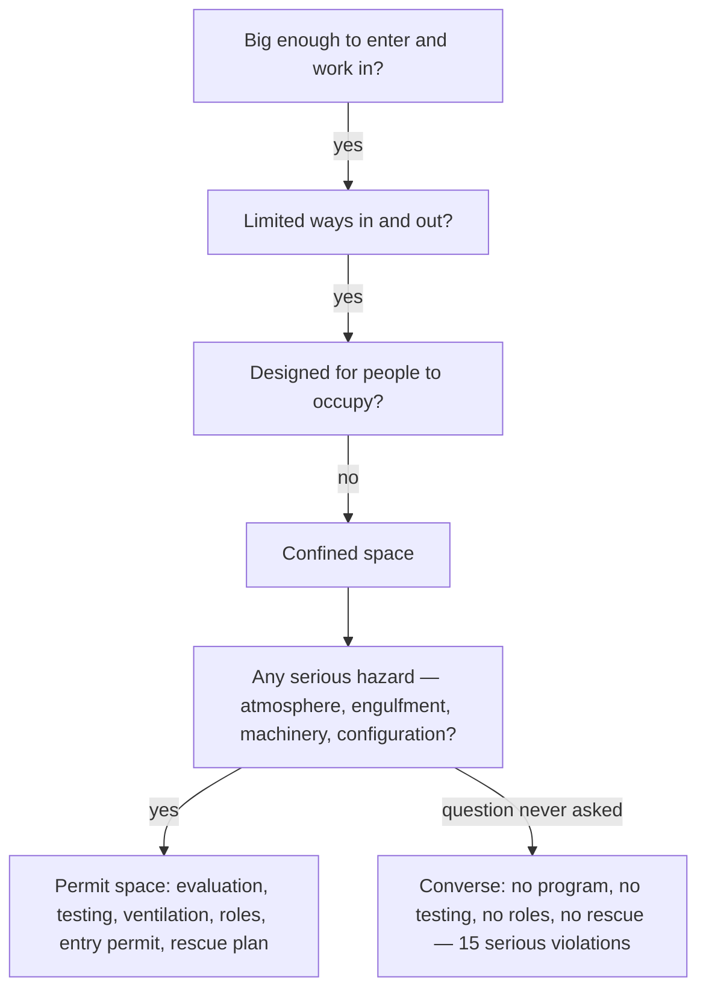

*Image: Monineath Horn on Unsplash.*

On the morning of 7 January 2026, a construction crew was working under Converse Elementary School, just outside San Antonio, Texas. Literally under it: in the crawl space beneath the building, the low void between the ground and the floor structure where the plumbing and ductwork live. Dirt had built up down there, and the contractor's job was to dig it out.

You can't swing a shovel for long in a space like that, so the crew brought in mini-excavators — the smallest class of digging machine. Even the smallest class didn't fit. So the machines were altered until they did.

That morning, an equipment operator became trapped between one of those machines and a concrete beam. The injuries were fatal.

Six months later, on 13 July 2026, OSHA — the US federal workplace safety regulator — published its citations against two companies: the contractor, and the staffing agency that supplied extra labour for the job. The citation list reads like a checklist of everything a confined-space entry is supposed to have. Item by item, none of it was there.

This one belongs in the field-guide pile, because the trap isn't exotic chemistry or a rare equipment failure. It's recognition. Every confined-space course in the world trains you on tanks, vessels and sewers. Almost nobody trains you on the space under a school floor — and that's exactly why this story is worth your twenty minutes.

## What Happened at Converse

The known facts are short, and they come from OSHA's news release and the local reporting around it.

The contractor, D L Bandy Constructors Inc., was removing accumulated dirt from the crawl space at Converse Elementary School, a campus of the Judson Independent School District. A second company, Pacesetter Personnel Services, supplied temporary workers for the project. On 7 January 2026, an operator running a mini-excavator inside the crawl space was caught between the machine and a concrete beam and died of his injuries.

On 13 July, OSHA cited the contractor for **one willful violation and fifteen serious violations**, proposing $276,399 in penalties. The staffing agency drew **two serious violations** and $23,170.

The willful violation is the sentence that stops you. OSHA cited the contractor for — quoting the release — "removing rollover protective structures from mini-excavators" and fabricating parts "to fit the equipment inside the crawl space."

Read that twice. ROPS — the rollover protective structure — is the steel frame around the operator that keeps a tipping machine from crushing them; on a mini-excavator it's most of what stands between the operator's body and everything the machine can meet. The space was too low for the machine. So the frame came off, fabricated parts went on, and the machine went in.

The fifteen serious violations describe the rest of the job: failing to identify and evaluate permit-required confined spaces, failing to test the atmosphere, failing to provide ventilation and communication, failing to train workers on confined-space procedures, failing to designate confined-space personnel, and failing to implement entry and rescue procedures. Everything — starting from the first line, which is the one this post is about.

A note on "proposed": the companies had 15 business days to comply, meet with OSHA, or contest, so the numbers may change. The findings underneath tend to survive.

## The Space That Didn't Look Like One

Here's the honest question at the centre of this incident: would *you* have called it?

Picture the job. No process unit, no gas-test log, no permit office. A school — the least industrial place imaginable. The "vessel" is the gap under the floor. The work is digging dirt. It smells like soil, not solvent. Nothing about it pattern-matches to the confined-space slide from training.

Now put the definition next to it. A confined space is any space that passes three tests: big enough for a person to enter and work in; limited ways in and out; not designed for people to stay in. A school crawl space passes all three without breaking stride. It becomes **permit-required** if it adds any serious hazard — and the list isn't only bad air. The rule's final category is "any other recognized serious safety or health hazard." A digging machine sharing a void with a worker, in a space so low the machine had to be cut down to enter, ticks that box with room to spare.

That's not a stretch of the rules — it's their plain text. OSHA's confined-spaces-in-construction standard, 29 CFR 1926 Subpart AA, has been in force since 2015 and was written in large part because construction crews kept dying in exactly these unglamorous spaces. OSHA's own guidance for residential construction lists attics, basements and **crawl spaces** as the first examples to evaluate.

Recognition fails anyway because recognition runs on pictures, not definitions. Our own crews drill confined-space and breathing-apparatus scenarios every year under SCC/VCA contractor certification, and the scenarios are vessels, columns, tanks — the spaces industrial crews actually enter. Right training for the work, with one side effect: it teaches your gut that a confined space *looks like* a tank. Then one day the space looks like a school, and the gut says nothing. The gut is what was on duty.

And recognition is the keystone violation. Look at how the other fourteen hang off the first one:

Nobody at Converse decided to skip gas testing, or rescue planning, or the attendant at the opening. Those decisions were never made at all, because the one decision upstream of them — *this is a permit space* — was never made. One missed recognition, fifteen missing controls. That ratio is the whole architecture of confined-space safety.

## The Machine They Cut to Fit

The willful violation deserves its own section, because it's the part of this story every crew lead will recognize from somewhere.

At some point before the incident, someone stood next to a mini-excavator, looked at the crawl space entry, and understood that the machine would not go in. That moment was the job speaking as clearly as a job ever speaks: *the work as planned does not fit the space as built.* There were answers available — low-clearance equipment exists; slower methods with more hand work exist; re-priced, re-scheduled plans exist.

What happened instead is that the machine was modified to fit the plan. From that day forward, every shift in the crawl space ran on a machine whose crush protection had been removed *specifically because* the space was too tight — removed, in other words, precisely where it was most likely to be needed. That detail is what makes the citation willful rather than an oversight: cutting off a ROPS isn't a thing that happens to you. It's work. Somebody planned it, tooled it and did it.

If you've spent time on industrial sites, you've seen the soft version a hundred times. The guard that's off "just for this job." The interlock bridged because the cycle time doesn't allow it. Protection is always in the way — that's what protection *is*: material placed between you and the hazard, which puts it between you and the work too. The Converse version is only unusual in how legible it is. The space said no. The machine was made to say yes.

The rule hiding in this belongs on the whiteboard: **if the protection has to come off for the job to be possible, the job as planned is the problem.**

*Image: charlesdeluvio on Unsplash.*

## Two Citations for the Staffing Agency

The second company on the citation list never touched the excavator. Pacesetter Personnel Services supplied temporary workers, and OSHA cited it for failing to ensure permit-required confined-space procedures were followed, and for failing to give its temporary workers confined-space training.

If that seems harsh for a company whose product is people, it's the opposite — it's the system working as designed. US enforcement treats a staffing agency and its client as joint employers of a temporary worker; both owe that worker protection. The agency can't sell labour into a hazard and leave the safety part to the buyer. It has to know what its people will be doing and make sure they're trained for it — or not send them.

We walked through the industrial-scale version of this in [the Channelview acid-spill citations](/en/blog/channelview-acid-spill-cleanup-osha), where the labour supplier at the bottom of a three-company chain drew 86% of $3.5 million in fines. Converse is the same anatomy in a smaller frame: the further down the chain the worker stands, the fewer people above them have checked what they're walking into — and the law's answer is that *everyone* above them owed the check.

For the workers themselves, one line: the agency that placed you owes you training, not just a timesheet. If the site induction is "the entrance is over there," both of your employers have already failed you — and you're the only person left in the chain who can still say no.

## What a Crew Lead Can Actually Do

The standard disclaimer, honestly meant: a crew lead can't rewrite a contract. But every control missing at Converse fails at a moment when someone on the ground could have asked a question. Here are the questions.

**Run the definition, not the picture.** Before any crew of yours works inside anything, ask the three tests out loud: can a person get in and work? Are the ways in and out limited? Is it designed to be occupied? Yes-yes-no means confined space — hydrocracker or classroom void, no difference. Make the definition the reflex and the weird-looking cases stop being invisible.

**Treat "it doesn't fit" as a stop card.** Any time the job requires modifying equipment — especially removing anything with "protective" in its name — that's not a fabrication task, it's a planning failure surfacing in the field. Stop, escalate, make the plan change instead of the machine.

**Count the missing roles.** A permit entry has named people: entry supervisor, attendant at the opening, entrants who know the hazards, a rescue arrangement that doesn't begin with dialling the emergency number afterwards. If you can't name who holds each role on today's entry, the entry isn't ready. At Converse there were no roles because officially there was no entry — just digging.

**Give temporary workers the full induction or keep them out.** Agency workers get the same hazard briefing, the same confined-space rules and the same right of refusal as your own people, on day one, before first entry. "The agency handles their training" is a sentence that has preceded a great many citations — two of them in this story.

## The Lesson for Crew Leads and Young Techs

Built from what the citations actually establish:

1. **Confined spaces are defined by geometry, not by industry.** The rule never mentions tanks — it mentions entry, exit and occupancy, and a school crawl space qualifies as readily as a reactor. If your recognition depends on the space looking industrial, it has a hole exactly the shape of jobs like this one.

2. **One missed recognition erases every downstream control.** Fifteen of sixteen violations existed because the first one did. Testing, ventilation, roles, rescue — none of it was refused; it was never summoned, because the space was never named. The cheapest safety act on any site is saying the words "this is a permit space."

3. **When protection blocks the job, the plan is wrong — not the protection.** The crawl space rejected the machine. The response was to cut off the machine's crush protection and fabricate it into fitting. Every site has a quieter version of this trade running somewhere. Find yours before it finds you.

4. **A machine in a confined space is a confined-space hazard.** No gas, no vapour, no engulfment — the operator was killed by geometry: a moving machine and a fixed beam in a space with no room to be anywhere else. The permit evaluation asks about *every* serious hazard, and steel counts.

5. **Both ends of a labour chain owe the worker the same duty.** The staffing agency was cited alongside the contractor, for the same entry, on the same day. Supply people, and you own their preparation. Borrow people, and you own their protection. The worker in the space is owed the sum, not the remainder.

An elementary school crawl space is about the least dramatic place an industrial death can happen. That's the point. The spaces that look like nothing are the ones no permit ever gets written for — and the definition existed, printed and in force, eleven years before the machine was cut to fit.

## Credit and Further Reading

- OSHA news release, *US Department of Labor cites Texas contractor, staffing company after worker suffers fatal injury in elementary school crawl space* (13 July 2026): [https://www.osha.gov/news/newsreleases/dallas/20260713](https://www.osha.gov/news/newsreleases/dallas/20260713)
- KSAT San Antonio, coverage of the citations at the Judson ISD campus: [https://www.ksat.com/news/local/2026/07/13/us-department-of-labor-cites-contractor-staffing-company-after-construction-workers-death-at-judson-isd-campus/](https://www.ksat.com/news/local/2026/07/13/us-department-of-labor-cites-contractor-staffing-company-after-construction-workers-death-at-judson-isd-campus/)
- OSHA, Confined Spaces in Construction — 29 CFR 1926 Subpart AA: [https://www.osha.gov/confined-spaces-construction](https://www.osha.gov/confined-spaces-construction)
- For the industrial-scale version of the contractor-chain lesson, see our reading of [the Channelview acid-spill citations](/en/blog/channelview-acid-spill-cleanup-osha) — and for another space nobody named before entry, [the buried tank at PCE Lake Worth](/en/blog/pce-lake-worth-buried-tank-benzene).
