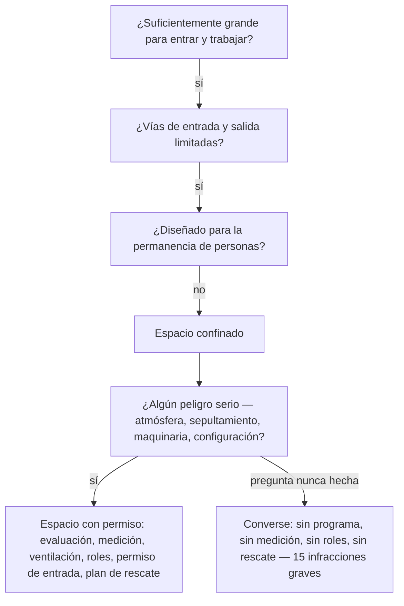

*Imagen: Monineath Horn en Unsplash.*

La mañana del 7 de enero de 2026, una cuadrilla de construcción trabajaba debajo de la escuela primaria Converse Elementary, a las afueras de San Antonio, Texas. Literalmente debajo: en el crawl space bajo el edificio — el hueco bajo de acceso entre el terreno y la estructura del piso, donde viven las tuberías y los conductos. Allí abajo se había acumulado tierra, y el trabajo del contratista era excavarla y sacarla.

En un espacio así no puedes usar una pala mucho rato, así que la cuadrilla metió miniexcavadoras — la clase más pequeña de máquina de excavación. Ni siquiera la clase más pequeña cabía. Así que modificaron las máquinas hasta que cupieron.

Esa mañana, un operador de equipo quedó atrapado entre una de esas máquinas y una viga de hormigón. Las lesiones fueron mortales.

Seis meses después, el 13 de julio de 2026, OSHA — el regulador federal de seguridad laboral de EE. UU. — publicó sus citaciones contra dos empresas: el contratista y la agencia de personal que suministró mano de obra adicional para el proyecto. La lista de infracciones se lee como la lista de verificación de todo lo que una entrada a espacio confinado debe tener. Punto por punto, nada de eso estaba.

Esta historia va a la pila de la guía de campo, porque la trampa aquí no es química exótica ni una avería rara de equipo. Es el reconocimiento. Todos los cursos de espacios confinados del mundo te entrenan con tanques, recipientes y alcantarillas. Casi nadie te entrena con el espacio bajo el piso de una escuela — y exactamente por eso esta historia merece tus veinte minutos.

## Qué pasó en Converse

Los hechos conocidos son breves y vienen del comunicado de OSHA y de la cobertura local a su alrededor.

El contratista, D L Bandy Constructors Inc., estaba retirando tierra acumulada del crawl space de la escuela Converse Elementary, un campus del distrito escolar Judson. Una segunda empresa, Pacesetter Personnel Services, suministró trabajadores temporales para el proyecto. El 7 de enero de 2026, un operador que manejaba una miniexcavadora dentro del espacio quedó atrapado entre la máquina y una viga de hormigón y murió por sus lesiones.

El 13 de julio, OSHA citó al contratista por **una infracción intencional (willful) y quince infracciones graves**, proponiendo $276.399 en multas. La agencia de personal recibió **dos infracciones graves** y $23.170.

La infracción intencional es la frase que te detiene. OSHA citó al contratista por — citando el comunicado — "retirar las estructuras de protección antivuelco de las miniexcavadoras" y fabricar piezas "para que el equipo cupiera dentro del crawl space".

Léelo dos veces. La ROPS — la estructura de protección antivuelco — es el armazón de acero alrededor del operador que impide que una máquina que vuelca lo aplaste; en una miniexcavadora es casi todo lo que separa el cuerpo del operador de todo lo que la máquina puede encontrar. El espacio era demasiado bajo para la máquina. Así que el armazón se quitó, se montaron piezas fabricadas, y la máquina entró.

Las quince infracciones graves describen el resto del trabajo: no identificar ni evaluar los espacios confinados que requieren permiso, no medir la atmósfera, no proporcionar ventilación ni comunicación, no formar a los trabajadores en los procedimientos de espacios confinados, no designar personal de espacios confinados y no implantar procedimientos de entrada y rescate. Todo — empezando por la primera línea, que es de lo que trata este artículo.

Una nota sobre "propuestas": las empresas tenían 15 días hábiles para cumplir, reunirse con OSHA o impugnar, así que las cifras pueden cambiar. Los hallazgos de fondo suelen sobrevivir.

## El espacio que no lo parecía

Aquí está la pregunta honesta en el centro de este incidente: ¿*tú* lo habrías llamado así?

Imagina el trabajo. Sin unidad de proceso, sin registro de medición de gases, sin oficina de permisos. Una escuela — el lugar menos industrial imaginable. El "recipiente" es el hueco bajo el piso. El trabajo es excavar tierra. Huele a suelo, no a disolvente. Nada encaja con la diapositiva de espacio confinado de la formación.

Ahora pon la definición al lado. Un espacio confinado es cualquier espacio que pasa tres pruebas: suficientemente grande para que una persona entre y trabaje; vías de entrada y salida limitadas; no diseñado para la permanencia de personas. El crawl space de una escuela pasa las tres sin despeinarse. Y se convierte en espacio **que requiere permiso** si añade cualquier peligro serio — y la lista no es solo aire malo. La última categoría de la norma es "cualquier otro peligro serio reconocido para la seguridad o la salud". Una máquina de excavación compartiendo un hueco con un trabajador, en un espacio tan bajo que hubo que recortar la máquina para que entrara, marca esa casilla de sobra.

Eso no es estirar las reglas — es su texto literal. La norma de OSHA de espacios confinados en construcción, 29 CFR 1926 Subpart AA, está en vigor desde 2015 y se escribió en gran parte porque las cuadrillas de construcción seguían muriendo exactamente en estos espacios sin glamur. La propia guía de OSHA para construcción residencial enumera áticos, sótanos y **crawl spaces** como los primeros ejemplos a evaluar.

Aun así el reconocimiento falla, porque el reconocimiento funciona con imágenes, no con definiciones. Nuestras cuadrillas hacen simulacros anuales de espacios confinados y equipos de respiración bajo la certificación de contratistas SCC/VCA, y los escenarios son recipientes, columnas, tanques — los espacios donde las cuadrillas industriales realmente entran. La formación correcta para ese trabajo, con un efecto secundario: le enseña a tu instinto que un espacio confinado *se parece* a un tanque. Y un día el espacio se parece a una escuela, el instinto no dice nada — y el instinto era quien estaba de guardia.

Y el reconocimiento es la infracción clave. Mira cómo las otras catorce cuelgan de la primera:

Nadie en Converse decidió saltarse la medición de gases, ni el plan de rescate, ni el vigilante en la abertura. Esas decisiones nunca se tomaron, porque la única decisión aguas arriba de ellas — *esto es un espacio con permiso* — nunca se tomó. Un reconocimiento fallido, quince controles ausentes. Esa proporción es toda la arquitectura de la seguridad en espacios confinados.

## La máquina que recortaron para que cupiera

La infracción intencional merece su propia sección, porque es la parte de esta historia que todo jefe de cuadrilla reconocerá de algún sitio.

En algún momento antes del incidente, alguien se paró junto a una miniexcavadora, miró la entrada del crawl space y entendió que la máquina no iba a entrar. Ese momento era el trabajo hablando tan claro como un trabajo puede hablar: *el trabajo tal como está planeado no cabe en el espacio tal como está construido.* Había respuestas disponibles — existe equipo para gálibos bajos; existen métodos más lentos con más trabajo manual; existen planes recotizados y reprogramados.

Lo que pasó en cambio es que la máquina fue modificada para caber en el plan. Desde ese día, cada turno en el crawl space funcionó con una máquina cuya protección contra aplastamiento había sido retirada *precisamente porque* el espacio era demasiado estrecho — retirada, en otras palabras, exactamente donde era más probable que hiciera falta. Ese detalle es lo que hace la citación intencional y no un descuido: quitar una ROPS no es algo que te ocurre. Es trabajo. Alguien lo planeó, tomó herramientas y lo hizo.

Si has pasado tiempo en plantas industriales, has visto la versión suave cien veces. La guarda que está quitada "solo para este trabajo". El enclavamiento puenteado porque el ciclo no lo permite. La protección siempre estorba — eso *es* la protección: material colocado entre tú y el peligro, lo que significa que también está entre tú y el trabajo. La versión de Converse solo es inusual por lo legible que es. El espacio dijo que no. A la máquina la obligaron a decir que sí.

La regla escondida aquí es para la pizarra: **si la protección tiene que quitarse para que el trabajo sea posible, el problema es el trabajo tal como está planeado.**

*Imagen: charlesdeluvio en Unsplash.*

## Dos citaciones para la agencia de personal

La segunda empresa de la lista nunca tocó la excavadora. Pacesetter Personnel Services suministró trabajadores temporales, y OSHA la citó por no asegurar que se siguieran los procedimientos de espacios confinados con permiso, y por no dar a sus trabajadores temporales formación en espacios confinados.

Si eso parece duro para una empresa cuyo producto son personas, es lo contrario — es el sistema funcionando según lo diseñado. La aplicación de la ley en EE. UU. trata a la agencia de personal y a su cliente como empleadores conjuntos del trabajador temporal; ambos le deben protección. La agencia no puede vender mano de obra hacia un peligro y dejar la parte de seguridad al comprador. Tiene que saber qué harán sus personas y asegurarse de que están formadas para ello — o no enviarlas.

Recorrimos la versión a escala industrial de esto en [las citaciones del derrame de ácido de Channelview](/es/blog/channelview-acid-spill-cleanup-osha), donde el proveedor de mano de obra al fondo de una cadena de tres empresas recibió el 86% de $3,5 millones en multas. Converse es la misma anatomía en un marco más pequeño: cuanto más abajo en la cadena está el trabajador, menos personas por encima han comprobado a qué entra — y la respuesta de la ley es que *todos* por encima le debían esa comprobación.

Para los propios trabajadores, una línea: la agencia que te colocó te debe formación, no solo una hoja de horas. Si la inducción del sitio es "la entrada está por allí", tus dos empleadores ya te han fallado — y tú eres la única persona que queda en la cadena que todavía puede decir que no.

## Qué puede hacer realmente un jefe de cuadrilla

La advertencia estándar, dicha con honestidad: un jefe de cuadrilla no puede reescribir un contrato. Pero cada control que faltó en Converse falla en un momento en que alguien sobre el terreno pudo haber hecho una pregunta. Aquí están las preguntas.

**Aplica la definición, no la imagen.** Antes de que cualquier cuadrilla tuya trabaje dentro de algo, haz las tres pruebas en voz alta: ¿puede una persona entrar y trabajar? ¿Son limitadas las vías de entrada y salida? ¿Está diseñado para ser ocupado? Sí-sí-no significa espacio confinado — hidrocraqueador o hueco bajo un aula, sin diferencia. Convierte la definición en reflejo y los casos de aspecto raro dejan de ser invisibles.

**Trata el "no cabe" como una tarjeta de parada.** Cada vez que el trabajo exige modificar equipo — sobre todo quitar algo con la palabra "protección" en el nombre — eso no es una tarea de taller, es un fallo de planificación aflorando en el campo. Para, escala, y haz que cambie el plan en vez de la máquina.

**Cuenta los roles que faltan.** Una entrada con permiso tiene personas con nombre: supervisor de entrada, vigilante en la abertura, entrantes que conocen los peligros, un dispositivo de rescate que no empieza marcando el número de emergencias después del hecho. Si no puedes nombrar quién ocupa cada rol en la entrada de hoy, la entrada no está lista. En Converse no había roles porque oficialmente no había entrada — solo excavación.

**Da a los trabajadores temporales la inducción completa o mantenlos fuera.** Los trabajadores de agencia reciben el mismo briefing de peligros, las mismas reglas de espacios confinados y el mismo derecho a negarse que tu propia gente, el primer día, antes de la primera entrada. "De su formación se encarga la agencia" es una frase que ha precedido a muchas citaciones — dos de ellas en esta historia.

## La lección para jefes de cuadrilla y técnicos jóvenes

Construida a partir de lo que las citaciones realmente establecen:

1. **Los espacios confinados se definen por geometría, no por industria.** La norma nunca menciona tanques — menciona entrada, salida y ocupación, y el crawl space de una escuela califica tan fácilmente como un reactor. Si tu reconocimiento depende de que el espacio parezca industrial, tiene un agujero exactamente con la forma de trabajos como este.

2. **Un reconocimiento fallido borra todos los controles aguas abajo.** Quince de dieciséis infracciones existieron porque existió la primera. Medición, ventilación, roles, rescate — nada fue rechazado; simplemente nunca fue convocado, porque el espacio nunca fue nombrado. El acto de seguridad más barato en cualquier obra es decir las palabras "esto es un espacio con permiso".

3. **Cuando la protección bloquea el trabajo, lo que está mal es el plan — no la protección.** El crawl space rechazó la máquina. La respuesta fue cortarle la protección contra aplastamiento y fabricarle la entrada. Cada obra tiene una versión más silenciosa de ese intercambio funcionando en alguna parte. Encuentra la tuya antes de que ella te encuentre a ti.

4. **Una máquina en un espacio confinado es un peligro de espacio confinado.** Sin gas, sin vapor, sin sepultamiento — al operador lo mató la geometría: una máquina en movimiento y una viga fija en un espacio sin sitio para estar en otra parte. La evaluación del permiso pregunta por *todos* los peligros serios, y el acero cuenta.

5. **Los dos extremos de una cadena de mano de obra deben al trabajador el mismo deber.** La agencia de personal fue citada junto al contratista, por la misma entrada, el mismo día. Si suministras personas, su preparación es tuya. Si tomas personas prestadas, su protección es tuya. Al trabajador dentro del espacio se le debe la suma, no el resto.

El crawl space de una escuela primaria es quizá el lugar menos dramático donde puede ocurrir una muerte industrial. Ese es el punto. Los espacios que no parecen nada son aquellos para los que nunca se escribe un permiso — y la definición existía, impresa y en vigor, once años antes de que recortaran la máquina para que cupiera.

## Créditos y lecturas adicionales

- Comunicado de OSHA, *US Department of Labor cites Texas contractor, staffing company after worker suffers fatal injury in elementary school crawl space* (13 de julio de 2026): [https://www.osha.gov/news/newsreleases/dallas/20260713](https://www.osha.gov/news/newsreleases/dallas/20260713)
- KSAT San Antonio, cobertura de las citaciones en el campus del Judson ISD: [https://www.ksat.com/news/local/2026/07/13/us-department-of-labor-cites-contractor-staffing-company-after-construction-workers-death-at-judson-isd-campus/](https://www.ksat.com/news/local/2026/07/13/us-department-of-labor-cites-contractor-staffing-company-after-construction-workers-death-at-judson-isd-campus/)
- OSHA, Confined Spaces in Construction — 29 CFR 1926 Subpart AA: [https://www.osha.gov/confined-spaces-construction](https://www.osha.gov/confined-spaces-construction)
- Para la versión a escala industrial de la lección de la cadena de contratistas, mira nuestra lectura de [las citaciones del derrame de ácido de Channelview](/es/blog/channelview-acid-spill-cleanup-osha) — y para otro espacio que nadie nombró antes de entrar, [el tanque enterrado de PCE Lake Worth](/es/blog/pce-lake-worth-buried-tank-benzene).
