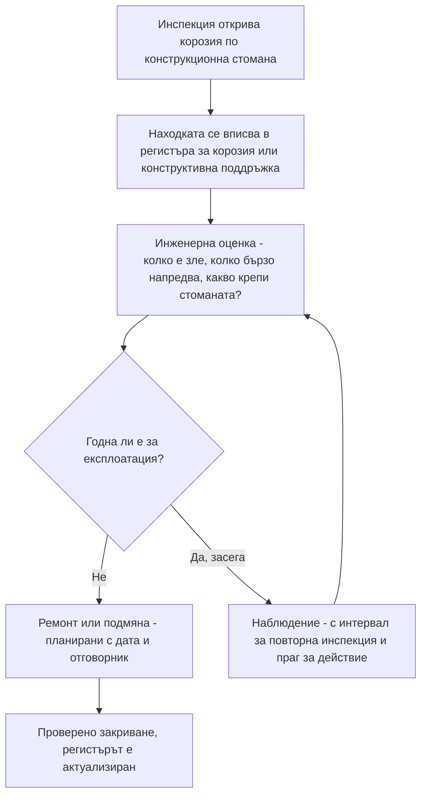

*Снимка: Maksym Kaharlytskyi, Unsplash.*

Около 16:40 следобед на 8 ноември 2022 г. голяма стоманена кула в рафинерията на Esso във Fawley, Хемпшир — най-голямата рафинерия във Великобритания — частично се срутва. По пътя си надолу тя разкъсва свързаните с нея тръбопроводи и втечнен нефтен газ, LPG — същото гориво като в туристическа бутилка, но течащо в рафинериен мащаб — започва да изтича без нищо да го спре. Около 400 килограма излизат през първия половин час.

Отвъд водата, на остров Уайт, хората излизат от къщите си да гледат небето. Факлите на рафинерията горят толкова силно, че жителите описват заревото като голям залез.

Никой не загива тази вечер. Никой дори не е ранен. Няма пожар — а при приблизително 2 400 килограма запалим газ, изтекли за 33-те часа, нужни за пълното изолиране на теча, това е по-близо до хвърляне на ези-тура, отколкото на когото и да било му се иска.

На 12 юни 2026 г. магистратският съд в Саутхамптън глобява Esso Petroleum Company Limited с 1 милион паунда за случилото се. Но датата, която трябва да ви спре, не е 2022 или 2026. Тя е заровена в разследването на HSE: корозията, съборила кулата, е била установена още през **2010 г.** Стоманата е казвала на площадката, че умира, цели дванадесет години.

## Какво се случва във Fawley

Първо картината. Fawley стои на Southampton Water и преработва голям дял от горивото, с което се движи Великобритания. Репортажите по онова време, позовавайки се на регионален организатор от синдиката GMB, поставят срутването в инсталацията за каталитичен крекинг с флуидизиран слой — FCC, една от основните конверсионни инсталации на рафинерията, която разбива тежкия нефт на по-леки продукти като бензин и LPG. По думите на синдикалиста, инсталацията е „широко известна сред работниците на площадката като неделима част от производството на бензин".

Тази вечер част от голяма стоманена кула в този район поддава. Конструкцията не пада ефектно като комин при събаряне — тя се срутва *частично*. Но частично е предостатъчно. Тръбопроводите не се интересуват от проценти. Линиите, свързани с кулата, се разкъсват и LPG преминава от „затворен" в „на свобода".

LPG има гаден навик: изпуснат от налягане, той се изпарява в тежка пара, която се стеле по земята и се носи, търсейки искра. Аварийните екипи във Fawley знаят точно с какво си имат работа — вдигат водни завеси, струи вода, които събарят и разреждат запалимия облак, и ги държат включени, докато операторите изолират участъка и изпускат останалото към факелната система. Тази работа отнема около 33 часа. Ден и половина, в които площадка с голям опасен потенциал живее на един източник на запалване разстояние от съвсем различна история.

HSE — Health and Safety Executive, британският национален регулатор по безопасност на труда — разследва. Заключението им се събира в един ред: срутването е причинено от корозия, развивала се в продължение на много години, а компанията е знаела за нея поне от 2010 г., без да предприеме действието, което би я овладяло.

Инспекторът на HSE от дирекцията за химикали, взривни вещества и големи опасности формулира човешкия залог ясно: „Този инцидент доведе до неконтролирано изпускане на голямо количество запалим газ, което изложи работници на съвсем реални и потенциално животозастрашаващи рискове."

Esso се признава за виновна в нарушение на член 3(1) от Закона за здраве и безопасност при работа от 1974 г. и е глобена с 1 милион паунда плюс 12 277 паунда разноски.

Запомнете този номер на член. Ще се върнем към него, защото от всички, които четат това, той се отнася най-вече за контракторите.

## Дванадесет години не са сляпо петно

Ето неудобната част. Това не е скрита корозия — от онази, която яде тръбата отвътре или работи под изолацията, където никой не може да я види, без да свали обшивката. Такива откази са поне *трудни* за откриване. Тук говорим за конструкционна стомана, сигнализирана през 2010 г., все още стояща необработена през 2022 г.

Как се случва това на площадка с повече инженери, отколкото има в повечето градчета?

Част от отговора е къде стои конструкционната стомана в документацията на една рафинерия. Оборудването под налягане — съдовете и тръбопроводите, които държат процеса — живее под строги писмени схеми за инспекция. То получава измервания на дебелини, инспекционни интервали, законово внимание. Стоманата, която *държи всичко това*, юридически е просто конструкция. Тя принадлежи на друг бюджет, инспектира се по друг цикъл и се ремонтира от друга опашка. Процесът получава вниманието; скелетът получава боята.

А корозията по конструкционна стомана е бавна. Точно това я прави преживяема като ред в таблица. Находка от 2010 г. не избухва през 2011 г. Тя влиза в регистър, получава рискова оценка и чака turnaround, на който са останали пари. После следващата инспекция я намира отново, малко по-зле, и тя се връща в регистъра. Всяка отделна година отлагането изглежда разумно. Никой никога не пише в план „да оставим кулата да падне". Пишат „повторна инспекция следващия цикъл" дванадесет пъти.

HSE предупреждава индустрията точно за това от години — нарича проблема *застаряваща инсталация* (ageing plant) и многократно е казвал, че застаряването не е въпрос на възраст на оборудването, а на това дали състоянието му се разбира и управлява. Fawley е това, което се получава, когато разбирането съществува — корозията е установена — а управлението не го последва.

*Снимка: Hans, Unsplash.*

## Хората под кулата

А сега — член 3(1). Законът за здраве и безопасност при работа разделя задълженията на работодателя на две. Член 2 защитава собствените ви служители. Член 3 защитава всички останали, които работата ви излага на риск — посетители, съседи и най-вече **контрактори**. Именно по този член е осъдена Esso.

Помислете кой всъщност стои под корозирала кула в рафинерия във вторник следобед през ноември. Някои са хора на оператора. Много от тях — не. Те са скелетаджии, изолаторчици, инспекционни техници, катализаторни екипи, такелажници — хора, които сутринта са влезли през контракторския портал и са приели конструкциите на завода изцяло на доверие.

И ето го нещото, което обучението наистина не покрива. Един контракторски инструктаж е изчерпателен за *процеса*: откъде може да дойде газ, как звучат алармите, къде са сборните пунктове, кога се носи личен газдетектор. Всяка част от него предполага, че опасността идва по тръбите. Ничия инструктажна карта не казва, че кулата до скелето ви е била сигнализирана за корозия, когато чиракът ви е бил в началното училище. Конструкционната умора не се надушва. За нея няма личен детектор. Работниците край тази кула на 8 ноември са имали точно два слоя защита от падаща стомана и разкъсваща се LPG линия: системата за управление на корозията на площадката и късмета. Първият вече е бил отказал. Вторият издържа — 2 400 килограма LPG и нито една искра.

Нашите собствени екипи работят по европейската контракторска сертификация за безопасност — SCC/VCA — и опреснителното обучение тренира изпускания на газ всяка година: откриване, маршрути за евакуация, сборни пунктове, дихателни апарати. Това е добро обучение. Но то, честно казано, е обучение за *последствията* от този инцидент. Причината — конструкция, тихо гниеща над жива LPG линия дванадесет години — никога не се появява на контракторска карта, защото контракторите са публика на интегритетната система на площадката, никога нейни автори.

Точно затова съществува член 3. Хората с най-малка възможност да знаят за корозионния регистър са стояли под съдържанието му.

## Къде всъщност се къса веригата

Една корозионна находка на площадка с голям опасен потенциал би трябвало да измине определен път. Опростено, той изглежда така:

Забележете цикъла между *Наблюдение* и *Оценка*. Този цикъл е легитимен — не всяка находка изисква незабавен ремонт. Но цикълът остава честен само ако две неща са верни: оценката наистина пита какво крепи стоманата (в този случай: LPG тръбопроводи — отговорът е трябвало да промени всичко), и прагът за действие наистина задейства някого, когато състоянието го премине.

Във Fawley, по публичните данни, находка е влязла в тази система през 2010 г. и кулата е стигнала до 2022 г. без действието, което би предотвратило срутването. Дали цикълът се е въртял без зъби, дали прагът никога не е бил дефиниран, или ремонтите постоянно са губили битката за бюджет — съдебното дело не разбива на части. Това, което установява, е резултатът, за чието предотвратяване системата съществува: цикълът оценка-и-наблюдение е работил дванадесет години и стоманата е паднала преди ремонтът да пристигне.

Ако ръководите екипи за прехраната си, тази диаграма заслужава дълъг поглед, защото хората ви работят надолу по течението на стотици находки, които в момента стоят в кутийката *Наблюдение* на площадки, чиито регистри никога няма да видите.

## Какво реално може да направи един екип за чуждата стомана

Първо честната версия: контракторски екип не може да одитира системата за управление на корозията на клиента и не бива да се преструва, че може. Но „не е наша системата" не значи „не е наш проблемът", и има неща, които наистина са в ръцете на екипа.

**Погледнете нагоре, преди да строите.** Скелетаджиите и без това инспектират това, за което се връзват — по правилник е. Разширете навика с едно ниво: преди екипът да монтира под или до каквато и да е конструкция — тридесет секунди истинско гледане. Дебели пластове ръжда, загуба на сечение при опорните плочи, ръждиви ивици под съединенията, боя, паднала на люспи — нищо от това не изисква инженерна диплома, за да бъде забелязано. Изисква позволение да бъде споменато.

**Докладвайте го, както бихте докладвали мирис на газ.** Корозирала греда минава за small talk; полъх на въглеводород спира работата. Тази разлика е навик, не логика — близката до катастрофа ситуация във Fawley дойде от стоманата, не от процеса. Ако състоянието на една конструкция би ви накарало да се замислите дали да паркирате колата си под нея, то отива при издаващия разрешителното, с думи, преди работата да започне.

**Задайте единствения въпрос, на който имате право.** Когато една работа поставя хората ви под или върху конструкция, която видимо страда, ръководителят на екипа може да попита клиента: *тази конструкция в инспекционната ви програма ли е?* Не искате да видите регистъра. Питате дали съществува отговорник. Реакцията казва много. Площадка с работеща система отговаря с едно изречение. Площадка, която замълчава, току-що ви е казала нещо по-важно.

**Записвайте какво сте сигнализирали.** Ако повдигнете конструктивно опасение и работата продължи, запишете какво сте видели, на кого сте казали и кога. Не като муниции — като памет. Дванадесет години са по-дълги от повечето договори, а хартията надживява предаванията на смени.

## Урокът за ръководители на екипи и млади техници

Изграден от това, което прокуратурата на HSE реално установява:

1. **Известен дефект не е управляван дефект.** Корозията във Fawley беше намерена. Намирането ѝ не промени нищо. Единствената находка, която се брои, е тази с дата за ремонт и име срещу нея.

2. **Конструкцията е част от процеса.** Кула, крепяща LPG тръбопроводи, е LPG оборудване, както и да я нарича регистърът на активите. Когато оценявате една работа, оценявайте какво е над нея и до нея, не само какво е в линията.

3. **Член 3 означава, че площадката дължи *на вас* истината за стоманата си.** Британският закон осъди Esso конкретно за излагане на риск на хора извън собствената ѝ ведомост. Ако сте контрактор, това задължение тече към вас — но задължение или не, вашите очи остават последната проверка.

4. **„Без пострадали" не значи „без инцидент".** 2 400 килограма LPG, 33 часа, водни завеси и глоба от 1 милион паунда при нула ранени. Разстоянието между тази история и история с множество жертви беше запалването, нищо друго. Третирайте близките до катастрофа ситуации по чужди площадки като свой учебен материал — те са най-евтините уроци, които някога ще получите.

5. **Бавните опасности се нуждаят от шумни календари.** Всичко, което се разгражда с години — корозия, слягане на фундаменти, кабелни скари, огнезащита — винаги ще губи честната битка срещу спешната работа от тази седмица. Решението не е бдителност, а механизъм: прагове за действие, отговорници, дати. Ако една площадка не може да ви покаже механизма, вярвайте на ръждата.

Кулата във Fawley прекара дванадесет години, казвайки на всички какво ще направи. В един ноемврийски следобед на 2022 г. най-накрая го направи и 2 400 килограма LPG не намериха искра. Никой няма право да разчита на това два пъти.

## Признание и допълнително четене

- Прессъобщение на HSE, *Esso fined £1 million after major gas leak at Fawley refinery* (15 юни 2026 г.): [https://press.hse.gov.uk/2026/06/15/esso-fined-1-million-after-major-gas-leak-at-fawley-refinery/](https://press.hse.gov.uk/2026/06/15/esso-fined-1-million-after-major-gas-leak-at-fawley-refinery/)
- ITV News Meridian, *Esso fined £1 million after 'partial collapse' caused 33 hour long gas leak at Fawley Oil Refinery* (15 юни 2026 г.): [https://www.itv.com/news/meridian/2026-06-15/esso-fined-1-million-after-partial-collapse-caused-33-hour-long-gas-leak](https://www.itv.com/news/meridian/2026-06-15/esso-fined-1-million-after-partial-collapse-caused-33-hour-long-gas-leak)
- Isle of Wight County Press (ноември 2022 г.), за срутването и FCC инсталацията: [https://www.countypress.co.uk/news/23115577.exxonmobil-fawley-incident-caused-collapse-structure/](https://www.countypress.co.uk/news/23115577.exxonmobil-fawley-incident-caused-collapse-structure/)
- Насоки на HSE за застаряващи инсталации и интегритет на активите на COMAH площадки: [https://www.hse.gov.uk/comah/](https://www.hse.gov.uk/comah/)
- Още за това как известните дефекти надживяват хората, които са ги намерили — вижте нашия прочит на [уплътнението с HF в Geismar, което смятаха да сменят](/bg/blog/geismar-hydrogen-fluoride-gasket-csb), а за друга конструкция, спряла да върши единствената си работа — [палубната решетка на Valaris 121](/bg/blog/valaris-121-grating-fall-hse).
