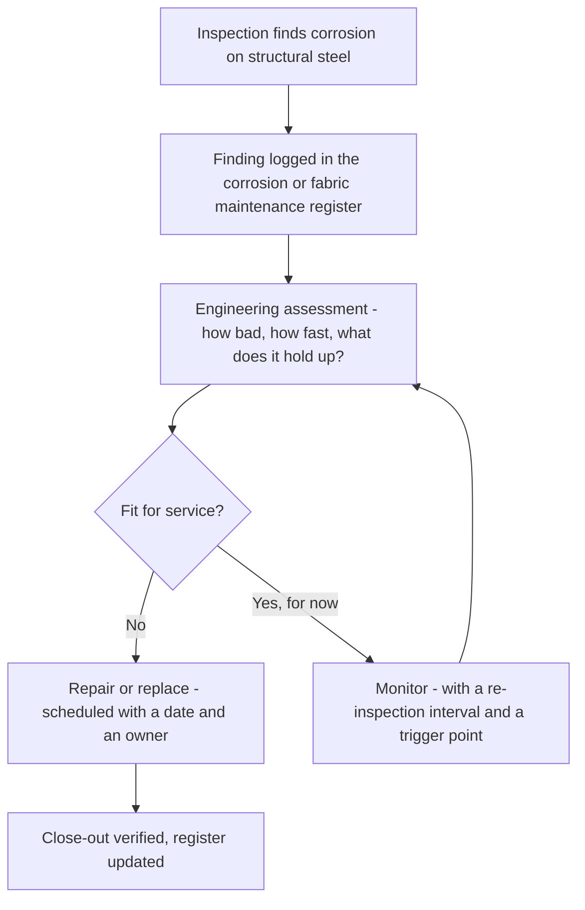

*Image: Maksym Kaharlytskyi on Unsplash.*

At about 4:40 in the afternoon on 8 November 2022, a large steel tower inside Esso's Fawley refinery in Hampshire — the biggest refinery in the UK — partially collapsed. On its way down it tore open the pipework connected to it, and liquefied petroleum gas, LPG, the same stuff in a camping bottle but flowing at refinery scale, started pouring out with nothing to stop it. Around 400 kilograms escaped in the first half hour.

Across the water on the Isle of Wight, people came out of their houses to look at the sky. The refinery's flares were lit up so hard that residents described the glow as looking like a large sunset.

Nobody died that evening. Nobody was even hurt. There was no fire — and with roughly 2,400 kilograms of flammable gas escaping over the 33 hours it took to fully isolate the leak, that is closer to a coin toss than anyone should be comfortable with.

On 12 June 2026, Southampton Magistrates' Court fined Esso Petroleum Company Limited £1 million for it. But the date that should stop you isn't 2022 or 2026. It's the one buried in the HSE investigation: the corrosion that brought the tower down had been identified as early as **2010**. The steel had been telling the site it was dying for twelve years.

## What Happened at Fawley

First, the picture. Fawley sits on Southampton Water and processes a large share of the fuel the UK runs on. Reporting at the time, citing a regional organiser from the GMB union, placed the collapse in the fluid catalytic cracking unit — the FCC, one of the refinery's core conversion units, which breaks heavy oil into lighter products like petrol and LPG. In the union man's words, the unit was "widely known by workers at the site to be integral to the production of petrol."

That evening, part of a large steel tower in that area gave way. The structure didn't fall over dramatically like a chimney demolition — it *partially* collapsed. But partially is plenty. Pipework doesn't care about percentages. The lines connected to the tower ruptured, and LPG went from contained to loose.

LPG has a nasty habit: released from pressure, it flashes to a heavy vapour that hugs the ground and drifts, looking for a spark. The emergency crews at Fawley knew exactly what they were dealing with — they put up water curtains, sprays of water that knock down and dilute a flammable cloud, and kept them running while operators worked to isolate the section and vent what remained to the flare system. That work took around 33 hours. A day and a half of a major hazard site living one ignition source away from a very different story.

The HSE — the Health and Safety Executive, Britain's national workplace safety regulator — investigated. Their finding fits in one line: the collapse was caused by corrosion that had developed over many years, and the company had known about it since at least 2010 without taking the action that would have dealt with it.

The HSE inspector from the regulator's Chemicals, Explosives and Major Hazards Division put the human stakes plainly: "This incident resulted in the uncontrolled release of a large quantity of flammable gas, which exposed workers to very real and potentially life-threatening risks."

Esso pleaded guilty to breaching Section 3(1) of the Health and Safety at Work etc. Act 1974 and was fined £1 million plus £12,277 in costs.

Hold onto that section number. We'll come back to it, because of everyone reading this, it applies to contractors most of all.

## Twelve Years Is Not a Blind Spot

Here's the uncomfortable part. This wasn't hidden corrosion — the kind that eats a pipe from the inside, or works away under insulation where nobody can see it without stripping the cladding. Those failures are at least *hard* to find. This was structural steel, flagged in 2010, still standing untreated in 2022.

How does that happen at a site with more engineers than most towns?

Part of the answer is where structural steel sits in a refinery's paperwork. Pressure equipment — the vessels and pipework that hold the process — lives under strict written inspection schemes. It gets thickness surveys, inspection intervals, statutory attention. The steel *holding all of that up* is legally just a structure. It's owned by a different budget, inspected on a different cycle, and repaired by a different queue. The process gets the attention; the skeleton gets the paint.

And corrosion on structural steel is slow. That's what makes it survivable as a line item. A finding from 2010 doesn't explode in 2011. It goes into a register, gets a risk ranking, and waits for a turnaround that has money left over. Then the next inspection finds it again, a bit worse, and it goes back in the register. Every individual year, deferring it looks reasonable. Nobody ever writes "let the tower fall down" in a plan. They write "re-inspect next cycle" twelve times.

The HSE has been warning the industry about exactly this for years — it calls the problem *ageing plant*, and it has said repeatedly that ageing isn't about how old equipment is, but about whether its condition is understood and managed. Fawley is what it looks like when the understanding exists — the corrosion was identified — and the managing doesn't follow.

*Image: Hans on Unsplash.*

## The People Under the Tower

Now, Section 3(1). The Health and Safety at Work Act splits an employer's duties in two. Section 2 protects your own employees. Section 3 protects everyone else your work puts at risk — visitors, neighbours, and above all, **contractors**. That's the section Esso was convicted under.

Think about who is actually standing under a corroded tower on a refinery on a Tuesday afternoon in November. Some of them are the operator's own people. A lot of them aren't. They're scaffolders, insulators, inspection techs, catalyst crews, riggers — people who arrived through the contractor gate that morning and took the plant's structures entirely on trust.

And here's the thing the training genuinely doesn't cover. A contractor induction is thorough about the *process*: where the gas could come from, what the alarms sound like, where the muster points are, when to wear a personal gas monitor. Every bit of it assumes danger arrives through the pipes. Nobody's induction card says the tower beside your scaffold was flagged for corrosion when your apprentice was in primary school. You can't smell structural fatigue. There's no personal monitor for it. The workers near that tower on 8 November had exactly two layers of protection from falling steel and a rupturing LPG line: the site's corrosion management system, and luck. The first one had already failed. The second one held — 2,400 kilograms of LPG and not one spark.

Our own crews work under European contractor safety certification — SCC/VCA — and the refresher training drills gas releases every year: detection, escape routes, muster, BA sets. It's good training. It is also, honestly, training for the *consequence* side of this incident. The cause — a structure quietly rotting above a live LPG line for twelve years — never appears on a contractor's card, because contractors are the audience of a site's integrity system, never the authors of it.

That's exactly why Section 3 exists. The people with the least ability to know about the corrosion register were the ones standing under its contents.

## Where the Chain Actually Broke

A corrosion finding on a major hazard site is supposed to travel a defined path. Simplified, it looks like this:

Notice the loop between *Monitor* and *Assessment*. That loop is legitimate — not every finding needs immediate repair. But the loop only stays honest if two things are true: the assessment genuinely asks what the steel is holding up (in this case: LPG pipework — the answer should have changed everything), and the trigger point actually fires someone into action when the condition passes it.

At Fawley, on the public record, a finding entered that system in 2010 and the tower reached 2022 without the action that would have prevented collapse. Whether the loop spun without teeth, or the trigger point was never defined, or the repairs kept losing the budget fight — the court record doesn't break down. What it does establish is the outcome the system exists to prevent: the assessment-and-monitor cycle ran for twelve years and the steel fell before the repair arrived.

If you lead crews for a living, that flowchart is worth a long look, because your people work downstream of hundreds of findings currently sitting in the *Monitor* box on sites you'll never see the registers of.

## What a Crew Can Actually Do About Someone Else's Steel

The honest version first: a contractor crew cannot audit a client's corrosion management system, and shouldn't pretend to. But "not our system" doesn't mean "not our problem", and there are things that are genuinely in a crew's hands.

**Look up before you build.** Scaffolders already inspect what they tie into — it's in the rules. Extend the habit one level: before the crew installs under or against any structure, thirty seconds of actually looking. Heavy scale, section loss at the base plates, staining streaks below connections, paint blistered off in sheets — none of that requires an engineering degree to notice. It requires permission to mention it.

**Report it like you'd report a gas smell.** A corroded stringer gets treated as small talk; a whiff of hydrocarbon stops the job. That difference is habit, not logic — Fawley's near-miss came from the steel, not the process. If the state of a structure would make you think twice about parking your car under it, it goes to the permit issuer, in words, before work starts.

**Ask the one question you're entitled to ask.** When a job puts your people under or on a structure that's visibly suffering, the crew lead can ask the client: *is this structure on your inspection programme?* You're not asking to see the register. You're asking whether an owner exists. The reaction tells you a lot. A site with a working system answers in a sentence. A site that goes quiet has just told you something more important.

**Log what you flagged.** If you raise a structural concern and the job continues, write down what you saw, who you told, and when. Not as ammunition — as memory. Twelve years is longer than most contracts, and paper outlives handovers.

## The Lesson for Crew Leads and Young Techs

Built from what the HSE's prosecution actually establishes:

1. **A known defect is not a managed defect.** Fawley's corrosion was found. Finding it changed nothing. The only finding that counts is one with a repair date and a name attached.

2. **The structure is part of the process.** A tower holding LPG pipework is LPG equipment, whatever the asset register calls it. When you assess a job, assess what's above and beside it, not just what's in the line.

3. **Section 3 means the site owes *you* the truth about its steel.** UK law convicted Esso specifically for exposing people beyond its own payroll. If you're a contractor, that duty runs toward you — and duty or not, your eyes are still the last check.

4. **No injuries doesn't mean no incident.** 2,400 kilograms of LPG, 33 hours, water curtains, and a £1 million fine with zero people hurt. The gap between this story and a multiple-fatality story was ignition, nothing else. Treat near-misses on other people's sites as your training material — they're the cheapest lessons you'll ever get.

5. **Slow hazards need loud calendars.** Anything that degrades over years — corrosion, foundation settlement, cable trays, fireproofing — will always lose a fair fight against this week's urgent work. The fix isn't vigilance, it's machinery: trigger points, owners, dates. If a site can't show you the machinery, believe the rust instead.

The tower at Fawley spent twelve years telling everyone what it was going to do. On a November afternoon in 2022, it finally did it, and 2,400 kilograms of LPG found no spark. Nobody gets to count on that twice.

## Credit and Further Reading

- HSE press release, *Esso fined £1 million after major gas leak at Fawley refinery* (15 June 2026): [https://press.hse.gov.uk/2026/06/15/esso-fined-1-million-after-major-gas-leak-at-fawley-refinery/](https://press.hse.gov.uk/2026/06/15/esso-fined-1-million-after-major-gas-leak-at-fawley-refinery/)
- ITV News Meridian, *Esso fined £1 million after 'partial collapse' caused 33 hour long gas leak at Fawley Oil Refinery* (15 June 2026): [https://www.itv.com/news/meridian/2026-06-15/esso-fined-1-million-after-partial-collapse-caused-33-hour-long-gas-leak](https://www.itv.com/news/meridian/2026-06-15/esso-fined-1-million-after-partial-collapse-caused-33-hour-long-gas-leak)
- Isle of Wight County Press (November 2022), on the collapse and the FCC unit: [https://www.countypress.co.uk/news/23115577.exxonmobil-fawley-incident-caused-collapse-structure/](https://www.countypress.co.uk/news/23115577.exxonmobil-fawley-incident-caused-collapse-structure/)
- HSE guidance on ageing plant and asset integrity at COMAH sites: [https://www.hse.gov.uk/comah/](https://www.hse.gov.uk/comah/)
- For more on how known defects outlive the people who found them, see our reading of the [Geismar HF gasket that was meant to be replaced](/en/blog/geismar-hydrogen-fluoride-gasket-csb), and for another structure that stopped doing its one job, the [Valaris 121 deck grating](/en/blog/valaris-121-grating-fall-hse).
