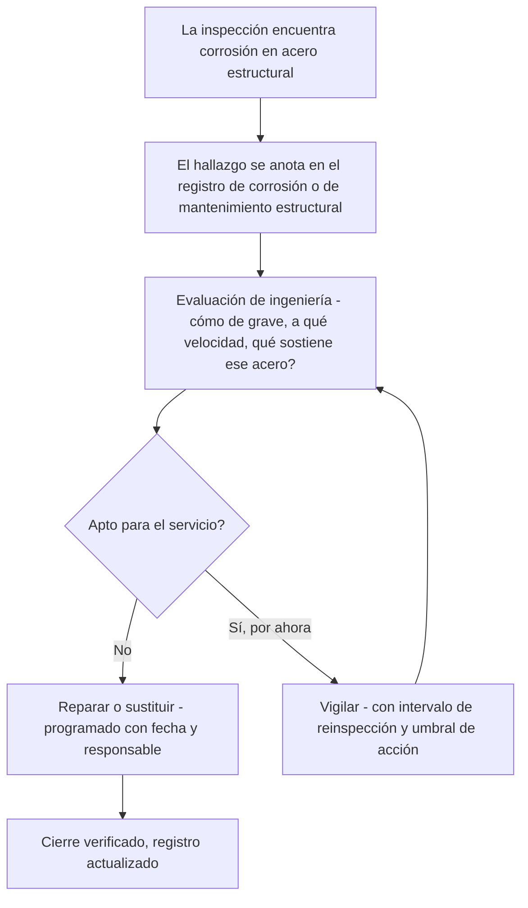

*Imagen: Maksym Kaharlytskyi en Unsplash.*

Hacia las 16:40 de la tarde del 8 de noviembre de 2022, una gran torre de acero dentro de la refinería de Esso en Fawley, Hampshire — la refinería más grande del Reino Unido — se derrumbó parcialmente. En su caída desgarró las tuberías conectadas a ella, y el gas licuado de petróleo, GLP — lo mismo que llevas en una bombona de camping, pero fluyendo a escala de refinería — empezó a escapar sin nada que lo detuviera. Unos 400 kilogramos salieron en la primera media hora.

Al otro lado del agua, en la isla de Wight, la gente salió de sus casas a mirar el cielo. Las antorchas de la refinería ardían con tanta fuerza que los vecinos describieron el resplandor como un gran atardecer.

Nadie murió esa tarde. Nadie resultó siquiera herido. No hubo incendio — y con aproximadamente 2.400 kilogramos de gas inflamable escapando durante las 33 horas que llevó aislar del todo la fuga, eso se parece más a lanzar una moneda al aire de lo que nadie debería tolerar.

El 12 de junio de 2026, el tribunal de magistrados de Southampton impuso a Esso Petroleum Company Limited una multa de 1 millón de libras por ello. Pero la fecha que debería detenerte no es 2022 ni 2026. Es la que está enterrada en la investigación del HSE: la corrosión que derribó la torre había sido identificada ya en **2010**. El acero llevaba doce años diciéndole a la planta que se estaba muriendo.

## Qué pasó en Fawley

Primero, el cuadro general. Fawley se asienta sobre Southampton Water y procesa una gran parte del combustible con el que funciona el Reino Unido. La prensa de entonces, citando a un organizador regional del sindicato GMB, situó el derrumbe en la unidad de craqueo catalítico fluidizado — la FCC, una de las unidades de conversión centrales de la refinería, que rompe el petróleo pesado en productos más ligeros como gasolina y GLP. En palabras del sindicalista, la unidad era «ampliamente conocida por los trabajadores de la planta como parte integral de la producción de gasolina».

Esa tarde, parte de una gran torre de acero en esa zona cedió. La estructura no cayó de forma espectacular como una chimenea en demolición — se derrumbó *parcialmente*. Pero parcialmente es más que suficiente. A las tuberías no les importan los porcentajes. Las líneas conectadas a la torre se rompieron, y el GLP pasó de contenido a suelto.

El GLP tiene una costumbre fea: liberado de la presión, se convierte en un vapor pesado que se pega al suelo y se desplaza buscando una chispa. Los equipos de emergencia de Fawley sabían exactamente con qué estaban tratando — levantaron cortinas de agua, chorros de agua que abaten y diluyen una nube inflamable, y las mantuvieron funcionando mientras los operadores aislaban la sección y venteaban lo que quedaba hacia el sistema de antorcha. Ese trabajo llevó unas 33 horas. Un día y medio en que una planta de riesgo mayor vivió a una fuente de ignición de distancia de una historia muy distinta.

El HSE — el Health and Safety Executive, el regulador nacional británico de seguridad laboral — investigó. Su conclusión cabe en una línea: el derrumbe fue causado por corrosión que se había desarrollado durante muchos años, y la empresa lo sabía desde al menos 2010 sin haber tomado la acción que lo habría controlado.

La inspectora del HSE de la división de Químicos, Explosivos y Riesgos Mayores expuso lo que estaba en juego con claridad: «Este incidente resultó en la liberación descontrolada de una gran cantidad de gas inflamable, que expuso a trabajadores a riesgos muy reales y potencialmente mortales.»

Esso se declaró culpable de infringir la Sección 3(1) de la Ley de Salud y Seguridad en el Trabajo de 1974 y fue multada con 1 millón de libras más 12.277 libras en costas.

Quédate con ese número de sección. Volveremos a él, porque de todos los que leen esto, se aplica a los contratistas más que a nadie.

## Doce años no son un punto ciego

Aquí viene la parte incómoda. Esto no era corrosión oculta — de la que se come una tubería desde dentro, o trabaja bajo el aislamiento donde nadie puede verla sin desmontar el revestimiento. Esos fallos son al menos *difíciles* de encontrar. Esto era acero estructural, señalado en 2010, todavía en pie sin tratar en 2022.

¿Cómo ocurre eso en una planta con más ingenieros que la mayoría de los pueblos?

Parte de la respuesta está en dónde se sitúa el acero estructural en el papeleo de una refinería. Los equipos a presión — los recipientes y tuberías que contienen el proceso — viven bajo estrictos planes escritos de inspección. Reciben medición de espesores, intervalos de inspección, atención legal. El acero que *sostiene todo eso* es, legalmente, solo una estructura. Pertenece a otro presupuesto, se inspecciona con otro ciclo y se repara desde otra cola. El proceso recibe la atención; el esqueleto recibe la pintura.

Y la corrosión del acero estructural es lenta. Eso es lo que la hace sobrevivible como línea de una tabla. Un hallazgo de 2010 no explota en 2011. Entra en un registro, recibe una clasificación de riesgo y espera una parada de planta a la que le sobre dinero. Luego la siguiente inspección lo encuentra otra vez, un poco peor, y vuelve al registro. Cada año individual, aplazarlo parece razonable. Nadie escribe nunca en un plan «dejemos que la torre se caiga». Escriben «reinspeccionar el próximo ciclo» doce veces.

El HSE lleva años advirtiendo a la industria exactamente de esto — llama al problema *planta envejecida* (ageing plant), y ha dicho repetidamente que envejecer no va de cuántos años tiene el equipo, sino de si su estado se comprende y se gestiona. Fawley es lo que pasa cuando la comprensión existe — la corrosión fue identificada — y la gestión no la sigue.

*Imagen: Hans en Unsplash.*

## La gente bajo la torre

Ahora, la Sección 3(1). La Ley de Salud y Seguridad en el Trabajo divide los deberes del empresario en dos. La Sección 2 protege a tus propios empleados. La Sección 3 protege a todos los demás a quienes tu actividad pone en riesgo — visitantes, vecinos y, sobre todo, **contratistas**. Esa es la sección por la que fue condenada Esso.

Piensa en quién está realmente de pie bajo una torre corroída en una refinería un martes por la tarde de noviembre. Algunos son gente del operador. Muchos no. Son andamistas, aislistas, técnicos de inspección, equipos de catalizador, aparejadores — gente que entró esa mañana por la puerta de contratistas y aceptó las estructuras de la planta enteramente de buena fe.

Y aquí está lo que la formación de verdad no cubre. Una inducción de contratista es exhaustiva sobre el *proceso*: de dónde puede venir el gas, cómo suenan las alarmas, dónde están los puntos de reunión, cuándo llevar un detector personal de gases. Cada parte de ella asume que el peligro llega por las tuberías. Ninguna tarjeta de inducción dice que la torre junto a tu andamio fue señalada por corrosión cuando tu aprendiz estaba en primaria. La fatiga estructural no se huele. No hay detector personal para ella. Los trabajadores cerca de esa torre el 8 de noviembre tenían exactamente dos capas de protección frente al acero cayendo y una línea de GLP rompiéndose: el sistema de gestión de corrosión de la planta, y la suerte. La primera ya había fallado. La segunda aguantó — 2.400 kilogramos de GLP y ni una sola chispa.

Nuestros propios equipos trabajan bajo la certificación europea de seguridad para contratistas — SCC/VCA — y el reciclaje anual entrena fugas de gas cada año: detección, rutas de escape, puntos de reunión, equipos de respiración autónoma. Es buena formación. Pero es, honestamente, formación para el lado de las *consecuencias* de este incidente. La causa — una estructura pudriéndose en silencio sobre una línea viva de GLP durante doce años — nunca aparece en la tarjeta de un contratista, porque los contratistas son el público del sistema de integridad de una planta, nunca sus autores.

Exactamente para eso existe la Sección 3. Las personas con menos capacidad de conocer el registro de corrosión eran las que estaban de pie bajo su contenido.

## Dónde se rompe realmente la cadena

Un hallazgo de corrosión en una planta de riesgo mayor debe recorrer un camino definido. Simplificado, se ve así:

Fíjate en el bucle entre *Vigilar* y *Evaluación*. Ese bucle es legítimo — no todo hallazgo necesita reparación inmediata. Pero el bucle solo se mantiene honesto si dos cosas son ciertas: la evaluación pregunta de verdad qué sostiene el acero (en este caso: tuberías de GLP — la respuesta debería haberlo cambiado todo), y el umbral de acción realmente pone a alguien en marcha cuando el estado lo supera.

En Fawley, según el registro público, un hallazgo entró en ese sistema en 2010 y la torre llegó a 2022 sin la acción que habría evitado el derrumbe. Si el bucle giró sin dientes, si el umbral nunca se definió, o si las reparaciones perdieron una y otra vez la batalla del presupuesto — el expediente judicial no lo desglosa. Lo que sí establece es el resultado que el sistema existe para evitar: el ciclo de evaluar-y-vigilar funcionó doce años y el acero cayó antes de que llegara la reparación.

Si diriges cuadrillas para ganarte la vida, ese diagrama merece una mirada larga, porque tu gente trabaja aguas abajo de cientos de hallazgos que ahora mismo están en la casilla *Vigilar* de plantas cuyos registros nunca verás.

## Qué puede hacer de verdad una cuadrilla con el acero de otro

Primero la versión honesta: una cuadrilla contratista no puede auditar el sistema de gestión de corrosión del cliente, y no debería fingir que puede. Pero «no es nuestro sistema» no significa «no es nuestro problema», y hay cosas que sí están genuinamente en manos de la cuadrilla.

**Mira hacia arriba antes de montar.** Los andamistas ya inspeccionan aquello a lo que se amarran — está en las normas. Extiende el hábito un nivel: antes de que la cuadrilla instale debajo o contra cualquier estructura, treinta segundos de mirar de verdad. Óxido en capas gruesas, pérdida de sección en las placas base, regueros de manchas bajo las uniones, pintura desprendida en láminas — nada de eso requiere un título de ingeniería para notarse. Requiere permiso para mencionarse.

**Repórtalo como reportarías olor a gas.** Una viga corroída pasa por charla trivial; un tufo de hidrocarburo detiene el trabajo. Esa diferencia es costumbre, no lógica — el casi-accidente de Fawley vino del acero, no del proceso. Si el estado de una estructura te haría pensártelo dos veces antes de aparcar tu coche debajo, va al emisor del permiso, con palabras, antes de empezar el trabajo.

**Haz la única pregunta que tienes derecho a hacer.** Cuando un trabajo pone a tu gente debajo o encima de una estructura que sufre a la vista, el jefe de cuadrilla puede preguntar al cliente: *¿está esta estructura en vuestro programa de inspección?* No pides ver el registro. Preguntas si existe un responsable. La reacción dice mucho. Una planta con un sistema que funciona responde en una frase. Una planta que se queda callada acaba de decirte algo más importante.

**Anota lo que señalaste.** Si planteas una preocupación estructural y el trabajo continúa, escribe qué viste, a quién se lo dijiste y cuándo. No como munición — como memoria. Doce años son más largos que la mayoría de los contratos, y el papel sobrevive a los relevos.

## La lección para jefes de cuadrilla y técnicos jóvenes

Construida a partir de lo que la acusación del HSE realmente establece:

1. **Un defecto conocido no es un defecto gestionado.** La corrosión de Fawley se encontró. Encontrarla no cambió nada. El único hallazgo que cuenta es el que tiene una fecha de reparación y un nombre al lado.

2. **La estructura es parte del proceso.** Una torre que sostiene tuberías de GLP es equipo de GLP, la llame como la llame el registro de activos. Cuando evalúes un trabajo, evalúa lo que hay encima y al lado, no solo lo que hay en la línea.

3. **La Sección 3 significa que la planta *te* debe la verdad sobre su acero.** La ley británica condenó a Esso específicamente por exponer a personas ajenas a su propia plantilla. Si eres contratista, ese deber corre hacia ti — pero con deber o sin él, tus ojos siguen siendo la última comprobación.

4. **«Sin heridos» no significa «sin incidente».** 2.400 kilogramos de GLP, 33 horas, cortinas de agua y una multa de 1 millón de libras con cero personas heridas. La distancia entre esta historia y una historia con múltiples víctimas fue la ignición, nada más. Trata los casi-accidentes en plantas ajenas como tu material de formación — son las lecciones más baratas que vas a recibir.

5. **Los peligros lentos necesitan calendarios ruidosos.** Todo lo que se degrada a lo largo de años — corrosión, asentamiento de cimentaciones, bandejas de cables, ignifugado — siempre perderá una pelea justa contra el trabajo urgente de esta semana. El remedio no es la vigilancia, es la maquinaria: umbrales de acción, responsables, fechas. Si una planta no puede enseñarte la maquinaria, cree al óxido.

La torre de Fawley pasó doce años diciéndole a todo el mundo lo que iba a hacer. Una tarde de noviembre de 2022, por fin lo hizo, y 2.400 kilogramos de GLP no encontraron chispa. Nadie tiene derecho a contar con eso dos veces.

## Créditos y lecturas adicionales

- Nota de prensa del HSE, *Esso fined £1 million after major gas leak at Fawley refinery* (15 de junio de 2026): [https://press.hse.gov.uk/2026/06/15/esso-fined-1-million-after-major-gas-leak-at-fawley-refinery/](https://press.hse.gov.uk/2026/06/15/esso-fined-1-million-after-major-gas-leak-at-fawley-refinery/)
- ITV News Meridian, *Esso fined £1 million after 'partial collapse' caused 33 hour long gas leak at Fawley Oil Refinery* (15 de junio de 2026): [https://www.itv.com/news/meridian/2026-06-15/esso-fined-1-million-after-partial-collapse-caused-33-hour-long-gas-leak](https://www.itv.com/news/meridian/2026-06-15/esso-fined-1-million-after-partial-collapse-caused-33-hour-long-gas-leak)
- Isle of Wight County Press (noviembre de 2022), sobre el derrumbe y la unidad FCC: [https://www.countypress.co.uk/news/23115577.exxonmobil-fawley-incident-caused-collapse-structure/](https://www.countypress.co.uk/news/23115577.exxonmobil-fawley-incident-caused-collapse-structure/)
- Guía del HSE sobre plantas envejecidas e integridad de activos en emplazamientos COMAH: [https://www.hse.gov.uk/comah/](https://www.hse.gov.uk/comah/)
- Para más sobre cómo los defectos conocidos sobreviven a quienes los encontraron, lee nuestra lectura de [la junta de HF de Geismar que pensaban reemplazar](/es/blog/geismar-hydrogen-fluoride-gasket-csb), y para otra estructura que dejó de hacer su único trabajo, [la rejilla de cubierta del Valaris 121](/es/blog/valaris-121-grating-fall-hse).
