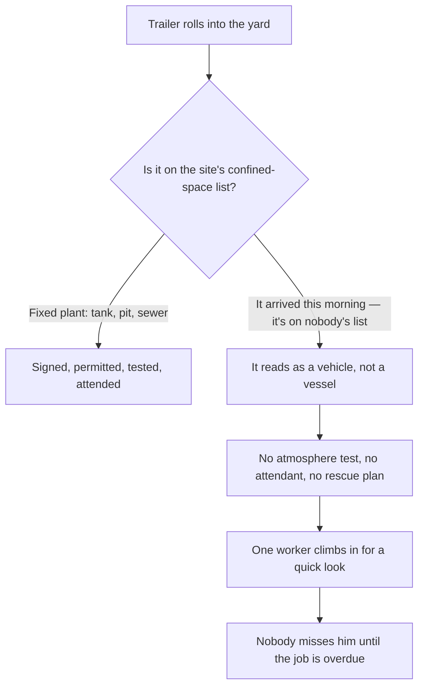

*Image: Jason Mitrione on Unsplash.*

Just before one o'clock on the afternoon of 7 January 2026, workers at a truck-parts and service yard on Interstate 37 in Corpus Christi, Texas realized they hadn't seen one of their colleagues for a while. A 63-year-old technician had been inspecting a tanker trailer parked in the yard. When the Corpus Christi Fire Department's hazmat and rescue crews arrived, they found him unresponsive inside the tank. They extracted him through the opening he'd entered. He was pronounced dead at the scene.

The fire department's statement afterward contains one sentence that should stop every crew lead cold. According to the department's spokesperson, "the employee had been unaccounted for for more than 20 minutes."

Twenty minutes. In an oxygen-deficient atmosphere, a person loses consciousness in seconds and is beyond saving in four to six minutes. Twenty minutes unaccounted for isn't a rescue window. It's the time it takes to notice someone is gone.

And here's the detail that makes this a post for everyone, not just refinery crews: this wasn't a refinery. It wasn't a chemical plant. It was a parts-and-service yard belonging to FleetPride, a national distributor of heavy-duty truck and trailer parts — the kind of workplace where the most dangerous thing on site, most days, is a forklift.

Six months later, on 15 July 2026, OSHA — the US workplace safety regulator — announced its findings and cited FleetPride for 19 violations, 16 of them classed as serious, with $264,380 in proposed penalties. Near the top of the list: the company had no confined space program at all.

This is a longer look at that citation, and at the whole class of hazard behind it. Because the tank that killed this technician wasn't part of the facility. It drove there. A refinery has a confined-space inventory: every tower, pit, and sewer mapped, signed, and gated behind a permit desk. A tanker trailer is a confined space that arrives at your gate at highway speed, sits in the yard looking like a vehicle, and leaves before anyone thinks to put it on a list.

## What Happened in the Yard

The facts here come from OSHA's news release of 15 July 2026 (release number 26-875-DAL) and from local reporting on the day of the incident.

The technician was working at the FleetPride service center in the Annaville area of Corpus Christi, on the 7700 block of Interstate 37. His job that day involved inspecting a tanker trailer — the long cylindrical tank you've driven past on the highway a thousand times, built to haul fuel, chemicals, or food-grade liquids. Inspecting one properly means looking inside, and looking inside often turns into climbing inside, through a manway on top that's roughly the width of your shoulders.

At some point he entered the tank. Nobody was watching him do it. That's not an assumption — it follows from what happened next: he was missing for over twenty minutes before anyone raised an alarm, which means there was no attendant at the manway, no entry log, nobody whose only job was to keep eyes on him. His colleagues noticed his absence, searched, and called the fire department. Hazmat crews in breathing apparatus made the recovery.

The cause of death, per OSHA's release: asphyxiation.

The release doesn't say what the atmosphere inside that tank was — what the trailer had last carried, whether it had been cleaned, whether it was sealed long enough for rust to do its quiet work. In a sense, it doesn't need to. Every one of those possibilities is invisible from the manway. That's the entire point of atmospheric testing: the gases that kill people in tanks — oxygen deficiency, hydrocarbon vapor, carbon monoxide, hydrogen sulfide — have no color at the concentrations that matter, and most have no reliable smell. You cannot look into a tank and see whether it will let you back out.

## Nineteen Violations Later

OSHA opened its inspection the day of the fatality and spent six months on it. The citation list it produced in July reads like an inverted textbook — a complete confined-space management system, described by its absence. In the release's own words, the violations "include failure to implement a confined space program, lacking elements for its respiratory protection program, and exposing workers to electrical hazards."

Let's unpack what "failure to implement a confined space program" means in practice, because the phrase is bureaucratic and the reality is not.

OSHA's confined-space rule for general industry, 29 CFR 1910.146, starts with a duty that comes before any permit, any gas monitor, any rescue plan: the employer must **evaluate the workplace** and determine whether it contains permit-required confined spaces. A confined space is anything big enough to enter, with limited ways in and out, not designed for people to occupy continuously. It becomes *permit-required* when it can have a hazardous atmosphere or another serious hazard inside. A tanker trailer ticks every box: one narrow manway, a steel shell nobody is meant to live in, and an interior atmosphere that depends entirely on what the tank held last and how long it's been closed.

If the evaluation never happens, nothing downstream of it exists. No signs saying "permit required." No written entry procedure. No gas testing before entry. No attendant. No rescue arrangement beyond calling 911 — and the fire department, however good, is a recovery service once you're twenty minutes behind. A confined space program isn't paperwork layered on top of the job. It's the mechanism by which anyone in the building knows the job is dangerous at all.

The respiratory protection findings point the same direction. A program with "lacking elements" typically means respirators exist on site but the system around them — fit testing, medical evaluations, training on when a filter mask helps and when it's a false comfort — is incomplete. That last point kills people in tanks specifically: a cartridge respirator filters contaminants out of the air, but it cannot add oxygen to air that doesn't have enough. In an oxygen-deficient tank, a filter mask is a talisman.

FleetPride, for its part, had 15 business days to pay, negotiate, or contest the citations before the independent review commission, and the case may still be adjusted or settled. The penalty may change. The sequence of events in the yard will not.

## A Confined Space Is Not a Place — It's a Set of Conditions

Here's the mental model failure this incident exposes, and it goes far beyond one company.

Confined-space systems, as actually practiced, are built around *places*. The plant surveys its site, lists its permit spaces, bolts signs next to the manways, and routes every entry through a permit desk. This works because the spaces hold still. The digester that was a permit space yesterday is a permit space today. On a refinery turnaround, the system is physically embedded in the geography of the site — our BA crews (breathing apparatus — supplied air for entries where the atmosphere can't be trusted) work inside that geography every shift, and the permit office knows which vessel every crew is in at any moment.

Now put a tanker trailer in that picture. It arrives in the morning. It's a *vehicle* — it has a license plate, not an equipment tag. It belongs to a customer, not to the site. It parks in the yard between other trucks, and it looks exactly like the rest of the fleet: a thing you work *on*, with wrenches — not a thing you go *inside*. Nothing about it triggers the plant's confined-space machinery, because the machinery was built around a list, and the trailer isn't on it.

The standard saw this coming. The evaluation duty in 1910.146 isn't a one-time survey of fixed equipment; it applies to the workplace as work actually arrives at it. A shop that routinely receives tank trailers for inspection or repair receives, routinely, a stream of unlabeled confined spaces of unknown recent history. The evaluation has to happen per tank, every time — because the hazard resets with every new arrival.

Walk through the trap as a flow:

The same blindness shows up in other shapes, and we've written about several of them. A crawl space under a school that [nobody named as a confined space](/en/blog/converse-crawl-space-excavator-osha) because it was "just under the building". A buried gasoline tank a Florida crew [entered without a permit](/en/blog/pce-lake-worth-buried-tank-benzene) because it was a demolition job, not a "process" job. A pit under an autoclave that [filled silently with argon](/en/blog/argon-pit-asphyxiation-bacchus-csb) because it was a floor feature, not a vessel. The pattern in every one: the space didn't look like the picture on the training card, so the system never engaged.

*Image: ALE SAT on Unsplash.*

## The Same Tank, Year After Year

If the Corpus Christi fatality were a freak event, it would still be worth writing about. It is not a freak event. Tank trailers and railcars kill workers with grim regularity, and the case files repeat each other almost word for word.

In November 2019, two workers at a tank-cleaning operation in the Houston area died inside a tanker truck they were cleaning — overcome by fumes. OSHA investigated, cited the company in 2020, and required reforms to its confined-space and respiratory programs. In December 2023, at a facility of the same company group in La Porte, Texas, another worker was found unresponsive at the end of his shift and died; the follow-up inspection found atmospheric testing not done before entry, no attendant posted, incomplete entry permits, and worker overexposure to carbon monoxide. In July 2024 OSHA proposed $810,703 in penalties, and its area director said the quiet part in one sentence: "Had Quala Services acted responsibly and made the safety reforms as required in 2020, another employee would not have lost their life."

In 2020, OSHA cited Trinity Rail Maintenance Services after two employees died in a railcar that had carried natural gasoline: the first entered and collapsed; the second was overcome trying to rescue him. That second death is its own well-documented epidemic — NIOSH, the US occupational safety research institute, has estimated for decades that around 60% of confined-space victims are would-be rescuers. The instinct to go in after your friend is the single most reliable multiplier of these fatalities.

Go back further and the file gets deeper. In March 2000, a long-haul driver climbed into his 7,000-gallon tanker trailer to clean it and was asphyxiated by the vapors of the pine-derived solvent it had carried. The US Chemical Safety Board's safety bulletin on nitrogen asphyxiation counted 85 incidents between 1992 and 2002 — 80 deaths — a striking share of them in or around equipment that was "empty" or inerted. And the government's own statistics agency, the BLS, counted 1,030 US workers killed in confined-space incidents from 2011 through 2018, about 129 a year; 126 of those deaths were from inhaling a harmful substance.

About 129 a year, for decades, with the mechanism fully understood the entire time. The physics of a dead atmosphere in a steel shell has not changed since your grandfather's generation. What keeps failing is the *recognition* step — the moment where someone looks at an object and correctly categorizes it as a thing that can kill.

## What the Training Card Misses

Confined-space training is genuinely good at what it covers. If you've sat through a proper course — and every tech on an SCC/VCA-certified crew has, with annual refreshers — you know the list: test the atmosphere top, middle, bottom; ventilate; post an attendant; agree the rescue plan before entry, not during. The card works.

But the card carries three silent assumptions, and the Corpus Christi yard broke all of them.

**Assumption one: someone upstream has already identified the space.** Training teaches you how to enter a permit space safely. It spends far less time on the upstream question — *is this a permit space?* — because in a plant, that decision was made years ago by whoever wrote the inventory. Take the same trained worker out of the plant and stand him in a truck yard next to a customer's trailer, and the inventory isn't there to think for him. The recognition has to happen in his own head, at the manway, against the pull of a schedule.

**Assumption two: an empty tank is a neutral tank.** The most counterintuitive fact in all of confined-space work is that a clean, empty, sealed steel tank can kill you with nothing in it but rust. Oxidation consumes oxygen; a closed tank gives it nothing back. The atmosphere drifts down from 20.9% oxygen toward levels that switch your lights off without a single molecule of "chemical" present. Add the more obvious cases — residue of the last cargo evaporating for days, a nitrogen purge someone did at the previous stop and told no one about — and the rule becomes absolute: the tank's recent history *is* the hazard, and a trailer that arrived this morning has a history you do not know.

**Assumption three: someone will notice quickly.** In a permitted entry, the attendant's entire function is to make the alarm instantaneous. Without one, detection time defaults to however long it takes for someone to wonder where you are — and in a working yard, that's measured in tens of minutes. We saw the fatal version of this at Woodland Pulp, where [nobody knew two engineers were inside](/en/blog/woodland-pulp-h2s-acid-sewer-csb) a sewer trench until far too late. Twenty minutes unaccounted for, against a four-to-six-minute survival window, means the outcome was decided a quarter of an hour before anyone started looking.

There's a fourth thing the card can't teach, because it's organizational, not technical: **in a mixed workplace, the confined-space program is only as good as the least "industrial" corner of the site.** FleetPride's yard had electrical hazards and respirator gaps in the same citation list — this was not a place with a strong safety system that missed one trailer. But even sites with excellent systems have their truck yard, their loading rack, their corner where equipment from outside arrives and the plant's rules feel like they apply less. That corner is where the next one of these happens.

## The Lesson for Crew Leads and Young Techs

Built from OSHA's citation list, and from the pattern across every case above:

1. **If you can get your shoulders through the opening, it's a candidate confined space — no matter what it's bolted to.** Trailer, railcar, vacuum truck, skid tank, mixer drum on a truck chassis. Wheels don't change the atmosphere inside. The recognition question isn't "is this on the list?" It's "can this hold an atmosphere that isn't the one I'm breathing now?"

2. **Treat every arriving tank as unknown, because it is.** A trailer's last cargo, cleaning status, and purge history live in someone else's paperwork, at someone else's site. Until a calibrated gas monitor — tested at the top, middle, and bottom of the tank, because different gases layer at different heights — says otherwise, the atmosphere inside a newly arrived tank is unverified. "It hauled water" and "it's been open" are hypotheses, not readings.

3. **No attendant, no entry. Ever.** The single cheapest control in the whole system is a person standing at the manway doing nothing but watching. They turn a twenty-minute detection gap into a five-second one, and they are the only thing standing between one fatality and the rescuer fatality that follows it. If the job can't spare a second person, the job can't be done yet.

4. **A filter mask does not make air.** Cartridge respirators remove contaminants; they cannot fix oxygen deficiency, and most tank atmospheres that kill are oxygen-deficient, contaminated, or both. Inside an unverified tank, the only respiratory protection that counts is supplied air — and if the job needs supplied air, it needs everything else the permit system wraps around supplied air.

5. **If your yard receives tanks, your site has a confined-space program requirement — even if your business card says "parts distributor."** The evaluation duty in 1910.146 follows the work, not the industry code. A shop that inspects, repairs, or cleans tank trailers is in the confined-space business whether it knows it or not. The program can be simple. It cannot be absent.

6. **Say the count out loud.** About 129 confined-space deaths a year in the US alone, 60% of rescuers among the victims in the classic studies, the same citation lists recycled from 2019 to 2023 to 2026. Nobody at that yard in January was reckless by the standards of the place they worked. The place's standards were the hazard.

A tanker trailer is the most familiar industrial object in the world. You've driven past ten thousand of them. That familiarity is precisely the mechanism of the trap: nothing you've seen ten thousand times reads as lethal. The technician in Corpus Christi had sixty-three years of seeing tanker trailers be harmless.

The inside of a closed steel tank has never been harmless. It just keeps that fact to itself until someone climbs in to check.

## Credit and Further Reading

- OSHA news release, 15 July 2026 — *US Department of Labor cites big rig parts distributer for confined space, safety hazards after worker fatality at company's Corpus Christi facility* (release 26-875-DAL): [https://www.osha.gov/news/newsreleases/dallas/20260715](https://www.osha.gov/news/newsreleases/dallas/20260715)
- Local reporting on the day of the incident, KRIS 6 News Corpus Christi: [63-year-old employee found dead inside tanker trailer in Annaville](https://www.kristv.com/news/local-news/in-your-neighborhood/corpus-christi/63-year-old-man-found-dead-inside-tanker-trailer-in-annaville)
- OSHA, 29 CFR 1910.146 — *Permit-required confined spaces*: [https://www.osha.gov/laws-regs/regulations/standardnumber/1910/1910.146](https://www.osha.gov/laws-regs/regulations/standardnumber/1910/1910.146)
- US Department of Labor, July 2024 — the Quala Services repeat citation after the La Porte fatality: [https://www.dol.gov/newsroom/releases/osha/osha20240708](https://www.dol.gov/newsroom/releases/osha/osha20240708)
- CSB Safety Bulletin No. 2003-10-B, *Hazards of Nitrogen Asphyxiation*: [https://www.csb.gov/hazards-of-nitrogen-asphyxiation/](https://www.csb.gov/hazards-of-nitrogen-asphyxiation/)
- From our own archive: the confined spaces that didn't look like confined spaces — [the Converse crawl space](/en/blog/converse-crawl-space-excavator-osha), [the PCE Lake Worth buried tank](/en/blog/pce-lake-worth-buried-tank-benzene), and [the argon-flooded pit at Bacchus](/en/blog/argon-pit-asphyxiation-bacchus-csb).
