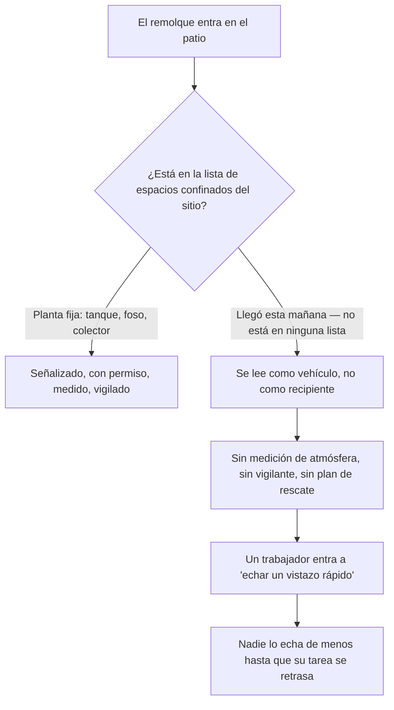

*Imagen: Jason Mitrione en Unsplash.*

Poco antes de la una de la tarde del 7 de enero de 2026, los trabajadores de un patio de repuestos y servicio de camiones en la Interstate 37, en Corpus Christi, Texas, se dieron cuenta de que llevaban un rato sin ver a uno de sus compañeros. Un técnico de 63 años había estado inspeccionando una cisterna de remolque aparcada en el patio. Cuando llegaron los equipos hazmat y de rescate del cuerpo de bomberos de Corpus Christi, lo encontraron inconsciente dentro del tanque. Lo extrajeron por la abertura por la que había entrado. Fue declarado muerto en el lugar.

La declaración del cuerpo de bomberos después contiene una frase que debería helar a cualquier jefe de cuadrilla. Según el portavoz del departamento, "el empleado llevaba más de 20 minutos sin que nadie supiera dónde estaba".

Veinte minutos. En una atmósfera deficiente en oxígeno, una persona pierde el conocimiento en segundos y está más allá de todo rescate en cuatro a seis minutos. Veinte minutos sin localizar no son una ventana de rescate. Son el tiempo que tarda alguien en notar que no estás.

Y aquí está el detalle que convierte esto en un texto para todos, no solo para cuadrillas de refinería: esto no era una refinería. No era una planta química. Era un patio de servicio de FleetPride, un distribuidor nacional de repuestos para camiones pesados y remolques — el tipo de lugar de trabajo donde lo más peligroso, la mayoría de los días, es una carretilla elevadora.

Seis meses después, el 15 de julio de 2026, OSHA — el regulador estadounidense de seguridad laboral — anunció sus conclusiones y citó a FleetPride por 19 violaciones, 16 de ellas clasificadas como graves, con 264.380 dólares en multas propuestas. En lo alto de la lista: la empresa no tenía ningún programa de espacios confinados.

Esta es una lectura larga de esa citación y de toda la clase de peligro que hay detrás. Porque el tanque que mató a este técnico no formaba parte de la instalación. Llegó conduciendo. Una refinería tiene un inventario de espacios confinados: cada torre, foso y colector, cartografiado, señalizado y cerrado tras una mesa de permisos. Una cisterna de remolque es un espacio confinado que llega a tu puerta a velocidad de autopista, se queda en el patio con aspecto de vehículo y se marcha antes de que a nadie se le ocurra apuntarla en una lista.

## Qué pasó en el patio

Los hechos proceden del comunicado de OSHA del 15 de julio de 2026 (número 26-875-DAL) y de la prensa local del día del suceso.

El técnico trabajaba en el centro de servicio de FleetPride en la zona de Annaville de Corpus Christi, en el bloque 7700 de la Interstate 37. Su trabajo ese día incluía inspeccionar una cisterna de remolque — ese largo tanque cilíndrico junto al que has pasado mil veces en la autopista, construido para transportar combustible, químicos o líquidos alimentarios. Inspeccionarla bien significa mirar dentro, y mirar dentro a menudo se convierte en meterse dentro, por una boca de hombre en la parte superior que tiene más o menos la anchura de tus hombros.

En algún momento entró en el tanque. Nadie lo estaba vigilando. Eso no es una suposición — se deduce de lo que pasó después: estuvo desaparecido más de veinte minutos antes de que alguien diera la alarma, lo que significa que no había vigilante en la boca de hombre, ni registro de entrada, ni nadie cuyo único trabajo fuera no quitarle los ojos de encima. Sus compañeros notaron su ausencia, lo buscaron y llamaron a los bomberos. Los equipos hazmat con equipos de respiración hicieron la recuperación.

La causa de la muerte, según el comunicado de OSHA: asfixia.

El comunicado no dice cuál era la atmósfera dentro de ese tanque — qué había transportado el remolque por última vez, si había sido limpiado, si llevaba cerrado el tiempo suficiente para que el óxido hiciera su trabajo silencioso. En cierto sentido, no hace falta. Cada una de esas posibilidades es invisible desde la boca de hombre. Ese es exactamente el sentido de medir la atmósfera: los gases que matan a la gente en los tanques — deficiencia de oxígeno, vapores de hidrocarburos, monóxido de carbono, sulfuro de hidrógeno — no tienen color en las concentraciones que importan, y la mayoría no tiene olor fiable. No puedes mirar dentro de un tanque y ver si te dejará salir.

## Diecinueve violaciones después

OSHA abrió su inspección el día de la muerte y le dedicó seis meses. La lista de citaciones que produjo en julio se lee como un manual invertido — un sistema completo de gestión de espacios confinados, descrito por su ausencia. En palabras del propio comunicado, las violaciones "incluyen no implementar un programa de espacios confinados, carecer de elementos en su programa de protección respiratoria y exponer a los trabajadores a peligros eléctricos".

Desempaquemos qué significa en la práctica "no implementar un programa de espacios confinados", porque la frase es burocrática y la realidad no lo es.

La norma de espacios confinados de OSHA para la industria general, 29 CFR 1910.146, empieza con un deber que viene antes de cualquier permiso, cualquier medidor de gases, cualquier plan de rescate: el empleador debe **evaluar el lugar de trabajo** y determinar si contiene espacios confinados que requieren permiso. Un espacio confinado es cualquier cosa lo bastante grande para entrar, con vías de entrada y salida limitadas, no diseñada para que la gente la ocupe de forma continua. Se convierte en espacio *que requiere permiso* cuando puede albergar una atmósfera peligrosa u otro peligro serio. Una cisterna de remolque cumple todas las casillas: una boca de hombre estrecha, un casco de acero en el que nadie está previsto que viva, y una atmósfera interior que depende por completo de lo que el tanque contuvo por última vez y de cuánto tiempo ha estado cerrado.

Si la evaluación nunca ocurre, nada de lo que viene después existe. Ni carteles de "se requiere permiso". Ni procedimiento escrito de entrada. Ni medición de gases antes de entrar. Ni vigilante. Ni más plan de rescate que llamar al 911 — y los bomberos, por buenos que sean, son un servicio de recuperación cuando llevas veinte minutos de retraso. Un programa de espacios confinados no es papeleo encima del trabajo. Es el mecanismo por el cual alguien en el edificio sabe siquiera que el trabajo es peligroso.

Los hallazgos sobre protección respiratoria apuntan en la misma dirección. Un programa con "elementos que faltan" suele significar que hay respiradores en el sitio, pero el sistema a su alrededor — pruebas de ajuste, evaluaciones médicas, formación sobre cuándo una máscara de filtro ayuda y cuándo es un falso consuelo — está incompleto. Ese último punto mata gente precisamente en los tanques: un respirador de cartucho filtra contaminantes del aire, pero no puede añadir oxígeno a un aire que no lo tiene. En un tanque deficiente en oxígeno, una máscara de filtro es un talismán.

FleetPride, por su parte, tenía 15 días hábiles para pagar, negociar o impugnar las citaciones ante la comisión revisora independiente, y el caso aún puede ajustarse o llegar a un acuerdo. La multa puede cambiar. La secuencia de los hechos en el patio, no.

## Un espacio confinado no es un lugar — es un conjunto de condiciones

Aquí está el fallo de modelo mental que este suceso deja al descubierto, y va mucho más allá de una empresa.

Los sistemas de espacios confinados, tal como se practican, están construidos alrededor de *lugares*. La planta inspecciona su sitio, lista sus espacios con permiso, atornilla carteles junto a las bocas de hombre y hace pasar cada entrada por una mesa de permisos. Funciona porque los espacios se quedan quietos. El digestor que ayer era un espacio con permiso lo sigue siendo hoy. En una parada de refinería, el sistema está físicamente incrustado en la geografía del sitio — nuestras cuadrillas de BA (breathing apparatus — aire suministrado para entradas donde no se puede confiar en la atmósfera) trabajan dentro de esa geografía cada turno, y la oficina de permisos sabe en todo momento en qué recipiente está cada cuadrilla.

Ahora pon una cisterna de remolque en esa imagen. Llega por la mañana. Es un *vehículo* — tiene matrícula, no etiqueta de equipo. Pertenece a un cliente, no al sitio. Aparca en el patio entre otros camiones y se ve exactamente igual que el resto de la flota: una cosa sobre la que se trabaja *por fuera*, con llaves — no una cosa en la que se entra *por dentro*. Nada en ella activa la maquinaria de espacios confinados de la planta, porque la maquinaria se construyó alrededor de una lista, y el remolque no está en ella.

La norma vio venir esto. El deber de evaluación de la 1910.146 no es un estudio único de los equipos fijos; se aplica al lugar de trabajo tal como el trabajo llega realmente a él. Un taller que recibe rutinariamente cisternas para inspección o reparación recibe, rutinariamente, un flujo de espacios confinados sin etiquetar y con historia reciente desconocida. La evaluación tiene que ocurrir por tanque, cada vez — porque el peligro se reinicia con cada nueva llegada.

Recorre la trampa como un flujo:

La misma ceguera aparece con otras formas, y hemos escrito sobre varias. Un crawl space bajo una escuela que [nadie nombró como espacio confinado](/es/blog/converse-crawl-space-excavator-osha) porque estaba "simplemente debajo del edificio". Un tanque de gasolina enterrado en el que una cuadrilla de Florida [entró sin permiso](/es/blog/pce-lake-worth-buried-tank-benzene) porque era un trabajo de demolición, no un trabajo "de proceso". Un foso bajo un autoclave que [se llenó silenciosamente de argón](/es/blog/argon-pit-asphyxiation-bacchus-csb) porque era un elemento del suelo, no un recipiente. El patrón en todos los casos: el espacio no se parecía a la imagen de la tarjeta de formación, así que el sistema nunca se activó.

*Imagen: ALE SAT en Unsplash.*

## El mismo tanque, año tras año

Si la muerte de Corpus Christi fuera un suceso aislado, aun así merecería este texto. No es un suceso aislado. Las cisternas de remolque y los vagones cisterna matan trabajadores con una regularidad sombría, y los expedientes se repiten casi palabra por palabra.

En noviembre de 2019, dos trabajadores de una empresa de limpieza de cisternas de la zona de Houston murieron dentro de un camión cisterna que estaban limpiando — vencidos por los vapores. OSHA investigó, citó a la empresa en 2020 y exigió reformas en sus programas de espacios confinados y protección respiratoria. En diciembre de 2023, en una instalación del mismo grupo empresarial en La Porte, Texas, otro trabajador fue hallado inconsciente al final de su turno y murió; la inspección posterior encontró mediciones de atmósfera no realizadas antes de la entrada, ningún vigilante apostado, permisos de entrada incompletos y sobreexposición del trabajador a monóxido de carbono. En julio de 2024 OSHA propuso 810.703 dólares en multas, y su directora de área dijo la parte silenciosa en una frase: "Si Quala Services hubiera actuado con responsabilidad y hecho las reformas de seguridad exigidas en 2020, otro empleado no habría perdido la vida."

En 2020, OSHA citó a Trinity Rail Maintenance Services después de que dos empleados murieran en un vagón cisterna que había transportado gasolina natural: el primero entró y se desplomó; el segundo fue vencido intentando rescatarlo. Esa segunda muerte es su propia epidemia bien documentada — NIOSH, el instituto estadounidense de investigación en seguridad laboral, estima desde hace décadas que alrededor del 60% de las víctimas de espacios confinados son personas que intentaban rescatar. El instinto de entrar a por tu amigo es el multiplicador más fiable de estas muertes.

Retrocede más y el expediente se hace más profundo. En marzo de 2000, un conductor de larga distancia se metió en su cisterna de 7.000 galones para limpiarla y murió asfixiado por los vapores del disolvente de pino que había transportado. El boletín de seguridad de la CSB (la Junta estadounidense de Seguridad Química) sobre asfixia por nitrógeno contó 85 incidentes entre 1992 y 2002 — 80 muertes — una parte llamativa de ellos en o alrededor de equipos que estaban "vacíos" o inertizados. Y la propia agencia estadística del gobierno, la BLS, contó 1.030 trabajadores estadounidenses muertos en sucesos de espacios confinados de 2011 a 2018, unos 129 al año; 126 de esas muertes fueron por inhalar una sustancia dañina.

Unos 129 al año, durante décadas, con el mecanismo plenamente comprendido todo el tiempo. La física de una atmósfera muerta dentro de un casco de acero no ha cambiado desde la generación de tu abuelo. Lo que sigue fallando es el paso del *reconocimiento* — el momento en que alguien mira un objeto y lo clasifica correctamente como una cosa que puede matar.

## Lo que la tarjeta de formación no cubre

La formación en espacios confinados es genuinamente buena en lo que cubre. Si has pasado por un curso serio — y todo técnico de una cuadrilla certificada SCC/VCA lo ha hecho, con refrescos anuales — conoces la lista: mide la atmósfera arriba, en medio y abajo; ventila; aposta un vigilante; acuerda el plan de rescate antes de la entrada, no durante. La tarjeta funciona.

Pero la tarjeta lleva tres suposiciones silenciosas, y el patio de Corpus Christi rompió las tres.

**Suposición uno: alguien aguas arriba ya ha identificado el espacio.** La formación te enseña a entrar con seguridad en un espacio con permiso. Dedica mucho menos tiempo a la pregunta aguas arriba — *¿esto es un espacio con permiso?* — porque en una planta esa decisión la tomó hace años quien escribió el inventario. Saca al mismo trabajador formado de la planta y ponlo en un patio de camiones junto al remolque de un cliente, y el inventario no está ahí para pensar por él. El reconocimiento tiene que ocurrir en su propia cabeza, en la boca de hombre, contra la presión del calendario.

**Suposición dos: un tanque vacío es un tanque neutro.** El hecho más contraintuitivo de todo el trabajo en espacios confinados es que un tanque de acero limpio, vacío y sellado puede matarte sin nada dentro salvo óxido. La oxidación consume oxígeno; un tanque cerrado no le devuelve nada. La atmósfera se desliza desde el 20,9% de oxígeno hacia niveles que te apagan las luces sin una sola molécula de "químico" presente. Añade los casos más obvios — residuo de la última carga evaporándose durante días, una purga de nitrógeno que alguien hizo en la parada anterior y no contó a nadie — y la regla se vuelve absoluta: la historia reciente del tanque *es* el peligro, y un remolque que llegó esta mañana tiene una historia que no conoces.

**Suposición tres: alguien se dará cuenta rápido.** En una entrada con permiso, la función entera del vigilante es hacer la alarma instantánea. Sin él, el tiempo de detección pasa a ser lo que tarde alguien en preguntarse dónde estás — y en un patio en plena faena, eso se mide en decenas de minutos. Vimos la versión fatal de esto en Woodland Pulp, donde [nadie sabía que dos ingenieros estaban dentro](/es/blog/woodland-pulp-h2s-acid-sewer-csb) de un colector hasta que fue demasiado tarde. Veinte minutos sin localizar, contra una ventana de supervivencia de cuatro a seis minutos, significa que el desenlace quedó decidido un cuarto de hora antes de que nadie empezara a buscar.

Hay una cuarta cosa que la tarjeta no puede enseñar, porque es organizativa, no técnica: **en un lugar de trabajo mixto, el programa de espacios confinados vale lo que valga el rincón menos "industrial" del sitio.** El patio de FleetPride tenía peligros eléctricos y carencias con los respiradores en la misma lista de citaciones — no era un lugar con un sistema de seguridad fuerte al que se le escapó un remolque. Pero hasta los sitios con sistemas excelentes tienen su patio de camiones, su rack de carga, su rincón donde llega equipo de fuera y las reglas de la planta parecen aplicar menos. Ese rincón es donde ocurre el siguiente caso como este.

## La lección para jefes de cuadrilla y técnicos jóvenes

Construida a partir de la lista de citaciones de OSHA y del patrón de todos los casos anteriores:

1. **Si te caben los hombros por la abertura, es un candidato a espacio confinado — sin importar a qué esté atornillado.** Remolque, vagón cisterna, camión de vacío, tanque sobre skid, tambor de mezclador sobre chasis. Las ruedas no cambian la atmósfera de dentro. La pregunta del reconocimiento no es "¿está en la lista?". Es "¿puede esto contener una atmósfera distinta de la que respiro ahora?".

2. **Trata cada tanque que llega como desconocido, porque lo es.** La última carga de un remolque, su estado de limpieza y su historial de purgas viven en el papeleo de otro, en el sitio de otro. Hasta que un medidor de gases calibrado — probado arriba, en medio y abajo del tanque, porque los distintos gases se estratifican a distintas alturas — diga otra cosa, la atmósfera de un tanque recién llegado está sin verificar. "Transportaba agua" y "ha estado abierto" son hipótesis, no lecturas.

3. **Sin vigilante, no hay entrada. Nunca.** El control más barato de todo el sistema es una persona de pie en la boca de hombre que no hace nada más que mirar. Convierte un hueco de detección de veinte minutos en uno de cinco segundos, y es lo único que se interpone entre una muerte y la muerte del rescatador que la sigue. Si el trabajo no puede permitirse una segunda persona, el trabajo todavía no se puede hacer.

4. **Una máscara de filtro no fabrica aire.** Los respiradores de cartucho eliminan contaminantes; no pueden arreglar una deficiencia de oxígeno, y la mayoría de las atmósferas de tanque que matan son deficientes en oxígeno, están contaminadas, o ambas cosas. Dentro de un tanque sin verificar, la única protección respiratoria que cuenta es el aire suministrado — y si el trabajo necesita aire suministrado, necesita todo lo demás que el sistema de permisos envuelve alrededor del aire suministrado.

5. **Si tu patio recibe tanques, tu sitio tiene la obligación de un programa de espacios confinados — aunque tu tarjeta de visita diga "distribuidor de repuestos".** El deber de evaluación de la 1910.146 sigue al trabajo, no al código industrial. Un taller que inspecciona, repara o limpia cisternas está en el negocio de los espacios confinados, lo sepa o no. El programa puede ser sencillo. No puede estar ausente.

6. **Di la cifra en voz alta.** Unas 129 muertes al año en espacios confinados solo en EE. UU., un 60% de rescatadores entre las víctimas en los estudios clásicos, las mismas listas de citaciones recicladas de 2019 a 2023 a 2026. Nadie en ese patio en enero fue imprudente según los estándares del lugar donde trabajaba. Los estándares del lugar eran el peligro.

Una cisterna de remolque es el objeto industrial más familiar del mundo. Has pasado junto a diez mil. Esa familiaridad es exactamente el mecanismo de la trampa: nada que hayas visto diez mil veces se lee como letal. El técnico de Corpus Christi llevaba sesenta y tres años viendo cisternas inofensivas.

El interior de un tanque de acero cerrado nunca ha sido inofensivo. Simplemente se guarda ese dato hasta que alguien entra a comprobarlo.

## Créditos y lecturas adicionales

- Comunicado de OSHA, 15 de julio de 2026 — *US Department of Labor cites big rig parts distributer for confined space, safety hazards after worker fatality at company's Corpus Christi facility* (número 26-875-DAL): [https://www.osha.gov/news/newsreleases/dallas/20260715](https://www.osha.gov/news/newsreleases/dallas/20260715)
- Prensa local del día del suceso, KRIS 6 News Corpus Christi: [63-year-old employee found dead inside tanker trailer in Annaville](https://www.kristv.com/news/local-news/in-your-neighborhood/corpus-christi/63-year-old-man-found-dead-inside-tanker-trailer-in-annaville)
- OSHA, 29 CFR 1910.146 — *Permit-required confined spaces*: [https://www.osha.gov/laws-regs/regulations/standardnumber/1910/1910.146](https://www.osha.gov/laws-regs/regulations/standardnumber/1910/1910.146)
- US Department of Labor, julio de 2024 — la citación reincidente de Quala Services tras la muerte de La Porte: [https://www.dol.gov/newsroom/releases/osha/osha20240708](https://www.dol.gov/newsroom/releases/osha/osha20240708)
- CSB Safety Bulletin No. 2003-10-B, *Hazards of Nitrogen Asphyxiation*: [https://www.csb.gov/hazards-of-nitrogen-asphyxiation/](https://www.csb.gov/hazards-of-nitrogen-asphyxiation/)
- De nuestro propio archivo: los espacios confinados que no parecían espacios confinados — [el crawl space de Converse](/es/blog/converse-crawl-space-excavator-osha), [el tanque enterrado de PCE Lake Worth](/es/blog/pce-lake-worth-buried-tank-benzene) y [el foso de argón de Bacchus](/es/blog/argon-pit-asphyxiation-bacchus-csb).
