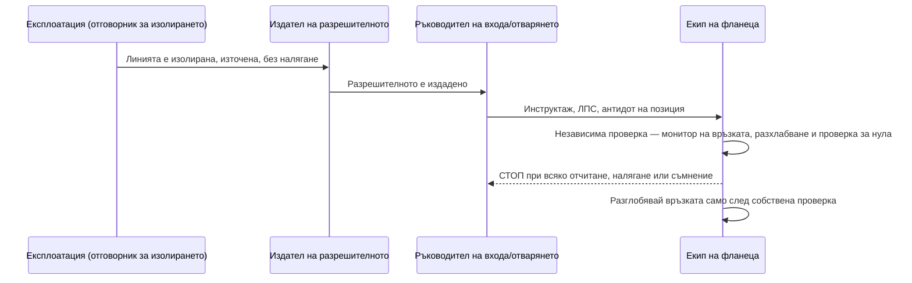

На 7 юни 2024 г. двама работници в завода на Honeywell в Geismar, Луизиана, отвориха фланцова връзка, за да сменят уплътнение. Фланецът е просто болтова връзка между два тръбни участъка; уплътнението е това, което запечатва мястото между тях. Единият от двамата работници беше от подизпълнител. Имаха разрешително. Бяха вършили тази работа и преди. Линията се предполагаше да е празна.

Не беше. Вътре беше останал по-малко от един паунд безводен флуороводород — HF. Когато фланецът се разглоби, този HF попадна върху лицето на човека от подизпълнителя. Той прекара два дни в болница с изгаряния втора степен.

По-малко от един паунд. И ето частта, която трябва да ви накара да се изправите: това беше *малкият* случай. U.S. Chemical Safety Board разследва три отделни изпускания на HF на тази една-единствена площадка в рамките на по-малко от три години.

*Снимка: PilMo Kang в Unsplash.*

Окончателният доклад на CSB за инцидентите с флуороводород в Honeywell Geismar излезе на 27 май 2025 г. и разглежда и трите. Основната констатация е от онези изречения, които би трябвало да смразят всеки планировчик на ремонти. Всяко от тези изпускания, заключава Съветът, е могло да бъде предотвратено — със системи, които компанията вече е имала на хартия. Председателят на CSB Steve Owens го каза направо: „Тези три сериозни инцидента не само че бяха напълно неприемливи — нашето разследване установи, че те бяха и изцяло предотвратими."

Тази публикация е за хората, които реално отварят HF линии. Ремонтните екипи. Специалистите с дихателни апарати. Човекът от подизпълнителя пред люка, на когото са казали, че линията е чиста. Защото подизпълнителят в инцидента от юни 2024 г. направи всичко, което пишеше в инструктажната карта, и пак се обърка.

## Какво всъщност прави флуороводородът, за да е ясен залогът

Ако никога не сте работили на HF инсталация, отделете тридесет секунди на химията. Тя обяснява защо „малък теч" не е малък проблем.

Безводният HF кипи при около 19,5 °C (67 °F). Това е стайна температура. Затова изпускането не се събира на локва по площадката, както би направило тежко масло — то мигновено преминава в парен облак и тръгва по вятъра. Точно затова изпускането през януари 2023 г. в Geismar (повече за него по-долу) принуди съседните предприятия да се укрият на място.

Върху кожата HF не се държи като нормална киселина. Технически той е *слаба* киселина — и именно това го прави опасен. Прониква през невредима кожа, преди нервите ви да усетят особена болка. После, дълбоко в тъканта, се разпада на флуоридни йони. Тези йони се свързват с калция и магнезия, от които клетките ви имат нужда, за да функционират. Резултатът е тъкан, която умира и се разтапя отвътре навън. А при изгаряне с що-годе сериозен размер тялото може да падне толкова ниско по калций — системна хипокалциемия, — че това да спре сърцето.

Медицинската литература определя изгарянията, по-големи от около 160 cm² (25 кв. инча), като сериозен риск от системна токсичност. Болката също е коварна: при концентрации 20% и по-ниски може да не я усетите до 24 часа. Работник може да бъде опръскан, да не почувства почти нищо, да се прибере с колата и през нощта да рухне.

Антидотът е калциев глюконат — гел, който се втрива в кожата, докато болката спре, плюс венозен калций при системна експозиция. Ако вашата HF площадка не го държи подготвен непосредствено на инсталацията и в медицинския пункт, това е пропуск, точка. Нищо от това не е екзотично знание вътре в една HF инсталация. Въпросът е просто каква е цената, когато една „освободена" линия се окаже, че не е.

## Три изпускания за по-малко от три години

Ето каталога, в реда, в който го излага CSB.

**21 октомври 2021 г. — фаталното.** По време на пускане на инсталацията фланцова тръбна връзка отказа и изпусна около 39 паунда безводен HF. Оператор беше залят. Езикът на доклада е равен и сломяващ: личните му предпазни средства „не бяха достатъчни, за да предпазят нито от кожна, нито от дихателна експозиция на HF". Откаран е в болница и почина същия ден. Материалните щети възлязоха на около 14 милиона долара. Уплътнението, което отказа, беше известен проблем — и ще се върнем на това *колко* известен.

**23 януари 2023 г. — това, което съседите усетиха.** По време на друго пускане се разруши ребойлер. (Ребойлерът е топлообменник, който изпарява течността обратно в процеса.) Той изпусна над 800 паунда безводен HF заедно с над 1600 паунда хлор. Стената на апарата беше изтъняла от корозия. По щастливо стечение на времето и позицията никой не пострада — но облакът беше достатъчно сериозен, че близките предприятия да се укрият на място. Материални щети: около 4 милиона долара.

**7 юни 2024 г. — изгарянето на подизпълнителя.** Инцидентът, с който започна тази публикация. Двама работници отвориха HF тръбопровод, за да сменят уплътнения; връзката „не беше адекватно освободена от HF преди началото на работата". Изпускането беше под един паунд. Работникът от подизпълнителя получи сериозни изгаряния по лицето и два дни в болница.

Един загинал. Един тежко пострадал. Около 18 милиона долара щети. Три различни механизма на отказ — уплътнение, апарат, изолиране на линия. И едно-единствено заключение ги свързва. CSB установи, че „и трите инцидента произтичат от неефективното прилагане на съществуващите системи за управление на безопасността на Honeywell. Ако Honeywell беше следвала своите съществуващи нормални процедури, политики и практики, тя е можела и най-вероятно е щяла да предотврати всеки един от трите инцидента."

Прочетете го два пъти. Проблемът не беше, че им липсваше процедура. Проблемът беше разликата между процедурата на рафта и работата на фланеца. И точно в тази разлика живеят подизпълнителите.

## Решението от 2007 г., което подреди масата

Фаталният случай от октомври 2021 г. не започна през 2021 г. Започна през 2007 г.

Същата година Honeywell определи нова технология за уплътнения за работа с HF и направи анализ по управление на промените върху нея — формалният преглед, който се прави, преди да се смени оборудване или процедура. Инженерингът разпозна проблема с корозията. Решението съществуваше. И тогава компанията взе решение, което звучи разумно на бюджетно съвещание и е смъртоносно в хоризонт от четиринадесет години. Вместо проактивно да смени уплътненията в цялата инсталация, тя щеше да ги сменя **по изхабяване** — всяко да се сменя само когато се случи да бъде разглобено по някаква друга причина.

„По изхабяване" е тиха фраза. Ето какво означава на практика. Уплътнение, маркирано като корозионен риск, остава в експлоатация — задържайки химикал, който при стайна температура мигновено преминава в пара — докато нещо друго не ви даде повод да отворите точно този фланец. Уплътнението, което отказа през октомври 2021 г., все още беше в инсталацията четиринадесет години след като по-добрият вариант беше идентифициран. Просто никога не беше идвал *неговият ред*.

CSB също установи, че инспекторите на площадката „не използваха налични технологии", които биха уловили деградацията по-рано — включително атмосферни монитори за HF и боя-индикатор за киселина, която сменя цвета си навсякъде, където HF прокапва. Инструментите да се види проблемът съществуваха. Просто не се използваха.

*Снимка: Eric Prouzet в Unsplash.*

Това е частта, която трябва да улучи всеки, който е стоял пред люк с динамометричен ключ. Отказите на механичната цялост рядко се обявяват сами. Уплътнение, „управлявано по изхабяване", изглежда точно като уплътнение, което е наред — чак до момента, в който разглобите връзката. Екипът на линията никога не вижда анализа по управление на промените от 2007 г. Той просто наследява последиците от него.

## Инженерът, който напусна през април 2022 г.

Разрушаването на ребойлера през януари 2023 г. има различна форма. И то е случаят, върху който CSB натисна най-силно — чак до препоръка OSHA да промени федерален нормативен акт.

Лошото състояние на ребойлера беше известно. Инвестиционен проект за подмяната му беше одобрен. Но проектът остана нефинансиран и никога не беше изпълнен — а причината е почти делнична. CSB установи, че само един служител на площадката в Geismar е имал реални работни познания за състоянието на ребойлера. Когато този инженер напусна компанията през април 2022 г., Honeywell така и не пренасочи инвестиционния проект към някой друг. Знанието излезе през вратата. Проектът тихо умря. И девет месеца по-късно апаратът поддаде, с 800 паунда HF и 1600 паунда хлор зад себе си.

Honeywell имаше система точно за това. Нарича се управление на организационните промени. Идеята е проста: когато човек напусне или дадена роля се преструктурира, питате *какво знаеше той, което следващият трябва да знае, и какво държеше, което сега няма собственик?* Системата съществуваше. Просто не беше приложена към напускането.

CSB счете това за достатъчно важно, за да препоръча OSHA да измени стандарта си Process Safety Management — така че да изисква прегледи на организационните промени, засягащи безопасността на процесите. Не само промени в оборудването и химията, а промени в *хората и ролите*. Това е забележително нещо за доклад, близък до рафинерийния свят, защото всеки планов ремонт е организационна промяна в миниатюра. Хора се сменят. Знание, живяло в главата на един оператор, се предава на екип от подизпълнители, пристигнал миналата седмица. Ребойлерът в Geismar е това, което се получава, когато това предаване не се случи и пропускът трае месеци вместо една смяна.

## „Линията беше празна" — инцидентът от юни 2024 г. отблизо

Сега обратно към подизпълнителя. Неговият инцидент е този, по който ръководителят на екипа може да направи най-много.

Минете го от неговата страна на фланеца. Има разрешително. На хартия линията е изолирана и източена. Сменя уплътнение — рутинна поддръжка, най-обикновената задача на една HF инсталация, от онези работи, които пълнят списъка със задачи по планов ремонт. Разглобява връзката, без да очаква нищо, защото нищо е това, което разрешителното е обещало. А връзката „не беше адекватно освободена от HF" — така че остатъчно количество, по-малко от паунд, пръсва лицето му.

Инструктажната карта покрива видимите опасности. Казва ви, че HF е опасен, казва ви ЛПС, казва ви антидота. Това, което картата не покрива, е разликата между две твърдения. Едното е „линията е изолирана и източена" — отметка в квадратче. Другото е „аз лично проверих, че точно тази връзка е празна и без налягане" — физически факт. Това не са едно и също твърдение. Първото е състояние, което някой нагоре по веригата е декларирал. Второто е нещо, което потвърждавате на самото желязо, със собствен монитор, преди да паднат последните болтове.

Остатъчен HF в източена линия не е рядко явление. Ниските точки задържат течност. Мъртвите участъци — участъци тръба, през които няма протичане — съдържат количества, до които масовото източване никога не стига. Линията може да се чете като „източена" на пулта на експлоатацията и пак да има джоб с HF, чакащ точно на фланеца, който се готвите да отворите. Стандартната процедура за отваряне на тръбопроводи с токсична среда съществува точно по тази причина: „източихме я" не е доказателство, че *тази връзка* е чиста.

Честният извод тук не е „подизпълнителят сгреши". Според това, което документира докладът, той е следвал разрешителното. Изводът е, че отварянето на HF линия е работа, при която човекът, който разглобява връзката, трябва да бъде оправомощен — и от него да се очаква — да провери изолирането самостоятелно и да спре, ако тази проверка липсва. Това е въпрос на култура и на система за разрешителни повече, отколкото на отделен човек.

Диаграмата не е хитра. Тя е нарочно скучна — защото отказът през юни 2024 г. беше загубата на точно тази една стъпка на проверка, собствената проверка на екипа между „разрешителното казва чисто" и „свалям болтовете". При HF тази стъпка не е бюрокрация. Тя е разликата между рутинна смяна на уплътнение и два дни в отделение за изгаряния.

## Какво означава това за екипите на HF алкилиране

Справедливо възражение: Geismar е завод за флуорохимикали, който произвежда хладилен агент, а не рафинерия. Вярно. Но HF си е HF и опасността се пренася директно там, където работят много от нашите читатели — на инсталацията за HF **алкилиране**.

Към края на 2024 г. около 42 рафинерии в САЩ са експлоатирали HF алкилиране — около една трета от действащия парк. В една HF алкилационна инсталация флуороводородната киселина е *катализаторът*: тя движи реакцията, която превръща леките олефини във високооктанов компонент за смесване. И тъй като е катализатор, тя не се изразходва — циркулира, в голямо количество, безсрочно. Документираният период с най-голям потенциал за експозиция не е нормалната работа. Той е **поддръжката на оборудването**. Тоест: плановите ремонти. Тоест: екипите на подизпълнителите.

Това е цялата причина доклад за завод за хладилни агенти в Луизиана да има място в блога на един подизпълнител. Всеки от трите механизма на отказ в Geismar има свой близнак в плановия ремонт:

- **Уплътнението по изхабяване** е позицията, която все се отлага за „следващия ремонт". Корозията е известна, по-добрата спецификация съществува, а подмяната все губи от бюджета — докато връзката, за чието отваряне ви плащат, не се окаже точно тази, която е била просрочена.
- **Ребойлерът без собственик** е знанието, което напуска площадката между плановите ремонти — дългогодишният оператор, който излиза в пенсия, технологът, който се премества, отнасяйки неписаната история за това кой апарат е изтънял и коя линия задържа течност.
- **Линията, която не беше празна** е най-обикновената задача на инсталацията, смяната на уплътнение, върху система, в която „източено" нагоре по веригата и „празно на тази връзка" не са един и същ факт.

Нашият екип тренира работа с дихателни апарати и отваряне на тръбопроводи с токсична среда точно по този сценарий — случаят с остатъчното количество, когато пултът казва чисто, а фланецът не е съгласен. Опреснителните учения по SCC/VCA покриват последователността за отваряне на HF и H2S линии всяка година. Но докладът за Geismar е полезна корекция за всеки, който смята, че обучението само по себе си затваря пропуска. Отказите там не бяха провали на обучението. Те бяха пропуските между система на хартия и работата на желязото — отложено уплътнение, проект без собственик, стъпка за проверка, която беше прескочена, защото разрешителното вече казваше, че линията е чиста.

Обучението казва на един екип коя е правилната стъпка. То не гарантира, че стъпката ще се случи във вторник, когато линията „очевидно е източена", а графикът е стегнат. Затварянето на този последен пропуск е работа на ръководителя на екипа и на системата за разрешителни.

## Въпроси, които ръководителят на екипа трябва да зададе преди следващата HF работа

Превърнете доклада в предварителен чеклист. Нито един от тези въпроси не е екзотичен. И трите инцидента в Geismar биха били засегнати от поне един.

1. **Кой отговаря за изолирането и аз лично проверих ли тази връзка?** Не „източена ли е линията", а „*този фланец* празен ли е и на нулево налягане, потвърдено с монитор на връзката". Приемайте разрешителното като началото на проверката, не като нейния край.
2. **Има ли гел с калциев глюконат подготвен на инсталацията и знае ли дежурният екип протокола за изгаряния — включително че болката може да е отложена?** Антидот в шкаф от другата страна на завода не е подготвен.
3. **Какво беше отложено от миналия планов ремонт по тази линия?** Ако отговорът е „уплътнение или апарат, маркирани за корозия", работите на заем, който някой друг е взел.
4. **Какво знание е напуснало, откакто бяхме тук за последно?** Ако операторът или инженерът, който знаеше особеностите на тази инсталация, го няма, приемете, че неписаната история си е отишла с него, и проверете основите наново.
5. **Реално използват ли се инструментите за откриване на корозия** — HF монитори, боя-индикатор за киселина — или са в чекмедже? Geismar ги имаше и не ги използваше.

## Източници и допълнително четене

- **U.S. Chemical Safety Board**, окончателен доклад от разследването на инцидентите с токсичен флуороводород в предприятието Honeywell Performance Materials and Technologies в Geismar, Луизиана — публикуван на 27 май 2025 г. [Съобщение за пресата и доклад](https://www.csb.gov/us-chemical-safety-board-issues-final-report-on-toxic-hydrogen-fluoride-incidents/) и [пълният PDF](https://www.csb.gov/assets/1/6/honeywell_geismar_investigation_report_-_final.pdf).
- **OSHA**, [Hazard Information Bulletin: Use of Hydrofluoric Acid in the Petroleum Refining Alkylation Process](https://www.osha.gov/publications/hib19931119) — контекст за HF като катализатор при алкилиране и за експозицията при поддръжка.
- **NIOSH**, [Hydrogen Fluoride / Hydrofluoric Acid: Systemic Agent](https://www.cdc.gov/niosh/ershdb/emergencyresponsecard_29750030.html) — токсикология, гранични стойности на експозиция и обеззаразяване.
- *A review of hydrofluoric acid burn management*, [PMC / NIH](https://pmc.ncbi.nlm.nih.gov/articles/PMC4116323/) — протокол за калциев глюконат и прагове на системна токсичност.

Анонимизираме работниците в този разказ нарочно. Докладът ги назовава; поуката няма нужда от имената им, а семействата им нямат нужда тази страница да излиза в резултатите от търсене. Това, от което екипите на острия край имат нужда, е частта, която инструктажната карта пропуска — че при HF линията, за която са ви казали, че е празна, е твърдение, а не факт, докато не я проверите сами.

*GEMBA Industrial Services поддържа сертифицирани по SCC/VCA екипи за работа с дихателни апарати и в затворени пространства, базирани във Варна, България, с полеви опит на площадки на Shell, ExxonMobil, BP, Neste и ORLEN. Ако вашият планов ремонт има отваряне на HF или H2S линии на критичния път, [свържете се с нас](https://gembaindustrial.com/bg/contact).*
