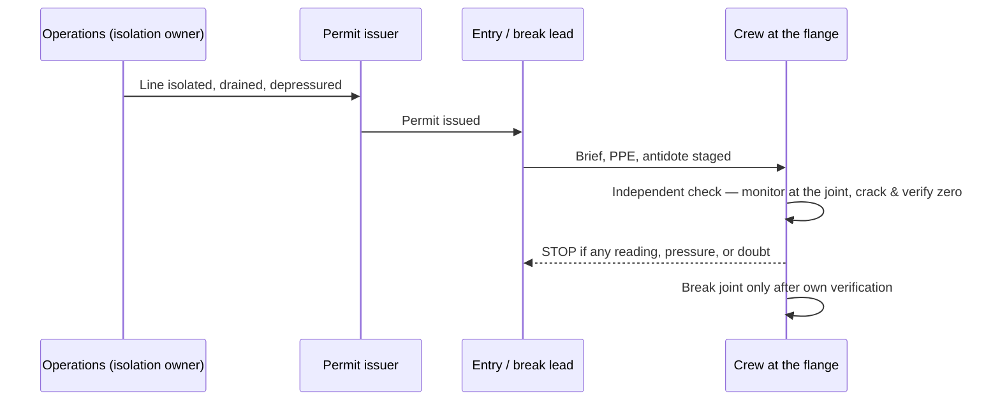

On June 7, 2024, two workers at Honeywell's Geismar, Louisiana plant opened a flanged connection to swap out a gasket. One of them was a contractor. They had a permit. They had done the job before. The line was supposed to be empty.

It was not. Less than a pound of anhydrous hydrogen fluoride was still inside, and when the flange came apart it found the contractor's face. He spent two days in a hospital with second-degree burns. Less than a pound — and that was the *small* one of three HF releases the U.S. Chemical Safety Board investigated at this single site over a stretch of under three years.

*Image: PilMo Kang on Unsplash.*

The CSB's final report on the Honeywell Geismar hydrogen fluoride incidents, released May 27, 2025, runs through all three. The headline finding is the kind of sentence that should stop a turnaround planner cold: every one of them, the Board concluded, was preventable using systems the company already had on paper. CSB Chairperson Steve Owens put it plainly — "Not only were these three serious incidents completely unacceptable, our investigation found that they also were entirely preventable."

This post is for the people who actually break HF lines: the maintenance crews, the breathing-apparatus specialists, the contractor at the manway who was told the line was clear. Because the contractor in the June 2024 incident did everything the training card told him to do, and it still went wrong.

## What hydrogen fluoride actually does, so the stakes are clear

If you have never worked an HF unit, the chemistry is worth thirty seconds, because it explains why "a small leak" is not a small problem.

Anhydrous HF boils at about 19.5 °C (67 °F). That is room temperature. A release does not pool on the deck like a heavy oil — it flashes into a vapor cloud and rides the wind. That is why the January 2023 release at Geismar (more on it below) put neighboring facilities into shelter-in-place.

On skin, HF behaves unlike a normal acid. It is technically a *weak* acid, which is exactly what makes it dangerous: it penetrates intact skin before your nerves register much pain, then dissociates into fluoride ions deep in the tissue. Those ions bind the calcium and magnesium your cells run on. The result is liquefaction necrosis from the inside out, and — for a burn of any real size — systemic hypocalcemia that can stop a heart. The medical literature flags burns larger than about 160 cm² (25 square inches) as a serious systemic-toxicity risk. And the pain is treacherous: at concentrations at or below 20%, the onset can be delayed up to 24 hours. A worker can be splashed, feel almost nothing, drive home, and deteriorate overnight.

The antidote is calcium gluconate — gel massaged into the skin until the pain stops, IV calcium for systemic exposure. If your HF site does not have it staged at the unit and in the medical bay, that is a gap, full stop. None of this is exotic knowledge inside an HF unit. The point is what it costs when a "cleared" line turns out not to be.

## Three releases in under three years

Here is the catalog, in the order the CSB lays it out.

**October 21, 2021 — the fatal one.** During a unit startup, a flanged piping connection failed and released roughly 39 pounds of anhydrous HF. A process operator was caught in it. The report's language is flat and devastating: his personal protective equipment "was not sufficient to protect against either skin or respiratory exposure to HF." He was taken to a hospital and died that day. Property damage came to about $14 million. The gasket that failed was a known problem — and we will come back to *how* known.

**January 23, 2023 — the one the neighbors felt.** During another startup, a reboiler ruptured and released over 800 pounds of anhydrous HF along with more than 1,600 pounds of chlorine gas. The vessel wall had thinned from corrosion. By luck of timing and position, no one was injured, but the cloud was serious enough that nearby facilities sheltered in place. Property damage: about $4 million.

**June 7, 2024 — the contractor's burn.** The incident this post opened with. Two workers opened HF piping to replace gaskets; the connection "was not adequately emptied of HF prior to the start of the work." The release was under a pound. The contract worker took serious facial burns and two days in the hospital.

One fatality, one serious injury, roughly $18 million in damage, three separate failure modes — gasket, vessel, line isolation — and a single conclusion tying them together. The CSB found that "all three incidents resulted from the ineffective implementation of Honeywell's existing safety management systems. Had Honeywell followed its existing normal procedures, policies, and practices, it could have, and likely would have, prevented each of the three incidents."

Read that twice. The problem was not that they lacked a procedure. The problem was the gap between the procedure on the shelf and the work at the flange. That gap is where contractors live.

## The 2007 decision that set the table

The October 2021 fatality did not start in 2021. It started in 2007.

That year, Honeywell identified a new gasket technology for the HF service and ran a Management of Change analysis on it. The engineering recognized the corrosion problem. The fix existed. And then the company made a decision that sounds reasonable in a budget meeting and is lethal on a fourteen-year horizon: rather than proactively replacing the gaskets across the unit, it would replace them **by attrition** — swap each one out when it happened to come apart for other reasons.

"By attrition" is a quiet phrase. What it means in practice is that a gasket flagged as a corrosion risk stays in service, holding back a chemical that flashes to vapor at room temperature, until something else gives you a reason to open that specific flange. The gasket that failed in October 2021 was still in the unit fourteen years after the better option was identified. It had simply never been *its turn*.

The CSB also found that inspectors at the site "did not use available technologies" that would have caught the deterioration earlier — including HF atmospheric monitors and acid-indicating paint that changes color where HF is weeping. The tools to see the problem existed. They were not being used.

*Image: Eric Prouzet on Unsplash.*

This is the part that should land for anyone who has ever stood at a manway with a torque wrench. Mechanical integrity failures rarely announce themselves. A gasket "managed by attrition" looks exactly like a gasket that is fine — right up until you break the joint. The crew on a line does not get to see the 2007 MoC analysis. They inherit its consequences.

## The engineer who left in April 2022

The January 2023 reboiler rupture has a different shape, and it is the one the CSB pushed hardest on, all the way up to a recommendation that OSHA change a federal regulation.

The reboiler's poor condition was known. A capital project to replace it had been approved. But the project was unfunded and never executed — and the reason is almost mundane. The CSB found that only one employee at the Geismar site had a real working knowledge of the reboiler's condition. When that engineer left the company in April 2022, Honeywell never reassigned the capital project to anyone else. The knowledge walked out the door, the project quietly died, and nine months later the vessel let go with 800 pounds of HF and 1,600 pounds of chlorine behind it.

Honeywell had a system for exactly this. It is called Management of Organizational Change — the discipline of asking, when a person leaves or a role is restructured, *what did they know that the next person needs to know, and what were they holding that now has no owner?* The system existed. It was not applied to the departure.

The CSB considered this important enough to recommend that OSHA amend its Process Safety Management standard to require reviews of organizational changes that affect process safety — not just changes to equipment and chemistry, but changes to *people and roles*. That is a notable thing to put in a refinery-adjacent report, because every turnaround is an organizational-change event in miniature. People rotate in. Knowledge that lived in one operator's head gets handed to a contractor crew who arrived last week. The Geismar reboiler is what it looks like when that handover does not happen and the gap runs for months instead of a shift.

## "The line was empty" — the June 2024 incident up close

Now back to the contractor, because his incident is the one a crew lead can do the most about.

Walk it from his side of the flange. He has a permit. The line has, on paper, been isolated and drained. He is replacing a gasket — routine maintenance, the most ordinary task on an HF unit, the kind of job that fills a turnaround punch list. He breaks the joint expecting nothing, because nothing is what the permit promised. And the connection "was not adequately emptied of HF" — so a residual amount, less than a pound, sprays his face.

The training card covers the visible hazards. It tells you HF is dangerous, tells you the PPE, tells you the antidote. What the card does not cover is the gap between "the line has been isolated and drained" as a checkbox and "I have personally verified this specific joint is empty and depressurized" as a physical fact. Those are not the same statement. The first is a status someone upstream asserted. The second is something you confirm at the steel, with your own monitor, before the last bolts come off.

Residual HF in a drained line is not a freak event. Low points trap liquid. Dead legs hold inventory a bulk drain never touches. A line can read "drained" at the operations panel and still have a pocket waiting at the exact flange you are about to open. The standard procedure for line-breaking on toxic service exists precisely because "we drained it" is not proof that *this joint* is clear.

The honest lesson here is not "the contractor made a mistake." Based on what the report documents, he followed the permit. The lesson is that an HF line-break is a job where the person breaking the joint has to be empowered — and expected — to verify isolation independently, and to stop if the verification is missing. That is a culture and a permit-system question more than an individual one.

The diagram is not clever. It is deliberately boring, because the failure in June 2024 was the loss of that one verification step — the crew's own check between "the permit says clear" and "I take the bolts off." On HF, that step is not bureaucracy. It is the difference between a routine gasket swap and two days in a burns unit.

## What this means for HF alky crews

A fair objection: Geismar is a fluorochemical plant making refrigerant, not a refinery. True. But HF is HF, and the hazard transfers directly to the place a lot of our readers work — the HF **alkylation** unit.

Roughly 42 U.S. refineries ran HF alkylation as of late 2024 — about a third of the operating fleet. In an HF alky unit, hydrofluoric acid is the *catalyst*: it drives the reaction that turns light olefins into high-octane blendstock, and because it is a catalyst it is not consumed — it circulates, in large inventory, indefinitely. And the documented period of greatest exposure potential is not normal running. It is **equipment maintenance**. Which is to say: turnarounds. Which is to say: contractor crews.

That is the whole reason a report about a Louisiana refrigerant plant belongs on a contractor's blog. Every one of the three Geismar failure modes has a turnaround analogue:

- **The gasket by attrition** is the line item that keeps getting deferred to "next TA." The corrosion is known, the better spec exists, and the replacement keeps losing to budget until a joint you are paid to open turns out to be the one that was overdue.
- **The reboiler with no owner** is the knowledge that walks off site between turnarounds — the long-service operator who retires, the process engineer who transfers, taking the unwritten history of which vessel is thin and which line traps liquid.
- **The line that wasn't empty** is the most ordinary task on the unit, the gasket swap, on a system where "drained" upstream and "empty at this joint" are not the same fact.

Our crew trains breathing-apparatus work and toxic line-breaking against exactly this scenario — the residual-inventory case, where the panel says clear and the flange disagrees. SCC/VCA refresher drills cover the HF and H2S line-break sequence every year. But the Geismar report is a useful corrective to anyone who thinks training closes the gap by itself: the failures there were not training failures. They were the gaps between a system on paper and the work at the steel — a deferred gasket, an unowned project, a verification step that got skipped because the permit already said the line was clear.

Training tells a crew what the right step is. It does not guarantee the step happens on a Tuesday when the line "is obviously drained" and the schedule is tight. Closing that last gap is a crew-lead and permit-system job.

## Questions a crew lead should ask before the next HF job

Turn the report into a pre-job checklist. None of these are exotic. All three Geismar incidents would have been touched by at least one.

1. **Who owns the isolation, and have I personally verified this joint?** Not "is the line drained" — "is *this flange* empty and at zero pressure, confirmed with a monitor at the joint." Treat the permit as the start of verification, not the end of it.
2. **Is calcium gluconate gel staged at the unit, and does the standby team know the burn protocol — including that the pain can be delayed?** Antidote in a cabinet across the plant is not staged.
3. **What got deferred from the last turnaround on this line?** If the answer is "a gasket or a vessel flagged for corrosion," you are working on borrowed time someone else borrowed.
4. **What knowledge left since we were last here?** If the operator or engineer who knew this unit's quirks is gone, assume the unwritten history left with them and re-verify the basics.
5. **Are the corrosion-detection tools actually in use** — HF monitors, acid-indicating paint — or are they in a drawer? Geismar had them and did not use them.

## Credit and further reading

- **U.S. Chemical Safety Board**, final investigation report on the toxic hydrogen fluoride incidents at the Honeywell Performance Materials and Technologies facility in Geismar, Louisiana — released May 27, 2025. [News release and report](https://www.csb.gov/us-chemical-safety-board-issues-final-report-on-toxic-hydrogen-fluoride-incidents/) and the [full PDF](https://www.csb.gov/assets/1/6/honeywell_geismar_investigation_report_-_final.pdf).
- **OSHA**, [Hazard Information Bulletin: Use of Hydrofluoric Acid in the Petroleum Refining Alkylation Process](https://www.osha.gov/publications/hib19931119) — background on HF as an alkylation catalyst and maintenance exposure.
- **NIOSH**, [Hydrogen Fluoride / Hydrofluoric Acid: Systemic Agent](https://www.cdc.gov/niosh/ershdb/emergencyresponsecard_29750030.html) — toxicology, exposure limits, and decontamination.
- *A review of hydrofluoric acid burn management*, [PMC / NIH](https://pmc.ncbi.nlm.nih.gov/articles/PMC4116323/) — calcium gluconate protocol and systemic toxicity thresholds.

We anonymize the workers in this account on purpose. The report names them; the lesson does not need their names, and their families do not need this page in a search result. What the crews at the sharp end need is the part the training card leaves out — that on HF, the line you were told was empty is a claim, not a fact, until you check it yourself.

*GEMBA Industrial Services runs SCC/VCA-certified breathing-apparatus and confined-space crews out of Varna, Bulgaria, with field experience at Shell, ExxonMobil, BP, Neste and ORLEN sites. If your turnaround has HF or H2S line-breaking on the critical path, [talk to us](https://gembaindustrial.com/en/contact).*
