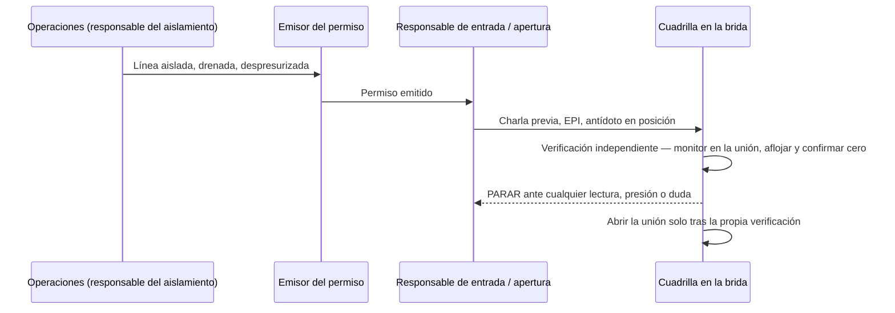

El 7 de junio de 2024, dos trabajadores de la planta de Honeywell en Geismar, Luisiana, abrieron una conexión embridada para cambiar una junta. Una brida no es más que una unión atornillada entre dos tramos de tubería; la junta es lo que sella el espacio entre ambos. Uno de los dos trabajadores era contratista. Tenían permiso. Ya habían hecho ese trabajo antes. Se suponía que la línea estaba vacía.

No lo estaba. Dentro quedaba menos de una libra de fluoruro de hidrógeno anhidro — HF. Cuando la brida se separó, ese HF alcanzó la cara del contratista. Pasó dos días en el hospital con quemaduras de segundo grado.

Menos de una libra. Y aquí viene la parte que debería hacerle enderezarse: ese fue el caso *pequeño*. El U.S. Chemical Safety Board investigó tres fugas de HF distintas en esta única instalación a lo largo de menos de tres años.

*Imagen: PilMo Kang en Unsplash.*

El informe final del CSB sobre los incidentes con fluoruro de hidrógeno en Honeywell Geismar se publicó el 27 de mayo de 2025 y repasa los tres. La conclusión principal es de esas frases que deberían dejar helado a cualquier planificador de paradas. Cada una de estas fugas, concluyó el Consejo, era evitable — con sistemas que la empresa ya tenía sobre el papel. El presidente del CSB, Steve Owens, lo dijo sin rodeos: «Estos tres incidentes graves no solo fueron completamente inaceptables; nuestra investigación determinó que además eran totalmente evitables».

Esta entrada es para quienes realmente abren líneas de HF. Las cuadrillas de mantenimiento. Los especialistas en equipos de respiración autónoma. El contratista en la boca de hombre al que le dijeron que la línea estaba limpia. Porque el contratista del incidente de junio de 2024 hizo todo lo que le indicaba la ficha de formación, y aun así salió mal.

## Qué hace realmente el fluoruro de hidrógeno, para que quede claro lo que está en juego

Si nunca ha trabajado en una unidad de HF, dedique treinta segundos a la química. Explica por qué «una fuga pequeña» no es un problema pequeño.

El HF anhidro hierve a unos 19,5 °C (67 °F). Eso es temperatura ambiente. Así que una fuga no se encharca sobre el suelo como haría un aceite pesado — se evapora de golpe formando una nube de vapor y se va con el viento. Por eso exactamente la fuga de enero de 2023 en Geismar (más sobre ella abajo) obligó a las instalaciones vecinas a confinarse.

Sobre la piel, el HF no se comporta como un ácido normal. Técnicamente es un ácido *débil* — y eso es precisamente lo que lo hace peligroso. Penetra la piel intacta antes de que los nervios sientan mucho dolor. Después, en lo profundo del tejido, se disocia en iones fluoruro. Esos iones capturan el calcio y el magnesio que sus células necesitan para funcionar. El resultado es tejido que muere y se licua de dentro hacia fuera. Y en una quemadura de cierto tamaño, el cuerpo puede quedarse con tan poco calcio — hipocalcemia sistémica — que puede detener un corazón.

La literatura médica señala las quemaduras mayores de unos 160 cm² (25 pulgadas cuadradas) como riesgo serio de toxicidad sistémica. El dolor también es traicionero: a concentraciones del 20 % o menores, puede no sentirlo hasta pasadas 24 horas. Un trabajador puede recibir una salpicadura, no notar casi nada, conducir hasta su casa y desplomarse esa noche.

El antídoto es gluconato cálcico — un gel que se masajea sobre la piel hasta que cesa el dolor, más calcio intravenoso en caso de exposición sistémica. Si su instalación de HF no lo tiene dispuesto en la propia unidad y en el botiquín, eso es una carencia, y punto. Nada de esto es conocimiento exótico dentro de una unidad de HF. La cuestión es sencillamente lo que cuesta cuando una línea «liberada» resulta no estarlo.

## Tres fugas en menos de tres años

Este es el catálogo, en el orden en que lo expone el CSB.

**21 de octubre de 2021 — la mortal.** Durante un arranque de la unidad, falló una conexión embridada de tubería y liberó unas 39 libras de HF anhidro. Un operador de proceso quedó atrapado en la nube. El lenguaje del informe es plano y demoledor: sus equipos de protección individual «no eran suficientes para proteger frente a la exposición cutánea ni respiratoria al HF». Fue trasladado a un hospital y murió ese mismo día. Los daños materiales ascendieron a unos 14 millones de dólares. La junta que falló era un problema conocido — y volveremos a *cuán* conocido.

**23 de enero de 2023 — la que notaron los vecinos.** Durante otro arranque, reventó un rehervidor. (Un rehervidor es un intercambiador de calor que vuelve a evaporar el líquido hacia el proceso.) Liberó más de 800 libras de HF anhidro junto con más de 1.600 libras de cloro gas. La pared del recipiente se había adelgazado por corrosión. Por suerte de horario y de posición, no hubo heridos — pero la nube fue lo bastante seria como para que las instalaciones cercanas se confinaran. Daños materiales: unos 4 millones de dólares.

**7 de junio de 2024 — la quemadura del contratista.** El incidente con el que abría esta entrada. Dos trabajadores abrieron tubería de HF para sustituir juntas; la conexión «no se había vaciado adecuadamente de HF antes del inicio del trabajo». La fuga fue de menos de una libra. El trabajador contratista sufrió quemaduras faciales graves y dos días de hospital.

Un fallecido. Un herido grave. Unos 18 millones de dólares en daños. Tres modos de fallo distintos — una junta, un recipiente, el aislamiento de una línea. Y una sola conclusión los une a todos. El CSB determinó que «los tres incidentes se debieron a la aplicación ineficaz de los sistemas de gestión de la seguridad ya existentes en Honeywell. Si Honeywell hubiera seguido sus procedimientos, políticas y prácticas normales ya existentes, podría haber evitado, y probablemente habría evitado, cada uno de los tres incidentes».

Léalo dos veces. El problema no fue que faltara un procedimiento. El problema fue la distancia entre el procedimiento en la estantería y el trabajo en la brida. Y en esa distancia es donde viven los contratistas.

## La decisión de 2007 que lo preparó todo

El accidente mortal de octubre de 2021 no empezó en 2021. Empezó en 2007.

Ese año, Honeywell identificó una nueva tecnología de juntas para el servicio de HF y le aplicó un análisis de gestión del cambio — la revisión formal que se hace antes de cambiar un equipo o un procedimiento. La ingeniería reconoció el problema de corrosión. La solución existía. Y entonces la empresa tomó una decisión que suena razonable en una reunión de presupuesto y es letal en un horizonte de catorce años. En lugar de sustituir proactivamente las juntas en toda la unidad, las sustituiría **por desgaste** — cambiar cada una solo cuando se abriera por algún otro motivo.

«Por desgaste» es una expresión discreta. Esto es lo que significa en la práctica. Una junta señalada como riesgo de corrosión sigue en servicio — conteniendo un producto que pasa a vapor a temperatura ambiente — hasta que otra cosa le dé un motivo para abrir esa brida concreta. La junta que falló en octubre de 2021 seguía en la unidad catorce años después de haberse identificado la mejor opción. Sencillamente nunca le había *tocado el turno*.

El CSB también determinó que los inspectores de la instalación «no utilizaron tecnologías disponibles» que habrían detectado antes el deterioro — entre ellas monitores atmosféricos de HF y pintura indicadora de ácido, que cambia de color allí donde el HF rezuma. Las herramientas para ver el problema existían. Sencillamente no se estaban usando.

*Imagen: Eric Prouzet en Unsplash.*

Esta es la parte que debería calar en cualquiera que haya estado alguna vez frente a una boca de hombre con una llave dinamométrica. Los fallos de integridad mecánica rara vez se anuncian. Una junta «gestionada por desgaste» tiene exactamente el mismo aspecto que una junta que está bien — hasta el momento en que se abre la unión. La cuadrilla que está en la línea nunca llega a ver el análisis de gestión del cambio de 2007. Solo hereda sus consecuencias.

## El ingeniero que se fue en abril de 2022

La rotura del rehervidor de enero de 2023 tiene otra forma. Y es la que el CSB apretó con más fuerza — hasta el punto de recomendar que OSHA modifique una norma federal.

El mal estado del rehervidor se conocía. Se había aprobado un proyecto de inversión para sustituirlo. Pero el proyecto quedó sin financiación y nunca se ejecutó — y la razón es casi mundana. El CSB determinó que solo un empleado de la instalación de Geismar tenía un conocimiento real y práctico del estado del rehervidor. Cuando ese ingeniero dejó la empresa en abril de 2022, Honeywell nunca reasignó el proyecto de inversión a nadie más. El conocimiento salió por la puerta. El proyecto murió en silencio. Y nueve meses después el recipiente cedió, con 800 libras de HF y 1.600 libras de cloro detrás.

Honeywell tenía un sistema exactamente para esto. Se llama gestión del cambio organizativo. La idea es simple: cuando una persona se va o se reestructura un puesto, uno se pregunta *¿qué sabía que la siguiente persona necesita saber, y qué llevaba entre manos que ahora no tiene dueño?* El sistema existía. Simplemente no se aplicó a esa salida.

El CSB lo consideró lo bastante importante como para recomendar que OSHA modifique su norma de Process Safety Management — para exigir revisiones de los cambios organizativos que afecten a la seguridad de procesos. No solo cambios de equipos y de química, sino cambios de *personas y funciones*. Es algo notable de incluir en un informe cercano al mundo de la refinería, porque toda parada de planta es un cambio organizativo en miniatura. Entra gente nueva. El conocimiento que vivía en la cabeza de un operador se le entrega a una cuadrilla de contratistas que llegó la semana pasada. El rehervidor de Geismar es el aspecto que tiene ese traspaso cuando no ocurre, y el hueco dura meses en lugar de un turno.

## «La línea estaba vacía» — el incidente de junio de 2024 de cerca

Volvamos ahora al contratista. Su incidente es sobre el que un jefe de cuadrilla puede hacer más.

Recórralo desde su lado de la brida. Tiene un permiso. Sobre el papel, la línea ha sido aislada y drenada. Está sustituyendo una junta — mantenimiento rutinario, la tarea más corriente de una unidad de HF, de esos trabajos que llenan la lista de pendientes de una parada. Abre la unión sin esperar nada, porque nada es lo que el permiso prometía. Y la conexión «no se había vaciado adecuadamente de HF» — así que una cantidad residual, menos de una libra, le rocía la cara.

La ficha de formación cubre los peligros visibles. Le dice que el HF es peligroso, le dice el EPI, le dice el antídoto. Lo que la ficha no cubre es la distancia entre dos afirmaciones. Una es «la línea ha sido aislada y drenada» — una casilla marcada. La otra es «he verificado personalmente que esta unión concreta está vacía y sin presión» — un hecho físico. No son la misma afirmación. La primera es un estado que alguien aguas arriba ha declarado. La segunda es algo que usted confirma en el acero, con su propio monitor, antes de que salgan los últimos pernos.

HF residual en una línea drenada no es un fenómeno raro. Los puntos bajos atrapan líquido. Los ramales muertos — tramos de tubería sin circulación — retienen producto que un drenaje general nunca alcanza. Una línea puede figurar como «drenada» en el panel de operaciones y seguir teniendo una bolsa de HF esperando en la misma brida que usted está a punto de abrir. El procedimiento estándar de apertura de líneas en servicio tóxico existe precisamente por esto: «la drenamos» no es prueba de que *esta unión* esté limpia.

La lección honesta aquí no es «el contratista cometió un error». Según lo que documenta el informe, siguió el permiso. La lección es que la apertura de una línea de HF es un trabajo en el que la persona que abre la unión tiene que estar facultada — y se espera de ella — para verificar el aislamiento de forma independiente y para parar si falta esa verificación. Eso es una cuestión de cultura y de sistema de permisos más que individual.

El diagrama no tiene ninguna gracia. Es deliberadamente aburrido — porque el fallo de junio de 2024 fue la pérdida de ese único paso de verificación, la comprobación propia de la cuadrilla entre «el permiso dice limpio» y «quito los pernos». Con HF, ese paso no es burocracia. Es la diferencia entre un cambio de junta rutinario y dos días en una unidad de quemados.

## Qué significa esto para las cuadrillas de alquilación con HF

Una objeción justa: Geismar es una planta fluoroquímica que fabrica refrigerante, no una refinería. Cierto. Pero el HF es el HF, y el peligro se traslada directamente al sitio donde trabajan muchos de nuestros lectores — la unidad de **alquilación** con HF.

A finales de 2024, unas 42 refinerías estadounidenses operaban alquilación con HF — alrededor de un tercio del parque en operación. En una unidad de alquilación con HF, el ácido fluorhídrico es el *catalizador*: impulsa la reacción que convierte olefinas ligeras en componente de mezcla de alto octanaje. Y como es un catalizador, no se consume — circula, en gran inventario, indefinidamente. El periodo documentado de mayor potencial de exposición no es la marcha normal. Es el **mantenimiento de equipos**. Es decir: las paradas de planta. Es decir: las cuadrillas de contratistas.

Esa es toda la razón por la que un informe sobre una planta de refrigerantes de Luisiana tiene sitio en el blog de un contratista. Cada uno de los tres modos de fallo de Geismar tiene su gemelo en una parada:

- **La junta por desgaste** es la partida que se sigue aplazando a «la próxima parada». La corrosión se conoce, existe la mejor especificación y la sustitución sigue perdiendo frente al presupuesto — hasta que la unión que a usted le pagan por abrir resulta ser la que llevaba tiempo vencida.
- **El rehervidor sin dueño** es el conocimiento que se marcha de la instalación entre paradas — el operador veterano que se jubila, el ingeniero de proceso que se traslada, llevándose la historia no escrita de qué recipiente está fino y qué línea atrapa líquido.
- **La línea que no estaba vacía** es la tarea más corriente de la unidad, el cambio de junta, en un sistema donde «drenado» aguas arriba y «vacío en esta unión» no son el mismo hecho.

Nuestra cuadrilla entrena el trabajo con equipos de respiración autónoma y la apertura de líneas en servicio tóxico contra exactamente este escenario — el caso del inventario residual, en el que el panel dice limpio y la brida dice lo contrario. Los simulacros de reciclaje SCC/VCA cubren cada año la secuencia de apertura de líneas de HF y H2S. Pero el informe de Geismar es un correctivo útil para quien crea que la formación cierra el hueco por sí sola. Los fallos de allí no fueron fallos de formación. Fueron los huecos entre un sistema sobre el papel y el trabajo en el acero — una junta aplazada, un proyecto sin dueño, un paso de verificación que se saltó porque el permiso ya decía que la línea estaba limpia.

La formación le dice a una cuadrilla cuál es el paso correcto. No garantiza que el paso se dé un martes en que la línea «está obviamente drenada» y el calendario aprieta. Cerrar ese último hueco es trabajo del jefe de cuadrilla y del sistema de permisos.

## Preguntas que un jefe de cuadrilla debería hacerse antes del próximo trabajo con HF

Convierta el informe en una lista de comprobación previa al trabajo. Ninguna de estas preguntas es exótica. Los tres incidentes de Geismar habrían quedado tocados por al menos una.

1. **¿Quién es el responsable del aislamiento y he verificado personalmente esta unión?** No «¿está drenada la línea?», sino «¿está *esta brida* vacía y a presión cero, confirmado con un monitor en la unión?». Trate el permiso como el principio de la verificación, no como su final.
2. **¿Hay gel de gluconato cálcico dispuesto en la unidad y conoce el equipo de vigilancia el protocolo de quemaduras — incluido que el dolor puede retrasarse?** Un antídoto en un armario al otro lado de la planta no está dispuesto.
3. **¿Qué se aplazó de la última parada en esta línea?** Si la respuesta es «una junta o un recipiente señalados por corrosión», está trabajando a crédito de un plazo que pidió otro.
4. **¿Qué conocimiento se ha ido desde la última vez que estuvimos aquí?** Si el operador o el ingeniero que conocía las manías de esta unidad ya no está, dé por hecho que la historia no escrita se fue con él y vuelva a verificar lo básico.
5. **¿Se están usando realmente las herramientas de detección de corrosión** — monitores de HF, pintura indicadora de ácido — o están en un cajón? Geismar las tenía y no las usó.

## Créditos y lecturas adicionales

- **U.S. Chemical Safety Board**, informe final de investigación sobre los incidentes con fluoruro de hidrógeno tóxico en la instalación de Honeywell Performance Materials and Technologies en Geismar, Luisiana — publicado el 27 de mayo de 2025. [Nota de prensa e informe](https://www.csb.gov/us-chemical-safety-board-issues-final-report-on-toxic-hydrogen-fluoride-incidents/) y el [PDF completo](https://www.csb.gov/assets/1/6/honeywell_geismar_investigation_report_-_final.pdf).
- **OSHA**, [Hazard Information Bulletin: Use of Hydrofluoric Acid in the Petroleum Refining Alkylation Process](https://www.osha.gov/publications/hib19931119) — antecedentes sobre el HF como catalizador de alquilación y la exposición en mantenimiento.
- **NIOSH**, [Hydrogen Fluoride / Hydrofluoric Acid: Systemic Agent](https://www.cdc.gov/niosh/ershdb/emergencyresponsecard_29750030.html) — toxicología, límites de exposición y descontaminación.
- *A review of hydrofluoric acid burn management*, [PMC / NIH](https://pmc.ncbi.nlm.nih.gov/articles/PMC4116323/) — protocolo de gluconato cálcico y umbrales de toxicidad sistémica.

Anonimizamos a los trabajadores en este relato a propósito. El informe da sus nombres; la lección no necesita sus nombres, y sus familias no necesitan que esta página aparezca en un resultado de búsqueda. Lo que necesitan las cuadrillas que están en el filo es la parte que la ficha de formación deja fuera — que con el HF, la línea que le dijeron que estaba vacía es una afirmación, no un hecho, hasta que la compruebe usted mismo.

*GEMBA Industrial Services opera cuadrillas certificadas SCC/VCA de equipos de respiración autónoma y espacios confinados desde Varna, Bulgaria, con experiencia de campo en instalaciones de Shell, ExxonMobil, BP, Neste y ORLEN. Si su parada tiene apertura de líneas de HF o H2S en la ruta crítica, [hable con nosotros](https://gembaindustrial.com/es/contact).*
