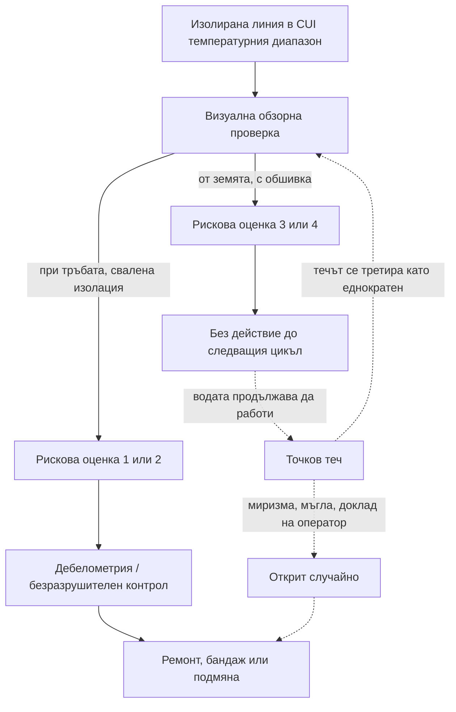

*Снимка: t Penguin, Unsplash.*

На 21 май 2019 г. двама инспектори от Health and Safety Executive — HSE, британския регулатор по безопасност на труда — влизат в етиленовия завод Fife Ethylene Plant в Mossmorran, близо до Kirkcaldy в Шотландия, за рутинна проверка. Нищо не е било докладвано. Никой не ги е викал. Планова инспекция на обект от горния клас по COMAH — категорията заводи, които държат толкова опасни вещества, че законът ги поставя под най-строгия възможен контрол.

И тогава усещат миризма.

Миризмата е на диметилсулфид, DMS. Ако не сте го срещали, представете си гниещо зеле с химическа нотка. Силно запалим е, дразни очите и кожата и няма място във въздуха. Инспекторите питат оператор за нея. Операторът им казва направо, че DMS и етан изтичат от надземна тръба. И че заводът знае за теча от около четири месеца, но е продължил да работи без допълнителни предпазни мерки.

Този разговор превръща рутинното посещение в наказателно дело. На 25 август 2026 г., седем години по-късно, ExxonMobil Chemical Limited се признава за виновна в Kirkcaldy Sheriff Court и е глобена с 267 000 паунда. Дотогава разследването е открило не един теч, а пет, разпръснати в рамките на деветнайсет месеца, всичките с една и съща причина: корозия под изолацията, CUI. И всичките пропуснати от система за инспекция, която произвеждала спретната рискова оценка и оставяла завода да продължи.

Ето защо един нос победи една база данни и какво означава това за всеки, който работи по чужди тръбопроводи.

## Какво се случи в Mossmorran

Първо, заводът. Fife Ethylene Plant приемаше етан от Северно море и го крекираше до етилен — градивния елемент на по-голямата част от пластмасите в света. Работи повече от четирийсет години. През февруари 2026 г. ExxonMobil го затвори окончателно, позовавайки се на разходите, и сега той се извежда от експлоатация. Така че тръбите от тази история се нарязват, докато четете това. Урокът — не.

Прессъобщението на HSE описва петте теча. Струва си да ги прочетете един по един, защото моделът се вижда само когато ги подредите.

**23 февруари 2018 г.** Точков теч на DMS и етан по 2-инчова стоманена линия, която в завода наричали „DMS линията“. Работела под високо налягане при 115 градуса Целзий. Течът продължил около четири месеца, преди да бъде отстранен.

**15 декември 2018 г.** Работник, изпълняващ несвързана задача по друга тръба — „ST01 Overheads линията“ — забелязва мъгла, излизаща през изолацията. Корозиралата обшивка е позволила да се образуват четири малки дупки. Течът продължил около шест седмици. Около 82 тона въглеводороди отишли в атмосферата.

**21 май 2019 г.** Този, който инспекторите усетили. Същата DMS линия като през 2018 г., друго място. Сместа била 20% DMS и 80% етан. Заводът я засякъл за първи път на 29 януари 2019 г., тоест течала е около четири месеца и половина. На 24 май HSE издава забранително предписание (Prohibition Notice), с което спира достъпа до зоната, а на 28 май — предписание за подобрение (Improvement Notice) с разпореждане за ремонт. Заводът отстранява проблема на 13 юни с монтиране на байпас.

**26 юни 2019 г.** При все още отворено разследване на HSE технолог от производството открива още един точков теч — този път по входящата линия към ацетиленовия конвертор. Рентгеновият контрол показва, че тръбата е корозирала под безопасната минимална дебелина на стената. Този път заводът спира част от инсталацията за ремонт. Течът продължил около две седмици.

**Септември 2019 г.** Докато извършва инспекциите, разпоредени с предписанието за подобрение, заводът открива пети точков теч по ST01 Overheads линията, близо до теча от декември 2018 г. Линията е продухана и ремонтирана с епоксиден бандаж.

Четете колоната „как е открит“, а не колоната с датите. Един теч е открит от оператор. Един — от работник на несвързана задача, който случайно погледнал нагоре. Един — от двама посетители, които го помирисали. Един — от технолог по време на активно разследване на регулатора. Един — от инспекции, разпоредени от регулатора. Нито един от петте не е открит от собствената CUI програма за инспекция на завода, работеща по замисъл.

Инспекторът на HSE, водил случая, обобщава резултата в едно изречение: „Макар нито един от тези течове да не доведе до катастрофално събитие, това се дължеше на късмет, а не на добро управление.“

## Оценката, която казваше „наред“

И така, каква беше програмата за инспекция? Това е частта, която би трябвало да накара всеки, попълвал някога таблица за рискова оценка, да усети лека тръпка.

Според констатациите на HSE инспекторите в завода извършвали визуални „обзорни“ проверки на всяка тръба. Резултатите влизали в компютърен инструмент заедно с данни за тръбата и работните ѝ условия. Инструментът давал рискова оценка от 1 (висок риск) до 4 (нисък риск). Заводът разследвал допълнително само тръби с оценка 1 или 2.

На хартия това е инспекция на база риск — стандартният подход в индустрията. Не можете всяка година да сваляте изолацията от всеки метър тръба в толкова голям завод, затова приоритизирате. Идеята е разумна. Проблемът беше какво я захранва. По думите на HSE: „Надземните тръби обикновено се проверяваха от нивото на земята, понякога от няколко метра разстояние, при ограничена видимост, и изолацията не винаги се сваляше, за да се погледне правилно отдолу.“

CUI се случва *под* обшивката. От земята, няколко метра под естакадата, виждате само външната страна на алуминиевия кожух. Може да хванете липсваща лента, ако светлината е подходяща. Няма да видите мокра изолация, ръждив цвят по стената на тръбата или точкова дупка. И така проверката отчита „нищо очевидно“, инструментът я комбинира с работните данни, излиза 3 или 4 и тръбата отпада от списъка за още един цикъл.

Това е капанът на всяка система с точки. Числото изглежда като измерване. Всъщност е мнение, формирано от мястото, където е стоял човекът. Никой не трябва да лъже, за да се провали системата. Всеки просто трябва да прави каквото казва процедурата — а процедурата казва „гледай оттук“.

И това е констатацията, която боли: „Въпреки повтарящите се течове, причинени от CUI, компанията не осъзна, че процесът ѝ на инспекция е дефектен, докато HSE не предприе принудителни действия.“ Два теча през 2018 г. Трети, открит през януари 2019 г. и оставен да тече. Всеки от тях сам по себе си беше доказателство, че оценката е грешна. Всеки беше ремонтиран като проблем на тръба, а не прочетен като проблем на системата.

*Снимка: Julia Taubitz, Unsplash.*

## Какво всъщност е корозията под изолацията

Ако сте нови в заводската работа, ето механизма с прости думи.

Тръбите в такъв обект са обвити в изолация — често минерална вата или пяна — и покрити с тънък метален кожух, наречен обшивка. Изолацията поддържа процеса топъл или го пази от замръзване и предпазва хората от горещи повърхности. Но прави и нещо, за което никой не я е проектирал: задържа вода.

Дъждът влиза през повреден шев, липсваща лента, опора на тръба или място, където някой е свалил участък за работа и не го е запечатал обратно. Веднъж вътре, водата стои до стоманата като мокра гъба, привързана към тръбата. Стоманата не може да изсъхне и не може да бъде видяна. Добавете топлина и имате корозионна клетка — скрита, работеща денонощно.

Температурата е от значение. Индустриалният стандарт по този проблем, API Recommended Practice 583, определя най-опасния CUI диапазон за въглеродна стомана на приблизително от минус 4 до 175 градуса Целзий — там, където има достатъчно топлина да ускори реакцията, но не достатъчно, за да поддържа изолацията суха. DMS линията в Mossmorran работеше при 115 градуса. Точно в средата на диапазона.

HSE го казва ясно: индустрията приема, че CUI не може да бъде напълно предотвратена там, където е нужна изолация, но трябва правилно да се следи и управлява. Никой не е съден за това, че има корозия. Съдени са за това, че не са гледали.

Още една подробност. DMS в етиленов завод обикновено е серна добавка, дозирана в пещите в малки количества за кондициониране на тръбите. „DMS линията“ не беше главен колектор. Беше малка линия на естакада сред десетки други — лесно е да я подминеш. Малките линии в CUI диапазона, извън обсег, пренасящи нещо запалимо, са точно тези, които поглед от земята никога не хваща.

## Къде се скъса веригата

Ето цикъла, който трябваше да пази завода, и точката, в която той продължаваше да се проваля. Пунктираният път е това, което се случи пет пъти.

Стрелките, излизащи от обзорната проверка, са целият случай. Същата тръба, същият инструмент, същите правила. Единствената разлика е къде е стоял човекът и дали кожухът е свален. Този избор решаваше дали една линия ще получи дебелометрия или още една година вода.

И обърнете внимание на последната пунктирана стрелка. След всеки теч тръбата беше ремонтирана и системата се връщаше към същата проверка. Цикълът, който трябваше да каже „оценките ни са грешни“, никога не се затвори, защото всеки теч беше заведен под „тръба“, а не под „процес“.

## От стола на контрактора

Сега частта, която е най-важна за нас и за всеки, който работи в завод, който не притежава.

HSE отбелязва, че във всички случаи освен един течовете са се случили при нормална работа на завода, „с персонал и контрактори, работещи на обекта“. Репортажите около затварянето посочваха около 179 преки служители и приблизително 250 контрактори. Това е обичайното съотношение в голям нефтохимически обект. Повечето хора, стоящи под надземна естакада в който и да е ден, са влезли през портала за контрактори.

От това следват две неща.

Първо, контракторите са публиката на системата за цялостност на обекта, никога нейните автори. Изолаторджия, скелетаджия, екип за смяна на катализатор — никой от тях не вижда CUI рисковите оценки. Приемат тръбопроводите над главите си на доверие. Нашите собствени екипи се обучават по схемата за безопасност на контрактори SCC/VCA и годишният опреснителен курс здраво тренира изпускания на газ: откриване, пътища за евакуация, сборни пунктове, дихателни апарати. Това обучение е изградено за *момента* на изпускането. То не казва нищо за четирите месеца и половина преди него, когато линия с оценка „нисък риск“ тихо е сълзяла етан в работеща инсталация. Обучението не покрива това, защото приема, че някой друг вече го е направил.

Второ, обнадеждаващата част: вижте кой откри теча от декември 2018 г. Работник на несвързана задача, който забеляза мъгла през изолацията. Не инспектор. Не инструмент. Човек, чиято работа е поставила очите му на височината на тръбата.

Това е констатацията за ръководител на екип. Всяко скеле, всяка работа с въжен достъп, всяко разтоварване на катализатор, което качва хора в естакадата, е възможност за инспекция, каквато собствената програма на обекта вероятно няма. Хората на височината на тръбата са сензорите, които инструментът за оценка никога не е получил.

## Какво всъщност може да направи един екип

Нищо от това не е за това да вършите корозионното инженерство на клиента вместо него. Става дума да не подминавате доказателствата.

За ръководител на екип, който качва хора на естакада:

- **Включете „състояние на обшивка и изолация“ в предработния инструктаж.** Липсващи ленти, отворени шевове, смачкан кожух при опорите, ръждиви петна под съединение, изолация, която е по-тъмна или провиснала в един участък. Трийсет секунди, в които казвате на хората какво да търсят, превръщат целия екип в обследване.
- **Всичко мокро се докладва писмено, със снимка и номер на линията.** Мокра изолация върху гореща линия е цялата история на CUI в едно наблюдение. Устно споменаване на най-близкия човек се губи. Снимка при връщането на разрешителното — не.
- **Ако сваляте изолация за собствената си работа, този прозорец е ваш.** Снимайте стената на тръбата, преди да я докоснете. Докладвайте какво виждате, дори да е наред. И я запечатайте обратно както трябва, защото лошото запечатване е начинът, по който започва следващият теч.
- **Третирайте миризмата като стоп, не като бележка.** Ако хората ви усещат нещо на естакадата и никое разрешително не обяснява защо, това е „спри и питай“ — всеки път. Операторът в Mossmorran знаеше за теча. Вашият екип обикновено няма да знае.

За млад техник на първия си голям обект:

- Ще ви кажат, че една линия е „нисък риск“. Вярвайте на човека — и пак гледайте. Оценката е дошла отнякъде и може да е дошла от земята.
- Мъгла над гореща линия, дъгоцветен отблясък по мокра обшивка, сладникава или зелева миризма без очевиден източник: това не са неща, които споменавате в края на смяната. Това са неща, които казвате по радиостанцията сега.
- Докладването на теч, който се оказва пара, не струва нищо на никого. 82-та тона в Mossmorran струваха шест седмици.

## Урокът

Заключителните думи на инспектора на HSE в прессъобщението са тези, които си струва да закачите на стената: „Щом се намесихме, операторът успя да идентифицира и отстрани проблемите бързо и ефективно. Това ви казва всичко, което трябва да знаете: мерките, необходими за предотвратяване на тези течове, бяха разумно осъществими през цялото време.“

Това е целият случай. Не беше нужно нищо екзотично. Стигнете до тръбата, свалете кожуха там, където температурният диапазон и историята казват, че трябва, измерете стоманата. Заводът е можел да прави това през цялото време — и го направи в момента, в който някой отвън го накара.

За останалите от нас урокът е по-малък и по-личен. Рисковата оценка е твърдение за тръба, направено от човек, стоящ някъде. Когато вие сте този, който стои по-близо, държите по-добра информация от базата данни. Използвайте я.

## Източници и допълнително четене

- **Прессъобщение на HSE**, 26 август 2026 г.: [Six-figure fine for ExxonMobil after five leaks of extremely flammable hydrocarbons at Fife chemical plant](https://press.hse.gov.uk/2026/08/26/six-figure-fine-for-exxonmobil-after-five-leaks-of-extremely-flammable-hydrocarbons-at-fife-chemical-plant/). Първоизточник за всяка дата, количество и цитат в тази статия. Признание за вина по Regulation 6(2) от Provision and Use of Work Equipment Regulations 1998 и section 33(1)(c) от Health and Safety at Work etc Act 1974. Глоба от 267 000 паунда в Kirkcaldy Sheriff Court, 25 август 2026 г.
- **API Recommended Practice 583**, *Corrosion Under Insulation and Fireproofing* — индустриалната референция за CUI температурни диапазони, уязвими места и методи за инспекция.
- **HSE Research Report RR509**, *Plant ageing: management of equipment containing hazardous fluids or pressure* — дългогодишната позиция на регулатора, че стареенето е въпрос на познаване на състоянието на оборудването, а не на възрастта му.
- **Hydrocarbon Processing**, февруари 2026 г.: [ExxonMobil ceases production at Fife ethylene plant](https://www.hydrocarbonprocessing.com/news/2026/02/exxonmobil-ceases-production-at-fife-ethylene-plant/) — контекст за затварянето и извеждането от експлоатация на завода.
- Нашият по-ранен материал за другия британски обект на същия оператор: [Кулата, сигнализирана през 2010 г.: Урокът с LPG от Fawley](/bg/blog/fawley-lpg-tower-collapse-hse), където корозионна констатация стоя в регистър дванайсет години.

Лицата в материалите на HSE са посочени тук само с длъжност.
