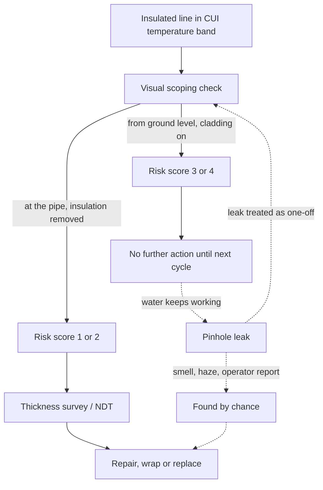

*Image: t Penguin on Unsplash.*

On 21 May 2019, two inspectors from the Health and Safety Executive — the HSE, Britain's workplace safety regulator — walked onto the Fife Ethylene Plant at Mossmorran, near Kirkcaldy in Scotland, for a routine visit. Nothing had been reported. Nobody had called them in. It was a planned inspection of an upper-tier COMAH site, the category of plant that holds enough hazardous material that the law puts it under the strictest controls there are.

Then they smelled something.

The smell was dimethyl sulphide, DMS. If you've never met it, think of rotting cabbage with a chemical edge. It is highly flammable, it irritates eyes and skin, and it doesn't belong in the air. The inspectors asked an operator about it. The operator told them, straightforwardly, that DMS and ethane were leaking from an overhead pipe. And that the site had known about it for around four months, and had kept running without extra precautions.

That conversation turned a routine visit into a prosecution. On 25 August 2026, seven years later, ExxonMobil Chemical Limited pleaded guilty at Kirkcaldy Sheriff Court and was fined £267,000. By then the investigation had found not one leak but five, spread over nineteen months, every one of them caused by the same thing: corrosion under insulation, CUI. And every one of them missed by an inspection system that produced a tidy risk score and let the plant carry on.

Here's why a nose beat a database, and what that means for anyone who works on someone else's pipework.

## What Happened at Mossmorran

First, the plant. The Fife Ethylene Plant took ethane gas from the North Sea and cracked it into ethylene, the building block for most of the world's plastics. It ran for more than forty years. In February 2026 ExxonMobil shut it down for good, citing costs, and it is now being decommissioned. So the pipes in this story are being cut up as you read this. The lesson isn't.

The HSE's press release lays out the five leaks. They are worth reading one at a time, because the pattern only appears when you line them up.

**23 February 2018.** A pinhole leak of DMS and ethane on a 2-inch steel line the site called the "DMS line". It ran under high pressure at 115 degrees Celsius. The leak went on for around four months before it was fixed.

**15 December 2018.** A worker doing unrelated work on a different pipe, the "ST01 Overheads line", noticed a haze coming through the insulation. Corroded cladding had let four small holes form. The leak lasted around six weeks. An estimated 82 tonnes of hydrocarbons went into the atmosphere.

**21 May 2019.** The one the inspectors smelled. Same DMS line as 2018, different spot. The mix was 20% DMS and 80% ethane. The site had first detected it on 29 January 2019, so it had been leaking for about four and a half months. The HSE issued a Prohibition Notice on 24 May banning access to the area, then an Improvement Notice on 28 May ordering repairs. The site fixed it on 13 June by installing a bypass.

**26 June 2019.** With the HSE investigation still open, a process technician found another pinhole, this time on the inlet line to the acetylene converter. X-ray testing showed the pipe had corroded below its safe minimum wall thickness. This time the site shut down part of the plant to repair it. The leak lasted around two weeks.

**September 2019.** While doing the inspections the Improvement Notice had ordered, the site found a fifth pinhole on the ST01 Overheads line, close to the December 2018 leak. It was purged and repaired with an epoxy wrap.

Read the discovery column, not the date column. One leak was found by an operator. One by a worker on an unrelated job who happened to look up. One by two visitors who smelled it. One by a process technician during an active regulator investigation. One by inspections the regulator had ordered. Not one of the five was found by the site's own CUI inspection programme working as designed.

The HSE inspector who led the case put the outcome in one sentence: "While none of these leaks resulted in a catastrophic event, this was down to good fortune rather than good management."

## The Score That Said "Fine"

So what was the inspection programme? This is the part that should make anyone who has ever filled in a risk-scoring spreadsheet feel a small chill.

According to the HSE's findings, inspectors at the site did visual "scoping" checks on each pipe. The results went into a computer tool alongside data about the pipe and its operating conditions. The tool produced a risk score from 1, meaning high risk, to 4, meaning low risk. The site would only investigate further if a pipe scored 1 or 2.

On paper, that's risk-based inspection, the standard approach across the industry. You can't strip every metre of insulation on a plant that size every year, so you prioritise. The idea is sound. The problem was what fed it. In the HSE's words: "Overhead pipes were typically checked from ground level, sometimes several metres away, with limited visibility, and insulation was not always removed to allow a proper look underneath."

CUI happens *under* the cladding. From the ground, several metres below a rack, all you can see is the outside of the aluminium jacket. You might catch a missing band if the light is right. You will not see wet insulation, a rust bloom on the pipe wall, or a pinhole. So the check reports "nothing obvious", the tool folds that in with the operating data, out comes a 3 or a 4, and the pipe drops off the list for another cycle.

That's the trap with any scoring system. The number looks like a measurement. It's actually an opinion, formed from wherever the person was standing. Nobody has to lie for the system to fail. Everyone just has to do what the procedure says, and the procedure says look from here.

And this is the finding that stings: "Despite suffering repeated leaks caused by CUI, the company did not recognise that its inspection process was flawed until HSE took enforcement action." Two leaks in 2018. A third found in January 2019 and left running. Each one was, on its own, evidence that the score was wrong. Each one got repaired as a pipe problem, not read as a system problem.

*Image: Julia Taubitz on Unsplash.*

## What Corrosion Under Insulation Actually Is

If you're new to plant work, here's the mechanism in plain terms.

Pipes on a site like this are wrapped in insulation, often mineral wool or a foam, then covered with a thin metal jacket called cladding. The insulation keeps the process warm, or stops it freezing, and protects people from hot surfaces. It also does something nobody designed it to do: it holds water.

Rain gets in at a damaged seam, a missing band, a pipe support, or a spot where somebody removed a section for a job and didn't seal it back. Once inside, the water sits against the steel like a wet sponge strapped to the pipe. The steel can't dry out, and it can't be seen. Add heat and you have a corrosion cell, hidden, working around the clock.

The temperature matters. The industry standard for this problem, API Recommended Practice 583, puts the worst CUI range for carbon steel at roughly minus 4 to 175 degrees Celsius, where there's enough heat to speed up the reaction but not enough to keep the insulation dry. The DMS line at Mossmorran ran at 115 degrees. Right in the middle of the band.

The HSE says it plainly: the industry accepts CUI can't be prevented entirely where insulation is needed, but it must be properly monitored and managed. Nobody is being prosecuted for having corrosion. They were prosecuted for not looking.

One more detail. DMS on an ethylene plant is usually a sulphur additive, dosed into the furnaces in small amounts to condition the tubes. The "DMS line" wasn't a main header. It was a small-bore line on a rack among dozens of others, easy to walk past. Small lines in the CUI band, out of reach, carrying something flammable, are precisely the ones a ground-level glance never catches.

## Where the Chain Broke

Here is the loop that was supposed to protect the site, and the point where it kept failing. The dashed path is what happened five times.

The arrows leaving the scoping check are the whole case. Same pipe, same tool, same rules. The only difference is where the person stood and whether the jacket came off. That choice decided whether a line got a thickness survey or another year of water.

And notice the last dashed arrow. After each leak the pipe was repaired and the system went back to the same check. The loop that should have said "our scores are wrong" never closed, because each leak was filed under "pipe" and not under "process".

## The Contractor's Chair

Now the part that matters most to us and to anyone who works on a plant they don't own.

The HSE notes that in all but one case, the leaks happened while the plant was operating normally, "with staff and contractors working on site." Reporting at the closure put the workforce at around 179 direct employees and roughly 250 contractors. That's the usual ratio on a big petrochemical site. Most of the people standing under an overhead rack on any given day arrived through the contractor gate.

Two things follow from that.

First, contractors are the audience of a site's integrity system, never its authors. An insulator, a scaffolder, a catalyst crew — none of them see the CUI risk scores. They take the pipework above their heads on trust. Our own crews train under the SCC/VCA contractor safety scheme, and the annual refresher drills gas releases hard: detection, escape routes, muster, breathing apparatus. That training is built for the *moment* of a release. It says nothing about the four and a half months before it, when a line rated "low risk" was quietly weeping ethane into an operating unit. The training doesn't cover this because it assumes someone else already did.

Second, the hopeful part: look at who found the December 2018 leak. A worker on an unrelated job who noticed a haze through the insulation. Not an inspector. Not a tool. Someone whose job had put their eyes at pipe height.

That's the finding for a crew lead. Every scaffold, every rope-access job, every catalyst dump that takes people up into the rack is an inspection opportunity the site's own programme probably doesn't have. The people at pipe height are the sensors the scoring tool never got.

## What a Crew Can Actually Do

None of this is about doing the client's corrosion engineering for them. It's about not walking past the evidence.

For a crew lead putting people up a rack:

- **Put "cladding and insulation condition" in the pre-job brief.** Missing bands, open seams, crushed jacket at supports, rust staining below a joint, insulation that's darker or sagging in one section. Thirty seconds of telling people what to look for turns a whole crew into a survey.
- **Anything wet gets reported in writing, with a photo and a line number.** Wet insulation on a hot line is the whole story of CUI in one observation. A verbal mention to whoever is nearest gets lost. A photo on the permit return doesn't.
- **If you strip insulation for your own job, you own that window.** Photograph the pipe wall before you touch it. Report what you see, even if it's fine. And seal it back properly, because a bad reseal is how the next leak starts.
- **Treat a smell as a stop, not a note.** If your people can smell something on a rack and no permit explains why, that's a stop-and-ask, every time. The Mossmorran operator knew about the leak. Your crew usually won't.

For a young tech on your first big site:

- You will be told a line is "low risk". Believe the person, and still look. The score came from somewhere, and it might have come from the ground.
- Haze above a hot line, a rainbow sheen on wet cladding, a sweet or cabbage smell with no obvious source: these are not things you mention at the end of the shift. They are things you say on the radio now.
- Reporting a leak that turns out to be steam costs nobody anything. The 82 tonnes at Mossmorran cost six weeks.

## The Lesson

The HSE inspector's closing line in the press release is the one worth pinning to the wall: "Once we stepped in, the operator was able to identify and fix problems quickly and effectively. That tells you everything you need to know: the measures needed to prevent these leaks were reasonably practicable all along."

That's the whole case. Nothing exotic was required. Get to the pipe, take the jacket off where the temperature band and the history say you should, measure the steel. The site could do that all along, and it did, the moment somebody outside the system made it.

For the rest of us, the lesson is smaller and more personal. A risk score is a claim about a pipe made by a person standing somewhere. When you're the one standing closer, you're holding better information than the database. Use it.

## Credit and Further Reading

- **HSE press release**, 26 August 2026: [Six-figure fine for ExxonMobil after five leaks of extremely flammable hydrocarbons at Fife chemical plant](https://press.hse.gov.uk/2026/08/26/six-figure-fine-for-exxonmobil-after-five-leaks-of-extremely-flammable-hydrocarbons-at-fife-chemical-plant/). Primary source for every date, quantity and quotation in this article. Pleaded guilty to Regulation 6(2) of the Provision and Use of Work Equipment Regulations 1998 and section 33(1)(c) of the Health and Safety at Work etc Act 1974. Fined £267,000 at Kirkcaldy Sheriff Court, 25 August 2026.
- **API Recommended Practice 583**, *Corrosion Under Insulation and Fireproofing* — the industry reference for CUI temperature ranges, susceptible locations, and inspection methods.
- **HSE Research Report RR509**, *Plant ageing: management of equipment containing hazardous fluids or pressure* — the regulator's long-standing position that ageing is about knowing the condition of equipment, not its age.
- **Hydrocarbon Processing**, February 2026: [ExxonMobil ceases production at Fife ethylene plant](https://www.hydrocarbonprocessing.com/news/2026/02/exxonmobil-ceases-production-at-fife-ethylene-plant/) — context on the plant's closure and decommissioning.
- Our earlier piece on the same operator's other UK site: [The Tower They Flagged in 2010: Fawley's LPG Lesson](/en/blog/fawley-lpg-tower-collapse-hse), where a corrosion finding sat in a register for twelve years.

Individuals in the HSE material are referred to here by role only.
