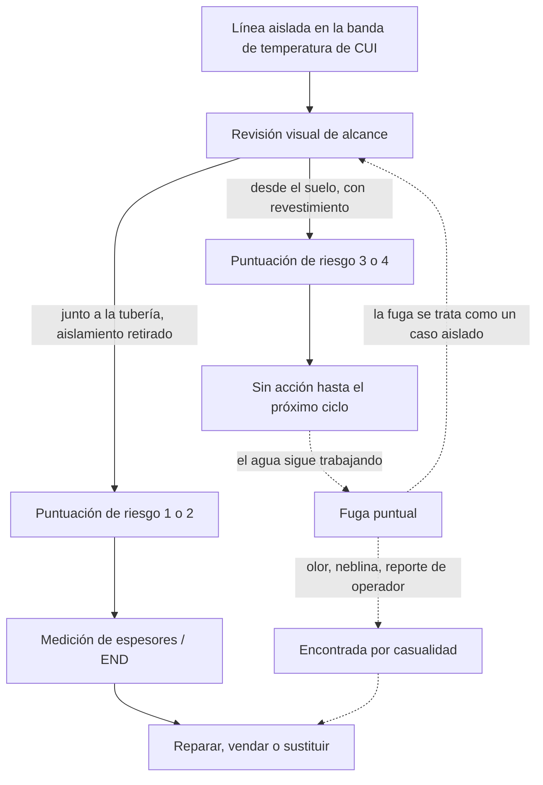

*Imagen: t Penguin en Unsplash.*

El 21 de mayo de 2019, dos inspectores del Health and Safety Executive — el HSE, el regulador británico de seguridad laboral — entraron en la Fife Ethylene Plant de Mossmorran, cerca de Kirkcaldy, en Escocia, para una visita rutinaria. Nadie había reportado nada. Nadie los había llamado. Era una inspección programada de una instalación COMAH de nivel superior, la categoría de planta que almacena tanto material peligroso que la ley la somete a los controles más estrictos que existen.

Entonces olieron algo.

El olor era dimetilsulfuro, DMS. Si nunca lo has tenido delante, piensa en col podrida con un toque químico. Es altamente inflamable, irrita ojos y piel, y no tiene nada que hacer en el aire. Los inspectores le preguntaron a un operador. El operador les dijo, sin rodeos, que DMS y etano estaban fugando de una tubería elevada. Y que la planta lo sabía desde hacía unos cuatro meses y había seguido operando sin precauciones adicionales.

Esa conversación convirtió una visita rutinaria en un proceso penal. El 25 de agosto de 2026, siete años después, ExxonMobil Chemical Limited se declaró culpable en el Kirkcaldy Sheriff Court y fue multada con 267.000 libras. Para entonces la investigación había encontrado no una fuga, sino cinco, repartidas en diecinueve meses, todas causadas por lo mismo: corrosión bajo aislamiento, CUI. Y todas pasadas por alto por un sistema de inspección que producía una puntuación de riesgo muy ordenada y dejaba que la planta siguiera adelante.

Aquí va por qué una nariz le ganó a una base de datos, y qué significa eso para cualquiera que trabaje sobre tuberías ajenas.

## Qué pasó en Mossmorran

Primero, la planta. La Fife Ethylene Plant recibía etano del Mar del Norte y lo craqueaba para producir etileno, el bloque de construcción de la mayoría de los plásticos del mundo. Operó durante más de cuarenta años. En febrero de 2026 ExxonMobil la cerró definitivamente, alegando costes, y ahora está en desmantelamiento. Así que las tuberías de esta historia se están cortando mientras lees esto. La lección, no.

El comunicado del HSE detalla las cinco fugas. Vale la pena leerlas una por una, porque el patrón solo aparece cuando las pones en fila.

**23 de febrero de 2018.** Una fuga puntual de DMS y etano en una línea de acero de 2 pulgadas que la planta llamaba la "línea de DMS". Operaba a alta presión y a 115 grados Celsius. La fuga duró unos cuatro meses antes de repararse.

**15 de diciembre de 2018.** Un trabajador que hacía un trabajo no relacionado en otra tubería, la "línea ST01 Overheads", notó una neblina saliendo a través del aislamiento. El revestimiento corroído había dejado que se formaran cuatro pequeños agujeros. La fuga duró unas seis semanas. Se estima que 82 toneladas de hidrocarburos fueron a la atmósfera.

**21 de mayo de 2019.** La que olieron los inspectores. La misma línea de DMS que en 2018, en otro punto. La mezcla era 20% DMS y 80% etano. La planta la había detectado por primera vez el 29 de enero de 2019, así que llevaba unos cuatro meses y medio fugando. El HSE emitió un Prohibition Notice el 24 de mayo prohibiendo el acceso a la zona, y un Improvement Notice el 28 de mayo ordenando reparaciones. La planta lo resolvió el 13 de junio instalando un bypass.

**26 de junio de 2019.** Con la investigación del HSE aún abierta, un técnico de proceso encontró otra fuga puntual, esta vez en la línea de entrada al convertidor de acetileno. La radiografía mostró que la tubería se había corroído por debajo de su espesor mínimo seguro. Esta vez la planta paró parte de la instalación para repararla. La fuga duró unas dos semanas.

**Septiembre de 2019.** Mientras hacía las inspecciones ordenadas por el Improvement Notice, la planta encontró una quinta fuga puntual en la línea ST01 Overheads, cerca de la fuga de diciembre de 2018. Se purgó y se reparó con un vendaje epoxi.

Lee la columna de "cómo se descubrió", no la de las fechas. Una fuga la encontró un operador. Otra, un trabajador en una tarea no relacionada que por casualidad miró hacia arriba. Otra, dos visitantes que la olieron. Otra, un técnico de proceso durante una investigación activa del regulador. Otra, inspecciones que el regulador había ordenado. Ninguna de las cinco fue encontrada por el propio programa de inspección de CUI de la planta funcionando como estaba diseñado.

Quien llevó el caso por parte del HSE resumió el resultado en una frase: "Aunque ninguna de estas fugas terminó en un evento catastrófico, eso se debió a la buena fortuna y no a una buena gestión."

## La puntuación que decía "todo bien"

Entonces, ¿cuál era el programa de inspección? Esta es la parte que debería provocar un pequeño escalofrío a cualquiera que haya rellenado alguna vez una hoja de cálculo de puntuación de riesgo.

Según las conclusiones del HSE, los inspectores de la planta hacían revisiones visuales de "alcance" en cada tubería. Los resultados entraban en una herramienta informática junto con datos sobre la tubería y sus condiciones de operación. La herramienta producía una puntuación de riesgo de 1, alto riesgo, a 4, bajo riesgo. La planta solo investigaba más a fondo si una tubería puntuaba 1 o 2.

Sobre el papel, eso es inspección basada en riesgo, el enfoque estándar en toda la industria. No puedes quitar cada metro de aislamiento de una planta de ese tamaño todos los años, así que priorizas. La idea es sólida. El problema era lo que la alimentaba. En palabras del HSE: "Las tuberías elevadas normalmente se revisaban desde el nivel del suelo, a veces a varios metros de distancia, con visibilidad limitada, y el aislamiento no siempre se retiraba para poder mirar debajo como es debido."

La CUI ocurre *debajo* del revestimiento. Desde el suelo, varios metros por debajo de un rack, todo lo que ves es el exterior de la chapa de aluminio. Puede que pilles un fleje que falta si la luz acompaña. No verás aislamiento mojado, ni una floración de óxido en la pared de la tubería, ni un agujero puntual. Así que la revisión reporta "nada evidente", la herramienta lo combina con los datos de operación, sale un 3 o un 4, y la tubería cae de la lista hasta el siguiente ciclo.

Esa es la trampa de cualquier sistema de puntuación. El número parece una medición. En realidad es una opinión, formada desde donde estaba parada la persona. Nadie tiene que mentir para que el sistema falle. Basta con que todos hagan lo que dice el procedimiento, y el procedimiento dice "mira desde aquí".

Y esta es la conclusión que duele: "A pesar de sufrir fugas repetidas causadas por CUI, la empresa no reconoció que su proceso de inspección era defectuoso hasta que el HSE tomó medidas coercitivas." Dos fugas en 2018. Una tercera encontrada en enero de 2019 y dejada en marcha. Cada una era, por sí sola, prueba de que la puntuación estaba mal. Cada una se reparó como un problema de tubería, no se leyó como un problema de sistema.

*Imagen: Julia Taubitz en Unsplash.*

## Qué es realmente la corrosión bajo aislamiento

Si eres nuevo en el trabajo de planta, aquí va el mecanismo en palabras sencillas.

Las tuberías en una instalación así van envueltas en aislamiento, a menudo lana mineral o una espuma, y cubiertas con una chapa metálica fina llamada revestimiento. El aislamiento mantiene el proceso caliente, o evita que se congele, y protege a la gente de superficies calientes. También hace algo para lo que nadie lo diseñó: retiene agua.

La lluvia entra por una junta dañada, un fleje que falta, un soporte de tubería, o un punto donde alguien retiró un tramo para un trabajo y no lo volvió a sellar. Una vez dentro, el agua se queda contra el acero como una esponja mojada atada a la tubería. El acero no puede secarse, y no puede verse. Añade calor y tienes una celda de corrosión, oculta, trabajando las veinticuatro horas.

La temperatura importa. La norma de la industria para este problema, la API Recommended Practice 583, sitúa el rango de CUI más peligroso para acero al carbono entre aproximadamente menos 4 y 175 grados Celsius, donde hay calor suficiente para acelerar la reacción pero no para mantener seco el aislamiento. La línea de DMS de Mossmorran operaba a 115 grados. Justo en medio de la banda.

El HSE lo dice claro: la industria acepta que la CUI no puede evitarse por completo donde hace falta aislamiento, pero debe monitorizarse y gestionarse como es debido. A nadie lo procesan por tener corrosión. Los procesaron por no mirar.

Un detalle más. El DMS en una planta de etileno suele ser un aditivo de azufre, dosificado en los hornos en pequeñas cantidades para acondicionar los tubos. La "línea de DMS" no era un colector principal. Era una línea de pequeño diámetro en un rack entre docenas de otras, fácil de pasar de largo. Las líneas pequeñas en la banda de CUI, fuera del alcance, con algo inflamable dentro, son precisamente las que un vistazo desde el suelo nunca detecta.

## Dónde se rompió la cadena

Este es el ciclo que debía proteger la planta, y el punto donde siguió fallando. El camino discontinuo es lo que ocurrió cinco veces.

Las flechas que salen de la revisión de alcance son todo el caso. Misma tubería, misma herramienta, mismas reglas. La única diferencia es dónde estaba parada la persona y si se quitó la chapa. Esa elección decidía si una línea recibía una medición de espesores o un año más de agua.

Y fíjate en la última flecha discontinua. Después de cada fuga la tubería se reparaba y el sistema volvía a la misma revisión. El ciclo que debía decir "nuestras puntuaciones están mal" nunca se cerró, porque cada fuga se archivó bajo "tubería" y no bajo "proceso".

## La silla del contratista

Ahora la parte que más nos importa a nosotros y a cualquiera que trabaje en una planta que no es suya.

El HSE señala que en todos los casos menos uno, las fugas ocurrieron mientras la planta operaba con normalidad, "con personal y contratistas trabajando en la instalación". Los reportajes sobre el cierre situaban la plantilla en unos 179 empleados directos y aproximadamente 250 contratistas. Es la proporción habitual en una gran instalación petroquímica. La mayoría de la gente que está bajo un rack elevado cualquier día entró por la puerta de contratistas.

De eso se siguen dos cosas.

Primero, los contratistas son el público del sistema de integridad de una planta, nunca sus autores. Un aislador, un andamista, una cuadrilla de catalizador — ninguno de ellos ve las puntuaciones de riesgo de CUI. Aceptan de buena fe las tuberías que tienen sobre la cabeza. Nuestras propias cuadrillas se forman bajo el esquema de seguridad para contratistas SCC/VCA, y el refresco anual entrena a fondo los escapes de gas: detección, rutas de escape, punto de reunión, equipos de respiración autónoma. Esa formación está hecha para el *momento* de la fuga. No dice nada sobre los cuatro meses y medio anteriores, cuando una línea calificada de "bajo riesgo" goteaba etano en silencio dentro de una unidad en operación. La formación no cubre esto porque asume que alguien más ya lo hizo.

Segundo, la parte esperanzadora: mira quién encontró la fuga de diciembre de 2018. Un trabajador en una tarea no relacionada que notó una neblina a través del aislamiento. Ni un inspector. Ni una herramienta. Alguien cuyo trabajo había puesto sus ojos a la altura de la tubería.

Esa es la conclusión para un jefe de cuadrilla. Cada andamio, cada trabajo con acceso por cuerdas, cada descarga de catalizador que sube gente al rack es una oportunidad de inspección que el propio programa de la planta probablemente no tiene. La gente a la altura de la tubería son los sensores que la herramienta de puntuación nunca tuvo.

## Qué puede hacer realmente una cuadrilla

Nada de esto va de hacerle la ingeniería de corrosión al cliente. Va de no pasar de largo ante la evidencia.

Para un jefe de cuadrilla que sube gente a un rack:

- **Incluye "estado del revestimiento y del aislamiento" en la charla previa al trabajo.** Flejes que faltan, juntas abiertas, chapa aplastada en los soportes, manchas de óxido bajo una unión, aislamiento más oscuro o hundido en un tramo. Treinta segundos diciéndole a la gente qué buscar convierten a toda la cuadrilla en una inspección.
- **Todo lo que esté mojado se reporta por escrito, con foto y número de línea.** Aislamiento mojado sobre una línea caliente es toda la historia de la CUI en una sola observación. Un comentario verbal al que esté más cerca se pierde. Una foto en la devolución del permiso, no.
- **Si retiras aislamiento para tu propio trabajo, esa ventana es tuya.** Fotografía la pared de la tubería antes de tocarla. Reporta lo que ves, aunque esté bien. Y séllalo de nuevo como es debido, porque un mal resellado es como empieza la siguiente fuga.
- **Trata un olor como un alto, no como una nota.** Si tu gente huele algo en un rack y ningún permiso explica por qué, es un "parar y preguntar", siempre. El operador de Mossmorran sabía de la fuga. Tu cuadrilla normalmente no lo sabrá.

Para un técnico joven en su primera planta grande:

- Te dirán que una línea es de "bajo riesgo". Créele a la persona, y aun así mira. La puntuación salió de algún sitio, y puede que haya salido del suelo.
- Neblina sobre una línea caliente, un brillo irisado sobre revestimiento mojado, un olor dulzón o a col sin fuente evidente: no son cosas que mencionas al final del turno. Son cosas que dices por la radio ahora.
- Reportar una fuga que resulta ser vapor no le cuesta nada a nadie. Las 82 toneladas de Mossmorran costaron seis semanas.

## La lección

La frase final del HSE en el comunicado es la que vale la pena colgar en la pared: "Una vez que intervinimos, el operador pudo identificar y corregir los problemas de forma rápida y eficaz. Eso te dice todo lo que necesitas saber: las medidas necesarias para evitar estas fugas eran razonablemente practicables desde el principio."

Ese es todo el caso. No hacía falta nada exótico. Llega hasta la tubería, quita la chapa donde la banda de temperatura y el historial dicen que debes, mide el acero. La planta pudo hacerlo desde el principio, y lo hizo en el momento en que alguien de fuera del sistema la obligó.

Para el resto de nosotros, la lección es más pequeña y más personal. Una puntuación de riesgo es una afirmación sobre una tubería hecha por una persona parada en algún sitio. Cuando tú eres quien está más cerca, tienes mejor información que la base de datos. Úsala.

## Créditos y lecturas adicionales

- **Comunicado del HSE**, 26 de agosto de 2026: [Six-figure fine for ExxonMobil after five leaks of extremely flammable hydrocarbons at Fife chemical plant](https://press.hse.gov.uk/2026/08/26/six-figure-fine-for-exxonmobil-after-five-leaks-of-extremely-flammable-hydrocarbons-at-fife-chemical-plant/). Fuente primaria de cada fecha, cantidad y cita de este artículo. Declaración de culpabilidad por la Regulation 6(2) de las Provision and Use of Work Equipment Regulations 1998 y la section 33(1)(c) de la Health and Safety at Work etc Act 1974. Multa de 267.000 libras en el Kirkcaldy Sheriff Court, 25 de agosto de 2026.
- **API Recommended Practice 583**, *Corrosion Under Insulation and Fireproofing* — la referencia de la industria para rangos de temperatura de CUI, ubicaciones susceptibles y métodos de inspección.
- **HSE Research Report RR509**, *Plant ageing: management of equipment containing hazardous fluids or pressure* — la posición de larga data del regulador de que el envejecimiento consiste en conocer el estado del equipo, no su edad.
- **Hydrocarbon Processing**, febrero de 2026: [ExxonMobil ceases production at Fife ethylene plant](https://www.hydrocarbonprocessing.com/news/2026/02/exxonmobil-ceases-production-at-fife-ethylene-plant/) — contexto sobre el cierre y desmantelamiento de la planta.
- Nuestro artículo anterior sobre la otra instalación británica del mismo operador: [La torre señalada en 2010: La lección de GLP de Fawley](/es/blog/fawley-lpg-tower-collapse-hse), donde un hallazgo de corrosión estuvo doce años en un registro.

Las personas que aparecen en el material del HSE se mencionan aquí solo por su función.
