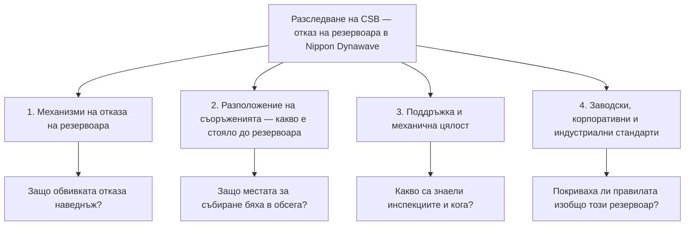

*Снимка: Sebastian Schuster, Unsplash.*

Малко преди 7:15 сутринта на 26 май 2026 г. дневната смяна в завода за хартия Nippon Dynawave Packaging в Лонгвю, щата Вашингтон, тъкмо започваше деня си. Смяната на смените беше стартирала около петнадесет минути по-рано, така че зоната до химическите резервоари на целулозния завод беше пълна с хора — колкото изобщо може да бъде: едни се записваха на смяна, други си тръгваха, кафе, предаване на задачите. Пространството, където се събираха, включваше стая за почивка, административно работно място и оперативни зони.

Тогава резервоар за съхранение от 900 000 галона (около 3 400 кубични метра), пълен с бяла луга — гореща, корозивна химическа смес, използвана за разтваряне на дървесен чипс в целулоза — отказа. Съобщението на американския Съвет по химическа безопасност (CSB) го нарича „разкъсване и имплозия на голям резервоар". Навън излязоха до 570 000 галона.

Единадесет души загинаха. Девет бяха открити на място през следващите пет дни; още двама починаха в болница. Осем други бяха ранени — седем работници от завода и един пожарникар — с изгаряния и увреждания от вдишване. Шестима от намерените бяха в зоната, където работниците се събират преди и след смяна. Един от загиналите беше електротехник с около петнадесет години стаж в завода.

Губернаторът на Вашингтон заяви, че това вероятно ще остане най-тежката съвременна индустриална трагедия на щата. Трябва да се върнеш до експлозия във въглищна мина от 1930 г. със 17 загинали, за да намериш по-лошо. И се случи в завод за хартия, в най-рутинния момент, който едно предприятие има: ежедневната смяна на караула.

## Резервоарът не е „просто склад"

Първо, материалът. Бялата луга е работният флуид на крафт-целулозния процес — основно натриева основа (сода каустик) и натриев сулфид, смесени горещи. Цялата ѝ работа е да разтваря химически дървесина. Кожата не е по-издръжлива от дървесината. Стена от такава течност, пристигаща без предупреждение, изгаря каквото докосне и обгазява каквото не. Изпускането беше достатъчно тежко, че замърсяване стигна до река Колумбия, а екипите по почистване вадеха течност от отказалия резервоар до края на юни — щатът отстрани около 12 000 останали галона, преди да разпусне обединеното си командване на 1 юли.

Сега съдът. Ако прекарваш работния си живот около рафинерии и химически заводи, развиваш тиха йерархия на страха: реактори, пещи, линии под високо налягане — на върха; големите „тъпи" атмосферни резервоари за съхранение — някъде на дъното. Резервоарът не се върти, не гори, основно просто си стои. Екипите минават покрай резервоарните паркове всеки ден без втори поглед.

Тази йерархия е капан и Лонгвю е доказателството. Атмосферният резервоар е „ниско налягане", но не е ниска енергия. Деветстотин хиляди галона са около 3 400 тона горещ химикал, задържани на няколко метра над земята от стоманена обвивка. Когато обвивката спре да си върши работата, цялата тази енергия се освобождава наведнъж, хоризонтално, върху каквото се окаже наблизо.

## Какво всъщност означава „имплозия"

Думата, която повечето репортажи използваха, си заслужава да се разгледа бавно, защото е обратното на това, което повечето хора си представят. Експлозията бута навън. Имплозията е атмосферата, която бута **навътре**.

Ето версията на прост език. Резервоарът за съхранение е проектиран да държи течност вътре — обвивката е здрава срещу налягане отвътре. В обратната посока е изумително слаба. Атмосферното налягане е около един килограм, натискащ върху всеки квадратен сантиметър, през цялото време, върху всяка повърхност. Нормално въздухът вътре в резервоара бута обратно и нищо не се случва. Но ако налягането вътре падне — да речем, течността се изпомпва по-бързо, отколкото вентилационният отвор може да пусне въздух, или отворът е запушен, или горещите пари вътре се охлаждат и кондензират — балансът се чупи. Атмосферата стиска обвивката от всички страни като ръка, мачкаща празна кутийка от напитка. Резервоари, строени с месеци, се огъват за секунди.

Всеки екип по резервоари е виждал учебната снимка на смачкана железопътна цистерна и е чувал същото изречение: *вентилационният отвор не е по избор*. Това, което учебната снимка не показва, е резервоар, отказващ достатъчно катастрофално, че да изсипе съдържанието си върху заета от хора зона.

Това ли беше последователността в Лонгвю? Никой още не може да каже и тази статия няма да се преструва. „Механизмите, довели до отказа на резервоара" е буквално първата точка в списъка на CSB с фокусни области на разследването. Честната позиция днес е: резервоар, който е трябвало да откаже безопасно — бавно, с предупреждение, овладяно — вместо това отказа наведнъж, към хората.

*Снимка: K. Mitch Hodge, Unsplash.*

## Около какво кръжат разследващите

Екипът на CSB пристигна ден след инцидента. Председателят Стив Оуенс: **„CSB открива разследване на този трагичен инцидент, за да установи как се е случил и какво може да се направи, за да не се повтори подобно нещо."** Съветът обяви четири фокусни области и самият списък е урок:

Забележи какво има в този списък освен металургия: **разположение на съоръженията** (facility siting). Не само *защо отказа резервоарът*, а *защо местата, където хората се събират, бяха в обсега му, когато това стана*.

И CSB вече не е сам. На 1 юли офисът на главния прокурор на Вашингтон обяви, че ще разследва дали престъпна дейност е допринесла за бедствието, поемайки паралелни правомощия с окръжния прокурор. Щатският Департамент по труда и индустриите (L&I) има краен срок 22 ноември за собствените си заключения — а междувременно е открил инспекции в два други крафт-целулозни завода и е стартирал целева програма за контрол на химическото съхранение в още седем, продължаваща до февруари 2027 г. Ако работиш в целулозно-хартиената индустрия в северозападните щати, инспекторите идват да гледат резервоарите ти, независимо дали някога си имал инцидент.

Досието на завода вече се чете ред по ред публично. Нищо в него не е драматично: около 12 000 долара щатски екологични глоби за три години — превишение на серен диоксид, нарушение за твърди частици в отпадните води, санкция за неразрешено изпускане от март 2026 г. Глоба от 700 долара за пропуск при заключване на оборудване (lockout). Санкция от 2025 г. за преместване на оборудване преди приключване на разследване за ампутация на пръст на работник. По-рано през 2026 г. работници докладваха, че дренажен отвор е отворил пропадане в под.

Внимавай с този списък. Нищо от него не е причинило отказ на резервоар — дребните глоби са нормалният фонов шум на управлението на голям стар завод, а погледнато назад, всяка санкция изглежда като предупреждение. Но има версия на това, която е важна за контракторите: следата от документи е начинът, по който отношението на едно предприятие към поддръжката става видимо. Когато финалният доклад излезе, разделът за механичната цялост — интервали на инспекция, измервания на дебелина, какво е открила последната вътрешна инспекция на този резервоар и кога е била — ще бъде частта, която си струва да се прочете два пъти. Виждали сме как върви тази история: във Fawley корозията, която събори кула през 2022 г., беше сигнализирана през 2010 г.

## Въпросът за стаята за почивка

Ето частта от този инцидент, която се пренася на всяка площадка, на която стъпват нашите екипи, независимо какво в крайна сметка покаже металургията.

Хората, които загинаха, не са работели — доколкото сочи публичната информация — *по* този резервоар. Те са започвали и завършвали смени до него. Стаята за почивка, административното пространство, мястото, където екипът се събира — те са били в обсега на резервоара.

Химическата индустрия е била официално предупредена за това и преди, по най-тежкия възможен начин. След експлозията в рафинерията в Тексас Сити през 2005 г., където повечето от 15-те загинали бяха контрактори във и около временни фургони, паркирани близо до инсталация в пуск, CSB наложи нови насоки за разположение на обитаеми преместваеми сгради. Индустрията в общи линии се съобрази — за взрив. Стандартите на API, излезли от Тексас Сити, са за експлозии на парни облаци и свръхналягане. Вълна от 3 400 тона гореща основа от колабиращ атмосферен резервоар е друга сметка за обсег и въпросът „къде хората могат безопасно да се събират" на много заводи е бил отговорен много преди някой да го зададе за този сценарий.

За контракторите това се приземява на много конкретно място: **планът за временните съоръжения**. По време на turnaround постоянните сгради на клиента са били (на теория) разположени от някого, правил проучване. Твоят контейнер за почивка, палатката за обяд, инструменталната, фургонът за регистрация? Те се поставят в каквото свободно място има близо до работата, от когото има мотокар, обикновено оптимизирано по една променлива: разстояние за ходене. Смяната на смените концентрира целия ти екип на това място два пъти на ден, в предвидими часове. Ако най-близкият голям резервоар откаже към него, въпросът за времето не е *дали* там има хора — а *колко*.

Мрачната аритметика на Лонгвю е точно това: резервоарът отказа в 7:15. Петнадесет минути по-рано или по-късно същият отказ среща малка част от хората.

## Урокът за ръководители на екипи и млади техници

1. **Погледни към резервоарния парк в първия ден.** Когато обхождаш нова площадка, намери къде ще се събира екипът ти — зона за почивка, сборен пункт, регистрация — и след това огледай около нея в пълен кръг. Кой е най-големият запас от енергия или химия в обсег? Резервоари, сфери, товарни рампи, буферни съдове на факела. Ако отговорът на „какво става тук, ако това откаже" е свиване на рамене, поискай от площадката да отговори. Точно това е проучването за разположение; имаш право да знаеш, че съществува.

2. **Третирай атмосферните резервоари като технологично оборудване.** Те живеят на дъното на йерархията на страха на всички и на дъното на много бюджети за инспекции. Но резервоарът има дебелина на стената, скорост на корозия, интервал на инспекция и вентилационна система, точно като съд под налягане. Ако си нает да работиш по или до резервоари, записите за механичната цялост са легитимно нещо, за което да попиташ — по същия начин, по който би попитал кога кранът е бил сертифициран за последно.

3. **Уважавай вентилационния отвор, както уважаваш предпазен клапан.** При всяка работа по резервоар — почистване, дрениране, пропарване, изпомпване — вентилационният път е това, което стои между рутинната работа и вакуумния колапс. Провери, че е отворен, оразмерен за операцията и не е замръзнал, запушен, боядисан или с гнездо в него. Ако процедурата ти изважда течност от резервоар, някой трябва да е собственик на въпроса „откъде влиза въздухът?"

4. **Знай, че смяната на смените е твоят пик на експозиция.** Два пъти на ден целият ти екип стои на едно място. Високоенергийните операции — пускане на инсталации, прехвърляне на големи обеми, повдигане над работещо оборудване — се случват по свой график. Като минимум знай кога и къде се концентрират хората ти и мисли какво е планирано около тези прозорци. Заводите разпределят крановите повдигания около заетите зони; същата логика важи за това кога всички са на палатката за обяд.

5. **Следи това разследване.** Четирите фокусни области на CSB се четат като чеклист за всеки застаряващ резервоарен парк в индустрията, а реакцията на Вашингтон — инспекции в други заводи, целеви контрол до 2027 г. — показва колко бързо един инцидент става инспекция за всички. Когато излязат заключенията за механичната цялост, вкарай ги в инструктажа си. Екипи със SCC/VCA обучение тренират влизане в съдове и газови опасности всяка година; никой не тренира „резервоарът до стаята за почивка отказва". След Лонгвю това вече не е невъобразим сценарий — а документиран.

Единадесет души започнаха обикновен вторник в завод за хартия и не го завършиха, а повечето от тях бяха точно там, където трябваше да бъдат: стаята за почивка, предаването на смяната, пътят към работното място. Разследването ще отнеме година или повече, за да ни каже защо резервоарът отказа. То вече ни каза накъде отказа *посоката* — и този въпрос поне всеки екип може да зададе за собствената си площадка още тази седмица.

## Източници и допълнително четене

- Съобщение на CSB за откриване на разследването (27 май 2026 г.): [https://www.csb.gov/us-chemical-safety-board-opens-investigation-into-fatal-chemical-tank-implosion-at-nippon-dynawave-paper-mill-in-washington/](https://www.csb.gov/us-chemical-safety-board-opens-investigation-into-fatal-chemical-tank-implosion-at-nippon-dynawave-paper-mill-in-washington/)
- Страница на разследването на CSB, *Nippon Dynawave Packaging Company Fatal Tank Collapse*: [https://www.csb.gov/nippon-dynawave-packaging-company-fatal-tank-collapse-/](https://www.csb.gov/nippon-dynawave-packaging-company-fatal-tank-collapse-/)
- Packaging Dive за наказателното разследване на главния прокурор на Вашингтон и разширените щатски инспекции на заводи (юли 2026 г.): [https://www.packagingdive.com/news/nippon-dynawave-disaster-longview-washington-attorney-general-investigation-labor-industries/824437/](https://www.packagingdive.com/news/nippon-dynawave-disaster-longview-washington-attorney-general-investigation-labor-industries/824437/)
- KOMO News за обема на изпускането и историята на санкциите на завода: [https://komonews.com/news/local/longview-chemical-tank-rupture-spills-up-to-570000-gallons-scrutiny-grows-over-mill-safety-record-nippon-dynawave-packaging-plant-implosion](https://komonews.com/news/local/longview-chemical-tank-rupture-spills-up-to-570000-gallons-scrutiny-grows-over-mill-safety-record-nippon-dynawave-packaging-plant-implosion)
- Доклад от разследването на CSB, *BP America Refinery Explosion, Texas City* (2007 г.) — където разположението на обитаеми сгради стана официален индустриален въпрос: [https://www.csb.gov/bp-america-refinery-explosion/](https://www.csb.gov/bp-america-refinery-explosion/)
- За версията на тази история с механичната цялост виж нашия прочит на [срутването на LPG кулата във Fawley](/bg/blog/fawley-lpg-tower-collapse-hse); за разположение на съоръженията и контролна зала, спасила животи — [експлозията на реактора в Givaudan](/bg/blog/givaudan-caramel-runaway-reactor-csb); а за другата целулозна трагедия на 2026 г. — [изпускането на H2S в Woodland Pulp](/bg/blog/woodland-pulp-h2s-acid-sewer-csb).
