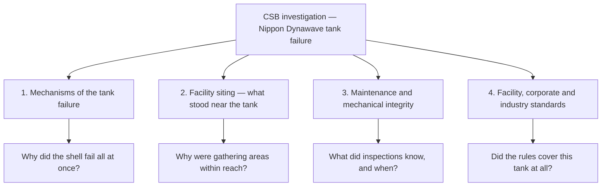

*Image: Sebastian Schuster on Unsplash.*

Just before 7:15 on the morning of 26 May 2026, the day shift at the Nippon Dynawave Packaging mill in Longview, Washington was settling in. Shift change had started about fifteen minutes earlier, so the area near the pulp mill's chemical tanks was as full as it ever gets: people clocking in, people clocking out, coffee, handover notes. The space where they gathered included a break room, an administrative workspace, and operational areas.

Then a 900,000-gallon storage tank full of white liquor — a hot, corrosive chemical solution used to dissolve wood chips into pulp — failed. The US Chemical Safety Board's announcement calls it "the rupture and implosion of a large tank." Up to 570,000 gallons came out.

Eleven people died. Nine were recovered at the scene over the following five days; two more died in hospital. Eight others were injured — seven mill workers and one firefighter — with burns and inhalation injuries. Six of the recovered were found in the area where workers gather before and after their shifts. One of the dead was an electrician who had put in about fifteen years at the mill.

Washington's governor said it will likely stand as the state's deadliest modern industrial tragedy. You have to go back to a 1930 coal mine explosion that killed 17 to find worse. And it happened at a paper mill, at the most routine moment a plant has: the daily changing of the guard.

## A Tank Is Not "Just Storage"

First, the material. White liquor is the working fluid of kraft pulping — mostly sodium hydroxide (caustic soda) and sodium sulfide, mixed hot. Its entire job is to chemically dissolve wood. Skin is not tougher than wood. A wall of it arriving without warning burns what it touches and gasses what it doesn't. The release was bad enough that contamination reached the Columbia River, and cleanup crews were still pulling liquid out of the failed tank into late June — the state removed roughly 12,000 remaining gallons before disbanding its unified command on 1 July.

Now the vessel. If you spend your working life around refineries and chemical plants, you develop a quiet hierarchy of fear: reactors, fired heaters, high-pressure lines at the top; big dumb atmospheric storage tanks somewhere near the bottom. A storage tank doesn't spin, doesn't burn, mostly just sits there. Crews walk past tank farms every day without a second look.

That hierarchy is a trap, and Longview is the proof. An atmospheric tank is "low pressure," but it is not low energy. Nine hundred thousand gallons is about 3,400 tonnes of hot chemical held a few metres above grade by a steel shell. When the shell stops doing its job, all of that energy is released at once, horizontally, at whatever happens to be nearby.

## What "Implosion" Actually Means

The word most reports used is worth slowing down on, because it's the opposite of what most people picture. An explosion pushes out. An implosion is the atmosphere pushing **in**.

Here's the plain-language version. A storage tank is designed to hold liquid in — the shell is strong against pressure from inside. It is astonishingly weak the other way. Air pressure is about one kilogram pressing on every square centimetre, all the time, on every surface. Normally the air inside the tank pushes back and nothing happens. But if the pressure inside drops — say liquid is pumped out faster than the vent can let air in, or a vent is blocked, or hot vapor inside cools and condenses — the balance breaks. The atmosphere squeezes the shell from all sides like a hand crushing an empty drink can. Tanks that took months to build buckle in seconds.

Every tank crew has seen the training photo of a crumpled tank car and heard the same line: *the vent is not optional*. What the training photo doesn't show is a tank failing catastrophically enough to release its contents onto an occupied area.

Was that the sequence at Longview? Nobody can say yet, and this post won't pretend to. "Mechanisms that led to the tank failure" is literally the first item on the CSB's list of investigation focus areas. The honest position today is: a tank that should have failed safely — slowly, with warning, contained — instead failed all at once, toward people.

*Image: K. Mitch Hodge on Unsplash.*

## What the Investigators Are Circling

The CSB team arrived the day after the incident. Chairperson Steve Owens: **"The CSB is opening an investigation into this tragic incident to determine how it happened and what can be done to prevent something like this from happening again."** The board has named four focus areas, and the list itself is a lesson:

Notice what's on that list besides metallurgy: **facility siting**. Not just *why did the tank fail*, but *why were the places people gather within reach of it when it did*.

And the CSB is not alone anymore. On 1 July the Washington attorney general's office announced it would investigate whether criminal activity contributed to the disaster, taking concurrent authority with the county prosecutor. The state's Department of Labor & Industries has a 22 November deadline for its own findings — and in the meantime it has opened inspections at two other kraft pulp mills and launched a targeted enforcement program covering chemical storage at seven more, running through February 2027. If you work pulp and paper in the Pacific Northwest, inspectors are coming to look at your tanks whether or not you've ever had an incident.

The mill's prior record is already being read line by line in public. None of it is dramatic: about $12,000 in state environmental penalties over three years — a sulfur dioxide exceedance, a wastewater solids violation, an unauthorized venting citation in March 2026. A $700 citation for an equipment lockout failure. A citation in 2025 for moving equipment before an investigation into a worker's finger amputation was complete. Earlier in 2026, workers reported a drain hole opening a sinkhole in a floor.

Be careful with that list. Nothing on it caused a tank to fail — small fines are the normal background noise of running a big old mill, and hindsight makes every citation look like a warning. But there's a version of this that matters to contractors: the paperwork trail is how a plant's relationship with maintenance becomes visible. When the final report lands, the mechanical integrity section — inspection intervals, thickness surveys, what the last internal inspection of that tank found and when it happened — will be the part worth reading twice. We've seen how that story goes before: at Fawley, the corrosion that dropped a tower in 2022 had been flagged in 2010.

## The Break Room Question

Here is the part of this incident that transfers to every site our crews walk onto, regardless of what the metallurgy eventually shows.

The people who died were not, as far as any public reporting indicates, working *on* that tank. They were starting and ending shifts next to it. The break room, the admin space, the spot where the crew gathers — those were inside the tank's reach.

The chemical industry has been formally warned about this before, in the hardest possible way. After the 2005 Texas City refinery explosion, where most of the 15 dead were contractors in and around temporary trailers parked near a unit being started up, the CSB drove new siting guidance for occupied portable buildings. The industry mostly complied — for blast. The API standards that came out of Texas City are about vapor cloud explosions and overpressure. A 3,400-tonne wave of hot caustic from a collapsing atmospheric tank is a different reach calculation, and "where can people safely gather" was answered at plenty of plants long before anyone asked it about that scenario.

For contractors this lands somewhere very specific: the **temporary facilities plan**. On a turnaround, the client's permanent buildings were (in theory) sited by someone doing a study. Your break container, your lunch tent, your tool crib, your sign-in trailer? Those get placed in whatever open space exists near the job, by whoever has a forklift, usually optimized for one variable: walking distance. Shift change concentrates your entire crew in that spot twice a day, at predictable times. If the nearest large tank fails toward it, the timing question isn't *whether* people are there — it's *how many*.

The morbid arithmetic of Longview is exactly that: the tank failed at 7:15. Fifteen minutes earlier or later, the same failure meets a fraction of the people.

## The Lesson for Crew Leads and Young Techs

1. **Look up at the tank farm on day one.** When you walk a new site, find where your crew will gather — break area, muster point, sign-in — and then look around it in a full circle. What's the biggest store of energy or chemistry within reach? Tanks, spheres, loading racks, flare knockout drums. If the answer to "what happens here if that fails" is a shrug, ask the site to answer it. That's what a siting study is; you're entitled to know it exists.

2. **Treat atmospheric tanks as process equipment.** They live at the bottom of everyone's fear hierarchy and at the bottom of a lot of inspection budgets. But a tank has a wall thickness, a corrosion rate, an inspection interval and a vent system, exactly like a pressure vessel. If you're contracted to work on or near tanks, the mechanical integrity records are a legitimate thing to ask about — the same way you'd ask when a crane was last certified.

3. **Respect the vent like you respect a relief valve.** On any tank job — cleaning, draining, steaming, pump-out — the vent path is the thing standing between routine work and a vacuum collapse. Verify it's open, sized for the operation, and not iced, plugged, painted over or nested in. If your procedure moves liquid out of a tank, someone must own the question "where does the air come in?"

4. **Know that shift change is your exposure peak.** Twice a day, your whole crew stands in one place. High-energy operations — starting up units, transferring large volumes, lifting over live equipment — happen on their own schedule. At minimum, know when and where your people concentrate, and think about what's scheduled around those windows. Plants stagger crane lifts around occupied areas; the same logic applies to when everyone's at the lunch tent.

5. **Watch this investigation.** The CSB's four focus areas read like a checklist for every ageing tank farm in the industry, and Washington's response — inspections at other mills, targeted enforcement through 2027 — shows how fast one incident becomes everyone's inspection. When the mechanical integrity findings come out, put them in your toolbox talk. Crews with SCC/VCA training drill vessel entry and gas hazards every year; nobody drills "the tank near the break room fails." After Longview, that's no longer an unimaginable scenario — it's a documented one.

Eleven people started an ordinary Tuesday at a paper mill and didn't finish it, and most of them were exactly where they were supposed to be: the break room, the handover, the walk to the job. The investigation will take a year or more to tell us why the tank failed. It has already told us where it failed *toward* — and that question, at least, every crew can ask about their own site this week.

## Credit and Further Reading

- CSB news release opening the investigation (27 May 2026): [https://www.csb.gov/us-chemical-safety-board-opens-investigation-into-fatal-chemical-tank-implosion-at-nippon-dynawave-paper-mill-in-washington/](https://www.csb.gov/us-chemical-safety-board-opens-investigation-into-fatal-chemical-tank-implosion-at-nippon-dynawave-paper-mill-in-washington/)
- CSB investigation page, *Nippon Dynawave Packaging Company Fatal Tank Collapse*: [https://www.csb.gov/nippon-dynawave-packaging-company-fatal-tank-collapse-/](https://www.csb.gov/nippon-dynawave-packaging-company-fatal-tank-collapse-/)
- Packaging Dive on the Washington attorney general's criminal investigation and the state's expanded mill inspections (July 2026): [https://www.packagingdive.com/news/nippon-dynawave-disaster-longview-washington-attorney-general-investigation-labor-industries/824437/](https://www.packagingdive.com/news/nippon-dynawave-disaster-longview-washington-attorney-general-investigation-labor-industries/824437/)
- KOMO News on the release volume and the mill's citation history: [https://komonews.com/news/local/longview-chemical-tank-rupture-spills-up-to-570000-gallons-scrutiny-grows-over-mill-safety-record-nippon-dynawave-packaging-plant-implosion](https://komonews.com/news/local/longview-chemical-tank-rupture-spills-up-to-570000-gallons-scrutiny-grows-over-mill-safety-record-nippon-dynawave-packaging-plant-implosion)
- CSB investigation report, *BP America Refinery Explosion, Texas City* (2007) — where occupied-building siting became a formal industry issue: [https://www.csb.gov/bp-america-refinery-explosion/](https://www.csb.gov/bp-america-refinery-explosion/)
- For the mechanical-integrity version of this story, see our reading of the [Fawley LPG tower collapse](/en/blog/fawley-lpg-tower-collapse-hse); for facility siting and a control-room that saved lives, the [Givaudan reactor explosion](/en/blog/givaudan-caramel-runaway-reactor-csb); and for the other pulp-mill tragedy of 2026, [Woodland Pulp's H2S release](/en/blog/woodland-pulp-h2s-acid-sewer-csb).
