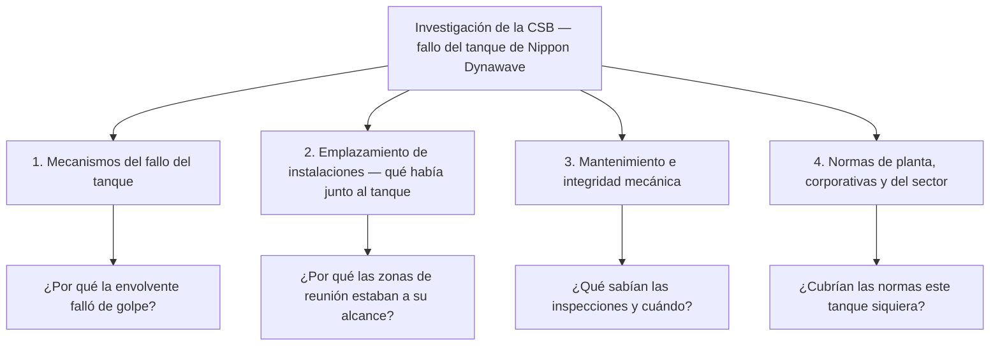

*Imagen: Sebastian Schuster en Unsplash.*

Poco antes de las 7:15 de la mañana del 26 de mayo de 2026, el turno de día de la planta papelera Nippon Dynawave Packaging en Longview, estado de Washington, empezaba su jornada. El cambio de turno había comenzado unos quince minutos antes, así que la zona junto a los tanques químicos de la planta de celulosa estaba tan llena como puede llegar a estarlo: gente fichando la entrada, gente fichando la salida, café, notas de relevo. El espacio donde se reunían incluía una sala de descanso, un área administrativa y zonas operativas.

Entonces falló un tanque de almacenamiento de 900.000 galones (unos 3.400 metros cúbicos) lleno de licor blanco — una solución química caliente y corrosiva que se usa para disolver astillas de madera y convertirlas en pulpa. El comunicado de la Junta de Seguridad Química de EE. UU. (CSB) lo llama "la ruptura e implosión de un tanque de gran tamaño". Salieron hasta 570.000 galones.

Murieron once personas. Nueve fueron recuperadas en el lugar durante los cinco días siguientes; dos más murieron en el hospital. Otras ocho resultaron heridas — siete trabajadores de la planta y un bombero — con quemaduras y lesiones por inhalación. Seis de los recuperados estaban en la zona donde los trabajadores se reúnen antes y después del turno. Uno de los fallecidos era un electricista con unos quince años en la planta.

El gobernador de Washington dijo que probablemente quedará como la tragedia industrial moderna más mortífera del estado. Hay que remontarse a una explosión en una mina de carbón de 1930, con 17 muertos, para encontrar algo peor. Y ocurrió en una planta papelera, en el momento más rutinario que tiene una fábrica: el cambio de guardia diario.

## Un tanque no es "solo almacenamiento"

Primero, el material. El licor blanco es el fluido de trabajo del proceso kraft de celulosa — principalmente hidróxido de sodio (sosa cáustica) y sulfuro de sodio, mezclados en caliente. Todo su trabajo consiste en disolver madera químicamente. La piel no es más resistente que la madera. Una pared de ese líquido llegando sin aviso quema lo que toca y gasea lo que no. La fuga fue tan grave que la contaminación llegó al río Columbia, y los equipos de limpieza siguieron extrayendo líquido del tanque fallado hasta finales de junio — el estado retiró unos 12.000 galones restantes antes de disolver su mando unificado el 1 de julio.

Ahora el recipiente. Si pasas tu vida laboral entre refinerías y plantas químicas, desarrollas una jerarquía silenciosa del miedo: reactores, hornos, líneas de alta presión en lo alto; los grandes y "tontos" tanques atmosféricos de almacenamiento en algún lugar del fondo. Un tanque de almacenamiento no gira, no arde, básicamente se queda ahí. Las cuadrillas pasan junto a los parques de tanques todos los días sin mirarlos dos veces.

Esa jerarquía es una trampa, y Longview es la prueba. Un tanque atmosférico es de "baja presión", pero no de baja energía. Novecientos mil galones son unas 3.400 toneladas de producto químico caliente sostenidas a unos metros del suelo por una envolvente de acero. Cuando la envolvente deja de hacer su trabajo, toda esa energía se libera de golpe, en horizontal, sobre lo que quiera que esté cerca.

## Qué significa realmente "implosión"

La palabra que usaron casi todos los reportajes merece que nos detengamos, porque es lo contrario de lo que la mayoría imagina. Una explosión empuja hacia fuera. Una implosión es la atmósfera empujando **hacia dentro**.

Aquí va la versión en lenguaje llano. Un tanque de almacenamiento está diseñado para contener líquido — la envolvente es fuerte contra la presión desde dentro. En el sentido contrario es asombrosamente débil. La presión atmosférica es aproximadamente un kilogramo empujando sobre cada centímetro cuadrado, todo el tiempo, sobre cada superficie. Normalmente el aire dentro del tanque empuja de vuelta y no pasa nada. Pero si la presión interior cae — digamos que el líquido se bombea hacia fuera más rápido de lo que el venteo puede dejar entrar aire, o un venteo está bloqueado, o el vapor caliente del interior se enfría y condensa — el equilibrio se rompe. La atmósfera aprieta la envolvente desde todos los lados como una mano aplastando una lata vacía. Tanques que tardaron meses en construirse se pandean en segundos.

Toda cuadrilla de tanques ha visto la foto de formación del vagón cisterna arrugado y ha oído la misma frase: *el venteo no es opcional*. Lo que la foto de formación no muestra es un tanque fallando de forma tan catastrófica que vuelca su contenido sobre una zona ocupada.

¿Fue esa la secuencia en Longview? Nadie puede decirlo todavía, y este artículo no va a fingir que sí. "Los mecanismos que llevaron al fallo del tanque" es literalmente el primer punto de la lista de áreas de investigación de la CSB. La posición honesta hoy es: un tanque que debería haber fallado de forma segura — despacio, con aviso, contenido — falló de golpe, hacia las personas.

*Imagen: K. Mitch Hodge en Unsplash.*

## Qué están rodeando los investigadores

El equipo de la CSB llegó al día siguiente del incidente. Su presidente, Steve Owens: **"La CSB abre una investigación sobre este trágico incidente para determinar cómo ocurrió y qué se puede hacer para evitar que algo así vuelva a suceder."** La junta ha nombrado cuatro áreas de enfoque, y la lista en sí es una lección:

Fíjate en lo que hay en esa lista además de metalurgia: **emplazamiento de instalaciones** (facility siting). No solo *por qué falló el tanque*, sino *por qué los lugares donde la gente se reúne estaban a su alcance cuando falló*.

Y la CSB ya no está sola. El 1 de julio la fiscalía general de Washington anunció que investigará si hubo actividad criminal que contribuyera al desastre, asumiendo competencias concurrentes con el fiscal del condado. El Departamento de Trabajo e Industrias del estado (L&I) tiene hasta el 22 de noviembre para presentar sus propias conclusiones — y mientras tanto ha abierto inspecciones en otras dos plantas de celulosa kraft y ha lanzado un programa de control específico del almacenamiento químico en siete plantas más, vigente hasta febrero de 2027. Si trabajas en el sector papelero del noroeste del Pacífico, los inspectores van a venir a mirar tus tanques, hayas tenido un incidente o no.

El historial previo de la planta ya se está leyendo línea a línea en público. Nada en él es dramático: unos 12.000 dólares en sanciones ambientales estatales en tres años — una superación de dióxido de azufre, una infracción por sólidos en aguas residuales, una sanción por venteo no autorizado en marzo de 2026. Una multa de 700 dólares por un fallo de bloqueo de equipos (lockout). Una sanción en 2025 por mover equipos antes de que terminara la investigación de la amputación de un dedo de un trabajador. A principios de 2026, los trabajadores reportaron que un agujero de drenaje había abierto un socavón en un suelo.

Cuidado con esa lista. Nada de eso hizo fallar un tanque — las multas pequeñas son el ruido de fondo normal de operar una fábrica grande y vieja, y la retrospectiva hace que cada sanción parezca un aviso. Pero hay una versión de esto que importa a los contratistas: el rastro documental es la forma en que la relación de una planta con el mantenimiento se hace visible. Cuando llegue el informe final, la sección de integridad mecánica — intervalos de inspección, medidas de espesor, qué encontró la última inspección interna de ese tanque y cuándo se hizo — será la parte que valga la pena leer dos veces. Ya hemos visto cómo va esa historia: en Fawley, la corrosión que tumbó una torre en 2022 se había señalado en 2010.

## La pregunta de la sala de descanso

Aquí está la parte de este incidente que se traslada a cada planta a la que entran nuestras cuadrillas, muestre lo que muestre al final la metalurgia.

Las personas que murieron no estaban, por lo que indica la información pública, trabajando *en* ese tanque. Estaban empezando y terminando turnos a su lado. La sala de descanso, el espacio administrativo, el punto donde se reúne la cuadrilla — todo eso estaba dentro del alcance del tanque.

La industria química ya había sido advertida formalmente de esto, de la manera más dura posible. Tras la explosión de la refinería de Texas City en 2005, donde la mayoría de los 15 muertos eran contratistas dentro y alrededor de casetas temporales aparcadas junto a una unidad en arranque, la CSB impulsó nuevas guías de emplazamiento para edificios portátiles ocupados. La industria en general cumplió — para explosiones. Las normas API que salieron de Texas City tratan de nubes de vapor y sobrepresión. Una ola de 3.400 toneladas de cáustico caliente desde un tanque atmosférico que colapsa es otro cálculo de alcance, y la pregunta "dónde puede reunirse la gente con seguridad" se respondió en muchas plantas mucho antes de que alguien la hiciera para este escenario.

Para los contratistas esto aterriza en un sitio muy concreto: el **plan de instalaciones temporales**. En una parada, los edificios permanentes del cliente fueron (en teoría) emplazados por alguien que hizo un estudio. ¿Tu contenedor de descanso, tu carpa de comidas, tu almacén de herramientas, tu caseta de registro? Esos se colocan en el espacio libre que haya cerca del trabajo, por quien tenga una carretilla elevadora, normalmente optimizando una sola variable: la distancia a pie. El cambio de turno concentra a toda tu cuadrilla en ese punto dos veces al día, a horas predecibles. Si el tanque grande más cercano falla hacia allí, la pregunta del momento no es *si* hay gente — es *cuánta*.

La aritmética sombría de Longview es exactamente esa: el tanque falló a las 7:15. Quince minutos antes o después, el mismo fallo encuentra a una fracción de la gente.

## La lección para jefes de cuadrilla y técnicos jóvenes

1. **Mira el parque de tanques el primer día.** Cuando recorras una planta nueva, localiza dónde se va a reunir tu cuadrilla — zona de descanso, punto de reunión, registro — y luego mira a su alrededor en un círculo completo. ¿Cuál es el mayor almacén de energía o de química al alcance? Tanques, esferas, cargaderos, botellones del mechero. Si la respuesta a "qué pasa aquí si eso falla" es un encogimiento de hombros, pide a la planta que la responda. Eso es un estudio de emplazamiento; tienes derecho a saber que existe.

2. **Trata los tanques atmosféricos como equipos de proceso.** Viven en el fondo de la jerarquía del miedo de todos y en el fondo de muchos presupuestos de inspección. Pero un tanque tiene un espesor de pared, una velocidad de corrosión, un intervalo de inspección y un sistema de venteo, exactamente igual que un recipiente a presión. Si te contratan para trabajar en tanques o cerca de ellos, los registros de integridad mecánica son algo legítimo que preguntar — igual que preguntarías cuándo se certificó la grúa por última vez.

3. **Respeta el venteo como respetas una válvula de alivio.** En cualquier trabajo de tanques — limpieza, drenaje, vaporizado, bombeo de vaciado — el camino de venteo es lo que separa el trabajo rutinario del colapso por vacío. Verifica que está abierto, dimensionado para la operación y que no está helado, obstruido, pintado encima ni anidado. Si tu procedimiento saca líquido de un tanque, alguien tiene que ser dueño de la pregunta "¿por dónde entra el aire?"

4. **Asume que el cambio de turno es tu pico de exposición.** Dos veces al día, toda tu cuadrilla está en un mismo punto. Las operaciones de alta energía — arranques de unidades, transferencias de grandes volúmenes, izados sobre equipos en servicio — tienen su propio calendario. Como mínimo, sabe cuándo y dónde se concentra tu gente, y piensa en qué está programado alrededor de esas ventanas. Las plantas escalonan los izados de grúa alrededor de las zonas ocupadas; la misma lógica aplica a cuándo están todos en la carpa de comidas.

5. **Sigue esta investigación.** Las cuatro áreas de enfoque de la CSB se leen como una lista de verificación para cada parque de tanques envejecido del sector, y la respuesta de Washington — inspecciones en otras plantas, control específico hasta 2027 — muestra lo rápido que un incidente se convierte en la inspección de todos. Cuando salgan las conclusiones de integridad mecánica, llévalas a tu charla de seguridad. Las cuadrillas con formación SCC/VCA entrenan la entrada a recipientes y los riesgos de gas cada año; nadie entrena "el tanque junto a la sala de descanso falla". Después de Longview, ese ya no es un escenario inimaginable — es uno documentado.

Once personas empezaron un martes corriente en una planta papelera y no lo terminaron, y la mayoría estaba exactamente donde debía estar: la sala de descanso, el relevo, el camino al tajo. La investigación tardará un año o más en decirnos por qué falló el tanque. Ya nos ha dicho hacia dónde falló — y esa pregunta, al menos, cada cuadrilla puede hacerla sobre su propia planta esta misma semana.

## Créditos y lecturas adicionales

- Comunicado de la CSB abriendo la investigación (27 de mayo de 2026): [https://www.csb.gov/us-chemical-safety-board-opens-investigation-into-fatal-chemical-tank-implosion-at-nippon-dynawave-paper-mill-in-washington/](https://www.csb.gov/us-chemical-safety-board-opens-investigation-into-fatal-chemical-tank-implosion-at-nippon-dynawave-paper-mill-in-washington/)
- Página de la investigación de la CSB, *Nippon Dynawave Packaging Company Fatal Tank Collapse*: [https://www.csb.gov/nippon-dynawave-packaging-company-fatal-tank-collapse-/](https://www.csb.gov/nippon-dynawave-packaging-company-fatal-tank-collapse-/)
- Packaging Dive sobre la investigación criminal de la fiscalía general de Washington y las inspecciones estatales ampliadas (julio de 2026): [https://www.packagingdive.com/news/nippon-dynawave-disaster-longview-washington-attorney-general-investigation-labor-industries/824437/](https://www.packagingdive.com/news/nippon-dynawave-disaster-longview-washington-attorney-general-investigation-labor-industries/824437/)
- KOMO News sobre el volumen de la fuga y el historial de sanciones de la planta: [https://komonews.com/news/local/longview-chemical-tank-rupture-spills-up-to-570000-gallons-scrutiny-grows-over-mill-safety-record-nippon-dynawave-packaging-plant-implosion](https://komonews.com/news/local/longview-chemical-tank-rupture-spills-up-to-570000-gallons-scrutiny-grows-over-mill-safety-record-nippon-dynawave-packaging-plant-implosion)
- Informe de investigación de la CSB, *BP America Refinery Explosion, Texas City* (2007) — donde el emplazamiento de edificios ocupados se convirtió en un asunto formal del sector: [https://www.csb.gov/bp-america-refinery-explosion/](https://www.csb.gov/bp-america-refinery-explosion/)
- Para la versión de esta historia centrada en la integridad mecánica, lee nuestra lectura del [colapso de la torre de GLP de Fawley](/es/blog/fawley-lpg-tower-collapse-hse); sobre emplazamiento de instalaciones y una sala de control que salvó vidas, la [explosión del reactor de Givaudan](/es/blog/givaudan-caramel-runaway-reactor-csb); y sobre la otra tragedia de 2026 en una planta de celulosa, la [fuga de H2S de Woodland Pulp](/es/blog/woodland-pulp-h2s-acid-sewer-csb).
