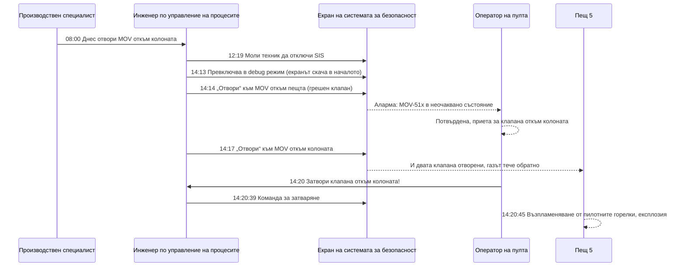

*Снимка: waa towaw, Unsplash.*

В 14:14 на 4 юни 2025 г. инженер по управление на процесите седи пред инженерна работна станция до контролната зала на чисто нов етанов крекинг в Монака, Пенсилвания, и натиска „отвори“ на един клапан. Грешният клапан. Правилният е по-надолу на същия екран и изглежда абсолютно същият, с изключение на последната цифра в тага си.

Шест минути по-късно Пещ 5 избухва.

Никой не загива. Никой дори не е сериозно ранен, което е почти чудо, като прочетеш какво е имало около тази пещ. Петнайсет души трябва да бъдат евакуирани от инсталацията. Един изпълнител остава заклещен в асансьора точно до Пещ 5 и се налага да бъде спасяван. В този ден на площадката има 529 изпълнители и 351 служители на Shell. Пещта е извън строя седем месеца, а сметката е около 95 милиона долара.

На 16 септември 2026 г. Американският съвет по химическа безопасност (CSB, федералната агенция, която разследва химически аварии) публикува своя [окончателен доклад](https://www.csb.gov/assets/1/6/Shell_Investigation_Report_Publication.pdf) № 2025-05-I-PA. Това са 70 страници за това как една рутинна задача, изпълнена успешно 19 пъти преди това, се обърква на двайсетия. Ако си изпълнител, който стои до оборудване, което „всъщност не се пуска“, ето кратката версия.

## Какво казва докладът на CSB

Заводът Shell Polymers Monaca превръща етан в етилен, суровината за полиетиленова пластмаса. Прави го в седем крекинг пещи, работещи една до друга. Всяка пещ загрява етан и пара до около 1545 °F (840 °C) в метални змиевици, етанът се „кракира“ до етилен и водород, а горещият газ се охлажда рязко, смесва се с продукцията на другите пещи и се изпраща към охладителна колона.

При крекинга се образува кокс, твърд въглероден остатък. Част от него се събира в голяма вертикална тръба след първия охладител, наречена коксов уловител. Ръководството на лицензодателя на пещта казва, че уловителите трябва да се изпразват приблизително веднъж годишно при пълно натоварване. Заводът тръгва през ноември 2022 г. До пролетта на 2025 г. нито един от седемте коксови уловителя не е почистван. Когато уловителят на Пещ 1 е отворен в края на март 2025 г., коксът стига почти до люка.

Така че Shell започва да ги чисти. Четири от тях са почистени по време на спиране на инсталацията. Пещ 5 е следващата.

Всяка пещ има два 36-инчови клапана с електрозадвижване (MOV) последователно между нея и охладителната колона: клапан „откъм пещта“ и клапан „откъм колоната“. За работата и двата са затворени, парната продувка между гнездата им е изолирана, а дренажът между тях е отворен. Солидна двойна блокировка с дренаж. Коксовият уловител е почистен за три дни без инцидент.

След това идва частта, за която никой не е написал процедура: връщането на пещта в работа.

## Шестте минути, стъпка по стъпка

Хронологията на CSB (Приложение А) се чете като обратно броене. Само длъжности; докладът няма нужда от имена, за да е ясен.

- **8:00, 4 юни.** На сутрешната оперативка производственият специалист възлага отварянето на клапана откъм колоната на инженер по управление на процесите. Инженерът никога не го е правил. Никой не споменава формуляра за байпас на системата за безопасност, който собствената политика на завода изисква.
- **12:19.** Инженерът моли техник по КИП да отключи системата за противоаварийна защита (SIS, отделният контролен слой, чиято единствена работа е да спира нещата безопасно). Клапанът откъм колоната може да бъде отворен само от логическия екран на SIS, от инженер, а не от оператор на терен.
- **14:13.** Инженерът следва писмена работна инструкция, изпраща команда за отваряне и нищо не се случва. Колега забелязва, че SIS е в режим „само за четене“ и трябва да е в режим „debug“. Инструкцията има тези стъпки в грешен ред. Когато инженерът сменя режима, екранът се опреснява и скача обратно в началото.
- **14:14.** Инженерът натиска „отвори“. Екранът вече показва клапана откъм пещта в горната част, а не клапана откъм колоната в долната. Клапанът откъм пещта започва да се отваря. В контролната зала се задейства аларма: MOV е в неочаквано състояние. Текстът ѝ е идентичен с алармата на клапана откъм колоната, с изключение на последната цифра. Операторът на пулта, който знае, че инженерът ще отваря клапана откъм колоната, я потвърждава и продължава.
- **14:16.** Инженерът забелязва, че клапанът откъм колоната не е помръднал, заключава (погрешно), че клапанът откъм пещта сигурно вече е бил отворен, и премахва командата.
- **14:17.** Инженерът превърта надолу и отваря клапана откъм колоната. И двата клапана вече са отворени. Четири други пещи кракират, колекторът зад клапана откъм колоната е на около 5 psig (0,35 bar), а Пещ 5 е при атмосферно налягане със запалени пилотни горелки.
- **14:20.** Операторът на пулта вижда клапана откъм пещта отворен, а клапана откъм колоната на 78 процента и продължаващ да се движи, тича до инженерната работна станция и казва на инженера да го затвори. Командата за затваряне излиза в 14:20:39.
- **14:20:45.** Около 641 фунта (290 кг) крекинг газ са се върнали обратно в горивната камера. Газът достига пилотните горелки. Камерата, проектирана да издържа 0,01 psig, се разкъсва.

Всеки клапан се движи четири минути от затворено до напълно отворено положение. Газът тече обратно около две минути и половина. Димосмукателният вентилатор на пещта е в ръчен режим по обороти, оставен така след обновяване на фърмуера предния ден, и не може да изтегля газа по-бързо, отколкото влиза. Детекторът за въглероден оксид в горивната камера би задействал аларма около 90 секунди преди възпламеняването. Той е потиснат.

## Рутинното, което се обърна

Неприятната част: същата задача е изпълнявана 19 пъти преди това, по същия начин, без проблем.

Проектантите са приели, че само един от двата MOV някога ще бъде затварян за изолация. Местният полеви пулт, този, който операторите ползват, никога не е програмиран да отваря отново и двата. Така че всеки път, когато Shell затваря двата клапана за ремонт, вместо да монтира 36-инчов глух фланец, излизането от това състояние означава инженер, който заобикаля системата за безопасност от инженерната зала. Това е нормално. Работи. Докато спира да работи.

Добави и другите решения от този ден, всяко разумно само по себе си:

- **Пилотните горелки остават запалени.** Shell веднъж вече е повреждала огнеупорната облицовка на пещ, когато вода докоснала студен тухлен под по време на хидроизпитание, затова пилотните горелки горят през цялото почистване на коксовия уловител, за да държат камерата над точката на оросяване. Собственият план за изолация на завода изисква пилотният газ да бъде изолиран. Ръководството на лицензодателя казва, че за изпразване на коксовия уловител пещта трябва да е в „пълно спиране, изолирана и охладена“. Нито едното не е спазено, а прегледът на отклонението, който политиката на завода изисква, така и не се случва.
- **Алармите са изключени по проект.** В режим „само пилотни горелки“ алармите за високо налягане в горивната камера, за въглероден оксид и за метан се потискат автоматично, за да не досаждат. Разумно, когато пещта е спряна. Фатално в единствения режим, в който тези аларми са единственото предупреждение.
- **Процедурата за пускане не е приложима.** Процедурата на Shell за пускане на пещ запалва първата пилотна горелка чак на стъпка 98. Пилотните горелки вече са запалени. Така че няма процедура за състоянието, в което пещта реално се намира, и задачата пада върху писмена инструкция със стъпки в грешен ред.
- **Не се брои за пускане.** Това е редът, към който все се връщаме, цитиран дословно от Таблица 2 на доклада: „Преминаването към и от ремонтна дейност не се счита за спиране, пускане или необичайна ситуация. В резултат на това не е обявена зона за изключване.“ Затова има работник в асансьора и хора навсякъде около Пещи 4, 5 и 6.

Нищо от това не е било скрито. Собственият анализ на опасностите на Shell от 2023 г. е идентифицирал точно този сценарий, обратен поток на крекинг газ към спряна пещ през MOV клапаните, и го е оценил като експлозия, която може да убие няколко души. Екипът решава, че две административни мерки са достатъчни: оператор, реагиращ на аларма за метан, и процедура за пускане. Добавянето на инженерни мерки, пишат те, би било „грубо непропорционално на намаляването на риска“. На 4 юни алармата е потисната, а процедурата не се използва.

*Снимка: Alexandre Daoust, Unsplash.*

## Екранът, който превъртя

CSB посвещава цяла глава на човеко-машинния интерфейс (HMI), което е просто екранът, който човек гледа, за да управлява завода. Грешката е толкова обикновена, че вероятно си правил нейна версия на телефона си.

Три клапана, един екран, отгоре надолу: откъм пещта, за декоксуване, откъм колоната. Трябва да превърташ, за да стигнеш от първия до последния. Логическите им блокове изглеждат еднакво. Етикетите им са 511, 512 и 513. Собствената спецификация на Shell за HMI казва, че етикетите трябва да са „възможно най-изчерпателни“, а примерният ѝ екран показва оборудване, обозначено като „CRACKED GAS DRYER A / B / C“. Никой не е приложил това към клапаните на пещта. Никъде на екрана не пише „MOV откъм пещта“ или „MOV откъм колоната“.

Така че когато смяната на режима опреснява екрана и го връща в началото, инженерът гледа блок, идентичен с този, който е гледал секунда по-рано. Кликът отива към грешния клапан. Последвалата аларма има същия текст като очакваната, минус една цифра, така че операторът на пулта, единственият, който можеше да я хване, не я хваща.

Индустриалният стандарт, към който CSB препраща (ANSI/ISA-101.01-2015), казва, че команди, които действат директно върху процеса, „трябва да изискват няколко входни действия от оператора и да не са възможни с едно случайно входно действие“. Няма стъпка за потвърждение и няма блокировка, която да откаже да отвори клапана откъм пещта, докато клапанът откъм колоната е затворен и пилотните горелки горят. Ето частта, която боли: лицензодателят е доставил такава. Проектът на Linde за полевия пулт включва последователна ключова блокировка и функция SIL 2, която затваря клапана откъм пещта при ниското налягане, сигнализиращо обратен поток. Тя никога не е програмирана за състоянието на двойна изолация. Препрограмирането на пулта е било в списък с проекти за подобрение. Други проекти са финансирани първи.

Писахме за [объркване на фланец в Deer Park](/bg/blog/pemex-deer-park-flange-misidentification), което имаше същата форма: грешното оборудване, избрано добросъвестно, защото две различни неща изглеждаха еднакво. Монака е същата история, преместена на екран.

## Единайсет мерки, всичките на хартия

Собственото разследване на Shell преброява 11 предпазни мерки, които е трябвало да спрат това. Заключението на CSB е директно: всяка една е административна мярка. Политика, процедура, аларма, на която някой трябва да реагира. Нито една не е инженерно решение, което физически да откаже два клапана да са отворени едновременно при запалени пилотни горелки.

Изречението на CSB за протокола, дословно от констатациите: „Shell активно е избрала да разчита единствено на административни мерки за предотвратяване на потенциално смъртоносна експлозия при преразглеждането на своя анализ на опасностите на процеса.“

Ако някога си седял на анализ на опасностите, където някой казва „процедурата го покрива“, това е изречението, което да запомниш. Процедурата го покрива, докато не спре да е приложима към състоянието, в което оборудването реално се намира, и тогава не покрива нищо.

OSHA издава три предписания през декември 2025 г. с предложена глоба от 26 480 долара: анализът на опасностите не покрива декоксуването и връщането в работа, не разглежда човешкия фактор при нерутинни операции, и няма писмена процедура за временни операции като връщането на MOV клапаните след изолация. Двайсет и шест хиляди долара срещу пещ за 95 милиона. Глобата никога не е истинската цена.

След експлозията Shell препрограмира полевия пулт на Пещ 5, така че операторите да могат да работят и с трите клапана от терена, добавя SIS логика, която държи клапана откъм колоната затворен, ако клапанът откъм пещта бъде отворен по погрешка, и написва процедура, наречена „Възстановяване след ремонт с двойна изолация“. Двете препоръки на CSB отиват по-далеч: прегледай целия анализ на опасностите на инсталацията, намери всеки смъртоносен сценарий, който се крепи само на хартиени мерки, и го отстрани инженерно.

## Защо това е важно от стола на изпълнителя

Никой в тази история не е изпълнител, освен единственият човек, за когото знаем, че е бил на най-опасното място: работникът в асансьора до Пещ 5.

Помисли какво е означавало „не е пускане“ за този човек. Зоните за изключване в Монака се обявяват при пускания и необичайни ситуации. Връщането от почистване на коксов уловител, със запалени пилотни горелки и инженер, който заобикаля системата за безопасност, не е нито едното. Затова асансьорът работи, а 529-те изпълнители на площадката нямат причина да мислят, че Пещ 5 е по-различна от Пещ 4.

Екипи с обучение по SCC/VCA всяка година тренират осъзнатост при пускане и спиране: знай кога инсталацията до теб сменя състоянието си, знай алармените сигнали, знай сборния си пункт. Това, което обучителната карта не покрива, е точно тази сива зона. Инсталация, „излизаща от ремонт“, не е в процедурата за пускане, затова не е в политиката за зони за изключване, затова не е в разрешителното ти, затова никой не ти казва.

Няколко неща, които ръководителят на екип реално може да направи с това:

- **Питай в какъв режим е съседното оборудване и към какъв преминава.** Не „работи ли Пещ 5?“, а „сменя ли някой днес положението на клапаните на Пещ 5, и откъде?“. Ако отговорът е „инженер от контролната сграда“, това е пещ, местена от някой, който не я вижда. Третирай я като пускане, независимо дали заводът го прави.
- **Третирай запалените пилотни горелки като работеща пещ.** Ако в камерата има пламък, камерата може да възпламени всичко, което влезе. Изолацията, която пази екипа при коксовия уловител, не прави нищо за хората до горивната камера, щом тази изолация започне да се сваля.
- **Питай дали алармите са потиснати.** Заводите потискат аларми в ремонтни режими, за да спрат досадните потоци от сигнали. Екипът ти трябва да знае дали газдетекцията на оборудването до теб в момента говори с някого.
- **Асансьорите и стълбищата до огневи съоръжения не са неутрална територия по време на смяна на клапани.** Ако ти караш асансьора този ден, знай какво има в камерата, до която спира.
- **Когато работната инструкция не съвпада с екрана, спри.** Това е за младия инженер точно колкото за техника на терен. Стъпката, на която пише „натисни отвори“ и нищо не става, е моментът да извикаш някой, който го е правил, а не да пробваш друг режим и да натиснеш пак.

## Поуката

Деветнайсет успешни повторения на небезопасен метод не са доказателство, че е безопасен. Те са доказателство, че още не ти е излязъл късметът. CSB цитира насоките на CCPS за байпас на системи за безопасност и това е най-добрият единичен ред в доклада за ръководител на екип: „Как предотвратявате нормализирането на отклонението, свързано с това явление (т.е. не се е случвало досега, значи няма да се случи и сега)?“

За младия техник: клапан, който се отваря четири минути, даде две минути и половина обратен поток, преди някой да забележи. Операторът на пулта, който го хвана и изтича до инженерната зала, направи правилното нещо и пак закъсня с шест секунди. Опасността е да си наблизо при запалени пилотни горелки и отворени клапани. Не бъди наблизо.

За ръководителя на екип: когато заводът каже „не е пускане“, попитай какво е тогава. Ако отговорът включва някой, който заобикаля система за безопасност, за да премести 36-инчов клапан на пещ с пламък в нея, имаш отговора си.

## Източници и допълнително четене

- U.S. Chemical Safety and Hazard Investigation Board, *Furnace Explosion and Fire at Shell Polymers Monaca*, Investigation Report No. 2025-05-I-PA, септември 2026 г. [Пълен доклад (PDF)](https://www.csb.gov/assets/1/6/Shell_Investigation_Report_Publication.pdf) и [прессъобщение на CSB от 16 септември 2026 г.](https://www.csb.gov/us-chemical-safety-board-releases-final-investigation-report-on-2025-explosion-and-fire-at-shell-polymers-monaca-facility-in-pennsylvania/).
- ANSI/ISA-101.01-2015, *Human-machine interfaces for Process Automation Systems*. Стандартът, по който CSB мери екрана за клапаните на Shell.
- CCPS, *Safe Work Practice: Temporary Instrumentation and Controls Bypass*. Източникът на въпроса „не се е случвало досега“.
- Нашите по-ранни публикации за [объркването на оборудване в Pemex Deer Park](/bg/blog/pemex-deer-park-flange-misidentification) и [разкъсването на тръба в пещта на Marathon Martinez](/bg/blog/marathon-martinez-fired-heater-tube-rupture-csb), два други случая на CSB, в които огневи съоръжения направиха нещо, което никой на терена не очакваше.
