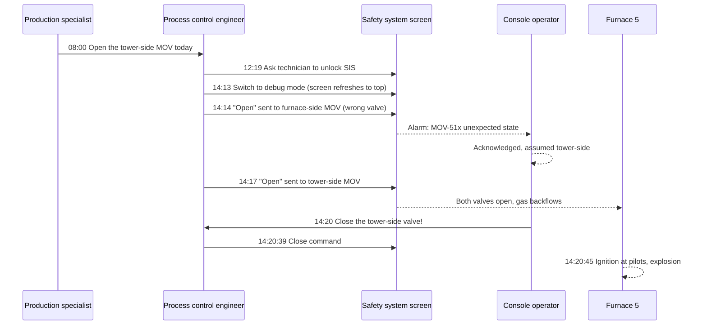

*Image: waa towaw on Unsplash.*

At 2:14 in the afternoon on 4 June 2025, a process control engineer sat at an engineering workstation next to the control room of a brand-new ethane cracker in Monaca, Pennsylvania, and clicked "open" on a valve. It was the wrong valve. The right one was further down the same screen, and it looked exactly the same except for the last digit of its tag.

Six minutes later, Furnace 5 exploded.

Nobody died. Nobody was even seriously hurt, which is close to a miracle when you read what was around that furnace. Fifteen people had to be evacuated from the unit. A contractor was trapped in the elevator right next to Furnace 5 and had to be rescued. There were 529 contractors on that site that day, alongside 351 Shell employees. The furnace was out for seven months and the bill came to about $95 million.

On 16 September 2026, the U.S. Chemical Safety Board (the CSB, the federal agency that investigates chemical accidents) published its [final report](https://www.csb.gov/assets/1/6/Shell_Investigation_Report_Publication.pdf), No. 2025-05-I-PA. It's 70 pages on how a routine job, done successfully 19 times before, goes sideways on the twentieth. If you're a contractor who stands near equipment that "isn't really starting up", here's the shorter version.

## What the CSB Report Says

The Shell Polymers Monaca plant turns ethane into ethylene, the building block for polyethylene plastic. It does that in seven cracking furnaces running side by side. Each furnace heats ethane and steam to about 1,545 °F (840 °C) inside metal coils, the ethane "cracks" into ethylene and hydrogen, and the hot gas is quenched, combined with the output of the other furnaces, and sent to a quench tower.

Cracking makes coke, a solid carbon residue. Some of it collects in a big vertical pipe after the first quench exchanger called a coke trap. The furnace licensor's manual says the traps should be emptied roughly once a year at full production. The plant started up in November 2022. By spring 2025, none of the seven coke traps had ever been cleaned. When the Furnace 1 trap was opened in late March 2025, coke was visible almost up to the manway.

So Shell started cleaning them. Four of them were done during a unit outage. Furnace 5 was next.

Each furnace has two 36-inch motor-operated valves (MOVs) in series between it and the quench tower: a "furnace-side" valve and a "tower-side" valve. For the job, both were closed, the steam purge between their gates was isolated, and a bleed between them was opened. A solid double block and bleed. The coke trap was cleaned over three days without incident.

Then came the part nobody had written a procedure for: putting the furnace back.

## The Six Minutes, Step by Step

The CSB timeline (Appendix A) reads like a countdown. Roles only; the report doesn't need names to make its point.

- **8:00 a.m., 4 June.** At the morning meeting, the production specialist assigns the job of opening the tower-side MOV to a process control engineer. The engineer has never done it before. Nobody mentions the safety-system bypass form the site's own policy required.
- **12:19 p.m.** The engineer asks an instrument technician to unlock the safety instrumented system (the SIS, the separate control layer whose only job is to shut things down safely). The tower-side valve could only be opened from the SIS logic screen by a control engineer, not by an operator in the field.
- **2:13 p.m.** The engineer follows a written job aid, sends the open command, and nothing happens. A colleague points out the SIS is in read-only mode and needs to be in "debug" mode. The job aid had those steps in the wrong order. When the engineer switches mode, the screen refreshes and jumps back to the top.
- **2:14 p.m.** The engineer clicks open. The screen is now showing the furnace-side valve at the top, not the tower-side valve at the bottom. The furnace-side valve starts opening. An alarm fires in the control room: an MOV is in an unexpected state. Its text is identical to the tower-side valve's alarm except for the last digit. The console operator, who knows the engineer is about to open the tower-side valve, acknowledges it and moves on.
- **2:16 p.m.** The engineer notices the tower-side valve hasn't moved, concludes (wrongly) that the furnace-side valve must have already been open, and removes the command.
- **2:17 p.m.** The engineer scrolls down and opens the tower-side valve. Both valves are now open. Four other furnaces are cracking, the header behind the tower-side valve sits at about 5 psig, and Furnace 5 is at atmospheric pressure with its pilots lit.
- **2:20 p.m.** The console operator sees the furnace-side valve open and the tower-side valve at 78 percent and still travelling, runs to the engineering workstation, and tells the engineer to close it. The close command goes out at 2:20:39.
- **2:20:45 p.m.** About 641 pounds (290 kg) of cracked gas has backflowed into the firebox. It reaches the pilots. The firebox, built to hold 0.01 psig, ruptures.

Each valve takes four minutes to travel from shut to full open. Gas backflowed for roughly two and a half minutes. The furnace's induced-draft fan was in manual speed control, left that way after a firmware update the day before, and couldn't pull gas out faster than it came in. The carbon monoxide detector in the firebox would have alarmed about 90 seconds before ignition. It was suppressed.

## What Looked Routine Went Sideways

The uncomfortable bit: the same task had been done 19 times before, by the same route, without a problem.

The designers assumed only one of the two MOVs would ever be closed for isolation. The local field control panel, the one operators use, was never programmed to reopen both. So every time Shell closed both valves for maintenance, instead of fitting a 36-inch line blind, getting back out of that state meant a control engineer overriding the safety system from the engineering room. That was normal. It worked. Until it didn't.

Layer on the other choices that day, each reasonable on its own:

- **The pilots stayed lit.** Shell had damaged furnace refractory once before when water touched a cold brick floor during a hydrotest, so the pilots were kept burning through the coke trap cleaning to keep the box above the dew point. The site's own isolation plan called for the pilot gas to be isolated. The licensor's manual said the furnace should be in "a complete shutdown, isolated and cooled down" for coke trap emptying. Neither was followed, and the deviation review the site's policy required never happened.
- **The alarms were off by design.** In pilot-only mode, the firebox high-pressure, carbon monoxide and methane alarms were automatically suppressed to avoid nuisance alarms. Sensible when a furnace is shut down. Fatal in the one mode where those alarms were the only warning.
- **The start-up procedure didn't apply.** Shell's furnace start-up procedure doesn't light the first pilot until step 98. The pilots were already lit. So there was no procedure for the state the furnace was actually in, and the job fell to a written job aid with its steps out of sequence.
- **It wasn't counted as a start-up.** This is the line we keep coming back to, quoted verbatim from Table 2 of the report: "Transitioning into and out of a maintenance activity is not considered a shutdown, start-up, or abnormal situation. As a result, no exclusion zone was initiated." That's why there was a craftsman in the elevator and people all around Furnaces 4, 5 and 6.

None of this was hidden. Shell's own 2023 hazard analysis had identified exactly this scenario, reverse flow of cracked gas into an offline furnace across the MOVs, and rated it as an explosion that could kill multiple people. The team decided two administrative controls were enough: an operator responding to a methane alarm, and a start-up procedure. Adding engineered controls, they wrote, would be "grossly disproportional to the risk reduction". On 4 June, the alarm was suppressed and the procedure wasn't in use.

*Image: Alexandre Daoust on Unsplash.*

## The Screen That Scrolled

The CSB spends a whole chapter on the human-machine interface (HMI), which is just the screen a person looks at to run the plant. The failure is so ordinary you've probably done a version of it on your phone.

Three valves, one screen, top to bottom: furnace-side, decoking, tower-side. You have to scroll to get from the first to the last. Their logic blocks look the same. Their labels are 511, 512 and 513. Shell's own HMI design specification says labels should be "as comprehensive as possible", and its example screen shows equipment tagged "CRACKED GAS DRYER A / B / C". Nobody applied that to the furnace valves. Nowhere on the screen did it say "Furnace-Side MOV" or "Tower-Side MOV".

So when the mode change refreshed the screen and jumped to the top, the engineer was looking at a block identical to the one they'd been looking at a second ago. The click went to the wrong valve. The alarm that followed had the same text as the expected one, minus one digit, so the console operator, the one person who could have caught it, didn't.

The industry standard the CSB points to (ANSI/ISA-101.01-2015) says commands that act directly on the process "should require multiple input actions from the operator and not be possible from a single inadvertent input action". There was no confirmation step, and no interlock refusing to open the furnace-side valve while the tower-side valve was shut and pilots were lit. Here's the part that stings: the licensor had supplied one. Linde's design for the field panel included a sequenced key interlock and a SIL 2 function that would shut the furnace-side valve on the low pressure that signals backflow. It was never programmed for the double-isolated state. Reprogramming the panel was on a list of improvement projects. Other projects were funded first.

We wrote about a [flange misidentification at Deer Park](/en/blog/pemex-deer-park-flange-misidentification) that had the same shape: the wrong piece of equipment, picked in good faith, because two things that were different looked the same. Monaca is that story moved onto a screen.

## Eleven Controls, All Paper

Shell's own investigation counted 11 safeguards that should have stopped this. The CSB's finding is blunt: every one was an administrative control. A policy, a procedure, an alarm someone had to respond to. Not one was a piece of engineering that would have physically refused to let two valves be open at once with the pilots on.

The CSB's sentence for the record, verbatim from the findings: "Shell actively chose to rely solely on administrative controls to prevent a potentially fatal explosion in its process hazard analysis revalidation."

If you've ever sat in a hazard study where someone says "the procedure covers it", that's the sentence to remember. A procedure covers it until it doesn't apply to the state the equipment is actually in, and then it covers nothing.

OSHA issued three citations in December 2025 with a proposed penalty of $26,480: the hazard analysis didn't cover decoking and return-to-service, didn't address human factors for non-routine operations, and there was no written procedure for temporary operations like bringing the MOVs back after isolation. Twenty-six thousand dollars, against a $95 million furnace. The fine is never the cost.

Since the explosion, Shell has reprogrammed the Furnace 5 field panel so operators can work all three valves from the field, added SIS logic that keeps the tower-side valve shut if the furnace-side valve is opened by mistake, and written a procedure called "Recovery from Double Isolation Maintenance". The CSB's two recommendations go further: go back through the whole unit's hazard analysis, find every fatal scenario resting only on paper controls, and engineer it out.

## Why This Matters From a Contractor's Chair

Nobody in that story was a contractor except the one person we know was in the most dangerous spot: the craftsman in the elevator next to Furnace 5.

Think about what "not a start-up" meant for that person. Exclusion zones at Monaca are announced during start-ups and abnormal situations. Coming back from a coke trap cleaning, with pilots lit and a control engineer overriding the safety system, was neither. So the elevator ran, and the 529 contractors on site had no reason to think Furnace 5 was any different from Furnace 4.

Crews with SCC/VCA training drill start-up and shutdown awareness every year: know when the unit next to you is changing state, know the alarm signals, know your muster point. What the training card doesn't cover is this grey zone. A unit "coming out of maintenance" isn't in the start-up procedure, so it isn't in the exclusion-zone policy, so it isn't on your permit, so nobody tells you.

Some things a crew lead can actually do with this:

- **Ask what mode the neighbouring equipment is in, and what it's moving to.** Not "is Furnace 5 running?" but "is anyone changing valve line-ups on Furnace 5 today, and from where?" If the answer is "an engineer from the control building", that's a furnace being moved by someone who can't see it. Treat it as a start-up whether the site does or not.
- **Treat lit pilots as a live furnace.** If there are flames in the box, the box can ignite whatever gets in. The isolation that protects the crew at the coke trap does nothing for the people beside the firebox once that isolation is being removed.
- **Ask whether the alarms are suppressed.** Sites suppress alarms in maintenance modes to stop nuisance floods. Your crew needs to know if the gas detection on the equipment next to you is currently talking to anyone.
- **Elevators and stairwells next to fired equipment are not neutral ground during a valve change.** If you're running the lift that day, know what's in the box it stops beside.
- **When a job aid doesn't match the screen, stop.** This one is for the young engineer as much as the field tech. The step that says "click open" and does nothing is the moment to get someone who has done it before, not to try a different mode and click again.

## The Lesson

Nineteen successful repetitions of an unsafe method aren't evidence that it's safe. They're evidence that you haven't been unlucky yet. The CSB quotes the CCPS guidance on bypassing safety systems, and it's the best single line in the report for a crew lead: "How are you preventing normalization of deviation associated with this phenomenon (i.e., it has not happened before so it will not happen now)?"

For the young tech: a valve that takes four minutes to open gave two and a half minutes of backflow before anyone noticed. The console operator who caught it and ran to the engineering room did the right thing and was still six seconds late. Being nearby with lit pilots and open valves is the hazard. Don't be nearby.

For the crew lead: when the site says "it's not a start-up", ask what it is. If the answer involves someone overriding a safety system to move a 36-inch valve on a furnace with flames in it, you've got your answer.

## Credit and Further Reading

- U.S. Chemical Safety and Hazard Investigation Board, *Furnace Explosion and Fire at Shell Polymers Monaca*, Investigation Report No. 2025-05-I-PA, September 2026. [Full report (PDF)](https://www.csb.gov/assets/1/6/Shell_Investigation_Report_Publication.pdf) and [CSB news release, 16 September 2026](https://www.csb.gov/us-chemical-safety-board-releases-final-investigation-report-on-2025-explosion-and-fire-at-shell-polymers-monaca-facility-in-pennsylvania/).
- ANSI/ISA-101.01-2015, *Human-machine interfaces for Process Automation Systems*. The standard the CSB measures Shell's valve screen against.
- CCPS, *Safe Work Practice: Temporary Instrumentation and Controls Bypass*. The source of the "it has not happened before" question.
- Our earlier posts on [equipment misidentification at Pemex Deer Park](/en/blog/pemex-deer-park-flange-misidentification) and the [Marathon Martinez fired heater tube rupture](/en/blog/marathon-martinez-fired-heater-tube-rupture-csb), two other CSB cases where fired equipment did something nobody on the ground was expecting.
