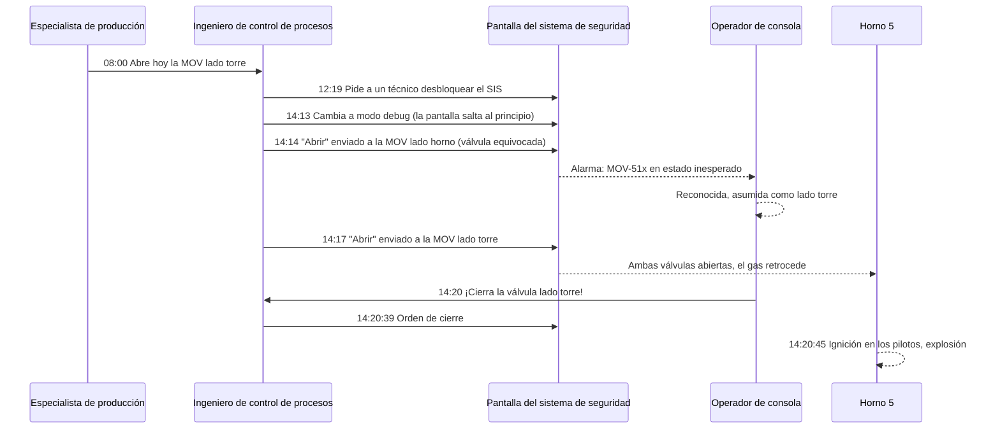

*Imagen: waa towaw en Unsplash.*

A las 2:14 de la tarde del 4 de junio de 2025, un ingeniero de control de procesos estaba sentado en una estación de ingeniería junto a la sala de control de un craqueador de etano recién estrenado en Monaca, Pensilvania, e hizo clic en "abrir" sobre una válvula. Era la válvula equivocada. La correcta estaba más abajo en la misma pantalla y era idéntica salvo por el último dígito de su etiqueta.

Seis minutos después, el Horno 5 explotó.

Nadie murió. Nadie resultó siquiera herido de gravedad, lo que roza el milagro cuando lees qué había alrededor de ese horno. Hubo que evacuar a quince personas de la unidad. Un contratista quedó atrapado en el ascensor justo al lado del Horno 5 y tuvo que ser rescatado. Ese día había 529 contratistas en la planta, junto a 351 empleados de Shell. El horno estuvo fuera de servicio siete meses y la factura rondó los 95 millones de dólares.

El 16 de septiembre de 2026, la Junta de Seguridad Química de Estados Unidos (la CSB, la agencia federal que investiga accidentes químicos) publicó su [informe final](https://www.csb.gov/assets/1/6/Shell_Investigation_Report_Publication.pdf), n.º 2025-05-I-PA. Son 70 páginas sobre cómo un trabajo rutinario, hecho con éxito 19 veces antes, se tuerce en la vigésima. Si eres contratista y trabajas cerca de equipos que "en realidad no están arrancando", aquí va la versión corta.

## Qué dice el informe de la CSB

La planta Shell Polymers Monaca convierte etano en etileno, la materia prima del plástico de polietileno. Lo hace en siete hornos de craqueo que funcionan en paralelo. Cada horno calienta etano y vapor a unos 1.545 °F (840 °C) dentro de serpentines metálicos, el etano se "craquea" en etileno e hidrógeno, y el gas caliente se enfría de golpe, se combina con la producción de los demás hornos y se envía a una torre de enfriamiento.

El craqueo produce coque, un residuo sólido de carbono. Parte de él se acumula en una gran tubería vertical situada después del primer intercambiador, llamada trampa de coque. El manual del licenciante del horno dice que las trampas deben vaciarse aproximadamente una vez al año a plena producción. La planta arrancó en noviembre de 2022. En la primavera de 2025, ninguna de las siete trampas de coque se había limpiado nunca. Cuando se abrió la trampa del Horno 1 a finales de marzo de 2025, el coque llegaba casi hasta la boca de hombre.

Así que Shell empezó a limpiarlas. Cuatro de ellas se hicieron durante una parada de la unidad. El Horno 5 era el siguiente.

Cada horno tiene dos válvulas motorizadas (MOV) de 36 pulgadas en serie entre él y la torre de enfriamiento: una válvula "lado horno" y una válvula "lado torre". Para el trabajo, ambas se cerraron, se aisló la purga de vapor entre sus compuertas y se abrió un venteo entre ellas. Un doble bloqueo con venteo en toda regla. La trampa de coque se limpió en tres días sin incidentes.

Luego llegó la parte para la que nadie había escrito un procedimiento: volver a poner el horno en marcha.

## Los seis minutos, paso a paso

La cronología de la CSB (Apéndice A) se lee como una cuenta atrás. Solo cargos; el informe no necesita nombres para dejar claro el punto.

- **8:00, 4 de junio.** En la reunión de la mañana, el especialista de producción asigna la tarea de abrir la MOV lado torre a un ingeniero de control de procesos. El ingeniero nunca lo ha hecho. Nadie menciona el formulario de bypass del sistema de seguridad que la propia política de la planta exigía.
- **12:19.** El ingeniero pide a un técnico de instrumentación que desbloquee el sistema instrumentado de seguridad (el SIS, la capa de control independiente cuyo único trabajo es parar las cosas de forma segura). La válvula lado torre solo podía abrirse desde la pantalla de lógica del SIS, por un ingeniero de control, no por un operador en campo.
- **14:13.** El ingeniero sigue una ayuda de trabajo escrita, envía la orden de apertura y no pasa nada. Un compañero señala que el SIS está en modo de solo lectura y necesita estar en modo "debug". La ayuda de trabajo tenía esos pasos en el orden equivocado. Cuando el ingeniero cambia de modo, la pantalla se refresca y salta de vuelta al principio.
- **14:14.** El ingeniero hace clic en abrir. La pantalla ahora muestra la válvula lado horno en la parte superior, no la válvula lado torre en la inferior. La válvula lado horno empieza a abrirse. Salta una alarma en la sala de control: una MOV está en un estado inesperado. Su texto es idéntico al de la alarma de la válvula lado torre salvo por el último dígito. El operador de consola, que sabe que el ingeniero está a punto de abrir la válvula lado torre, la reconoce y sigue adelante.
- **14:16.** El ingeniero nota que la válvula lado torre no se ha movido, concluye (erróneamente) que la válvula lado horno ya debía de estar abierta, y retira la orden.
- **14:17.** El ingeniero baja en la pantalla y abre la válvula lado torre. Ahora las dos válvulas están abiertas. Otros cuatro hornos están craqueando, el colector detrás de la válvula lado torre está a unos 5 psig (0,35 bar), y el Horno 5 está a presión atmosférica con sus pilotos encendidos.
- **14:20.** El operador de consola ve la válvula lado horno abierta y la válvula lado torre al 78 por ciento y todavía en movimiento, corre a la estación de ingeniería y le dice al ingeniero que la cierre. La orden de cierre sale a las 14:20:39.
- **14:20:45.** Unas 641 libras (290 kg) de gas craqueado han retrocedido hasta el hogar del horno. Alcanzan los pilotos. El hogar, diseñado para soportar 0,01 psig, revienta.

Cada válvula tarda cuatro minutos en ir de cerrada a totalmente abierta. El gas retrocedió durante unos dos minutos y medio. El ventilador de tiro inducido del horno estaba en control manual de velocidad, dejado así tras una actualización de firmware el día anterior, y no podía extraer el gas más rápido de lo que entraba. El detector de monóxido de carbono del hogar habría dado alarma unos 90 segundos antes de la ignición. Estaba suprimido.

## Lo que parecía rutina se torció

Lo incómodo: la misma tarea se había hecho 19 veces antes, por la misma vía, sin problema.

Los diseñadores asumieron que solo una de las dos MOV se cerraría alguna vez para aislamiento. El panel de control local de campo, el que usan los operadores, nunca se programó para reabrir las dos. Así que cada vez que Shell cerraba ambas válvulas para mantenimiento, en lugar de montar una brida ciega de 36 pulgadas, salir de ese estado significaba que un ingeniero de control puenteara el sistema de seguridad desde la sala de ingeniería. Eso era lo normal. Funcionaba. Hasta que dejó de funcionar.

Súmale las otras decisiones de ese día, cada una razonable por sí sola:

- **Los pilotos siguieron encendidos.** Shell ya había dañado el refractario de un horno cuando el agua tocó un suelo de ladrillo frío durante una prueba hidráulica, así que los pilotos se mantuvieron encendidos durante toda la limpieza de la trampa de coque para mantener el hogar por encima del punto de rocío. El propio plan de aislamiento de la planta exigía aislar el gas de los pilotos. El manual del licenciante decía que para vaciar la trampa de coque el horno debía estar en "parada completa, aislado y enfriado". No se cumplió ninguna de las dos cosas, y la revisión de la desviación que exigía la política de la planta nunca se hizo.
- **Las alarmas estaban desactivadas por diseño.** En modo solo pilotos, las alarmas de alta presión en el hogar, de monóxido de carbono y de metano se suprimían automáticamente para evitar alarmas molestas. Sensato cuando un horno está parado. Fatal en el único modo en que esas alarmas eran el único aviso.
- **El procedimiento de arranque no aplicaba.** El procedimiento de arranque de horno de Shell no enciende el primer piloto hasta el paso 98. Los pilotos ya estaban encendidos. Así que no había procedimiento para el estado en que realmente se encontraba el horno, y la tarea recayó en una ayuda de trabajo escrita con los pasos desordenados.
- **No contaba como arranque.** Esta es la línea a la que seguimos volviendo, citada literalmente de la Tabla 2 del informe: "La transición hacia y desde una actividad de mantenimiento no se considera una parada, un arranque ni una situación anormal. En consecuencia, no se estableció ninguna zona de exclusión." Por eso había un operario en el ascensor y gente alrededor de los Hornos 4, 5 y 6.

Nada de esto estaba oculto. El propio análisis de riesgos de Shell de 2023 había identificado exactamente este escenario, el retroceso de gas craqueado hacia un horno fuera de servicio a través de las MOV, y lo había calificado como una explosión que podía matar a varias personas. El equipo decidió que dos controles administrativos bastaban: un operador respondiendo a una alarma de metano, y un procedimiento de arranque. Añadir controles de ingeniería, escribieron, sería "groseramente desproporcionado respecto a la reducción del riesgo". El 4 de junio, la alarma estaba suprimida y el procedimiento no estaba en uso.

*Imagen: Alexandre Daoust en Unsplash.*

## La pantalla que hizo scroll

La CSB dedica un capítulo entero a la interfaz hombre-máquina (HMI), que no es más que la pantalla que mira una persona para operar la planta. El fallo es tan corriente que probablemente has hecho una versión de él en tu móvil.

Tres válvulas, una pantalla, de arriba abajo: lado horno, decoquizado, lado torre. Hay que hacer scroll para ir de la primera a la última. Sus bloques de lógica se ven iguales. Sus etiquetas son 511, 512 y 513. La propia especificación de diseño de HMI de Shell dice que las etiquetas deben ser "lo más completas posible", y su pantalla de ejemplo muestra equipos etiquetados como "CRACKED GAS DRYER A / B / C". Nadie aplicó eso a las válvulas del horno. En ningún sitio de la pantalla ponía "MOV lado horno" o "MOV lado torre".

Así que cuando el cambio de modo refrescó la pantalla y saltó al principio, el ingeniero estaba mirando un bloque idéntico al que había estado mirando un segundo antes. El clic fue a la válvula equivocada. La alarma que siguió tenía el mismo texto que la esperada, menos un dígito, así que el operador de consola, la única persona que podía haberlo detectado, no lo hizo.

La norma del sector a la que apunta la CSB (ANSI/ISA-101.01-2015) dice que las órdenes que actúan directamente sobre el proceso "deben requerir múltiples acciones de entrada del operador y no ser posibles con una única acción de entrada accidental". No había paso de confirmación, ni enclavamiento que se negara a abrir la válvula lado horno mientras la válvula lado torre estaba cerrada y los pilotos encendidos. Y aquí viene lo que duele: el licenciante había suministrado uno. El diseño de Linde para el panel de campo incluía un enclavamiento secuencial de llaves y una función SIL 2 que cerraría la válvula lado horno ante la baja presión que señala un retroceso. Nunca se programó para el estado de doble aislamiento. Reprogramar el panel estaba en una lista de proyectos de mejora. Otros proyectos se financiaron primero.

Escribimos sobre una [confusión de bridas en Deer Park](/es/blog/pemex-deer-park-flange-misidentification) que tenía la misma forma: el equipo equivocado, elegido de buena fe, porque dos cosas distintas parecían iguales. Monaca es esa misma historia trasladada a una pantalla.

## Once controles, todos de papel

La propia investigación de Shell contó 11 salvaguardas que deberían haber evitado esto. La conclusión de la CSB es contundente: cada una era un control administrativo. Una política, un procedimiento, una alarma a la que alguien tenía que responder. Ninguna era una pieza de ingeniería que se negara físicamente a dejar dos válvulas abiertas a la vez con los pilotos encendidos.

La frase de la CSB para que conste, literal de las conclusiones: "Shell eligió activamente confiar únicamente en controles administrativos para prevenir una explosión potencialmente mortal en la revalidación de su análisis de riesgos del proceso."

Si alguna vez has estado en un estudio de riesgos donde alguien dice "el procedimiento lo cubre", esa es la frase que hay que recordar. Un procedimiento lo cubre hasta que deja de aplicar al estado en que realmente está el equipo, y entonces no cubre nada.

OSHA emitió tres citaciones en diciembre de 2025 con una sanción propuesta de 26.480 dólares: el análisis de riesgos no cubría el decoquizado ni la vuelta a servicio, no abordaba los factores humanos en operaciones no rutinarias, y no había procedimiento escrito para operaciones temporales como devolver las MOV a servicio tras un aislamiento. Veintiséis mil dólares, frente a un horno de 95 millones. La multa nunca es el coste.

Desde la explosión, Shell ha reprogramado el panel de campo del Horno 5 para que los operadores puedan manejar las tres válvulas desde campo, ha añadido lógica en el SIS que mantiene cerrada la válvula lado torre si la válvula lado horno se abre por error, y ha escrito un procedimiento llamado "Recuperación tras mantenimiento con doble aislamiento". Las dos recomendaciones de la CSB van más allá: repasar todo el análisis de riesgos de la unidad, encontrar cada escenario mortal que descansa solo en controles de papel, y eliminarlo con ingeniería.

## Por qué importa desde la silla del contratista

Nadie en esta historia era contratista salvo la única persona que sabemos que estaba en el lugar más peligroso: el operario del ascensor junto al Horno 5.

Piensa qué significó "no es un arranque" para esa persona. Las zonas de exclusión en Monaca se anuncian durante arranques y situaciones anormales. Volver de una limpieza de trampa de coque, con los pilotos encendidos y un ingeniero de control puenteando el sistema de seguridad, no era ninguna de las dos. Así que el ascensor funcionaba, y los 529 contratistas de la planta no tenían motivo para pensar que el Horno 5 fuera distinto del Horno 4.

Las cuadrillas con formación SCC/VCA practican cada año la conciencia de arranque y parada: saber cuándo la unidad de al lado cambia de estado, conocer las señales de alarma, conocer el punto de reunión. Lo que la tarjeta de formación no cubre es esta zona gris. Una unidad "saliendo de mantenimiento" no está en el procedimiento de arranque, así que no está en la política de zonas de exclusión, así que no está en tu permiso, así que nadie te lo dice.

Algunas cosas que un jefe de cuadrilla puede hacer de verdad con esto:

- **Pregunta en qué modo está el equipo vecino y a cuál está pasando.** No "¿está funcionando el Horno 5?", sino "¿alguien va a cambiar hoy la alineación de válvulas del Horno 5, y desde dónde?". Si la respuesta es "un ingeniero desde el edificio de control", es un horno movido por alguien que no lo ve. Trátalo como un arranque, lo haga la planta o no.
- **Trata los pilotos encendidos como un horno vivo.** Si hay llama en el hogar, el hogar puede encender cualquier cosa que entre. El aislamiento que protege a la cuadrilla en la trampa de coque no hace nada por la gente junto al hogar una vez que ese aislamiento se está retirando.
- **Pregunta si las alarmas están suprimidas.** Las plantas suprimen alarmas en modos de mantenimiento para cortar las avalanchas de avisos molestos. Tu cuadrilla necesita saber si la detección de gas del equipo de al lado está hablando ahora mismo con alguien.
- **Los ascensores y las escaleras junto a equipos de fuego no son terreno neutral durante un cambio de válvulas.** Si ese día eres tú quien maneja el ascensor, sabe qué hay en el hogar junto al que se detiene.
- **Cuando la ayuda de trabajo no coincide con la pantalla, para.** Esto va tanto para el ingeniero joven como para el técnico de campo. El paso que dice "haz clic en abrir" y no hace nada es el momento de buscar a alguien que ya lo haya hecho, no de probar otro modo y volver a hacer clic.

## La lección

Diecinueve repeticiones exitosas de un método inseguro no demuestran que sea seguro. Demuestran que todavía no has tenido mala suerte. La CSB cita la guía del CCPS sobre el bypass de sistemas de seguridad, y es la mejor línea del informe para un jefe de cuadrilla: "¿Cómo está evitando la normalización de la desviación asociada a este fenómeno (es decir, no ha pasado antes, así que no pasará ahora)?"

Para el técnico joven: una válvula que tarda cuatro minutos en abrirse dio dos minutos y medio de retroceso antes de que alguien lo notara. El operador de consola que lo detectó y corrió a la sala de ingeniería hizo lo correcto y aun así llegó seis segundos tarde. El peligro es estar cerca con los pilotos encendidos y las válvulas abiertas. No estés cerca.

Para el jefe de cuadrilla: cuando la planta diga "no es un arranque", pregunta qué es entonces. Si la respuesta incluye a alguien puenteando un sistema de seguridad para mover una válvula de 36 pulgadas en un horno con llama dentro, ya tienes tu respuesta.

## Créditos y lecturas adicionales

- U.S. Chemical Safety and Hazard Investigation Board, *Furnace Explosion and Fire at Shell Polymers Monaca*, Investigation Report No. 2025-05-I-PA, septiembre de 2026. [Informe completo (PDF)](https://www.csb.gov/assets/1/6/Shell_Investigation_Report_Publication.pdf) y [nota de prensa de la CSB del 16 de septiembre de 2026](https://www.csb.gov/us-chemical-safety-board-releases-final-investigation-report-on-2025-explosion-and-fire-at-shell-polymers-monaca-facility-in-pennsylvania/).
- ANSI/ISA-101.01-2015, *Human-machine interfaces for Process Automation Systems*. La norma con la que la CSB mide la pantalla de válvulas de Shell.
- CCPS, *Safe Work Practice: Temporary Instrumentation and Controls Bypass*. La fuente de la pregunta "no ha pasado antes".
- Nuestras entradas anteriores sobre la [confusión de equipos en Pemex Deer Park](/es/blog/pemex-deer-park-flange-misidentification) y la [rotura de tubo en el horno de Marathon Martinez](/es/blog/marathon-martinez-fired-heater-tube-rupture-csb), otros dos casos de la CSB en los que un equipo de fuego hizo algo que nadie en campo esperaba.
