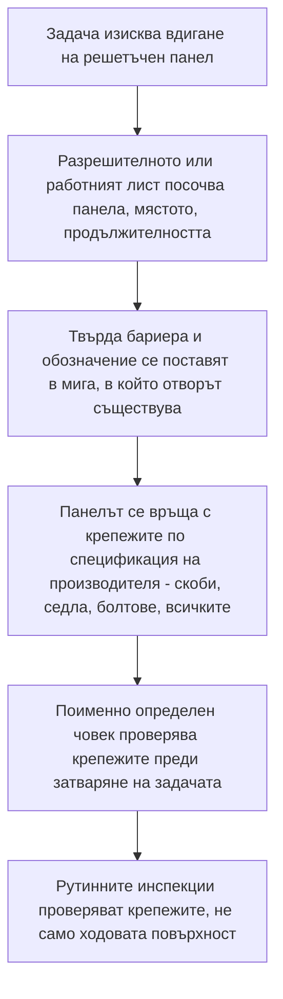

*Снимка: leonardo mendes, Unsplash.*

Следобедът на 22 януари 2023 г. 50-годишен кранист на Valaris 121 — самоповдигаща се (jack-up) сондажна платформа на буксир през Северно море към Дънди — допива кафето си в столовата, взима радиостанцията и излиза на палубата. Спасителен пояс се е разхлабил от времето и той иска да го върне на мястото му. Дребна задача. От онези, които дори не споменаваш при предаване на смяната.

Около 16:00 ч. колега, работещ в палубната надстройка, чува силен шум. Когато екипажът отива да провери, намира палубна решетка, излязла от рамката си, и зейнала дупка там, където допреди малко е имало пътека. До вратата на шлюза лежат каска, чифт ръкавици и радиостанция.

Бреговата охрана търси цяла нощ и прекратява операцията на следващия ден. Тялото му така и не е открито.

На 18 май 2026 г. — повече от три години по-късно — Ensco Offshore UK Limited, компанията-оператор на платформата, се признава за виновна пред шерифския съд в Абърдийн в нарушение на британския Закон за здраве и безопасност при работа и е глобена с 267 000 паунда плюс 20 025 паунда допълнителна санкция в полза на пострадалите. HSE — Health and Safety Executive, британският национален регулатор по безопасност на труда — публикува заключенията си заедно с присъдата. Главен инспектор на HSE събира извода в едно изречение: „Ако компанията беше взела относително прости мерки за откриване и контрол на съответните рискове, особено по време на преместването на платформата, е много вероятно инцидентът изобщо да не се беше случил."

*Относително прости мерки.* Запомнете тази фраза. Този текст е за това какви са били тези мерки, защо никой не ги е взел и защо същата пролука съществува по палубите и конструкциите на рафинериите на сушата — включително онези, по които turnaround екипите ходят всеки ден.

## Какво се случва на Valaris 121

Първо картината. Jack-up платформа на буксир не е платформа в обичайния си режим. Краката ѝ са вдигнати, тя плава и се движи с морето. Онзи следобед времето се влошава: вятър над 30 мили в час и вълни над пет метра, минаващи под и срещу корпуса.

Части от палубата — като повдигнатите пътеки и площадки на почти всяка офшорна инсталация и рафинерийна конструкция — са настлани с решетъчен под (grating): панели от открита мрежа, през която се вижда, легнали в стоманена рамка. Решетъчните панели не стоят на място само от гравитацията. Държат ги фиксатори — в този случай скоби Hilti, малки крепежи, които притискат панела към носещата стомана отдолу, за да не може да се повдигне, да се плъзне или да „изходи" от рамката си.

Ето какво установява разследването на HSE. Въпросният панел не е бил закрепен според спецификацията на производителя — крепежната схема, за която панелът е проектиран. А проверките, през които панелът е минавал през годините, никога не са гледали дали скобите изобщо са там и дали си вършат работата. На хартия палубата е била наред. Отдолу панелът се е държал на по-малко, отколкото е проектиран.

После се намесва морето. Вълните не само натискат плаваща конструкция надолу — водата и въздухът, движещи се под палубата, натискат *нагоре*. В хода на онзи следобед, заключава HSE, вълновото действие е приложило достатъчно възходяща сила върху долната страна на решетката, за да разруши крепежите и да измести панела. Някъде по палуба, по която е минавал стотици пъти, човек с 16 години в офшора — изкачил се от общ работник до палубен бригадир до кранист — стъпва там, където винаги е имало под. А подът го няма.

Разследването е достатъчно задълбочено, за да затвори и другите врати. Отказалите крепежи и скоби отиват в лабораторията на HSE в Бъкстън, която не открива следи от инструменти — никой не е пипал нищо. Това не е саботаж и не е необяснима случайност. Това са крепежи, които никога не са били както трябва, проверки, които никога не са погледнали, и време, което е намерило пролуката.

## Какво установява разследването

Ако оголим историята, остават три прости констатации. Всяка си заслужава да се прочете бавно, защото нито една не е специфична за офшорния сондаж. Те са за ходовите повърхности навсякъде.

**Панелът не е бил закрепен така, както е предписал производителят.** Решетъчните системи идват със спецификация за закрепване: колко скоби или крепежа на панел, къде се поставят. Някъде между монтажа и онзи януарски следобед този панел се е оказал с по-малко. Никой не е решавал да направи палубата опасна. Тя просто тихо се е отдалечила от спецификацията — както става, когато нищо не кара никого да погледне.

**Проверките не са проверявали крепежите.** Платформата е имала рутинни поддръжки и инспекции и палубата е била оглеждана. Но гледането *на* решетката не казва почти нищо — панелът си лежи в рамката и изглежда еднакво независимо дали е стегнат по спецификация, или се крепи хлабаво. Скобите живеят отдолу, извън погледа. Инспекция, която не вижда самите крепежи, е инспекция на боята, не на пода.

**Преместването на платформата променя натоварванията и никой не задава въпроса наново.** Платформа на буксир в тежко време е в това, което хората от безопасността наричат преходно състояние — временна ситуация, за която ежедневните оценки на риска не са писани. Палуби, които в нормална експлоатация никога не виждат възходящ вълнови натиск, изведнъж го получават. Цитатът на инспектора посочва точно това: простите мерки са имали значение „особено по време на преместването на платформата". Компанията е имала плаваща конструкция, тръгнала към петметрови вълни, а стандартното допускане — *подовете са подове* — никога не е било преразгледано за прехода.

## Защо опитен човек стъпва в дупка

Ето емоционалното ядро на тази история — и си струва да поседим с него.

Нищо в преценката на този човек не се е провалило. Не е бързал, не е рязал ъгли, не е правил нищо, което една permit система изобщо би отбелязала. Той е вървял. Ходенето по палуба е под прага на онова, което който и да е от нас третира като задача. За него няма toolbox talk. Никоя оценка на риска в последната минута не пита: „Истински ли е подът?"

И точно това е механизмът. Всяка система за безопасност, под която някога сте работили — разрешителни, анализи на безопасността на задачата, PPE матрици — тръгва от *задачата*. Отказът на решетъчния под атакува нещо под всичко това: допусканията, върху които стоите, докато вършите всяка задача. Проверявате дали клапанът е изолиран. Проверявате газдетектора си. Но не проверявате, с ръка на сърцето, дали индустриалният под между вас и четиридесетметровата пропаст е закрепен — защото проверката му не е ваша работа. И ето неудобната част: на онази платформа проверката на скобите очевидно не е била ничия работа. Не е била вписана в ничия инспекционна карта. Така остава непогледната, докато морето не поглежда вместо всички.

Има още един детайл, който прави историята осезаема. Той излиза навън, за да закрепи разхлабен спасителен пояс — спасително средство, разтръскано от същото време, което няколко метра встрани разхлабва решетката. Платформата е казвала на всички, по малки начини, че този следобед морето разглобява разни неща. Заради едното разхлабено нещо изпращат човек да го оправи. Другото разхлабено нещо е бил подът.

*Снимка: nyxx tape, Unsplash.*

## Моделът зад „единичния случай"

Ако това беше един-единствен злополучен панел, пак щеше да си струва да се разкаже. Но не е един-единствен злополучен панел.

Публикация в The Chemical Engineer около присъдата преброява десет предписания (improvement notices) на HSE към британския бизнес на оператора за пет години — четири за повдигателни операции, две за управление на азбест, едно след непланирано изпускане на около 6000 кг въглеводороден газ през 2022 г., и — онези, от които трябва да настръхнете: две конкретно за незакрепени решетъчни подове. Регулаторът е сигнализирал писмено за хлабави подове в този флот още преди фаталния инцидент.

И после се случва отново. През ноември 2025 г. — почти три години след загубата на краниста — 32-годишен работник на същата платформа пада около 80 фута (24 метра), след като стъпва в зона, където решетка е била свалена за почистване, според същата публикация. Този път не отказала скоба: панел, съзнателно изваден, и човек, който може да влезе в отвора. Различен път на отказа, същата фатална геометрия — дупка там, където трябва да има под, и вървящ човек, който няма причина да я очаква.

След разследването от 2023 г. компанията, по данни от публикациите, подменя полимерните решетки в целия си флот с горещо поцинкована стомана. Това е истинска мярка и заслужава признание. Но забележете какво казва падането от ноември 2025 г.: може да подмените всеки панел на инсталацията и това не пази никого в мига, в който панел бъде *свален*, а отворът не е овладян. Опасността никога не е била материалът. Опасността е отворът.

## Какво значи това на рафинериен turnaround

Може би четете това от рафинерия, не от платформа, и си мислите, че Северно море е чужд проблем. Тръгнете по която и да е инсталация с тази мисъл и тя няма да преживее първия тръбен мост.

Рафинерийните конструкции са настлани със същите решетки, държани от същите скоби и седла, инспектирани със същото минаване покрай тях. А turnaround-ът — плановият ремонтен престой, когато стотици допълнителни контрактори заливат завода — е за рафинерията това, което буксирът е за Valaris 121: преходното състояние. По време на turnaround решетъчни панели се вадят постоянно: за скеле, за кабели и шлангове, за спускане на оборудване, за достъп отдолу. Всеки вдигнат панел е отвор на височина, често в пътека, която скелетаджия, изолаторджия или катализаторен работник ще пресече на тъмно в 03:00 с две заети ръце.

Стандартните контроли не са екзотика — и този инцидент е чеклист на точно местата, където те се чупят:

Две от тези кутийки са онези, които Valaris 121 показва как отказват на живо. Кутия D: панел, върнат без пълния комплект крепежи, изглежда завършен, а не е — и може да стои така години, докато вятър, вибрации, изпуснат товар или заливане с вода не му зададат трудния въпрос. Кутия F: инспекционна рутина, която никога не проверява физически крепежите, ще заверява хлабав под вечно.

Екипите със SCC/VCA обучение — европейската сертификация за безопасност на контракторите, която нашите хора носят — учат за отвори и бариери още във въвеждащия курс. Но курсът предполага, че решетката, която е *на място*, е закрепена. Попитайте честно из екипа: на чия карта, на последната ви обект, пишеше „провери крепежите на решетките"? За повечето обекти истинският отговор е: на ничия. Такъв е бил отговорът и на Valaris 121.

## Урокът за бригадири и млади техници

Изведен директно от констатациите на HSE, ето какво реално можете да отнесете на следващата задача:

1. **Третирайте всеки вдигнат решетъчен панел като дупка, не като стъпка от задачата.** Бариерата се вдига, когато панелът се вдига — не в края на смяната, не „ние сме до него". Падането от ноември 2025 г. е свален панел, не отказал.

2. **Възстановяване значи крепежи, не полагане.** Панел, пуснат обратно в рамката си, не е възстановен. Той е камуфлаж. Някой, посочен поименно на хартия, проверява, че скобите са сложени и стегнати, преди разрешителното да се затвори.

3. **Когато заводът влиза в преходно състояние, задайте наново скучните въпроси.** На буксир, в буря, при пропарване, под turnaround трафик — ежедневните допускания за конструкциите са писани за ежедневното състояние. Инспекторът на HSE окачва целия случай на преместването на платформата. Вашата версия на преместването е самият turnaround.

4. **Ако инспекцията ви не вижда крепежа, тя не го инспектира.** Обхождането на палубата хваща корозия и щети. То не проверява скоби отдолу. Някой трябва да се наведе, да светне под панела и да брои крепежи срещу спецификацията — по някакъв график, със записано име.

5. **Гледайте какво времето вече прави.** Разтръскан спасителен пояс, панел, който „бумти" под краката, парапет, който играе в гнездото си — това е конструкцията, която ви казва, че средата разглобява закрепвания. Реакцията на едно разхлабено нещо не бива да е само да оправиш него; тя е да попиташ какво още току-що се е пуснало.

За младия техник, който тегли чертата: човекът, който загина, не беше най-неопитният на онази платформа. Беше от най-опитните. Шестнайсет години, три повишения, излязъл да свърши съвестно дребна задача, която никой не му е възлагал. Опитът те пази от опасностите, които виждаш. Той е безсилен срещу под, който тихо е престанал да бъде под — само система, която проверява крепежите, помага там. Работете за хора, които проверяват.

## Източници и допълнително четене

- Прессъобщение на HSE, *Offshore firm fined following death of worker on Valaris 121 whose body was never recovered* (18 май 2026): [https://press.hse.gov.uk/2026/05/18/offshore-firm-fined-following-death-of-worker-on-valaris-121-whose-body-was-never-recovered/](https://press.hse.gov.uk/2026/05/18/offshore-firm-fined-following-death-of-worker-on-valaris-121-whose-body-was-never-recovered/)
- The Chemical Engineer, *Valaris receives tenth UK safety warning in five years and fined over worker's death*: [https://www.thechemicalengineer.com/news/valaris-receives-tenth-uk-safety-warning-in-five-years-and-fined-over-worker-s-death](https://www.thechemicalengineer.com/news/valaris-receives-tenth-uk-safety-warning-in-five-years-and-fined-over-worker-s-death)
- The Maritime Executive, *Valaris Fined for Rig Worker's Fatal Fall Through Hole in Deck Grating*: [https://maritime-executive.com/article/valaris-fined-for-rig-worker-s-fatal-fall-through-hole-in-deck-grating](https://maritime-executive.com/article/valaris-fined-for-rig-worker-s-fatal-fall-through-hole-in-deck-grating)
- Насоки на HSE за безопасна работа на височина и ходови повърхности: [https://www.hse.gov.uk/work-at-height/](https://www.hse.gov.uk/work-at-height/)
- Още за това как преходните състояния изненадват екипите — вижте нашия прочит на [разрива на пещна тръба в Marathon Martinez](/bg/blog/marathon-martinez-fired-heater-tube-rupture-csb) (първо пускане) и [забравените работни лампи в барабана в Dow Plaquemine](/bg/blog/forgotten-work-lights-dow-plaquemine-fme) (формуляр за закриване на turnaround).
