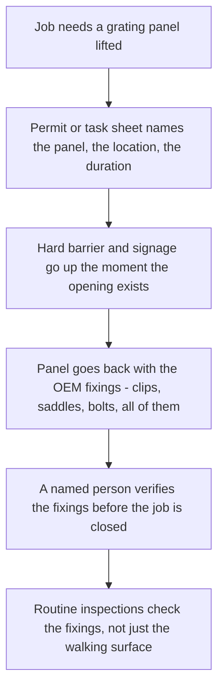

*Image: leonardo mendes on Unsplash.*

On the afternoon of 22 January 2023, a 50-year-old crane operator on the Valaris 121 — a jack-up drilling rig under tow across the North Sea toward Dundee — finished a coffee in the mess, picked up his radio, and went out on deck. A lifebuoy had come loose in the weather, and he meant to put it back where it belonged. A small job. The kind you don't even mention at handover.

Around 4 p.m., a colleague working in the deckhouse heard a loud noise. When the crew went to look, they found a deck grating out of its frame and an open hole where a walkway used to be. Near the airlock door lay a hard hat, a pair of gloves, and a radio.

The coastguard searched through the night and called it off the next day. His body was never recovered.

On 18 May 2026 — more than three years later — Ensco Offshore UK Limited, the company operating the rig, pleaded guilty at Aberdeen Sheriff's Court to breaching the UK's Health and Safety at Work Act and was fined £267,000, plus a £20,025 victim surcharge. The HSE — the Health and Safety Executive, Britain's national workplace safety regulator — published its findings with the sentencing. An HSE principal inspector put the conclusion in one sentence: "Had the company taken relatively simple measures to identify and control the underlying risks, particularly during the rig move, it is highly likely the incident would never have occurred."

*Relatively simple measures.* Hold onto that phrase. This post is about what those measures were, why nobody took them, and why the same gap exists on refinery decks and structures onshore — including the ones turnaround crews walk every day.

## What Happened on the Valaris 121

First, the picture. A jack-up rig under tow is not a rig doing its normal job. Its legs are up, it's floating, and it moves with the sea. That afternoon the weather was getting worse: winds over 30 mph and waves over five metres running under and against the hull.

Parts of the rig's deck — like the elevated walkways and platforms on almost every offshore installation and refinery structure — were floored with grating: panels of open mesh you can see through, sitting in a steel frame. Grating panels don't stay put by gravity alone. They're held down by fixings — in this case Hilti clips, small fasteners that clamp the panel to the supporting steel underneath so it can't lift, slide, or walk out of its frame.

Here's what the HSE investigation found. The grating panel in question had not been secured in line with the original equipment manufacturer's specification — the fixing arrangement the panel was designed to have. And the inspections the panel had received over time never checked whether the clips were actually there and doing their job. On paper, the deck was fine. Underneath, the panel was holding on with less than it was designed for.

Then the sea got involved. Waves don't just push down on a floating structure — water and air moving under a deck push *up*. Over the course of that afternoon, the HSE concluded, wave action applied enough upward force to the underside of the grating to fail the fixings and displace the panel. Somewhere on a deck he had walked hundreds of times, a man with 16 years offshore — who had worked his way up from roustabout to deck foreman to crane operator — stepped where a floor had always been, and the floor wasn't there.

The investigation was thorough enough to close the other doors, too. The failed fixings and clips went to the HSE's laboratory in Buxton, which found no tool marks — nobody had tampered with anything. This wasn't sabotage and it wasn't a freak one-off. It was fixings that were never right, inspections that never looked, and weather that found the gap.

## What the Investigation Found

Strip the story down and there are three plain findings. Each one is worth reading slowly, because none of them is about offshore drilling specifically. They're about walking surfaces anywhere.

**The panel wasn't secured the way its manufacturer said it should be.** Grating systems come with a securing specification: how many clips or fasteners per panel, where they go. Somewhere between installation and that January afternoon, this panel ended up with less than that. Nobody decided to make the deck dangerous. It just quietly drifted away from spec, the way things do when nothing forces anyone to look.

**The inspections didn't check the fixings.** The rig had maintenance and inspection routines, and the deck got looked at. But looking *at* a grating tells you almost nothing — the panel sits in its frame and looks identical whether it's clipped down properly or resting loose. The clips live underneath, out of sight. An inspection that doesn't get eyes on the fixings themselves is an inspection of the paint, not the floor.

**The rig move changed the loads, and nobody re-asked the question.** A rig under tow in heavy weather is in what safety people call a transient state — a temporary condition the everyday risk assessments weren't written for. Decks that never see wave uplift in normal operation suddenly do. The inspector's quote singles this out: the simple measures mattered "particularly during the rig move." The company had a floating structure heading into five-metre seas, and the standing assumption — *the floors are floors* — never got re-examined for the trip.

## Why an Experienced Hand Stepped Into a Hole

Here's the emotional core of this one, and it's worth sitting with.

Nothing about the man's judgement failed. He wasn't rushing, wasn't cutting a corner, wasn't doing anything the permit system would ever have flagged. He was walking. Walking across a deck is below the threshold of what any of us treat as a task. There's no toolbox talk for it. No last-minute risk assessment asks, "Is the floor real?"

And that's exactly the mechanism. Every safety system you've ever worked under — permits, job safety analyses, PPE matrices — starts from the *task*. Grating failure attacks something underneath all of that: the assumptions you stand on while doing every task. You check the valve is isolated. You check your gas monitor. You do not check, hand on heart, that the industrial flooring between you and a forty-metre drop is fastened down — because checking it isn't your job, and here's the uncomfortable part: on that rig, verifying the clips was apparently nobody's job. Not written into anyone's inspection card. That's how it went unlooked-at until the sea did the looking.

There's one more detail that makes this land. He went out there to re-secure a loose lifebuoy — a piece of rescue equipment shaken loose by the same weather that was working the grating loose a few metres away. The rig was telling everyone, in small ways, that the sea was taking things apart that afternoon. One loose item got a man dispatched to fix it. The other one was the floor.

*Image: nyxx tape on Unsplash.*

## The Pattern Behind the One-Off

If this were a single unlucky panel, it would still be worth telling. It isn't a single unlucky panel.

Reporting in The Chemical Engineer around the sentencing counted ten HSE improvement notices served on the operator's UK business over five years — four on lifting operations, two on asbestos management, one after an unplanned release of about 6,000 kg of hydrocarbon gas in 2022, and, the ones that should make you sit up: two specifically about unsecured gratings. The regulator had flagged loose flooring on this fleet before the fatality, in writing.

And then it happened again. In November 2025 — almost three years after the crane operator was lost — a 32-year-old worker on the same rig fell around 80 feet after stepping into an area where grating had been removed for cleaning, according to the same reporting. Not a failed clip that time: a panel deliberately lifted out, with a person able to walk into the opening. Different failure path, same fatal geometry — a hole where a floor should be, and a walking human who had no reason to expect it.

After the 2023 investigation, the company reportedly replaced the polymer grating across its fleet with galvanised steel. That's a real fix, and worth acknowledging. But notice what the November 2025 fall says: you can upgrade every panel on the installation, and it protects nobody the moment a panel is *removed* and the opening isn't controlled. The hazard was never really the material. It's the opening.

## What This Means on a Refinery Turnaround

You might be reading this from a refinery, not a rig, thinking the North Sea is someone else's problem. Walk any unit with that thought and it won't survive the first pipe rack.

Refinery structures are floored with the same grating, held by the same clips and saddles, inspected with the same walk-past. And a turnaround — the planned maintenance shutdown when hundreds of extra contractors flood the plant — is to a refinery what the tow was to the Valaris 121: the transient state. Grating panels come up constantly during a turnaround: to rig scaffolding, to run cable and hose, to drop equipment through, to reach what's underneath. Every lifted panel is an opening at height, often in a walkway that a scaffolder, an insulator, or a catalyst hand will cross in the dark at 03:00 carrying something with both hands.

The standard controls aren't exotic, and this incident is a checklist of exactly where they break:

Two of those boxes are the ones the Valaris 121 shows failing in the wild. Box D: a panel that goes back without its full set of fixings looks finished and isn't — and it can sit like that for years until wind, vibration, a dropped load, or a flood of water asks it the hard question. Box F: an inspection routine that never physically verifies the fixings will certify a loose floor forever.

Crews with SCC/VCA training — the European contractor safety certification our own people carry — get openings and barriers in the induction. But the induction assumes the grating that's *in place* is fixed. Ask around a crew, honestly: whose card, on your last job, said "verify grating fixings"? For most sites the true answer is nobody's. That was the answer on the Valaris 121, too.

## The Lesson for Crew Leads and Young Techs

Built straight from the HSE's findings, here's what you can actually carry onto the next job:

1. **Treat every lifted grating panel as a hole, not a job step.** The barrier goes up when the panel comes up — not at the end of the shift, not "we're standing right here." The November 2025 fall was a removed panel, not a failed one.

2. **Reinstatement means fixings, not placement.** A panel dropped back into its frame is not reinstated. It's camouflage. Somebody named on paper checks the clips are on and tight before the permit closes.

3. **When the plant enters a transient state, re-ask the boring questions.** Under tow, in a storm, during steam-out, under turnaround traffic loads — the everyday assumptions about structures were written for the everyday state. The HSE inspector's quote hangs the whole case on the rig move. Your version of the rig move is the turnaround itself.

4. **If your inspection can't see the fixing, it isn't inspecting it.** Walking the deck checks for corrosion and damage. It does not check clips underneath. Someone has to get low, get a light on the underside, and count fasteners against the spec — on some schedule, owned by some name.

5. **Watch what the weather is already doing.** A lifebuoy shaken loose, a panel drumming underfoot, a handrail working in its socket — those are the structure telling you the environment is undoing fastenings. The response to one loose item shouldn't be to fix that item; it should be to ask what else just let go.

For a young tech weighing this trade: the man who died was not the least experienced person on that rig. He was one of the most. Sixteen years, three promotions, out doing a conscientious little task nobody assigned him. Experience protects you from the hazards you can see. It does nothing against a floor that has quietly stopped being a floor — only a system that checks the fixings does that. Work for people who check.

## Credit and Further Reading

- HSE press release, *Offshore firm fined following death of worker on Valaris 121 whose body was never recovered* (18 May 2026): [https://press.hse.gov.uk/2026/05/18/offshore-firm-fined-following-death-of-worker-on-valaris-121-whose-body-was-never-recovered/](https://press.hse.gov.uk/2026/05/18/offshore-firm-fined-following-death-of-worker-on-valaris-121-whose-body-was-never-recovered/)
- The Chemical Engineer, *Valaris receives tenth UK safety warning in five years and fined over worker's death*: [https://www.thechemicalengineer.com/news/valaris-receives-tenth-uk-safety-warning-in-five-years-and-fined-over-worker-s-death](https://www.thechemicalengineer.com/news/valaris-receives-tenth-uk-safety-warning-in-five-years-and-fined-over-worker-s-death)
- The Maritime Executive, *Valaris Fined for Rig Worker's Fatal Fall Through Hole in Deck Grating*: [https://maritime-executive.com/article/valaris-fined-for-rig-worker-s-fatal-fall-through-hole-in-deck-grating](https://maritime-executive.com/article/valaris-fined-for-rig-worker-s-fatal-fall-through-hole-in-deck-grating)
- HSE guidance on safe work at height and walking surfaces: [https://www.hse.gov.uk/work-at-height/](https://www.hse.gov.uk/work-at-height/)
- For more on how transient states catch crews out, see our reading of the [Marathon Martinez fired heater rupture](/en/blog/marathon-martinez-fired-heater-tube-rupture-csb) (a first start-up) and the [Dow Plaquemine work lights left in a drum](/en/blog/forgotten-work-lights-dow-plaquemine-fme) (a turnaround closure form).
