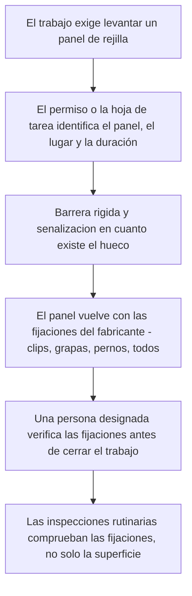

*Imagen: leonardo mendes, Unsplash.*

La tarde del 22 de enero de 2023, un operador de grúa de 50 años de la Valaris 121 —una plataforma de perforación autoelevable (jack-up) remolcada por el mar del Norte rumbo a Dundee— terminó un café en el comedor, cogió su radio y salió a cubierta. Un aro salvavidas se había soltado con el temporal y quería devolverlo a su sitio. Un trabajo menor. De esos que ni se mencionan en el relevo de turno.

Hacia las 16:00, un compañero que trabajaba en la caseta de cubierta oyó un ruido fuerte. Cuando la tripulación fue a mirar, encontró una rejilla de cubierta fuera de su marco y un hueco abierto donde antes había una pasarela. Junto a la puerta de la esclusa había un casco, un par de guantes y una radio.

Los guardacostas buscaron toda la noche y suspendieron la operación al día siguiente. Su cuerpo nunca fue recuperado.

El 18 de mayo de 2026 —más de tres años después— Ensco Offshore UK Limited, la empresa operadora de la plataforma, se declaró culpable ante el tribunal del sheriff de Aberdeen de infringir la Ley británica de Salud y Seguridad en el Trabajo y fue multada con 267.000 libras, más un recargo de 20.025 libras destinado a las víctimas. El HSE —Health and Safety Executive, el regulador nacional británico de seguridad laboral— publicó sus conclusiones junto con la sentencia. Un inspector principal del HSE resumió la conclusión en una frase: «Si la empresa hubiera tomado medidas relativamente sencillas para identificar y controlar los riesgos subyacentes, en particular durante el traslado de la plataforma, es muy probable que el incidente nunca hubiera ocurrido».

*Medidas relativamente sencillas.* Quédese con esa frase. Este artículo trata de cuáles eran esas medidas, de por qué nadie las tomó y de por qué la misma brecha existe en las cubiertas y estructuras de las refinerías en tierra, incluidas las que las cuadrillas de parada recorren a diario.

## Qué pasó en la Valaris 121

Primero, el cuadro general. Una plataforma jack-up remolcada no es una plataforma haciendo su trabajo habitual. Lleva las patas izadas, flota y se mueve con el mar. Aquella tarde el tiempo empeoraba: viento de más de 30 mph y olas de más de cinco metros pasando bajo el casco y contra él.

Partes de la cubierta —como las pasarelas y plataformas elevadas de casi cualquier instalación marina o estructura de refinería— estaban pavimentadas con rejilla (grating): paneles de malla abierta, a través de los cuales se puede ver, asentados en un marco de acero. Los paneles de rejilla no se quedan en su sitio solo por gravedad. Los sujetan fijaciones —en este caso clips Hilti, pequeños herrajes que aprietan el panel contra el acero portante inferior para que no pueda levantarse, deslizarse ni salirse de su marco.

Esto es lo que encontró la investigación del HSE. El panel en cuestión no había sido asegurado conforme a la especificación del fabricante original, es decir, el esquema de fijación para el que el panel fue diseñado. Y las inspecciones que el panel recibió a lo largo del tiempo nunca comprobaron si los clips estaban realmente allí cumpliendo su función. Sobre el papel, la cubierta estaba bien. Por debajo, el panel se sostenía con menos de lo que estaba diseñado para tener.

Entonces intervino el mar. Las olas no solo empujan hacia abajo una estructura flotante: el agua y el aire que se mueven bajo una cubierta empujan *hacia arriba*. A lo largo de aquella tarde, concluyó el HSE, la acción del oleaje aplicó suficiente fuerza ascendente a la cara inferior de la rejilla como para vencer las fijaciones y desplazar el panel. En algún punto de una cubierta que había cruzado cientos de veces, un hombre con 16 años en el mar —que había ascendido de peón a capataz de cubierta y a operador de grúa— pisó donde siempre había habido suelo. Y el suelo no estaba.

La investigación fue lo bastante minuciosa como para cerrar también las otras puertas. Las fijaciones y clips fallidos fueron al laboratorio del HSE en Buxton, que no encontró marcas de herramientas: nadie había manipulado nada. No fue sabotaje ni una rareza irrepetible. Fueron fijaciones que nunca estuvieron bien, inspecciones que nunca miraron y un temporal que encontró la brecha.

## Qué encontró la investigación

Si se despoja la historia, quedan tres conclusiones simples. Cada una merece leerse despacio, porque ninguna trata específicamente de la perforación marina. Tratan de las superficies por las que se camina, en cualquier parte.

**El panel no estaba asegurado como decía su fabricante.** Los sistemas de rejilla vienen con una especificación de fijación: cuántos clips o herrajes por panel y dónde van. En algún momento entre la instalación y aquella tarde de enero, este panel acabó con menos. Nadie decidió hacer peligrosa la cubierta. Simplemente se alejó de la especificación en silencio, como pasa cuando nada obliga a nadie a mirar.

**Las inspecciones no comprobaban las fijaciones.** La plataforma tenía rutinas de mantenimiento e inspección, y la cubierta se revisaba. Pero mirar *la* rejilla no dice casi nada: el panel descansa en su marco y tiene el mismo aspecto tanto si está bien clipado como si está suelto. Los clips viven debajo, fuera de la vista. Una inspección que no pone los ojos en las propias fijaciones es una inspección de la pintura, no del suelo.

**El traslado de la plataforma cambió las cargas y nadie volvió a hacerse la pregunta.** Una plataforma remolcada con mal tiempo está en lo que la gente de seguridad llama un estado transitorio: una condición temporal para la que las evaluaciones de riesgo cotidianas no fueron escritas. Cubiertas que en operación normal nunca reciben empuje ascendente del oleaje, de pronto lo reciben. La cita del inspector lo señala expresamente: las medidas sencillas importaban «en particular durante el traslado de la plataforma». La empresa tenía una estructura flotante rumbo a olas de cinco metros, y la suposición de siempre —*los suelos son suelos*— nunca se reexaminó para el viaje.

## Por qué un veterano pisó un agujero

Aquí está el núcleo emocional de esta historia, y vale la pena detenerse en él.

Nada falló en el juicio de aquel hombre. No iba con prisa, no recortaba pasos, no hacía nada que un sistema de permisos hubiera señalado jamás. Caminaba. Cruzar una cubierta andando está por debajo del umbral de lo que cualquiera de nosotros trata como una tarea. No hay charla de seguridad para eso. Ninguna evaluación de último minuto pregunta: «¿El suelo es real?»

Y ese es exactamente el mecanismo. Todos los sistemas de seguridad bajo los que ha trabajado —permisos, análisis de seguridad del trabajo, matrices de EPI— parten de la *tarea*. El fallo de una rejilla ataca algo que está por debajo de todo eso: las suposiciones sobre las que usted se apoya mientras hace cualquier tarea. Comprueba que la válvula está aislada. Comprueba su detector de gases. Pero no comprueba, con la mano en el corazón, que el suelo industrial entre usted y una caída de cuarenta metros está sujeto, porque comprobarlo no es su trabajo. Y aquí viene la parte incómoda: en aquella plataforma, verificar los clips no era, por lo visto, el trabajo de nadie. No figuraba en la ficha de inspección de nadie. Así se quedó sin mirar hasta que el mar miró por todos.

Hay un detalle más que remata la historia. Salió a cubierta a asegurar un aro salvavidas suelto: un equipo de rescate zarandeado por el mismo temporal que, a unos metros, estaba aflojando la rejilla. La plataforma llevaba toda la tarde diciendo a todos, con pequeñas señales, que el mar estaba desmontando cosas. Por un objeto suelto se despachó a un hombre a arreglarlo. El otro objeto suelto era el suelo.

*Imagen: nyxx tape, Unsplash.*

## El patrón detrás del «caso aislado»

Si esto fuera un único panel desafortunado, seguiría mereciendo contarse. No es un único panel desafortunado.

La cobertura de The Chemical Engineer en torno a la sentencia contó diez requerimientos de mejora del HSE al negocio británico del operador en cinco años: cuatro por operaciones de izado, dos por gestión de amianto, uno tras una liberación no planificada de unos 6.000 kg de gas de hidrocarburos en 2022 y —los que deberían hacerle incorporarse en la silla— dos específicamente por rejillas sin asegurar. El regulador había advertido por escrito de suelos sueltos en esta flota antes de la fatalidad.

Y luego volvió a ocurrir. En noviembre de 2025 —casi tres años después de perder al operador de grúa— un trabajador de 32 años de la misma plataforma cayó unos 80 pies (24 metros) tras pisar una zona donde se había retirado la rejilla para limpieza, según la misma publicación. Esa vez no fue un clip fallido: fue un panel levantado deliberadamente, con una persona capaz de entrar andando en el hueco. Distinta vía de fallo, la misma geometría fatal: un agujero donde debería haber suelo y un ser humano caminando sin motivo para esperarlo.

Tras la investigación de 2023, la empresa, según esa cobertura, sustituyó la rejilla polimérica de toda su flota por acero galvanizado. Es una mejora real y merece reconocerse. Pero fíjese en lo que dice la caída de noviembre de 2025: puede renovar todos los paneles de la instalación y no protege a nadie en el momento en que un panel se *retira* y el hueco no se controla. El peligro nunca fue realmente el material. Es el hueco.

## Qué significa esto en una parada de refinería

Quizá esté leyendo esto desde una refinería, no desde una plataforma, pensando que el mar del Norte es problema de otros. Recorra cualquier unidad con esa idea y no sobrevivirá al primer rack de tuberías.

Las estructuras de refinería van pavimentadas con la misma rejilla, sujeta por los mismos clips y grapas, inspeccionada con el mismo pasar de largo. Y una parada de planta —el mantenimiento programado en el que cientos de contratistas extra inundan la instalación— es para una refinería lo que el remolque fue para la Valaris 121: el estado transitorio. Durante una parada, los paneles de rejilla se levantan constantemente: para montar andamio, para tender cable y manguera, para bajar equipos, para llegar a lo que hay debajo. Cada panel levantado es un hueco en altura, a menudo en una pasarela que un andamista, un aislador o un operario de catalizador cruzará a oscuras a las 03:00 con las dos manos ocupadas.

Los controles estándar no son exóticos, y este incidente es una lista de verificación de los puntos exactos donde se rompen:

Dos de esas casillas son las que la Valaris 121 muestra fallando en la realidad. La casilla D: un panel que vuelve sin su juego completo de fijaciones parece terminado y no lo está, y puede quedarse así años hasta que el viento, la vibración, una carga caída o una inundación de agua le hagan la pregunta difícil. La casilla F: una rutina de inspección que nunca verifica físicamente las fijaciones certificará un suelo suelto para siempre.

Las cuadrillas con formación SCC/VCA —la certificación europea de seguridad para contratistas que lleva nuestra propia gente— ven los huecos y las barreras en la inducción. Pero la inducción da por hecho que la rejilla que está *colocada* está fijada. Pregunte con franqueza en una cuadrilla: ¿en la ficha de quién, en su último trabajo, ponía «verificar las fijaciones de la rejilla»? En la mayoría de los sitios la respuesta verdadera es: en la de nadie. Esa fue también la respuesta en la Valaris 121.

## La lección para jefes de cuadrilla y técnicos jóvenes

Construida directamente sobre las conclusiones del HSE, esto es lo que puede llevarse de verdad al próximo trabajo:

1. **Trate cada panel de rejilla levantado como un agujero, no como un paso del trabajo.** La barrera se pone cuando el panel se levanta, no al final del turno, no «si estamos aquí al lado». La caída de noviembre de 2025 fue un panel retirado, no uno fallido.

2. **Reponer significa fijaciones, no colocación.** Un panel dejado caer en su marco no está repuesto. Es camuflaje. Alguien con nombre y apellidos en el papel comprueba que los clips están puestos y apretados antes de cerrar el permiso.

3. **Cuando la planta entra en un estado transitorio, vuelva a hacer las preguntas aburridas.** Remolcada, en temporal, durante el vaporizado, bajo el tráfico de una parada: las suposiciones cotidianas sobre las estructuras se escribieron para el estado cotidiano. El inspector del HSE cuelga todo el caso del traslado de la plataforma. Su versión del traslado es la propia parada.

4. **Si su inspección no puede ver la fijación, no la está inspeccionando.** Recorrer la cubierta detecta corrosión y daños. No comprueba los clips de debajo. Alguien tiene que agacharse, iluminar la cara inferior y contar herrajes contra la especificación, con una periodicidad definida y un responsable con nombre.

5. **Observe lo que el temporal ya está haciendo.** Un aro salvavidas zarandeado, un panel que tamborilea bajo los pies, una barandilla que juega en su casquillo: es la estructura diciéndole que el entorno está deshaciendo sujeciones. La respuesta a un elemento suelto no debería ser solo arreglar ese elemento; es preguntarse qué más acaba de soltarse.

Para el técnico joven que sopesa este oficio: el hombre que murió no era el menos experimentado de aquella plataforma. Era de los que más. Dieciséis años, tres ascensos, fuera haciendo con conciencia una pequeña tarea que nadie le había asignado. La experiencia le protege de los peligros que puede ver. No puede nada contra un suelo que ha dejado de ser suelo en silencio: eso solo lo hace un sistema que comprueba las fijaciones. Trabaje para gente que comprueba.

## Créditos y lecturas adicionales

- Nota de prensa del HSE, *Offshore firm fined following death of worker on Valaris 121 whose body was never recovered* (18 de mayo de 2026): [https://press.hse.gov.uk/2026/05/18/offshore-firm-fined-following-death-of-worker-on-valaris-121-whose-body-was-never-recovered/](https://press.hse.gov.uk/2026/05/18/offshore-firm-fined-following-death-of-worker-on-valaris-121-whose-body-was-never-recovered/)
- The Chemical Engineer, *Valaris receives tenth UK safety warning in five years and fined over worker's death*: [https://www.thechemicalengineer.com/news/valaris-receives-tenth-uk-safety-warning-in-five-years-and-fined-over-worker-s-death](https://www.thechemicalengineer.com/news/valaris-receives-tenth-uk-safety-warning-in-five-years-and-fined-over-worker-s-death)
- The Maritime Executive, *Valaris Fined for Rig Worker's Fatal Fall Through Hole in Deck Grating*: [https://maritime-executive.com/article/valaris-fined-for-rig-worker-s-fatal-fall-through-hole-in-deck-grating](https://maritime-executive.com/article/valaris-fined-for-rig-worker-s-fatal-fall-through-hole-in-deck-grating)
- Guía del HSE sobre trabajo seguro en altura y superficies de tránsito: [https://www.hse.gov.uk/work-at-height/](https://www.hse.gov.uk/work-at-height/)
- Más sobre cómo los estados transitorios sorprenden a las cuadrillas: vea nuestra lectura de la [rotura de tubo del horno de Marathon Martinez](/es/blog/marathon-martinez-fired-heater-tube-rupture-csb) (una primera puesta en marcha) y las [lámparas de trabajo olvidadas en un tambor en Dow Plaquemine](/es/blog/forgotten-work-lights-dow-plaquemine-fme) (un formulario de cierre de parada).
