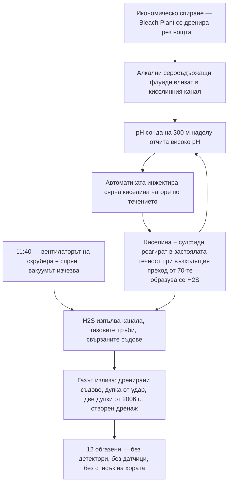

*Снимка: Kanae Kanesaki, Unsplash.*

В 18:15 ч. на 27 януари 2026 г. двама млади инженери са намерени в безсъзнание на втория етаж на производствена сграда в целулозния завод Woodland Pulp в Бейливил, щата Мейн. Дотогава газът, който ги е повалил, вече е изчезнал от повече от три часа. Аварията е овладяна, спирането на завода си е продължило по план. Никой не е знаел, че те са горе.

Единият е 20-годишен студент на стаж, още в университета. Другият — 26-годишен инженер-химик, с по-малко от пет месеца стаж в завода. Студентът умира на следващия ден. Инженерът умира на 16 февруари, след като е изключен от животоподдържащи системи.

Газът е сероводород — H2S. И ето детайлът, който трябва да накара всеки ръководител на екип да остави кафето: нищо не е протекло, нищо не се е спукало и нито един оператор не е отворил грешния вентил. Собствената автоматика на завода е *произвела* газа — върху изправно оборудване, правещо точно това, което му е наредено, по време на рутинно икономическо спиране.

Американският Съвет по химическа безопасност (CSB) публикува актуализация по разследването си на 14 юли 2026 г. (разследване № 2026-01-I-ME) и тя се чете като машина, която се сглобява парче по парче в продължение на петдесет години, чакайки една студена сутрин, за да се включи. Нека я разгледаме, защото почти всяко парче от тази машина съществува в някаква форма във всеки завод, където работят контрактори.

## Канал, който никога не е бил просто канал

Woodland Pulp вари дървесен чипс до целулоза — суровината за хартия. Химията е наситена със сяра: силно алкални процесни флуиди, заредени със серни съединения като натриев сулфид.

Под завода минава тръба, наречена **киселинен канал** („acid sewer") — над 300 метра гравитачен дренаж, отвеждащ отпадни потоци от Bleach Plant (инсталацията, където целулозата се избелва) надолу към пречиствателната станция. Името издава втората ѝ работа: това не е просто дренаж, а стъпка от пречистването. В него се инжектира сярна киселина, за да свали pH на отпадните води, преди те да поемат към лагуната за пречистване.

А сега три детайла, монтирани през десетилетия, всеки безобиден сам по себе си.

**Първо:** в средата на 70-те години участък от канала е препроектиран нагоре — около метър и половина изкачване на десетина метра дължина. CSB го нарича „възходящ преход". Гравитачен дренаж, който трябва да тече нагоре, се подприщва пред изкачването, така че над 90 метра тръба нагоре по течението постоянно стои пълна с течност. Тръбата се е превърнала в съд — и никой не е попълнил документа, който да го каже.

**Второ:** около шест месеца преди инцидента системата за инжектиране на киселина при пречиствателната станция се поврежда, а ремонтът се проточва. Заводът преминава на резервна точка за дозиране — на повече от 300 метра *нагоре по течението*, близо до Bleach Plant.

**Трето:** около месец преди инцидента това резервно дозиране е автоматизирано. pH сонда чак долу при пречиствателната станция вече решава сама кога да инжектира киселина нагоре по течението.

Прочетете тези три неща отново като едно изречение: киселината вече влиза в канала отгоре, на базата на измерване, направено отдолу, преди ниска точка, в която течността се застоява. Ако някога сте работили с контролен контур, вече усещате закъснението в тази схема.

А химията, чакаща вътре в това закъснение, не е била тайна. Собственият информационен лист за безопасност на завода за един от неговите алкални серосъдържащи флуиди казва дословно: **„Не допускайте контакт с киселинни материали поради опасност от отделяне на токсичен сероводород."** Сярна киселина среща натриев сулфид и прави H2S така, както оцетът и содата правят пяна — надеждно, всеки път. Предупреждението е стояло в собствения архив на завода.

## Сутринта, в която всичко се свърза

На 26 януари 2026 г. ръководството решава да спре по-голямата част от завода. Не за технологичен престой, не за поддръжка — цената на природния газ е скочила и заводът работи на загуба. Икономическо спиране: най-спокойната, най-безобидната причина един завод да угасне.

Между около 00:30 и 02:30 ч. на 27-и операторите започват да спират и дренират Bleach Plant. Алкални, наситени със сяра флуиди от скрубера и от Lime Kiln (пещта за вар) се стичат в киселинния канал — точно по проект. Долу при пречиствателната станция pH сондата вижда алкалната вълна и си върши работата: около 04:00 ч. извиква още сярна киселина при горната точка на дозиране.

И тук закъснението става убиец. По време на спиране потокът през канала е тънка струйка. Киселината и алкалните флуиди се събират пред онзи възходящ преход от 70-те и реагират — образувайки сероводород в застоялата течност. Киселината наистина *е* сваляла pH на сместа — точно там, в тръбата. Но сондата, която е можела да каже „стига", е на 300 метра надолу, чакаща течност, която едва се движи. Всичко, което тя вижда, е продължаващо високо pH. Затова продължава да иска киселина, а дозиращата система, работеща безупречно, продължава да храни реакцията.

Никаква аларма не звучи, защото аларма за това не съществува. Контролният контур не е повреден. Той прави точно това, за което е настроен — с информация, остаряла с часове.

## Вентилаторът, който никой не е смятал за защита

Едно-единствено нещо все още пази всички в сградата, и почти никой не би го нарекъл защитно оборудване: вентилаторът на скрубера на Bleach Plant. Този вентилатор създава вакуум в тръбите за събиране на газове — включително в киселинния канал — и тегли изпаренията през скрубера и навън през комина. Докато той работи, всичко, което каналът вари, тихо се поглъща.

Около 11:40 ч. вентилаторът е изключен. Той е в списъка за спиране. Разбира се, че е — нали спирате завода.

От този момент H2S няма къде да отиде освен нагоре: в газовото пространство на канала, в тръбите за събиране на газове, в свързаните процесни съдове. А между 10:30 и обед работници на първия етаж са отворили вентили, за да дренират два от тези съдове — свързани отгоре с газосъбирателната система, а отдолу с киселинния канал — към подовия сифон. Щом течността свършва, след нея тръгва газът — право в сградата.

Осем служители на първия етаж поемат първия удар. Един пада в безсъзнание, свестява се и се измъква на чист въздух. Още седем се разминават с парещи очи и гърла и главоболие. Никой от тях не носи личен H2S детектор — компанията не е осигурила такива — а в Bleach Plant няма стационарни H2S датчици. Първата газдетекторна система, която се задейства този ден, е падащ човек.

*Снимка: Daniel Miksha, Unsplash.*

## Вторият етаж

Един етаж по-горе газът намира три отвора, които CSB картографира с хладна прецизност. Дупка около 15 на 5 сантиметра в стъклопластова газосъбирателна тръба — вероятно избита случайно при ремонтни работи, така и незабелязана или недокладвана. Два отвора по 2,5 сантиметра, пробити във вентилационна тръба на резервоар през **2006 г.** за измерване на газов поток и никога незапушени — двайсет години отворени дупки в тръба, чиято единствена работа е да носи токсичен газ. И дренажна линия от 5 сантиметра, отворена *по проект*, предназначена да изпуска конденза от газовите тръби. Три отвора, събрани в една зона, която CSB вече нарича „зоната на изпускане на сероводород".

Двамата млади инженери работят на 5–6 метра от това място — вероятно по **проект за чертежи на оборудване, нямащ нищо общо със спирането**. Те не са в екипа по спирането, вероятно не са в ничий списък с хора на смяна, не са част от последователността от вентили и вентилатори, направила сутринта опасна. Вършат документална работа в сграда, в която — доколкото която и да е система знае — не се случва нищо опасно.

Нямат лични детектори, защото компанията не раздава такива. Няма зонови датчици, които да алармират. Сградата няма вентилационна система — нито при работа, нито при спиране. При концентрациите, които CSB оценява, че са получили — вероятно над 500 ppm, пет пъти над нивото, непосредствено опасно за живота и здравето — H2S може да повали човек за секунди, и не усещате предупредителна миризма: високите концентрации първо парализират обонянието.

Когато други служители откриват високите нива на H2S, реакцията всъщност сработва: някой затваря ръчния вентил на резервоара със сярна киселина и отваря промивка с вода, която избутва натрупаната химия отвъд възходящия преход. До 15:00 ч. газът в сградата се е разнесъл.

И тогава минават още три часа. Няма система, която да следи кой е в сградата Kraft Mill — нито контрол на достъпа, нито сборен списък при спиране, нито какъвто и да е списък. Дванайсет души са били обгазени в тази сграда, десет са излезли на крака, а сметката, която казва *двама липсват*, така и не се прави — защото никой няма числата, за да я направи. Двамата инженери са намерени около 18:15 ч., часове след като са паднали.

Председателят на CSB Стив Оуенс: **„Макар разследването ни още да продължава, вече е ясно, че тази ужасна трагедия изобщо не е трябвало да се случи."** Когато една актуализация — дори не финалният доклад — казва *вече е ясно*, това е най-близкото до присъда, което жанрът позволява.

Още едно число за онзи, който ще запише това като „оперативен проблем, не мой бюджет": освен двете смърти, CSB оценява имуществените щети и пропуснатата употреба на **над 16 милиона долара**. Личният H2S детектор с щипка струва около сто долара.

## Какво не покрива обучителната карта

Всеки курс за H2S учи едно и също ядро: познавай газа, носи детектора, вярвай на алармата, не спасявай без дихателен апарат. Всичко е вярно — и нищо от него не описва тази сутрин, защото картата предполага, че газът идва от *процеса*. Тук той идва от системата за отпадни води, произведен на място от контролен контур.

**Дренажът е процесно оборудване.** Контракторите третират каналите и сифоните като „навън". Влиза вътре — работата е свършена. Но канал, който приема несъвместими потоци, е реактор без капак, без прибори и без оператор. Нашите екипи се сблъскват с версия на това постоянно при работа по резервоари и реактори: разрешителното покрива съда, а отвореният подов сифон на три метра не е в ничии документи.

**Спирането пренарежда опасностите; не ги премахва.** Всички отпускат гарда при спиране — процесът умира, значи и опасността умира. Но дренирането праща необичайна химия в тръби при дебити, които чупят всички допускания, за които е настроена апаратурата. Най-опасната фаза в годината на този завод беше сутринта, в която той спря да прави целулоза.

**Някои защити не са надписани като защити.** Вентилаторът на скрубера беше вентилация по страничен ефект. Никой не изключва „нещото, което пази канала да не обгази сградата" — но „вентилаторът на скрубера" беше просто поредният ред в списъка за спиране. Преди спиране питайте за всеки работещ вентилатор, ежектор и продувка: *какво пази това тихомълком и какво става, когато спре?*

## Урокът за ръководители на екипи и млади техници

1. **Начертайте дренажите, преди да дренирате.** Всяка работа, която праща флуид към канал, заслужава една честна минута върху това накъде отива той и какво среща по пътя. Ако серниста химия и киселина делят една тръба някъде по този път, намерили сте утрешното заглавие.

2. **Не вярвайте на автоматика извън проектния ѝ режим.** Контролен контур, настроен за нормален дебит, гадае по време на спиране. Ако сондата е далеч от точката на дозиране, която командва, ниският дебит превръща обратната връзка във фикция. Когато състоянието на завода се промени, някой трябва да попита какво *мисли* автоматиката, че се случва — защото тя ще продължи да действа според убеждението си.

3. **Извървете линията за отворени дупки.** Пробит тестов щуцер от 2006 г., дупка от удар при ремонт, отворен по проект дренаж: всяка тръба, носеща газ, е затворена само колкото най-забравения си отвор.

4. **Носете детектора навсякъде в инсталацията.** Нашите хора закачат личните H2S детектори за работа в рафинерия толкова рутинно, колкото си връзват обувките — по правилата на SCC/VCA това не подлежи на преговори, и то не само за екипа в съда, а за всички в границите на инсталацията. Двамата загинали не вършеха работа с газов риск; нито десетимата обгазени етаж по-долу. Детекторът не е за работата, която вършиш — а за сградата, в която я вършиш. Сто долара срещу 500 ppm.

5. **Бройте хората поименно при всяка смяна на фазата.** Разстоянието между „газът изчезна" в 15:00 ч. и „намерени" в 18:15 ч. е дължината на списък, който не съществуваше. Сборният списък работи само ако включва хората *около* работата — инженера с бележника, инспектора на минаване — а не само хората *по* нея. Двамата инженери от Woodland Pulp не се нуждаеха от някой по-бърз или по-смел този ден. Нуждаеха се да бъдат в списък.

Разследването на CSB още е отворено — детекцията, контролът на достъпа и по-широките практики за процесна безопасност на завода са все още на масата. Но актуализацията вече казва достатъчно. Машината, която уби тези двама инженери, се сглобяваше петдесет години: препроектирана тръба от 70-те, две дупки, пробити през 2006 г., повреден дозатор от миналото лято, промяна в автоматиката месец по-рано, вентилатор, изключен по график. Всеки завод има такава машина, наполовина сглобена някъде. Единственият въпрос е кое парче ще докосне вашият екип следващото — и дали някой задава простите въпроси на глас, преди тя да се включи.

## Източници и допълнително четене

- Актуализация по разследването на CSB, *Fatal Hydrogen Sulfide Release at Woodland Pulp Mill*, № 2026-01-I-ME (юли 2026 г.) — първоизточникът на всеки детайл от хронологията по-горе: [https://www.csb.gov/assets/1/20/Woodland_Pulp_Mill_Investigation_Update.pdf](https://www.csb.gov/assets/1/20/Woodland_Pulp_Mill_Investigation_Update.pdf)
- Прессъобщение на CSB за актуализацията (14 юли 2026 г.): [https://www.csb.gov/csb-issues-woodland-pulp-investigation-update/](https://www.csb.gov/csb-issues-woodland-pulp-investigation-update/)
- Страницата на OSHA за опасностите от сероводород — концентрации, симптоми и защо обонянието не е детектор: [https://www.osha.gov/hydrogen-sulfide/hazards](https://www.osha.gov/hydrogen-sulfide/hazards)
- Бюлетин по безопасност на CSB, *Sodium Hydrosulfide: Preventing Harm* (2004 г.) — същата химия „киселина среща сулфид", документирана две десетилетия преди Бейливил: [https://www.csb.gov/file.aspx?DocumentId=5643](https://www.csb.gov/file.aspx?DocumentId=5643)
- За друга работа, при която самата химия на почистването генерира H2S, вижте нашия прочит на [инцидента при извеждането от експлоатация в Catalyst Refiners](/bg/blog/catalyst-refiners-h2s-decommissioning-csb) — а за това какво прави една неследена атмосфера за минути, [аргоновата яма в Bacchus](/bg/blog/argon-pit-asphyxiation-bacchus-csb).
