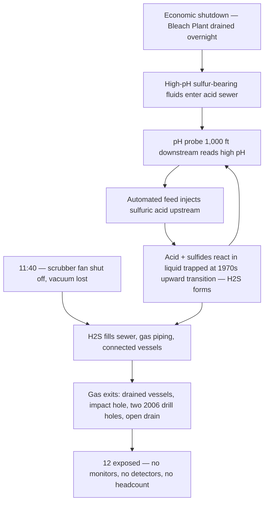

*Image: Kanae Kanesaki on Unsplash.*

At 6:15 in the evening on 27 January 2026, two young engineers were found collapsed on the second floor of a process building at the Woodland Pulp mill in Baileyville, Maine. By then the gas that put them on the floor had been gone for more than three hours. The emergency had been handled, the shutdown had carried on. Nobody knew they were up there.

One was a 20-year-old co-op student, still in university. The other was a 26-year-old chemical engineer, less than five months into the job. The student died the next day. The engineer died on 16 February, after he was taken off life support.

The gas was hydrogen sulfide — H2S. And here's the detail that should stop every crew lead mid-coffee: nothing leaked, nothing burst, and no operator opened the wrong valve. The mill's own automation *manufactured* the gas, on purpose-built equipment doing exactly what it was told, during a routine economic shutdown.

The US Chemical Safety Board published its investigation update on 14 July 2026 (investigation No. 2026-01-I-ME), and it reads like a machine assembling itself piece by piece over fifty years, waiting for one cold morning to switch on. Let's walk through it, because almost every piece of this machine exists in some form at every plant where contractors work.

## A Sewer That Was Never Just a Sewer

Woodland Pulp cooks wood chips into pulp — the raw material for paper. The chemistry is sulfur-heavy: strongly alkaline process fluids loaded with sulfur compounds like sodium sulfide.

Running under the mill is a pipe called the **acid sewer** — over 1,000 feet of gravity drain carrying discharges from the Bleach Plant (where pulp gets whitened) down to the Wastewater Treatment Plant. The name gives away its second job: it isn't just a drain, it's a treatment step. Sulfuric acid is injected into it to bring the effluent's pH down before the water heads to the treatment lagoon.

Now three details, installed decades apart, each harmless on its own.

**First:** in the mid-1970s, a section of the sewer was rerouted upward — about five feet of rise over 35 feet of run. The CSB calls it the "upward transition." A gravity drain that has to flow uphill backs up behind the rise, so more than 300 feet of upstream piping sits permanently holding liquid. A pipe became a vessel, and nobody filed the paperwork that says so.

**Second:** about six months before the incident, the acid injection system at the treatment plant end broke, and repairs dragged. The mill switched to a backup acid feed point — more than 1,000 feet *upstream*, near the Bleach Plant.

**Third:** about a month before the incident, that backup feed was automated. A pH probe way down at the Wastewater Treatment Plant would now decide, on its own, when to inject acid upstream.

Read those three again as one sentence: acid now entered the sewer at the top, based on a measurement taken at the bottom, upstream of a low spot where liquid pools. If you've ever worked a control loop, you can already feel the lag in that arrangement.

And the chemistry waiting inside that lag was no secret. The mill's own safety data sheet for one of its high-pH sulfur-bearing fluids says, word for word: **"Do not permit contact with acidic materials due to potential to release toxic hydrogen sulfide."** Sulfuric acid meeting sodium sulfide makes H2S the way vinegar and baking soda make foam — reliably, every time. The warning was in the mill's own filing cabinet.

## The Morning It All Connected

On 26 January 2026, mill management decided to shut most of the plant down. Not for a turnaround, not for maintenance — natural gas prices had spiked and running the mill was losing money. An economic shutdown: the calmest, least dramatic reason a plant ever goes dark.

Between about 12:30 and 2:30 a.m. on the 27th, operators began shutting down and draining the Bleach Plant. High-pH, sulfur-loaded fluids from the scrubber and the Lime Kiln flowed into the acid sewer, exactly as designed. Down at the treatment plant, the pH probe saw the alkaline slug and did its job: at around 4:00 a.m. it called for more sulfuric acid at the upstream feed point.

Here's where the lag becomes the killer. During a shutdown, flow through the sewer is a trickle. The acid and the alkaline fluids pooled upstream of that 1970s upward transition and reacted — generating hydrogen sulfide in the trapped liquid. The acid *was* lowering the mixture's pH, right there in the pipe. But the probe that could have said "enough" was 1,000 feet downhill, waiting for liquid that was barely moving. All it could see was high-pH fluid still arriving. So it kept calling for acid, and the injection system, working flawlessly, kept feeding the reaction.

No alarm sounded, because no alarm existed for this. The control loop wasn't broken. It was doing precisely what it was configured to do, with information that was hours out of date.

## The Fan Nobody Thought of as a Safeguard

There was still one thing protecting everybody in the building, and almost nobody would have called it safety equipment: the Bleach Plant's scrubber fan. That fan pulls a vacuum on the plant's gas collection piping — including the acid sewer — dragging fumes through the scrubber and out the stack. As long as it ran, whatever the sewer brewed was being quietly swallowed.

At about 11:40 a.m., the fan was switched off. It was on the shutdown list. Of course it was — you're shutting the plant down.

From that moment, the H2S had nowhere to go but up: into the sewer's vapor space, the gas collection piping, the connected process vessels. And between 10:30 a.m. and noon, workers on the first floor had opened valves to drain two of those vessels — connected to the gas collection system at the top and the acid sewer at the bottom — to the floor drain. Once the liquid ran out, the gas followed, straight into the building.

Eight employees on the first floor took the first hit. One collapsed unconscious, came around, and got out to fresh air. Seven more walked away with burning eyes and throats, headaches. None of them wore a personal H2S monitor — the company didn't provide any — and there were no fixed H2S detectors in the Bleach Plant. The first gas detection system to activate that day was a human being falling over.

*Image: Daniel Miksha on Unsplash.*

## The Second Floor

One floor up, the gas found three openings the CSB maps in cold detail. A roughly six-by-two-inch hole in a fiberglass gas collection pipe — likely punched by accident during maintenance work, never noticed or never reported. Two one-inch holes drilled into a tank vent pipe in **2006** for a gas flow measurement, and never plugged — twenty years of open holes in a pipe whose whole job is carrying toxic gas. And a two-inch drain line that was open *by design*, meant to let condensation out of the gas piping. Three openings, clustered in one area the CSB now calls the "hydrogen sulfide release zone."

The two young engineers were working about 15 to 20 feet from that spot — likely on an **equipment drawing project unrelated to the shutdown**. They weren't on the shutdown crew, likely not in anyone's headcount, not part of the sequence of valves and fans that made the morning dangerous. They were doing documentation work in a building where — as far as any system knew — nothing hazardous was happening.

They had no personal monitors, because the company didn't issue them. There were no area detectors to alarm. The building had no ventilation system, during operations or shutdowns. At the concentrations the CSB estimates they received — likely over 500 ppm, five times the level that's immediately dangerous to life and health — H2S can drop a person in seconds, and you don't smell a warning first: high concentrations paralyze the sense of smell.

When other employees discovered the high H2S levels, the response actually worked: someone closed the manual valve on the sulfuric acid supply and opened a water flush that pushed the accumulated chemistry past the upward transition. By 3:00 p.m. the gas in the building had dissipated.

And then three more hours passed. There was no system tracking who was in the Kraft Mill — no access control, no shutdown muster, no list. Twelve people had been gassed in that building, ten had walked out, and the arithmetic that says *two are missing* never ran, because no one had the numbers to run it. The two engineers were found at approximately 6:15 p.m., hours after they went down.

CSB Chairperson Steve Owens: **"Although our investigation is still ongoing, it already is clear that this terrible tragedy should never have happened."** When an update — not even the final report — says *already is clear*, that's as close to a verdict as the genre allows.

One more number for whoever files this under "operations problem, not my budget": beyond the two deaths, the CSB puts property damage and loss of use at **over $16 million**. Clip-on H2S monitors cost about a hundred dollars each.

## What the Training Card Doesn't Cover

Every H2S course teaches the same core: know your gas, wear your monitor, trust the alarm, don't rescue without air. All correct — and none of it frames this morning, because the card assumes the gas comes from *the process*. Here it came from the effluent system, made fresh on the spot by a control loop.

**The drain is process equipment.** Contractors treat sewers and drains as "away." Stuff goes in, job's done. But a sewer that receives incompatible streams is a reactor with no lid, no instruments, and no operator. Our crews hit a version of this on tank and reactor jobs constantly: the permit covers the vessel, and the open floor drain three meters away is on nobody's paperwork.

**Shutdowns rearrange hazards; they don't remove them.** Everyone's guard drops during a shutdown — the process is dying, so the danger must be too. But draining sends unusual chemistry into pipes at flows that break every assumption the instrumentation was tuned for. The most dangerous phase of this mill's year was the morning it stopped making pulp.

**Some safeguards aren't labeled as safeguards.** The scrubber fan was ventilation-by-side-effect. Nobody switches off "the thing keeping the sewer from gassing the building" — but "the scrubber fan" was just another item on the shutdown list. Before a shutdown, ask of every running fan, eductor and purge: *what is this quietly protecting, and what happens when it stops?*

## The Lesson for Crew Leads and Young Techs

1. **Map the drains before you drain.** Any job that sends fluid to a sewer deserves one honest minute on where it goes and what it meets on the way. If sulfur chemistry and acid share a pipe anywhere in that path, you've found tomorrow's headline.

2. **Distrust automation running outside its design case.** A control loop tuned for normal flow is guessing during a shutdown. If a probe sits far from the injection point it commands, low flow turns feedback into fiction. When the plant state changes, someone must ask what the automation *thinks* is happening — because it will keep acting on its belief.

3. **Walk the line for open holes.** A drilled test port from 2006, an impact hole from a maintenance bump, a designed-open drain: any pipe that carries gas is only as closed as its most forgotten opening.

4. **Wear the monitor everywhere inside the unit.** Our people clip on personal H2S monitors for refinery work as routinely as they lace boots — under SCC/VCA rules it's not negotiable, and not only for the crew inside the vessel: for everyone inside the unit boundary. The two who died weren't doing gas-hazard work; neither were the ten exposed a floor below. The monitor isn't for the job you're doing — it's for the building you're doing it in. A hundred dollars against 500 ppm.

5. **Count heads by name, every phase change.** The gap between "gas gone" at 3:00 p.m. and "found" at 6:15 p.m. is the length of a list that didn't exist. A muster list only works if it includes the people *near* the job — the engineer taking notes, the inspector passing through — not just the people *on* it. The two engineers at Woodland Pulp didn't need anyone to be faster or braver that day. They needed to be on a list.

The CSB's investigation is still open — detection, access control, and the mill's wider process safety practices are all still on its table. But the update already says enough. The machine that killed those two engineers took fifty years to assemble: a 1970s pipe reroute, two holes drilled in 2006, a broken injector last summer, an automation change a month out, a fan switched off on schedule. Every plant has a machine like this half-built somewhere. The only question is which piece your crew touches next — and whether anyone asks the plain questions out loud before it switches on.

## Credit and Further Reading

- CSB Investigation Update, *Fatal Hydrogen Sulfide Release at Woodland Pulp Mill*, No. 2026-01-I-ME (July 2026) — the primary source for every timeline detail above: [https://www.csb.gov/assets/1/20/Woodland_Pulp_Mill_Investigation_Update.pdf](https://www.csb.gov/assets/1/20/Woodland_Pulp_Mill_Investigation_Update.pdf)
- CSB news release announcing the update (14 July 2026): [https://www.csb.gov/csb-issues-woodland-pulp-investigation-update/](https://www.csb.gov/csb-issues-woodland-pulp-investigation-update/)
- OSHA's hydrogen sulfide hazard page — concentrations, symptoms, and why smell is not a detector: [https://www.osha.gov/hydrogen-sulfide/hazards](https://www.osha.gov/hydrogen-sulfide/hazards)
- CSB Safety Bulletin, *Sodium Hydrosulfide: Preventing Harm* (2004) — the same acid-meets-sulfide chemistry, documented two decades before Baileyville: [https://www.csb.gov/file.aspx?DocumentId=5643](https://www.csb.gov/file.aspx?DocumentId=5643)
- For another job where cleaning chemistry generated the H2S itself, see our reading of the [Catalyst Refiners decommissioning incident](/en/blog/catalyst-refiners-h2s-decommissioning-csb) — and for what an unmonitored atmosphere does in minutes, the [argon pit at Bacchus](/en/blog/argon-pit-asphyxiation-bacchus-csb).
