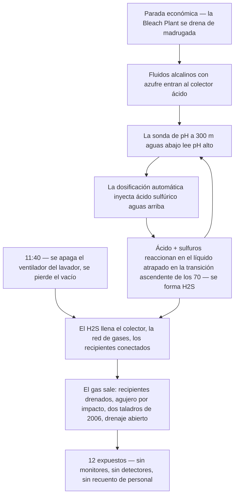

*Imagen: Kanae Kanesaki en Unsplash.*

A las 6:15 de la tarde del 27 de enero de 2026, dos jóvenes ingenieros fueron encontrados desplomados en el segundo piso de un edificio de proceso de la planta de celulosa Woodland Pulp en Baileyville, Maine. Para entonces, el gas que los tumbó llevaba más de tres horas disipado. La emergencia se había gestionado, la parada de planta había seguido su curso. Nadie sabía que estaban allí arriba.

Uno era un estudiante en prácticas de 20 años, todavía en la universidad. El otro, un ingeniero químico de 26 años con menos de cinco meses en el puesto. El estudiante murió al día siguiente. El ingeniero murió el 16 de febrero, tras ser desconectado del soporte vital.

El gas era sulfuro de hidrógeno — H2S. Y aquí está el detalle que debería hacer que cualquier jefe de cuadrilla suelte el café: nada tuvo fugas, nada reventó y ningún operador abrió la válvula equivocada. La propia automatización de la planta *fabricó* el gas, sobre equipos en perfecto estado haciendo exactamente lo que se les ordenó, durante una parada económica rutinaria.

La Junta de Seguridad Química de EE. UU. (CSB) publicó su actualización de investigación el 14 de julio de 2026 (investigación n.º 2026-01-I-ME), y se lee como una máquina que se ensambla pieza a pieza durante cincuenta años, esperando una mañana fría para ponerse en marcha. Recorrámosla, porque casi cada pieza de esta máquina existe de alguna forma en cada planta donde trabajan contratistas.

## Un colector que nunca fue solo un colector

Woodland Pulp cuece astillas de madera hasta convertirlas en celulosa, la materia prima del papel. La química es intensa en azufre: fluidos de proceso fuertemente alcalinos cargados de compuestos de azufre como el sulfuro de sodio.

Bajo la planta corre una tubería llamada el **colector ácido** («acid sewer»): más de 300 metros de drenaje por gravedad que lleva los efluentes desde la Bleach Plant (la planta de blanqueo, donde se blanquea la celulosa) hasta la planta de tratamiento de aguas residuales. El nombre delata su segundo trabajo: no es solo un drenaje, es una etapa de tratamiento. Se le inyecta ácido sulfúrico para bajar el pH del efluente antes de que el agua siga hacia la laguna de tratamiento.

Ahora, tres detalles, instalados con décadas de diferencia, cada uno inofensivo por sí solo.

**Primero:** a mediados de los años 70, un tramo del colector se redirigió hacia arriba — un metro y medio de subida en unos diez metros de recorrido. La CSB lo llama la «transición ascendente». Un drenaje por gravedad que tiene que fluir cuesta arriba se embalsa detrás de la subida, de modo que más de 90 metros de tubería aguas arriba quedan permanentemente llenos de líquido. Una tubería se convirtió en un recipiente, y nadie rellenó el papel que lo dijera.

**Segundo:** unos seis meses antes del incidente, el sistema de inyección de ácido en el extremo de la planta de tratamiento se averió, y la reparación se eternizó. La planta pasó a un punto de dosificación de respaldo — a más de 300 metros *aguas arriba*, cerca de la Bleach Plant.

**Tercero:** alrededor de un mes antes del incidente, esa dosificación de respaldo se automatizó. Una sonda de pH allá abajo, en la planta de tratamiento, decidiría ahora por su cuenta cuándo inyectar ácido aguas arriba.

Vuelva a leer esos tres puntos como una sola frase: el ácido entraba ahora al colector por arriba, según una medición tomada abajo, aguas arriba de un punto bajo donde el líquido se estanca. Si alguna vez ha trabajado con un lazo de control, ya siente el retardo en ese montaje.

Y la química que esperaba dentro de ese retardo no era ningún secreto. La propia hoja de datos de seguridad de la planta para uno de sus fluidos alcalinos con azufre dice, palabra por palabra: **«No permita el contacto con materiales ácidos debido al potencial de liberar sulfuro de hidrógeno tóxico».** El ácido sulfúrico al encontrarse con el sulfuro de sodio produce H2S igual que el vinagre y el bicarbonato producen espuma: de forma fiable, todas las veces. La advertencia estaba en el propio archivador de la planta.

## La mañana en que todo se conectó

El 26 de enero de 2026, la dirección decidió parar la mayor parte de la planta. No por una parada de mantenimiento — el precio del gas natural se había disparado y operar daba pérdidas. Una parada económica: la razón más tranquila y menos dramática por la que una planta se apaga.

Entre las 0:30 y las 2:30 de la madrugada del día 27, los operadores empezaron a parar y drenar la Bleach Plant. Fluidos alcalinos cargados de azufre procedentes del lavador de gases y del horno de cal fluyeron hacia el colector ácido, exactamente según el diseño. Abajo, en la planta de tratamiento, la sonda de pH vio la ola alcalina e hizo su trabajo: hacia las 4:00 pidió más ácido sulfúrico en el punto de dosificación de aguas arriba.

Aquí es donde el retardo se vuelve letal. Durante una parada, el caudal por el colector es un hilillo. El ácido y los fluidos alcalinos se acumularon juntos aguas arriba de aquella transición ascendente de los años 70 y reaccionaron, generando sulfuro de hidrógeno en el líquido atrapado. El ácido *sí* estaba bajando el pH de la mezcla, allí mismo, dentro de la tubería. Pero la sonda que podría haber dicho «suficiente» estaba a 300 metros cuesta abajo, esperando un líquido que apenas se movía. Lo único que veía era fluido de pH alto que seguía llegando. Así que siguió pidiendo ácido, y el sistema de inyección, funcionando impecablemente, siguió alimentando la reacción.

No sonó ninguna alarma, porque no existía alarma para esto. El lazo de control no estaba averiado. Hacía exactamente aquello para lo que estaba configurado, con información desfasada en horas.

## El ventilador que nadie consideraba una salvaguarda

Todavía quedaba una cosa protegiendo a todos en el edificio, y casi nadie la habría llamado equipo de seguridad: el ventilador del lavador de gases de la Bleach Plant. Ese ventilador genera vacío en la red de recogida de gases de la planta — incluido el colector ácido — arrastrando los vapores a través del lavador y fuera por la chimenea. Mientras funcionara, todo lo que el colector cocinara era tragado en silencio.

Hacia las 11:40, el ventilador se apagó. Estaba en la lista de parada. Claro que estaba: la planta se estaba apagando.

Desde ese momento, el H2S no tenía adónde ir salvo hacia arriba: al espacio de vapor del colector, a la red de recogida de gases, a los recipientes de proceso conectados. Y entre las 10:30 y el mediodía, trabajadores del primer piso habían abierto válvulas para drenar dos de esos recipientes — conectados por arriba al sistema de recogida de gases y por abajo al colector ácido — hacia el sumidero del suelo. Cuando el líquido se acabó, lo siguió el gas, directo al interior del edificio.

Ocho empleados del primer piso recibieron el primer golpe. Uno se desplomó inconsciente, volvió en sí y logró salir al aire fresco. Otros siete se marcharon con ojos y gargantas ardiendo y dolor de cabeza. Ninguno llevaba monitor personal de H2S — la empresa no los proporcionaba — y no había detectores fijos de H2S en la Bleach Plant. El primer sistema de detección de gas que se activó ese día fue un ser humano cayendo al suelo.

*Imagen: Daniel Miksha en Unsplash.*

## El segundo piso

Un piso más arriba, el gas encontró tres aberturas que la CSB cartografía con frialdad. Un agujero de unos 15 por 5 centímetros en una tubería de fibra de vidrio de recogida de gases — probablemente golpeada por accidente durante trabajos de mantenimiento, nunca detectado o nunca reportado. Dos agujeros de 2,5 centímetros taladrados en un venteo de tanque en **2006** para una medición de caudal de gas, y jamás taponados — veinte años de agujeros abiertos en una tubería cuyo único trabajo es transportar gas tóxico. Y una línea de drenaje de 5 centímetros abierta *por diseño*, pensada para evacuar la condensación de la red de gases. Tres aberturas, agrupadas en una zona que la CSB llama ahora la «zona de liberación de sulfuro de hidrógeno».

Los dos jóvenes ingenieros trabajaban a unos 5 o 6 metros de ese punto — probablemente en un **proyecto de planos de equipos sin relación con la parada**. No estaban en la cuadrilla de parada, probablemente no figuraban en el recuento de nadie, no formaban parte de la secuencia de válvulas y ventiladores que hizo peligrosa la mañana. Hacían trabajo de documentación en un edificio donde — hasta donde cualquier sistema sabía — no ocurría nada peligroso.

No tenían monitores personales, porque la empresa no los repartía. No había detectores de área que alarmaran. El edificio no tenía sistema de ventilación, ni en operación ni en paradas. A las concentraciones que la CSB estima que recibieron — probablemente más de 500 ppm, cinco veces el nivel inmediatamente peligroso para la vida y la salud — el H2S puede tumbar a una persona en segundos, y no hay olor que avise: las concentraciones altas paralizan primero el sentido del olfato.

Cuando otros empleados descubrieron los niveles altos de H2S, la respuesta funcionó: alguien cerró la válvula manual del suministro de ácido sulfúrico y abrió un lavado con agua que empujó la química acumulada más allá de la transición ascendente. Hacia las 15:00, el gas del edificio se había disipado.

Y entonces pasaron tres horas más. No había ningún sistema que registrara quién estaba en el edificio Kraft Mill — ni control de acceso, ni recuento de parada, ni lista alguna. Doce personas habían sido gaseadas en ese edificio, diez habían salido por su pie, y la aritmética que dice *faltan dos* nunca se hizo, porque nadie tenía los números para hacerla. Los dos ingenieros fueron encontrados hacia las 18:15, horas después de caer.

El presidente de la CSB, Steve Owens: **«Aunque nuestra investigación sigue en curso, ya está claro que esta terrible tragedia nunca debió haber ocurrido».** Cuando una actualización — ni siquiera el informe final — dice *ya está claro*, eso es lo más parecido a un veredicto que permite el género.

Un número más para quien archive esto como «problema de operaciones, no de mi presupuesto»: además de las dos muertes, la CSB cifra los daños materiales y la pérdida de uso en **más de 16 millones de dólares**. Un monitor de H2S de pinza cuesta unos cien dólares.

## Lo que la tarjeta de formación no cubre

Todo curso de H2S enseña el mismo núcleo: conozca su gas, lleve su monitor, confíe en la alarma, no rescate sin equipo de aire. Todo correcto — y nada de eso encuadra esta mañana, porque la tarjeta asume que el gas viene *del proceso*. Aquí vino del sistema de efluentes, fabricado en el momento por un lazo de control.

**El drenaje es equipo de proceso.** Los contratistas tratan los colectores y sumideros como «afuera». Entra, y trabajo terminado. Pero un colector que recibe corrientes incompatibles es un reactor sin tapa, sin instrumentos y sin operador. Nuestras cuadrillas se topan con una versión de esto constantemente en trabajos de tanques y reactores: el permiso cubre el recipiente, y el sumidero abierto a tres metros no está en el papeleo de nadie.

**Las paradas reorganizan los peligros; no los eliminan.** Todos bajan la guardia durante una parada — el proceso está muriendo, así que el peligro también debe estar muriendo. Pero drenar manda química inusual a tuberías con caudales que rompen todas las suposiciones para las que se calibró la instrumentación. La fase más peligrosa del año de esta planta fue la mañana en que dejó de hacer celulosa.

**Algunas salvaguardas no llevan etiqueta de salvaguarda.** El ventilador del lavador era ventilación por efecto secundario. Nadie apaga «la cosa que impide que el colector gasee el edificio» — pero «el ventilador del lavador» era solo una línea más en la lista de parada. Antes de una parada, pregunte por cada ventilador, eductor y purga en marcha: *¿qué está protegiendo esto en silencio, y qué pasa cuando se detenga?*

## La lección para jefes de cuadrilla y técnicos jóvenes

1. **Trace los drenajes antes de drenar.** Cualquier trabajo que mande fluido a un colector merece un minuto honesto sobre adónde va y qué se encuentra por el camino. Si la química del azufre y el ácido comparten una tubería en algún punto de ese trayecto, ha encontrado el titular de mañana.

2. **Desconfíe de la automatización fuera de su caso de diseño.** Un lazo de control ajustado para caudal normal está adivinando durante una parada. Si la sonda está lejos del punto de inyección que comanda, el caudal bajo convierte la realimentación en ficción. Cuando el estado de la planta cambia, alguien tiene que preguntar qué *cree* la automatización que está pasando — porque seguirá actuando según su creencia.

3. **Camine la línea buscando agujeros abiertos.** Una toma de prueba taladrada en 2006, un agujero por un golpe de mantenimiento, un drenaje abierto por diseño: cualquier tubería que lleva gas está tan cerrada como su abertura más olvidada.

4. **Lleve el monitor en todas partes dentro de la unidad.** Nuestra gente se engancha el monitor personal de H2S para trabajos de refinería con la misma rutina con que se ata las botas — bajo las reglas SCC/VCA no es negociable, y no solo para la cuadrilla dentro del recipiente: para todos dentro del límite de la unidad. Los dos que murieron no hacían trabajo con riesgo de gas; tampoco los diez expuestos un piso más abajo. El monitor no es para el trabajo que está haciendo — es para el edificio donde lo está haciendo. Cien dólares contra 500 ppm.

5. **Cuente cabezas por nombre en cada cambio de fase.** La distancia entre «gas disipado» a las 15:00 y «encontrados» a las 18:15 es la longitud de una lista que no existía. Una lista de recuento solo funciona si incluye a la gente *cerca* del trabajo — el ingeniero tomando notas, el inspector de paso — no solo a la gente *en* el trabajo. Los dos ingenieros de Woodland Pulp no necesitaban que nadie fuera más rápido ni más valiente ese día. Necesitaban estar en una lista.

La investigación de la CSB sigue abierta — la detección, el control de acceso y las prácticas de seguridad de proceso de la planta siguen sobre su mesa. Pero la actualización ya dice suficiente. La máquina que mató a esos dos ingenieros tardó cincuenta años en ensamblarse: una tubería redirigida en los 70, dos agujeros taladrados en 2006, un dosificador averiado el verano pasado, un cambio de automatización un mes antes, un ventilador apagado según el programa. Cada planta tiene una máquina como esta a medio construir en alguna parte. La única pregunta es qué pieza tocará su cuadrilla a continuación — y si alguien hace las preguntas simples en voz alta antes de que se ponga en marcha.

## Créditos y lecturas adicionales

- Actualización de investigación de la CSB, *Fatal Hydrogen Sulfide Release at Woodland Pulp Mill*, n.º 2026-01-I-ME (julio de 2026) — la fuente primaria de cada detalle de la cronología anterior: [https://www.csb.gov/assets/1/20/Woodland_Pulp_Mill_Investigation_Update.pdf](https://www.csb.gov/assets/1/20/Woodland_Pulp_Mill_Investigation_Update.pdf)
- Nota de prensa de la CSB anunciando la actualización (14 de julio de 2026): [https://www.csb.gov/csb-issues-woodland-pulp-investigation-update/](https://www.csb.gov/csb-issues-woodland-pulp-investigation-update/)
- Página de OSHA sobre los peligros del sulfuro de hidrógeno — concentraciones, síntomas y por qué el olfato no es un detector: [https://www.osha.gov/hydrogen-sulfide/hazards](https://www.osha.gov/hydrogen-sulfide/hazards)
- Boletín de seguridad de la CSB, *Sodium Hydrosulfide: Preventing Harm* (2004) — la misma química de ácido y sulfuro, documentada dos décadas antes de Baileyville: [https://www.csb.gov/file.aspx?DocumentId=5643](https://www.csb.gov/file.aspx?DocumentId=5643)
- Para otro trabajo donde la propia química de limpieza generó el H2S, vea nuestra lectura del [incidente de desmantelamiento de Catalyst Refiners](/es/blog/catalyst-refiners-h2s-decommissioning-csb) — y para lo que hace una atmósfera sin monitorear en minutos, el [foso de argón de Bacchus](/es/blog/argon-pit-asphyxiation-bacchus-csb).
